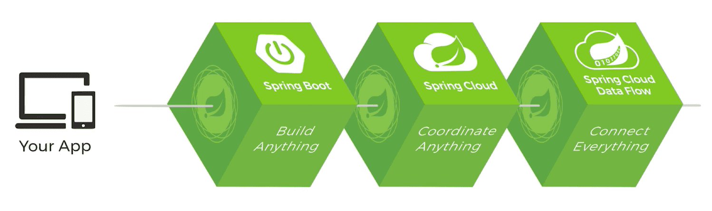
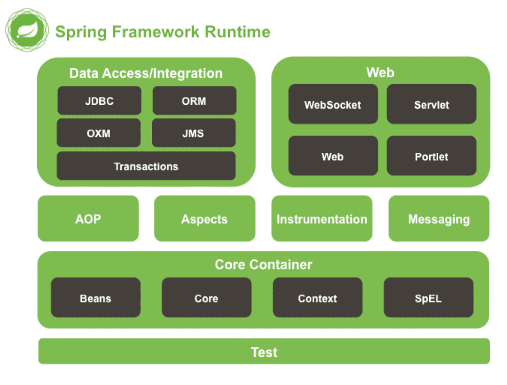
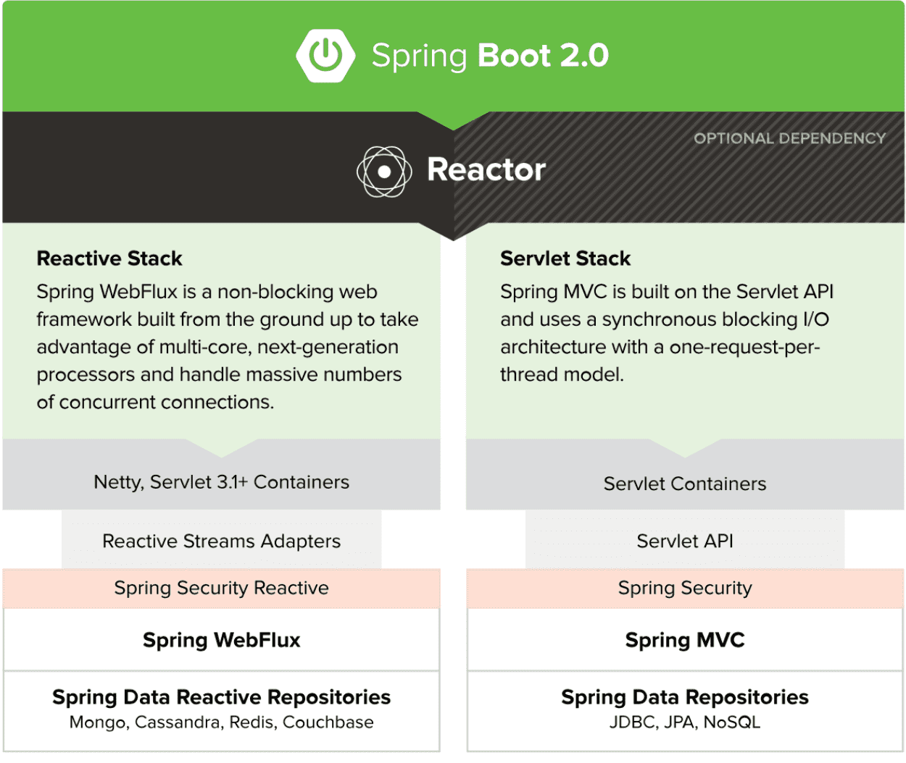
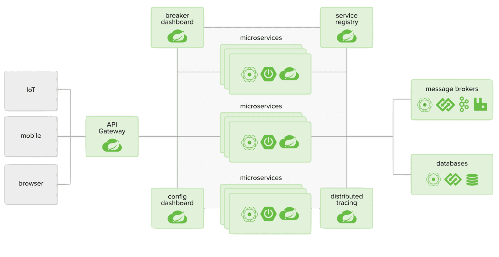
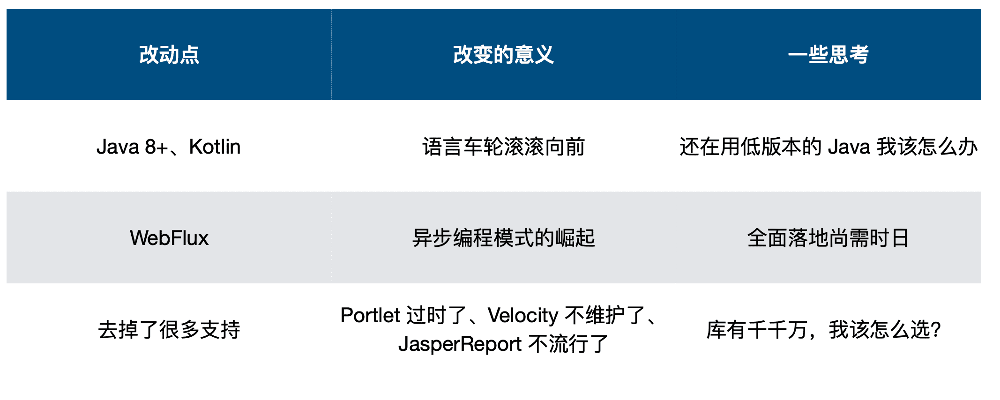
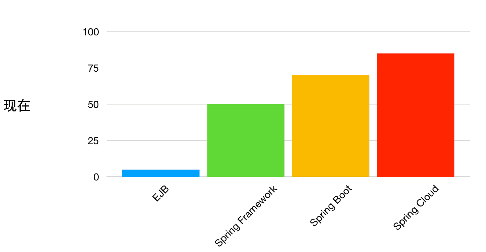
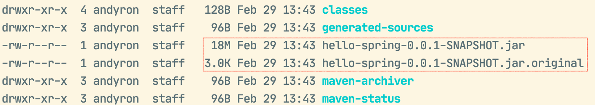

# 《玩转Spring全家桶》笔记

[《玩转Spring全家桶》](https://time.geekbang.org/course/intro/100023501)

初始Spring

Spring中的数据操作

Web开发

Spring Boot

Spring Cloud

## 一、初始Spring

### Spring家族的主要成员

Spring，始于框架，但不限于框架

#### 设计理念

力争让选择无处不在

体现海纳百川的精神

保持向后兼容性

专注API设计

追求严苛的代码质量

#### Spring Boot

#### Spring Cloud

简化分布式系统的开发：配置管理、服务注册与发现、熔断、服务追踪......

### 跟着 Spring 了了解技术趋势

#### Spring 5.x的改变

#### Spring Boot和Spring Cloud的出现是必然

开箱即用

与生态圈的深度整合

注重运维

Cloud Native的大方向

最佳实践不懈多，固化到系统实现才是王道

......

### 第一个Spring程序

https://start.spring.io

`curl http://localhost:8080/hello`

` curl http://localhost:8080/actuator/health`

`mvn clean package -Dmaven.test.skip`    打包， 跳过测试

`.jar.original`是代码打出的实际的包，是不可执行的，只有自己的内容。大的`.jar`包是包含依赖文件，里包含了.original的内容，还包含了依赖的各个jar，可直接执行。

`java -jar hello-spring-0.0.1-SNAPSHOT.jar `   同样可以运行，说明可以作为单个进程跑起来了

pom文件没有`<parent>`时，可以通过`<dependencyManagement>`来导入

## 二、JDBC必知必会

### 如何配置单数据源

**H2** 数据库

`spring-boot-starter-jdbc`  JDBC依赖

查看所有Bean   `http://localhost:8080/actuator/beans`

 Lombok Plugin 

#### 直接配置所需的Bean

**数据源相关**

DataSource(根据选择的连接池实现决定)

 **事务相关**(可选)

PlatformTransactionManager(DataSourceTransactionManager)

TransactionTemplate

**操作相关(可选)**

JdbcTemplate

#### Spring Boot 做了了哪些配置

**DataSourceAutoConfiguration**

​	配置 DataSource 

**DataSourceTransactionManagerAutoConfiguration**

​	配置 ataSourceTransactionManager 

**JdbcTemplateAutoConfiguration**

​	配置 JdbcTemplate 

符合条件时才进⾏行行配置

#### 数据源相关配置属性

**通⽤**

- spring.datasource.url=jdbc:mysql://localhost/test 
- spring.datasource.username=dbuser 
- spring.datasource.password=dbpass

- spring.datasource.driver-class-name=com.mysql.jdbc.Driver(可选)

**初始化内嵌数据库**

- spring.datasource.initialization-mode=embedded|always|never 
- spring.datasource.schema 与 spring.datasource.data  确定初始化SQL⽂文件

- spring.datasource.platform=hsqldb | h2 | oracle | mysql | postgresql(与前者对应)

### 如何配置多数据源

#### 配置多数据源的注意事项

**不同数据源的配置要分开**
**关注每次使⽤用的数据源**

- 有多个DataSource时系统如何判断 
- 对应的设施(事务、ORM等)如何选择DataSource