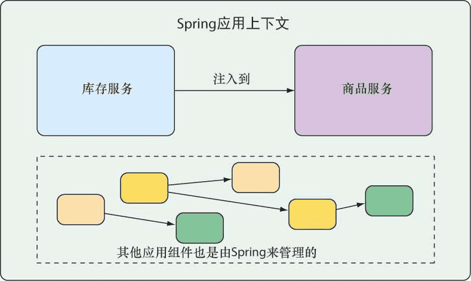

# 《Spring实战（第5版）》笔记


## 介绍


我们更应该去追求一些内在稳定不变的知识，比如技术规范、设计原理等。


本书提供一个实用的、项目驱动的指南，将Spring的各种元素组合起来形成一个真正的应用。


Spring 5的主要功能是对反应式编程的支持，包括**Spring WebFlux**。这是一个全新的反应式Web框架。

**Reactor**是一个用于处理反应式类型的Java库。

Spring Boot 2提供了比以前更多的自动配置支持，以及一个完全重新设计的**Actuator**，用于探查和操作正在运行的应用。


作者提供的代码示例：[spring-in-action-5-samples](https://github.com/habuma/spring-in-action-5-samples)

出版社中文书籍页面：https://www.epubit.com/bookDetails?id=UB6cb48474abc65

## 一、Spring基础

### 1 Spring起步

数据库作为支撑的简单Web应用

围绕微服务构建一个现代应用

#### 什么是Spring

Spring的核心是提供一个容器（container），通常称为<font color=#FF8C00>**Spring应用上下文**</font>（Springapplication context），它们会**创建和管理应用组件**。这些组件也可以称为**bean**，会在Spring应用上下文中装配在一起，从而形成一个完整的应用程序。这就像砖块、砂浆、木材、管道和电线组合在一起，形成一栋房子似的。

将bean装配在一起的行为是通过一种基于**依赖注入**（dependency injection，**DI**）的模式实现的。此时，组件不会再去创建它所依赖的组件并管理它们的生命周期，使用依赖注入的应用依赖于单独的实体（容器）来创建和维护所有的组件，并将其注入到需要它们的bean中。通常，这是通过<u>构造器参数和属性访问方法</u>来实现的。

例图，应用组件通过Spring应用上下文来进行管理并实现互相注入：




以前，Spring应用上下文将bean装配在一起的方式是XML文件，例如，描述两个bean，并通过构造器参数将InventoryService装配到了ProductService中：

```xml
<bean id="inventoryService" class="com.example.InventoryService" />
<bean id="productService" class="com.example.ProductService" />
	<constructor-arg ref="inventoryService" />
</bean>
```

现在，spring通过Java注解配置:

```java
@Configuration
public class ServiceConfiguration {
  @Bean
  public InventoryService inventoryService() {
    return new InventoryService();
  }
  
  @Bean 
  public ProductService productService() {
    return new ProductService(inventoryService());
  }
}
```

@Configuration注解，**配置类**，会为Spring应用上下文提供bean。

@Bean注解，<u>表明这些方法所返回的对象会以bean的形式添加到Spring的应用上下文中</u>（默认情况下，这些bean所对应的bean ID与定义它们的方法名称是相同的）。

Java注解配置的优势：**更强的类型安全性以及更好的重构能力**。

**自动配置**：

1. 自动**装配**（autowiring）：自动为组件注入它们所依赖的其他bean
2. 组件**扫描**（component scanning）：自动发现应用类路径下的组件，并将它们创建成Spring应用上下文中的bean

Spring Boot让自动配置更加方便。


#### 初始化Spring应用

初始化Spring应用的方式有很多种：

- 通过地址为https://start.spring.io/的Web应用；
- 在命令行中使用curl命令；
- 在命令行中使用Spring Boot命令行接口；
- 在Spring Tool Suite中创建新项目；
- 在IntelliJ IDEA中创建新项目；
- 在NetBeans中创建新项目。


##### jar 与 war

**war包是JavaWeb程序打的包，war文件代表了一个Web应用程序，jar是类的归档文件。**


#### 编写Spring应用


##### 了解Spring Boot DevTools


### 2 开发Web应用

Eric Evans《领域驱动设计》

 'Thymeleaf' is pronounced like this: **/ˈtaɪmˌlɪːf/**

#### 展现信息


#### 处理表单提交


#### 校验表单输入

##### 声明校验规则


##### 在表单绑定的时候执行校验


##### 展现校验错误


#### 使用视图控制器

```java
@Configuration
public class WebConfig implements WebMvcConfigurer {

    @Override
    public void addViewControllers(ViewControllerRegistry registry) {
        registry.addViewController("/").setViewName("home");
    }
}
```


### 3 使用数据

JDBC（Java Database Connectivity）

JPA（Java Persistence API）


#### 3.1 使用JDBC读取和写入数据


##### 调整领域对象以适应持久化


##### 使用JdbcTemplate


##### 定义模式和预加载数据


##### 插入数据


