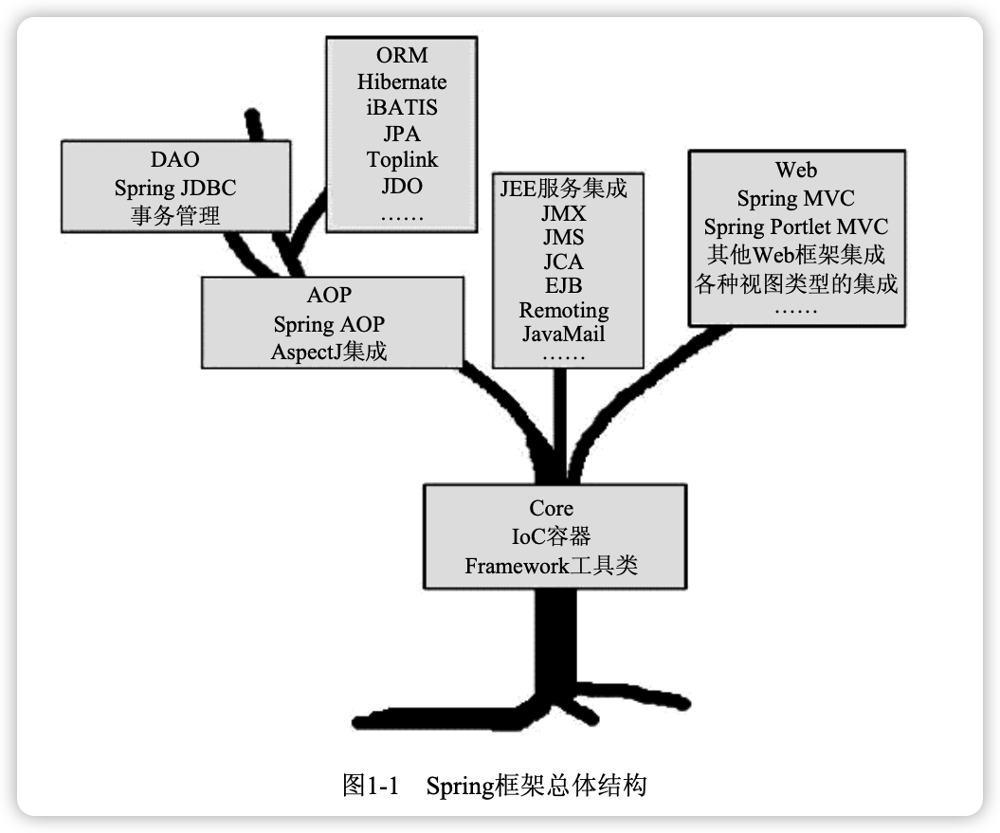
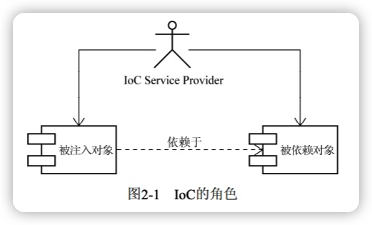
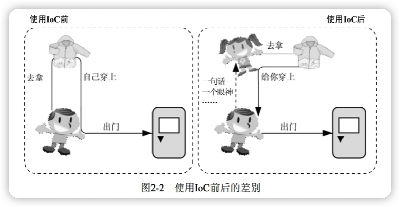
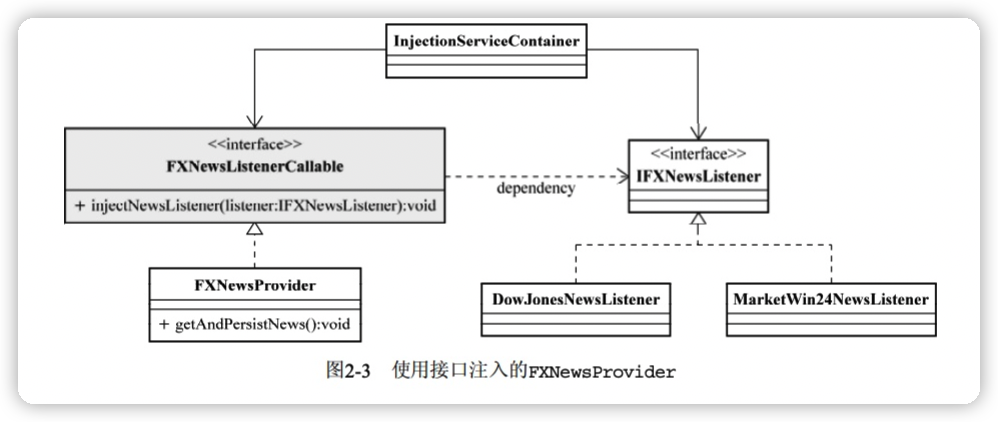

Spring揭秘
---

Spring框架提倡一切从实际出发，使用基于POJO的轻量级编程模型推进整个应用的快速开发。

从Spring框架身上，纵观，几乎可以看到整个基于Java平台的软件开发的演变历史；横看，可以跟踪和捕捉当前业界最先进的理念和软件开发模式。

# 一、掀起Spring的盖头来

## 1 Spring框架的由来

大部分J2EE应用开发初期甚至整个生命周期内都不需要牵扯到分布式架构，EJB  -> Spring

Spring的本质始终都是为了提供各种服务，以帮助我们简化基于POJO的Java应用程序开发。



组成整个Spring框架的各种服务实现被划分到了多个相互独立却又相互依赖的模块当中。


# 二、Spring的IOC容器

## 2 IOC的基本概念

### 2.1 理念：让别人为你服务

IOC，Iversion of Control，控制反转。别名依赖注入（Dependency Injection）。

```java
public class FXNewProvider {
    private IFXNewsListener newsListener;
    private IFXNewPersister newPersister;

    public void getAndPersistNews() {
        // ...
    }

    public FXNewProvider() {
        newsListener = new DowJonesNewsListener();
        newPersister = new DowJonesNewsPersister();
    }
}
```

要依赖于某个类或服务，最简单而有效的方式就是直接在类的构造函数中新建相应的依赖类。



所有的被注入对象（FXNewsProvider）和依赖对象（IFXNewsListener和IFXNewPersister）现在由IoC Service Provider统一管理。



### 2.2 注入方式

作为被注入对象，要想让IoC Service Provider为其提供服务，并将所需要的被依赖对象送过来，也需要**通过某种方式通知对方**。

IoC模式最权威的总结和解释是Martin Fowler的文章 [Inversion of Control Containers and the Dependency Injection pattern](https://martinfowler.com/articles/injection.html)

#### 构造方法注入

```java
public FXNewsProvider(IFXNewsListener newsListner,IFXNewsPersister newsPersister) { 
	this.newsListener = newsListner; 
	this.newPersistener = newsPersister; 
}
```

#### setter 方法注入

```java
public class FXNewsProvider {
	private IFXNewsListener newsListener; 
 	private IFXNewsPersister newPersistener; 
 
  public IFXNewsListener getNewsListener() { 
    return newsListener; 
  } 
  public void setNewsListener(IFXNewsListener newsListener) { 
    this.newsListener = newsListener; 
  } 
  public IFXNewsPersister getNewPersistener() { 
    return newPersistener; 
  } 
  public void setNewPersistener(IFXNewsPersister newPersistener) { 
    this.newPersistener = newPersistener; 
  } 
}
```

#### 接口注入

FXNewsProvider为了让IoC Service Provider为其注入所依赖的IFXNewsListener，首先需要实现
IFXNewsListenerCallable接口，这个接口会声明一个injectNewsListner方法（方法名随意），该方法的参数，就是所依赖对象的类型。这样，InjectionServiceContainer对象，即对应的IoC Service Provider就可以通过这个接口方法将依赖对象注入到被注入对象FXNewsProvider当中。



重要的是接口中声明方法的参数类型，必须是“被注入对象”所依赖对象的类型。

#### 三种注入方式的比较

- 接口注入。不提倡，因为它强制被注入对象实现不必要的接口，带有**侵入性**。

- 构造方法注入。

  优点：对象在构造完成之后，即已进入就绪状态，可以马上使用。

  缺点：

  - 当依赖对象比较多的时候，构造方法的参数列表会比较长。
  - 通过反射构造对象的时候，对相同类型的参数的处理会比较困难，维护和使用上也比较麻烦。而且
    在Java中，构造方法无法被继承，无法设置默认值。
  - 对于非必须的依赖处理，可能需要引入多个构造方法，而参数数量的变动可能造成维护上的不便。

- setter方法注入。

  优点：

  - 因为方法可以命名，所以setter方法注入在描述性上要比构造方法注入好一些。
  - setter方法可以被继承，允许设置默认值，而且有良好的IDE支持。

  缺点：对象无法在构造完成后马上进入就绪状态。

### 2.3 IoC 的附加值
