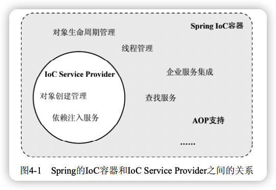
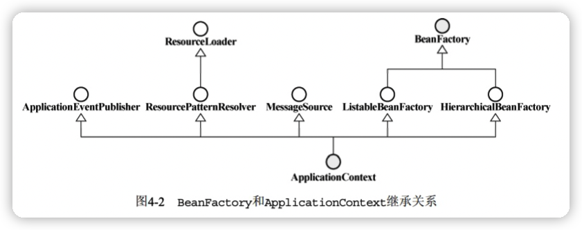
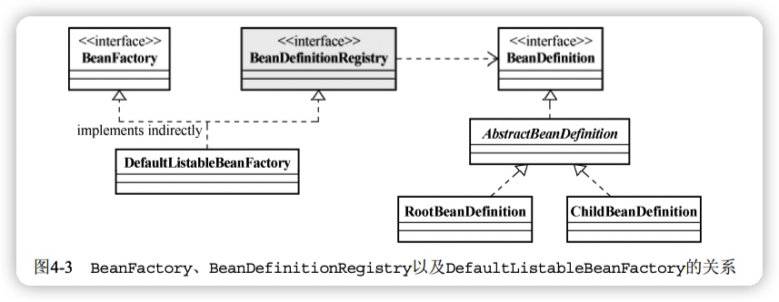
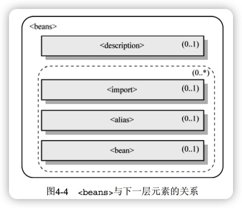
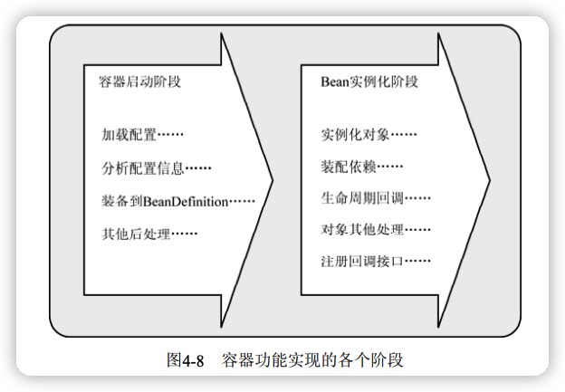
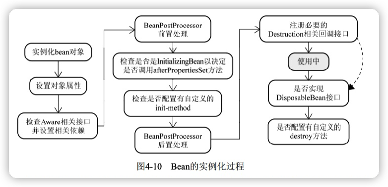
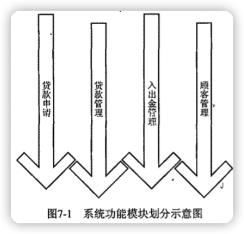
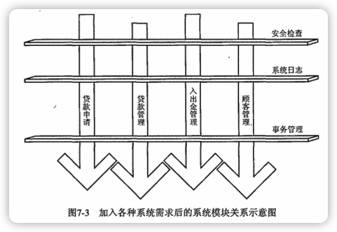
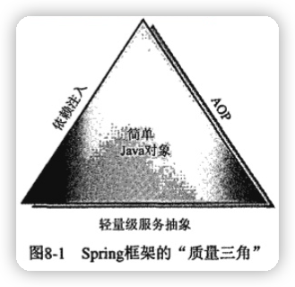

Spring揭秘
---

Spring框架提倡一切从实际出发，使用**基于POJO的轻量级编程模型**推进整个应用的快速开发。

从Spring框架身上，纵观，几乎可以看到整个基于Java平台的软件开发的演变历史；横看，可以跟踪和捕捉当前业界最先进的理念和软件开发模式。

# 一、掀起Spring的盖头来

## 1 Spring框架的由来

大部分J2EE应用开发初期甚至整个生命周期内都不需要牵扯到分布式架构，EJB  -> Spring

Spring的本质始终都是为了提供各种服务，以帮助我们简化基于POJO（Plain Old Java Object，简单Java对象）的Java应用程序开发。


组成整个Spring框架的各种服务实现被划分到了多个相互独立却又相互依赖的模块当中。

整个Spring框架构建在Core核心模块之上，它提供了一个IoC容器实现，用于帮助我们==**以依赖注入的方式管理对象之间的依赖关系**==。之外，Core模块还又框架内部使用的各种工具类（当然也可以在框架之外使用）。

🔖

# 二、Spring的IOC容器

## 2 IOC的基本概念

### 2.1 理念：让别人为你服务

IOC，Iversion of Control，控制反转。别名依赖注入（Dependency Injection）。

```java
public class FXNewProvider {
    private IFXNewsListener newsListener;
    private IFXNewPersister newPersister;

    public void getAndPersistNews() {
        // ...
    }

    public FXNewProvider() {
        newsListener = new DowJonesNewsListener();
        newPersister = new DowJonesNewsPersister();
    }
}
```

要依赖于某个类或服务，最简单而有效的方式就是直接在类的构造函数中新建相应的依赖类。


所有的**被注入对象**（FXNewsProvider）和**依赖对象**（IFXNewsListener和IFXNewPersister）现在由IoC Service Provider（这里可看做为IoC容器）统一管理。


### 2.2 注入方式

作为被注入对象，要想让IoC Service Provider为其提供服务，并将所需要的被依赖对象送过来，也需要**通过某种方式通知对方**。

IoC模式最权威的总结和解释是Martin Fowler的文章 [Inversion of Control Containers and the Dependency Injection pattern](https://martinfowler.com/articles/injection.html)，其中提到三种依赖注入的方式：

#### 构造方法注入

被注入对象可以通过在其构造方法中声明依赖对象的参数列表，让外部（通常是IoC容器）知道它需要哪些依赖对象。

```java
public FXNewsProvider(IFXNewsListener newsListner,IFXNewsPersister newsPersister) { 
	this.newsListener = newsListner; 
	this.newPersistener = newsPersister; 
}
```

IoC Service Provider会检查被注入对象的构造方法，取得它所需要的依赖对象列表，进而为其注入相应的对象。同一个对象是不可能被构造两次的，因此，**被注入对象的构造乃至其整个生命周期，应该是有IoC Service Provider来管理。**

#### setter 方法注入

```java
public class FXNewsProvider {
	private IFXNewsListener newsListener; 
 	private IFXNewsPersister newPersistener; 
 
  public IFXNewsListener getNewsListener() { 
    return newsListener; 
  } 
  public void setNewsListener(IFXNewsListener newsListener) { 
    this.newsListener = newsListener; 
  } 
  public IFXNewsPersister getNewPersistener() { 
    return newPersistener; 
  } 
  public void setNewPersistener(IFXNewsPersister newPersistener) { 
    this.newPersistener = newPersistener; 
  } 
}
```

可以在对象构造完成后再注入。

#### 接口注入

FXNewsProvider为了让IoC Service Provider为其注入所依赖的IFXNewsListener，首先需要实现
IFXNewsListenerCallable接口，这个接口会声明一个injectNewsListner方法（方法名随意），该方法的参数，就是所依赖对象的类型。这样，InjectionServiceContainer对象（即对应的IoC Service Provider）就可以通过这个接口方法将依赖对象注入到被注入对象FXNewsProvider当中。


重要的是**==接口中声明方法的参数类型，必须是“被注入对象”所依赖对象的类型==**。

#### 三种注入方式的比较

- 接口注入。不提倡，因为它强制被注入对象实现不必要的接口，带有**侵入性**。

- 构造方法注入。

  优点：对象在构造完成之后，即已进入就绪状态，可以马上使用。

  缺点：

  - 当依赖对象比较多的时候，构造方法的参数列表会比较长。
  - 通过反射构造对象的时候，对相同类型的参数的处理会比较困难，维护和使用上也比较麻烦。而且
    在Java中，构造方法无法被继承，无法设置默认值。
  - 对于非必须的依赖处理，可能需要引入多个构造方法，而参数数量的变动可能造成维护上的不便。

- setter方法注入。

  优点：

  - 因为方法可以命名，所以setter方法注入在描述性上要比构造方法注入好一些。
  - setter方法可以被继承，允许设置默认值，而且有良好的IDE支持。

  缺点：对象无法在构造完成后马上进入就绪状态。

### 2.3 IoC 的附加值

使用IoC模式的好处：

- 不会对业务对象构成很强的侵入性
- 对象具有更好的可测试性、可重用性和可扩展性

```java
FXNewsProvider dowJonesNewsProvider = new FXNewsProvider(new DowJonesNewsListener(), new DowJonesNewsPersister());
        
 FXNewsProvider marketWin24NewsProvider = new FXNewsProvider(new MarketWin24NewsListener(), new MarketWin24NewsPersister());
```


TDD(Test Driven Developement，测试驱动开发)已经成为越来越受重视的一种开发方式，因为**保证业务对象拥有良好的可测试性，可以为最终交付高质量的软件奠定良好的基础，同时也拉起了产品质量的第一道安全网**。

使用IoC模式后，为了测试FXNewsProvider，就可以提供一个MockNewsListener给FXNewsProvider，而把对DowJonesNewsListener等的依赖排除在外，从而可以毫无牵绊的开展单元测试。

```java
public class MockNewsListener implements IFXNewsListener {
  // ...
}
```


## 3 IoC Service Provider

IoC Service Provider是一个抽象出来的概念，它可以指代**==任何将IoC场景中的业务对象绑定到一起的实现方式==**。它可以是**一段代码**，也可以是**一组相关的类**，甚至可以是**比较通用的IoC框架或IoC容器实现**。

比如，FXNewsProvider相关依赖绑定代码

```java
DowJonesNewsListener newsListener = new DowJonesNewsListener();
DowJonesNewsPersister newsPersister = new DowJonesNewsPersister();
FXNewsProvider newsProvider = new FXNewsProvider(newsListener, newsPersister);
newsProvider.getAndPersistNews();
```

这段代码就可以认为是这个场景中的IoC Service Provider，只是比较简单，而且目的单一。要将系统中几十、几百甚至数以千计的业务对象绑定到一起，采用这种凡是显然不切实际的。

### 3.1 IoC Service Provider的职责

- **业务对象的构建管理**。

  业务对象无需关系所依赖的对象如何构建如何取得，由IoC Service Provider来做，因它需<u>要将对象的构建逻辑从客户端对象剥离出来，以免这部分逻辑污染业务对象的实现</u>。

- **业务对象间的依赖绑定**。

> 如果对象A需要引用对象B，那么A就是B的客服端对象。

### 3.2 IoC Service Provider如何管理对象间的依赖关系

服务生最终必须知道顾客点到额饮品与库存饮品的对应关系，才能为顾客端上适当的饮品。<u>对于为被注入对象提供依赖注入的IoC Service Provider来说，它也同样需要知道自己所管理和掌握的被注入对象和依赖对象之间的对应关系</u>。

> IoC Service Provider有哪些记录诸多对象之间的对应关系的方式？

#### 直接编码方式

这种方式，在容器启动之前，就可以通过程序编码的方式将被注入对象和依赖对象注册到容器中，并明确它们相互之间的依赖注入关系。伪代码：

```java
IoContainer container = ...;
container.register(FXNewsProvider.class, new FXNewsProvider());
container.register(IFXNewsListener.class, new DowJonesNewsListener());
...
FXNewsProvider newsProvider = (FXNewsProvider) container.get(FXNewsProvider.class);
newsProvider.getAndPersistNews();
```


#### 配置文件方式

普通文本文件、properties文件、XML文件等都可以称为**管理和保存**依赖注入关系的载体。最为常用的是XML文件（Spring）。

通过Spring的配置方式来管理FXNewsProvider的依赖注入关系：

```xml
<bean id="newsProvider" class=".. FXNewsProvider">
  <property name="newsListener">
  	<ref bean="djNewsListener"/>
  </property>
  <property name="newPersistener">
  	<ref bean="djNewsPersister"/>
  </property>
</bean>

<bean id="djNewsListener" class="..impl.DowJonesNewsListener">
</bean>
<bean id="djNewsPersister" class="..impl.DowJonesNewsPersister">
</bean>
```

从读取配置文件完成对象组装的容器中获取FxNewsprovider并使用：

```java
...
container.readConfigurationFiles(...);
FXNewsProvider newsProvider = (FXNewsProvider) container.getBean ("newsProvider") ;
newsProvider.getAndPersistNews();
```

#### 元数据方式（注解）

代表实现是[Google Guice](https://github.com/google/guice)，是在Java5的注解和Generic（泛型）基础上开发的一套IoC框架。

我们可以直接在类中使用元数据信息来标注各个对象之间的依赖关系，然后由Guice框架根据这些注解所提供的信息将这些对象组装后，交给客户端对象使用。

```java
public class FXNewsProvider {
	private IFXNewsListener newsListener;
	private IFXNewsPersister newPersistener;
	
  @Inject
	public FXNewsProvider (IFXNewsListener listener, IFXNewsPersister persister) {
		this.newslistener = listener;
		this.newPersistener = persister;  
  }
  ...
}
```

通过@Inject，指明需要IoC Service Provider通过构造方法注入方式，为FXNewsProvider注入其所依赖的对象。

之后通过Guice中是由相应的Module来提供依赖相关信息：

```java
public class NewsBindingModule extends AbstractModule {
	@Override
	protected void configure () {
  	bind(IFXNewsListener.class).to(DowJonesNewsListener.class).in(Scopes.SINGLETON);
    bind(IFXNewsPersister.class).to(DowJonesNewsPersister.class).in(Scopes.SINGLETON);
  }
}
```

从Guice获取并使用最终绑定完成的FXNewsProvider：

```java
Injector injector = Guice.createInjector(new NewsBindingModule());
FXNewsProvider newsProvider = injector.getInstance(FXNewsProvider.class);
newsProvider.getAndPersistNews();
```

注解方式也可以算作编码方式的一种特殊情况。


## 4 Spring的IoC容器之BeanFactory

Spring的IoC容器是一个提供**IoC支持的轻量级容器**：

- IoC支持。
- 作为轻量级容器提供IoC之外的支持。如相应的AOP框架支持、企业级服务集成等服务。



Spring提供两类容器：

- BeanFactory。基础类型IoC容器，提供完善的IoC服务支持。

  默认采用**延迟初始化策略（lazy-load）**，只有当客户端对象需要访问容器中的某个受管对象的时候，才对该受管对象进行初始化以及依赖注入操作。

  因此，容器启动初期速度较快。

  比较适合<u>资源有限，并且功能要求不是很严格</u>的场景。

- ApplicationContext。

  建立在BeanFactory基础上。

  更多高级特性，如事件发布、国际化信息支持等。

  默认全部初始化并绑定。初始化速较慢。



### 4.1 拥有BeanFactory之后

在BeanFactory之前，自己实例相应的对象并调用：

```java
FXNewsProvider newsProvider = new FXNewsProvider();
newsProvider.getAnPersistNews();
```

有了BeanFactory之后，只需将”生产线图纸“交给BeanFactory：

```java
BeanFactory container = new ClassPathXmlApplicationContext("配置文件路径");
FXNewsProvider newsProvider = (FXNewsProvider) container.getBean("djNewsProvider");
newsProvider.getAnPersistNews();
```


### 4.2 BeanFactory的对象注册与依赖绑定方式

> 在Spring的术语中，把BeanFactory的对象注册与依赖绑定信息称为**==Configuration Metadata==**。

#### 直接编码方式

通过编码方式使用BeanFactory实现FX新闻相关类的注册及绑定：

```java
    public static void main(String[] args) {
        DefaultListableBeanFactory beanRegistry = new DefaultListableBeanFactory();
        BeanFactory container = (BeanFactory) bindViaCode(beanRegistry);
        FXNewsProvider newsProvider = (FXNewsProvider) container.getBean("djNewsProvider");
        newsProvider.getAndPersistNews();
    }

    private static BeanFactory bindViaCode(BeanDefinitionRegistry registry)  {
        // 定义Bean
        AbstractBeanDefinition newsProvider = new RootBeanDefinition(FXNewsProvider.class, true);
        AbstractBeanDefinition newsListener = new RootBeanDefinition(DowJonesNewsListener.class, true);
        AbstractBeanDefinition newsPersister = new RootBeanDefinition(DowJonesNewsPersister.class, true);

        // 将bean定义到容器中
        registry.registerBeanDefinition("djNewsProvider", newsProvider);
        registry.registerBeanDefinition("djNewsListener", newsListener);
        registry.registerBeanDefinition("djNewsPersister", newsPersister);

        // 指定依赖关系
        //   1 通过构造方法注入
        ConstructorArgumentValues argValues = new ConstructorArgumentValues();
        argValues.addIndexedArgumentValue(0, newsListener);
        argValues.addIndexedArgumentValue(1, newsPersister);
        newsProvider.setConstructorArgumentValues(argValues);
        //   2 或通过setter方法注入
        MutablePropertyValues propertyValues = new MutablePropertyValues();
        propertyValues.addPropertyValue(new PropertyValue("newsListener", newsListener));
        propertyValues.addPropertyValue(new PropertyValue("newsPersister", newsPersister));
        newsProvider.setPropertyValues(propertyValues);

        return (BeanFactory) registry;
    }
```




==DefaultListableBeanFactory== **间接**实现 BeanFactory 接口，还实现了 BeanDefinitionRegistry 接口，这个接口担当Bean注册管理的角色；

BeanFactory 值定义如何访问容器内管理的Bean的方法，各个BeanFactory的具体实现类负责具体Bean的注册已经管理工作。

> 简单的比喻
>
> BeanDefinitionRegistry  图书馆的书架
>
> BeanFactory  图书馆

容器中每一个受管的对象，都有一个 ==BeanDefinition== （主要实现类为 RootBeanDefinition 和 ChildBeanDefinition）实例，负责保存**对象的所有必要信息，包括其对应的对象的class类型、是否是抽象类、构造方法参数以及其他属性等**。当客户端向 BeanFactory 请求相应对象的时，它就通过这些信息为客户端返回一个完备可用的对象实例。

#### 外部配置文件方式

根据不同的外部配置文件格式，给出相应的 ==BeanDefinitionReader== 实现类，主要是 XmlBeanDefinitionReader，（PropertiesBeanDefinitionReader 在最新版已经过期），实现类复制将相应的配置文件内容读取并映射到 BeanDefinition，然后映射后的BeanDefinition注册到一个BeanDefinitionRegistry，完成Bean的注册和加载。

> Spring 2.x 以前采用DTD实现文档的格式约束，之后引入XSD，两者都可以使用。

```xml
<?xml version="1.0" encoding="UTF-8"?>
<!DOCTYPE beans PUBLIC "-//SPRING//DTD BEAN//EN"
        "http://www.springframework.org/dtd/spring-beans.dtd">
<beans>
    <bean id="djNewsProvider" class="com.andyron.ch02.ch21.FXNewsProvider">
        <property name="newsListener">
            <ref bean="djNewsListener"/>
        </property>
        <property name="newsPersister">
            <ref bean="djNewsPersister"/>
        </property>
    </bean>

    <bean id="djNewsListener" class="com.andyron.ch02.ch21.DowJonesNewsListener">
    </bean>
    <bean id="djNewsPersister" class="com.andyron.ch02.ch21.DowJonesNewsPersister">
    </bean>
</beans>
```


```java
    public static void main(String[] args) {
        DefaultListableBeanFactory beanRegistry = new DefaultListableBeanFactory();
        BeanFactory container = (BeanFactory) bindViaXMLFile(beanRegistry);
        FXNewsProvider newsProvider = (FXNewsProvider) container.getBean("djNewsProvider");
        newsProvider.getAndPersistNews();
    }
		
    private static BeanFactory bindViaXMLFile(BeanDefinitionRegistry registry) {
      XmlBeanDefinitionReader reader = new XmlBeanDefinitionReader(registry);
      reader.loadBeanDefinitions("beans.xml");
      return (BeanFactory) registry;
    }
```


#### 注解方式

`@Autowired` 和 `@Component`

🔖

### 4.3 BeanFactory的XML之旅


#### `<beans>` 和 `<bean>`

DTD格式：

```xml
<?xml version="1.0" encoding="UTF-8"?>
<!DOCTYPE beans PUBLIC "-//SPRING//DTD BEAN//EN"
        "http://www.springframework.org/dtd/spring-beans.dtd">
<beans>
    ...
</beans>
```

XSD格式：

```xml
<?xml version="1.0" encoding="UTF-8"?>
<beans xmlns="http://www.springframework.org/schema/beans"
       xmlns:xsi="http://www.w3.org/2001/XMLSchema-instance"
       xsi:schemaLocation="http://www.springframework.org/schema/beans
       http://www.springframework.org/schema/beans/spring-beans.xsd">
    ...
</beans>
```

所有注册到容器的业务对象，在Spring中称之为**==Bean==**。

`<beans>`是最顶层的元素，下面可以包含0个或1个`<description>`和多个`<bean>`以及`<import>`或者`<alias>`：



`<beans>`拥有相应的属性来对`<bean>`进行统一的默认行为配置：

- default-lazy-init
- default-autowire
- default-dependency-check
- default-init-method
- default-destroy-method

#### 孤孤单单一个Bean


#### 业务对象之间相互协作

🔖🔖

##### 1 构造方法注入的XML之道


##### 2 setter方法注入的XML之道


##### 3 `<property`和`constructor-arg>`中的可用配置项


##### 4 depends-on


##### 5 autowire


##### 6 dependency-check


##### 7 lazy-init


#### bean”纵向上“的关系（”继承“）


#### bean的scope

容器在对象进入其相应的scope之前，生成并装配这些对象，在该对象不再处于这些scope的限定之后，容器通常会销毁这些对象。


#### 工厂方法与FactoryBean


### 4.4 容器背后的秘密


#### ”战略性观望“

Spring的IoC容器会议某种方式加载Configuration Metadata（通常是XML格式），然后根据这些信息绑定整个系统的对象，最终组装成一个可用的基于轻量级容器的应用系统。

实现上面的功能的，可根据类似的流程分为两个阶段：**容器启动阶段**和**Bean实例化阶段**。




#### 插手”容器的启动“

BeanFactoryPostProcessor

该机制允许我们**在容器实例化相应对象之前，对注册到容器的BeanDefinition所保存的信息做相应的修改**。


#### 了解bean的一生



##### 1 Bean的实例化与BeanWrapper


##### 2 各色的Aware接口


##### 3 BeanPostProcessor


##### 4 InitializingBean和init-method


##### 5 DisposableBean与destroy-method


## 5 Spring IoC容器ApplicationContext


### 5.1 统一资源加载策略


#### Spring的Resource


#### ResourceLoader（更广义的URL）


#### ApplicationContext与ResourceLoader


### 5.2 国际化信息支持


### 5.3 容器内部事件发布

#### 自定义事件发布


#### Spring的容器内事件发布类结构分析


#### Spring容器内事件发布的应用


### 5.4 多配置模块加载的简化


## 6 Spring IoC容器之扩展


# 三、Spring Aop框架


## 7 AOP简介



调试

监控

日志记录

权限限制

安全检查




### 7.1 AOP的尴尬


### 7.2 AOP走向现实


#### 静态AOP时代


#### 动态AOP时代


### 7.3 Java平台上的AOP实现机制


#### 动态代理


#### 动态字节码增强


#### Java代码生成


#### 自定义类加载器


#### AOL扩展


### 7.4 AOP国家的公民


#### Joinpoint


方法调用（Method Call）

方法调用执行（Method Call execution）

构造方法调用（Constructor Call）

构造方法执行（Constructor Call execution）

字段设置（Field Set）

字段获取（Field Get）

异常处理执行（Exception Handler Execution）

类初始化（Class initialization）


#### Pointcut

Joinpoint的表达方式


#### Advice

单一横切关注点逻辑的载体


#### Aspect

Aspect是对系统中的横切关注点逻辑进行模块化封装的AOP概念实体。


#### 织入和织入器


#### 目标对象


## 8 Spring AOP概述及其实现机制

### 8.1 概述



Spring AOP采用Java作为AOP的实现语言（AOL）。以有限的20%AOP支持，来满足80%的AOP需求；另外20%的需求，可求助于AspectJ，Spring AOP对AspectJ也提供了很好的集成。


### 8.2 Spring AOP的实现机制

Spring AOP属于第二代AOP，采用**动态代理机制和字节码生成技术**实现。

#### 代理模式


#### 动态代理


#### 动态字节码生成


# 四、使用Spring访问数据

## 13 统一的数据访问异常层次体系


## 14 JDBC API的最佳实践


## 15 Spring对各种ORM的集成


## 16 Spring数据访问的扩展


