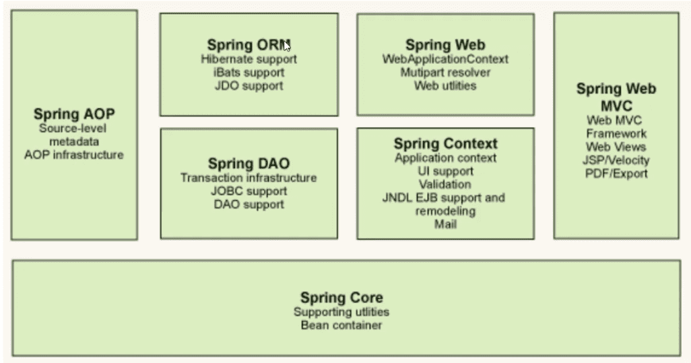
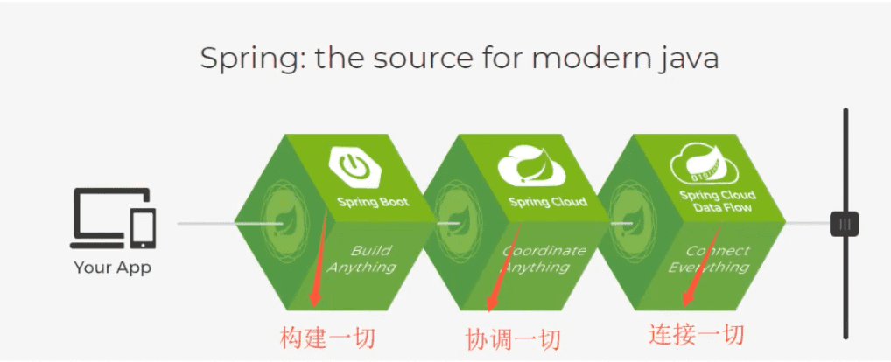
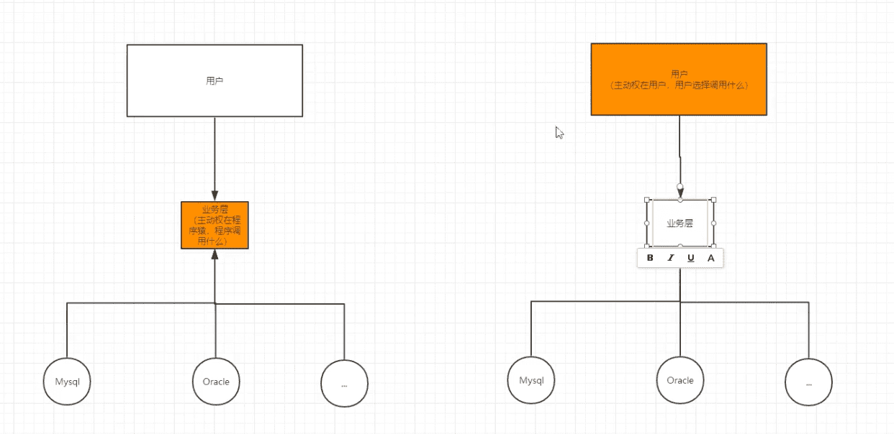
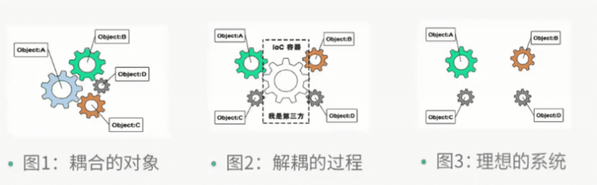
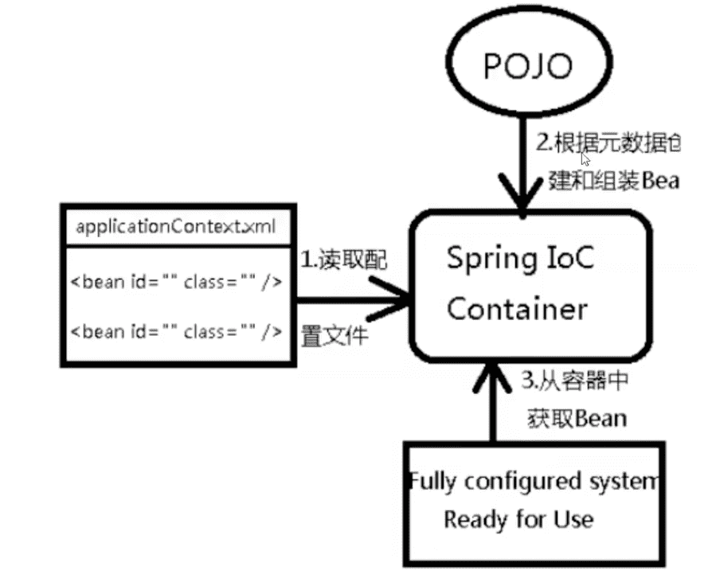
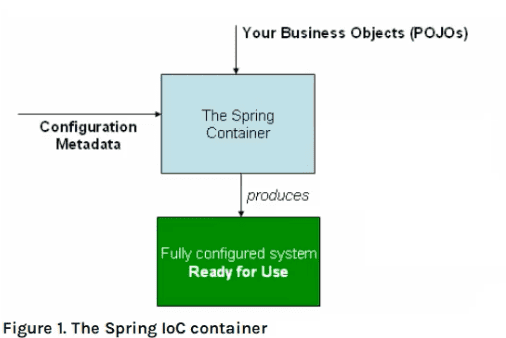
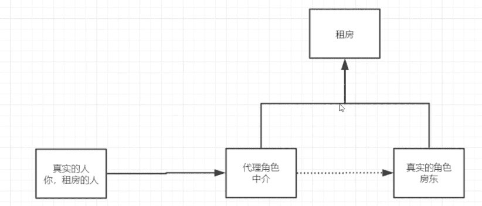
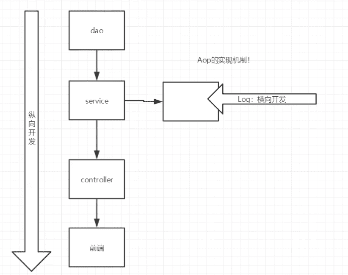
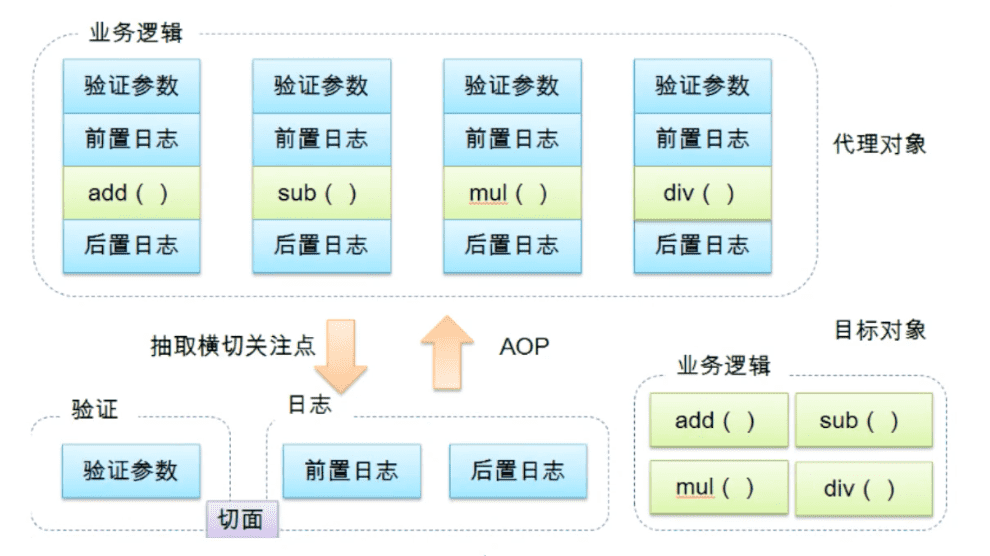
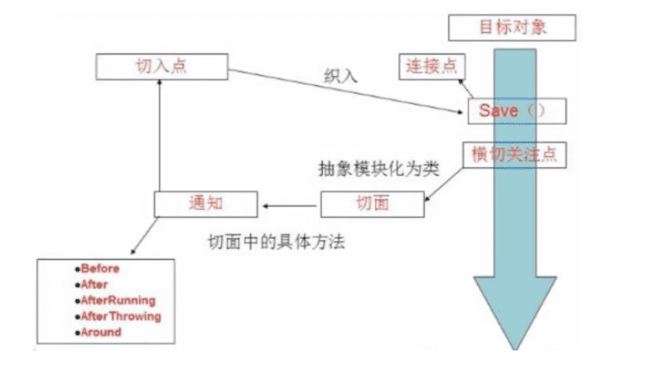

Spring5学习
-------

[【狂神说Java】Spring5最新完整教程IDEA版通俗易懂](https://www.bilibili.com/video/BV1WE411d7Dv?p=1)

## 1、Spring简介

Spring是为解决企业应用开发复杂性而创建的，简化开发。它用基本的JavaBean来完成以前只可能由[EJB](https://baike.baidu.com/item/EJB/144195)完成的事情。

Spring的用途不仅仅限于服务器端的开发，它可用于任何Java应用。

Spring的雏形是**interface21**（2004年）

作者Rod Johnson，音乐博士

Spring理念（设计哲学）：使现有的技术更加容易使用，本身是一个大杂烩（融合剂），整合了现有的技术框架！

SSH：Struct2 + Spring + Hibernate  (已经过时)

SSM：SpringMVC + Spring + MyBatis 


官方文档：https://docs.spring.io/spring-framework/docs/current/reference/html/

官方下载地址：https://repo.spring.io/ui/native/release/org/springframework/spring

GitHub：https://github.com/spring-projects/spring-framework


maven

```xml
<!-- https://mvnrepository.com/artifact/org.springframework/spring-webmvc -->
 <dependency>
    <groupId>org.springframework</groupId>
    <artifactId>spring-webmvc</artifactId>
    <version>5.3.9</version>
</dependency>
  
  <!-- https://mvnrepository.com/artifact/org.springframework/spring-jdbc -->
<dependency>
    <groupId>org.springframework</groupId>
    <artifactId>spring-jdbc</artifactId>
    <version>5.3.9</version>
</dependency>
```

只需要依赖spring-webmvc包，其它spring包都会导入


### 优点

- 开源的免费的框架（容器）
- 轻量级的、非入侵式
- 控制反转（IOC）、面向切面编程（AOP）
- 支持事务的处理，对框架整合的支持

总结：Spring就是一个轻量级的控制反转（IOC）和面向切面编程（AOP）的框架！


### 组成

Spring七大模块



- 核心容器(Spring Core)：核心容器提供 Spring 框架的基本功能。核心容器的主要组件是`BeanFactory`，它是工厂模式的实现。BeanFactory使用控制反转 （IOC） 模式将应用程序的配置和依赖性规范与实际的应用程序代码分开。

- Spring上下文(Spring Context)：Spring上下文是一个配置文件，继承BeanFactory，向Spring框架提供上下文信息。Spring上下文包括JNDI(Java命名和目录接口)、EJB(Enterprise Java Beans称为Java企业Bean)、电子邮件、国际化、校验和调度等功能。

- Spring AOP：集成了所有AOP功能。减弱代码的功能耦合，清晰的被分离开。

- Spring DAO：提供了JDBC的抽象层，还提供了声明性事务管理方法。

- Spring ORM：提供了JPA、JDO、Hibernate、MyBatis 等ORM映射层。

- Spring Web模块：提供了基础的 Web 开发的上下文信息，现有的Web框架，如JSF、Tapestry、Structs等，提供了集成。

- Spring MVC 框架：一个全功能的构建 Web 应用程序的 MVC 实现。通过策略接口，MVC 框架变成为高度可配置的，MVC 容纳了大量视图技术，其中包括 JSP。

### 拓展

Spring是现代化的Java开发！说白了就是基于Spring的开发！



- Spring Boot
  - 一个快速开发的脚手架
  - 基于Spring Boot可以快速的开发单个微服务
  - 约定大于配置
- Spring Cloud
  - 基于Spring Boot实现的

学习SpringBoot的前提，是Spring和SpringMVC，他们启动承上启下的作用。


Spring弊端：发展了太久之后，违背了原来的理论!配置十分繁琐，人称“配置地狱”！

SpringBoot解决了这个问题。

  

## 2、IOC理论推导

原来

UserDao	接口

UserDaolmpl	实现类

UserService	业务接口

UserServicelmpl	业务实现类


在我们之前的业务中，用户的需求可能会影响我们原来的代码，我们需要根据用户的需求去修改原来的代码！如果程序代码量十分大，修改一次的成本十分昂贵！

通过set实现改变：

```java
public UserDao userDao = new UserDaoOracleImpl();
```

变成：

```java
public  UserDao userDao;
//利用set进行动态实现值的注入
public void setUserDao(UserDao userDao) {
        this.userDao = userDao;
    }
```

之前，程序的是主动创建对象，控制权在程序员手上； 使用了set注入后，程序员不再具有主动性，而是变成了被动的接受对象！


这种思想，从本质上解决了问题，让程序员不用再去管理对象的创建。系统的耦合性大大降低~，可以更加专注的在业务的是线上（增加类似`UserDaoSqlserverImpl`的编写，而不要去频繁修改`UserServiceImpl`）！这是IOC的原型，控制反转，就是把控制权反转交给了用户，让程序更加通用。


### IOC的本质

 

IOC是一种设计思想，DI（依赖注入）是实现IOC的一种方法。



IoC是Spring框架的核心内容，使用多种方式完美的实现IoC，可以使用XML配置，也可以使用注解，新版本Spring也可不要配置。

Spring容器在初始化时先读取配置文件，根据配置文件或元数据创建于组织对象存入容器中，程序是用时再从IOC容器中取出需要的对象。






采用XML方式配置Bean的时候，Bean的定义信息和实现分类；而采用注解的方式两者是合为一体的，Bean的定义信息直接以注解的形式定义在实现类中，从而达到零配置的目的。

**控制反转是一种通过描述（XML或注解）并采用第三方去生产或获取特定对象的方式。在Spring中实现控制反转的是IoC容器，其实现方法是依赖注入（Dependency Injection，DI）。**


## 3、helloSpring

新建module，

### 3.1 导入Spring相关jar包

```xml
<dependency>
  <groupId>org.springframework</groupId>
  <artifactId>spring-webmvc</artifactId>
  <version>5.3.9</version>
</dependency>
```

### 3.2编写相关代码

一个Hello实体类：

```java
public class Hello {
    private String str;

    @Override
    public String toString() {
        return "Hello{" +
                "str='" + str + '\'' +
                '}';
    }

    public void setStr(String str) {
        this.str = str;
    }

    public String getStr() {
        return str;
    }
}
```

编写spring的配置文件beans.xml

```xml
<?xml version="1.0" encoding="UTF-8"?>
<beans xmlns="http://www.springframework.org/schema/beans"
       xmlns:xsi="http://www.w3.org/2001/XMLSchema-instance"
       xsi:schemaLocation="http://www.springframework.org/schema/beans http://www.springframework.org/schema/beans/spring-beans.xsd">

    <!-- 使用Spring来创建对象，在Spring中这些都称为Bean

    类型 变量名 = new 类型();
    Hello hello = new Hello();

    id = 变量名
    class = new的对象
    property 相当于给对象中的属性设置一个值
    -->
    <bean id="hello" class="com.andyron.pojo.Hello">
        <property name="str" value="Spring"></property>
    </bean>

</beans>
```

测试：

```java
public class MyTest {
    public static void main(String[] args) {
        // 获取Spring的上下文对象
        ApplicationContext context = new ClassPathXmlApplicationContext("beans.xml");
        // 我们的对象现在都在Spring中管理了，我要需要使用，直接去里面取出来就可以！

        Hello hello = (Hello) context.getBean("hello");
        System.out.println(hello.toString());
    }
}
```

### 总结

hello对象是由Spring创建的，hello对象的属性是由Spring容器设置的，这个过程就叫**控制反转**：

控制：谁来控制对象的创建，传统应用程序的对象时由程序本身控制创建的（new ...），使用Spring后，对象由Spring创建的。

反转：程序本身不创建对象，而变成被动的接收对象。

依赖注入：利用set方法来进行注入的。

IOC是一种编程思想，有主动的编程变成被动的接收。


现在我们彻底不用在程序中改动了，要实现不同的操作，只需要在xml配置文件中进行修改，所谓的IOC就是：**对象由Spring来创建，管理，装配！**


## 4、IOC创建对象的方式

1. 使用无参数构造创建对象，默认；

   ```xml
   <bean id="user" class="com.andyron.pojo.User">
     <property name="name" value="戎先生"></property>
   </bean>
   ```

   

2. 假设要使用有参构造创建对象：

   - 下标赋值

     ```xml
     <bean id="user" class="com.andyron.pojo.User">
       <constructor-arg index="0" value="Mr.Ron"></constructor-arg>
     </bean>
     ```

   - 参数类型匹配赋值（不建议使用）

     ```xml
     <bean id="user" class="com.andyron.pojo.User">
       <constructor-arg type="java.lang.String" value="Tom"></constructor-arg>
     </bean>
     ```

   - 直接通过参数名

     ```xml
     <bean id="user" class="com.andyron.pojo.User">
       <constructor-arg name="name" value="Andy"></constructor-arg>
     </bean>
     ```


总结：只要在配置文件中配置bean后，容器中管理的对象就已经被初始化了，而且只有一份，每次获取都是同一个。

## 5、Spring配置


### alias

给bean取别名

```xml
<alias name="user2" alias="user2bieming"></alias>
```


### bean

id： bean的唯一标识符

class：bean对象所对应的**全限定名**

name：也是别名，而且可以同时取多个别名（空格逗号分号分隔都可以）

```xml
<bean id="user2" class="com.andyron.pojo.User2" name="u2 u3,u4;u5">
  <property name="name" value="哈哈"></property>
</bean>
```


### import

一般用于团队开发使用，它可以将多个配置文件导入合并为一个。

```xml
<import resource="beans.xml"></import>
<import resource="beans2.xml"></import>
```


## 6、DI依赖注入

[注入的配置细节官网文档-1.4.2. Dependencies and Configuration in Detail](https://docs.spring.io/spring-framework/docs/5.2.16.RELEASE/spring-framework-reference/core.html#beans-factory-properties-detailed)

### 6.1 构造器注入（Constructor-based DI）


### 6.2 Set方式注入（Setter-based DI）【重点】

依赖注入：Set注入

- 依赖：bean对象的创建依赖于容器
- 注入：bean对象中的所有属性，有容器注入


### 6.3 拓展方式注入

- p命名空间注入。`property`，对应默认的无参构造方法
- c命名空间注入。`construct-args`，必须要有有参构造方法

```xml
<bea<?xml version="1.0" encoding="UTF-8"?>
<beans xmlns="http://www.springframework.org/schema/beans"
       xmlns:xsi="http://www.w3.org/2001/XMLSchema-instance"
       xmlns:p="http://www.springframework.org/schema/p"
       xmlns:c="http://www.springframework.org/schema/c"
       xsi:schemaLocation="http://www.springframework.org/schema/beans http://www.springframework.org/schema/beans/spring-beans.xsd">

    <!-- p命名空间注入，可以直接注入属性的值：property 对应默认的无参构造方法 -->
    <bean id="user" class="com.andyron.pojo.User" p:name="andy" p:age="18"></bean>

    <!-- c命名空间注入，通过构造器注入：construct-args，对应有参构造方法 -->
    <bean id="user2" class="com.andyron.pojo.User" c:age="19" c:name="Tom"></bean>
</beans>
```


> 注意：p命名和c命名空间注入不能直接使用，需要导入xml约束
>
> ```xml
> xmlns:p="http://www.springframework.org/schema/p"
> xmlns:c="http://www.springframework.org/schema/c"
> ```

 

### 6.4 Bean的作用域

1. [singleton](https://docs.spring.io/spring-framework/docs/5.2.16.RELEASE/spring-framework-reference/core.html#beans-factory-scopes-singleton) scope，默认的作用域，全局只有一个实例

```java
```


2. [prototype](https://docs.spring.io/spring-framework/docs/5.2.16.RELEASE/spring-framework-reference/core.html#beans-factory-scopes-prototype) ，每次从容器中get的时候，都会产生一个新对象


```xml
<bean id="user2" class="com.andyron.pojo.User" c:age="19" c:name="Tom" scope="prototype"></bean>
```

```java
User user = context.getBean("user2", User.class);
User user2 = context.getBean("user2", User.class);
System.out.println(user.hashCode());
System.out.println(user2.hashCode());
System.out.println(user == user2);
```

结果hasCode不同，false

3. request、session、application作用域都只能在web开发中使用到。


## 7、Bean的自动装配

在Spring中有三种装配的方式：

1. 在xml中显示的配置
2. 在java中显示的配置
3. 隐式的自动装配【重要】

### 7.1 测试

### ByName自动装配

```xml
<bean id="cat" class="com.andyron.pojo.Cat"></bean>
<bean id="dog" class="com.andyron.pojo.Dog"></bean>

<bean id="people" class="com.andyron.pojo.People">
  <property name="name" value="主人"></property>
  <property name="cat" ref="cat"></property>
  <property name="dog" ref="dog"></property>
</bean>
```

改成：

```xml
    <bean id="cat" class="com.andyron.pojo.Cat"></bean>
    <bean id="dog" class="com.andyron.pojo.Dog"></bean>

    <bean id="people" class="com.andyron.pojo.People" autowire="byName">
        <property name="name" value="主人"></property>
    </bean>
```

`byName`配置后会自动在容器上下文中查找，和自己set方法后面的值对应的beanid！


### ByType自动装配

```xml
<bean  class="com.andyron.pojo.Cat"></bean>
<bean class="com.andyron.pojo.Dog"></bean>

<bean id="people" class="com.andyron.pojo.People" autowire="byType">
  <property name="name" value="主人"></property>
</bean>
```

小结：

- byname的时候，需要保证所有bean的id唯一，并且这个bean需要和自动注入的属性的set方法的值一致！
- bytype的时候，需要保证所有bean的class唯一，并且这个bean需要和自动注入的属性的类型一致。

### 使用注解实现自动装配

jdk1.5支持注解，Spring2.5就支持注解

注解配置比xml配置更好一点。

要使用注解须知：

1. 导入context约束
2. 配置注解的支持` <context:annotation-config/>`

```xml
<?xml version="1.0" encoding="UTF-8"?>
<beans xmlns="http://www.springframework.org/schema/beans"
    xmlns:xsi="http://www.w3.org/2001/XMLSchema-instance"
    xmlns:context="http://www.springframework.org/schema/context"
    xsi:schemaLocation="http://www.springframework.org/schema/beans
        https://www.springframework.org/schema/beans/spring-beans.xsd
        http://www.springframework.org/schema/context
        https://www.springframework.org/schema/context/spring-context.xsd">

    <context:annotation-config/>

</beans>
```

#### @Autowired

直接在属性上使用即可。也可以在set方法上使用！

在属性上使用时，可以不要编写set方法，前提是这个自动装配的属性在Spring容器中存在，且符合命名规则。

注意：

**@Nullable**  字段标注这个注解，说明字段可以为null

**@Qualifier**，当bean中同一个class注册了好几个（id有几个）时，用这个注解区分；或者当不能直接通过名字识别时，用这个指定

```java
<bean id="dog2" class="Dog"></bean>
<bean id="dog22" class="Dog"></bean>
  
  
@Autowired
@Qualifier(value = "dog22")
private Dog dog;
```

#### @Resource

这是Java原生注解，可替代@Autowired，它在名字（id）和类型（class）都找不到时才会报错；它有name属性替代@Qualifier注解的使用：

```java
<bean id="dog2" class="Dog"></bean>
<bean id="dog22" class="Dog"></bean>
  
  
@Resource(name = "dog22")
private Dog dog;
```

@Resource功能强大一些，但常用的是@Autowired。

@Autowired是通过byType方式实现的；@Resource默认通过byName实现，如果找不动名字，则通过byType实现。


## 8、使用注解开发

在Spring4之后，要使用注解开发，必须要保证aop的包导入了。

使用注解还需要导入context约束，增加注解的支持。

1. bean


2. 属性如何注入

```java
@Component
public class User {
    /**
     相当于 <property name="name" value="Andy"></property>
     */
    @Value("Andy")
    public String name;
}
```

或者

```java
@Component
public class User {
  public String name;
  
  @Value("Andy")
  public void setName(String name) {
    this.name = name;
  }
}
```


3. 衍生的注解

@Component有几个衍生注解，我们在web开发中，会按照mvc三层架构分层：

- dao 【@Repository】
- service 【@Service】
- controller 【@Controller】

这四个注解功能都是一样的，都是代表将某个类注册到Spring中，装配Bean。


4. 自动装配

```
- @Autowired

- @Nullable

- @Resource
```


5. 作用域 

```java
@Component
@Scope("prototype")
public class User {
}
```


6. 小结

xml与注解：

- xml更加万能，适合于任何场合。维护简单方便
- 注解不是自己类使用不了，维护相对复杂

xml与注解最佳实践

- xml用来管理bean
- 注解只负责完成属性的注入;注解使用前必须开启注解的支持：

```xml
<context:annotation-config/>
<!-- 指定要扫描的包，这个包的注解就会生效-->
<context:component-scan base-package="com.andyron"/>
```


## 9、使用Java的方式配置Spring

用Java的配置类完全替代Spring的xml配置文件，全都交个Java。

之前叫做JavaConfig是Spring的一个子项目，在Spring4之后，它成为了一个核心功能。

`AnnotationConfigApplicationContext`

```java
/**
 被@Configuration配置的类本身也会被Spring容器托管，注册到容器中，因为它本来就是一个@Component；
 @Configuration代表这是一个配置了，类似之前xml配置文件
 */
@Configuration
@ComponentScan("com.andyron.pojo")
@Import(AndyConfig2.class)
public class AndyConfig {
    /*
    注册一个bean，就相当于一个bean标签
    这个方法的名字就相当于bean标签中的id
    这个方法的返回值就相当于bean标签中的class
     */
    @Bean
    public User getUser() {
        return new User();
    }
}

```

这种纯Java的配置方式，在SpringBoot中随处可见 。


## 10、代理模式

中介

为什么要学习代理模式？因为这就是SpringAOP的底层！




### 10.1 静态代理

角色分析

- 抽象角色：一般会使用接口或抽象类来解决
- 真实角色：被代理的角色
- 代理角色：代理真实角色，代理真实角色后，我们一般会做一些附属操作
- 客户：访问代理对象的人

代码编写步骤：

1. 接口
2. 真实角色
3. 代理角色
4. 客户端访问代理角色


代理模式的好处：

- 可以是真实角色的操作更加纯粹，不用去关注一些公共的业务
- 公共业务就交给代理角色！实现了业务的分工！
- 公共业务发生扩展的时候，方便集中管理！

缺点：

- 一个真实角色就会产生一个代理角色；代码量会翻倍，开发效率会变低


### 10.2 加深理解

代码：**spring-08-demo2**

聊聊AOP，利用代理模式在不改变原有代码的情况下添加功能




### 10.3 动态代理

为了解决静态代理代码量增加（方法重新实现），产生了动态代理。

- 动态代理和静态代理角色一样
- 动态代理的代理类是动态生成的，不是我们直接写的
- 动态代理分为两大类：基于接口的动态代理，基于类的动态代理
  - 基于接口：JDK动态代理
  - 基于类：**cglib**
  - java字节码实现：javasist（在JBoss中使用不是Tomcat，jboss的一个子项目，其主要的优点，在于简单，而且快速。直接使用java编码的形式，而不需要了解虚拟机指令，就能动态改变类的结构，或者动态生成类。）

需要了解两个类

`Proxy`：代理。提供了创建动态代理和实例的静态方法

`InvocationHandler`：调用处理程序。由代理实例的调用**处理程序**实现的接口。每个代理实例都有一个关联的调用处理程序。当在代理实例上调用方法时，方法调用将被编码并分派到其调用处理程序的invoke方法。

动态代理的好处：

- 可以是真实角色的操作更加纯粹，不用去关注一些公共的业务
- 公共业务就交给代理角色！实现了业务的分工！
- 公共业务发生扩展的时候，方便集中管理！
- 一个动态代理处理程序代理的是一个接口，一般就是对应的一类业务。
- 一个动态代理处理程序可以代理多个类，只要是实现了同一个接口即可。

## 11、AOP

### 11.1 什么是AOP

AOP（Aspect Oriented Programming，面向切面编程），通过预编译方式和运行期动态代理实现程序功能的统一维护的一种技术。AOP是OOP的延续，是软件开发中的一个热点，也是Spring框架中的一个重要内容，是函数式编程的一种衍生泛型。利用AOP可以对业务逻辑的各个部分进行隔离，从而使得业务逻辑各部分之间的耦合度降低，提高程序的可重用性，同时提高了开发的效率。




### 11.2 AOP在Spring中的作用

提供**声明式事务**；允许用户自定义切面

- 横切关注点：跨越应用程序多个模块的方法或功能。即是，与我们业务逻辑无关的，但是我们需要关注的部分，就是横切关注点，如日志，安全，缓存，事务。。。
- 切面（Aspect）：横切关注点被模块化的特殊对象，即，它是一个**类**。
- 通知（Advice）：切面必须要完成的工作。即，它是类中的一个方法。
- 目标（Target）：被通知的对象。
- 代理（Proxy）：向目标对象应用通知之后创建的对象。
- 切入点（PointCut）：切面通知执行的”地点“的定义。
- 连接点（JointPoint）：与切入点匹配的执行点。




SpringAOP中，通过Advice定义横切逻辑，Spring中支持5种类型的Advice：

| 通知类型     | 连接点               | 实现接口                                        |
| ------------ | -------------------- | ----------------------------------------------- |
| 前置通知     | 方法前               | org.springframework.aop.MethodBeforeAdvice      |
| 后置通知     | 方法后               | org.springframework.aop.AfterReturningAdvice    |
| 环绕通知     | 方法前后             | org.aopalliance.intercept.MethodInterceptor     |
| 异常抛出通知 | 方法抛出异常         | org.springframework.aop.ThrowsAdvice            |
| 引介通知     | 类中增加新的方法属性 | org.springframework.aop.IntroductionInterceptor |

即AOP在不改变原有代码的情况下，去增加新的功能。

### 11.3 使用Spring实现AOP

【重点】使用AOP，需要导入一个依赖包

```xml
	<!-- https://mvnrepository.com/artifact/org.aspectj/aspectjweaver -->
<dependency>
  <groupId>org.aspectj</groupId>
  <artifactId>aspectjweaver</artifactId>
  <version>1.9.4</version>
</dependency>
```


业务代码 UserService UserServiceImpl

AOP处理代码 Log AfterLog 

把类注册到Spring中：添加配置文件applicationContext.xml

> 【Code：spring-09-aop】

方式一：使用原生Spring API接口【主要SpringAPI接口实现】 

```xml
<!-- 注册bean -->
<bean id="userService" class="com.andyron.service.UserServiceImpl"/>
<bean id="log" class="com.andyron.log.Log"/>
<bean id="afterLog" class="com.andyron.log.AfterLog"/>

<!-- 方式一：使用原生Spring API接口 -->
<!-- 配置aop：需要导入aop的约束 -->
<aop:config>
  <!-- 切入点，expression：表达式 -->
  <aop:pointcut id="pointcut" expression="execution(* com.andyron.service.UserServiceImpl.*(..))"/>

  <aop:advisor advice-ref="log" pointcut-ref="pointcut"/>
  <aop:advisor advice-ref="afterLog" pointcut-ref="pointcut"/>
</aop:config>
```


方式二：自定义类实现AOP（相对简单）【主要是切面定义】

AspectJ切入点语法定义

```xml
<!-- 方式二：自定义类 -->
<bean id="diy" class="com.andyron.diy.DiyPointcut"/>
<aop:config>
  <!-- 自定义切面，ref要引用类 -->
  <aop:aspect  ref="diy">
    <!-- 切入点 -->
    <aop:pointcut id="point" expression="execution(* com.andyron.service.UserServiceImpl.*(..))"/>
    <!-- 通知 -->
    <aop:before method="before" pointcut-ref="point"/>
    <aop:after method="after" pointcut-ref="point"/>
  </aop:aspect>
</aop:config>
```


方式三：使用注解实现AOP！


## 12、整合MyBatis

步骤：

1. 导入相关jar包
   - junit
   - mybatis
   - mysql相关
   - spring相关
   - aop
   - [mybatis-spring](http://mybatis.org/spring/zh/index.html) 整合mybatis到spring中的库
2. 编写配置文件
3. 测试

[mybatis-spring文档](http://mybatis.org/spring/zh/index.html) 

### 12.1 回忆mybatis

1. 编写实体类
2. 编写核心配置文件
3. 编写接口
4. 编写Mapper.xml
5. 测试

> maven静态资源问题

### 12.2 MyBaits-Spring

 

1. 编写数据源配置(DataSource)

   在Spring配置文件配置（mybatis中配置就不要了）：

   ```xml
   <!-- DataSource：使用Spring的数据源替换mybatis的配置 c3p0 dpcd druid
       我们这里使用Spring提供的JDBC
       -->
   <bean id="dataSource" class="org.springframework.jdbc.datasource.DriverManagerDataSource">
     <property name="driverClassName" value="com.mysql.jdbc.Driver"/>
     <property name="url"
               value="jdbc:mysql://127.0.0.1:3306/mybatis?useSSL=false&amp;useUnicode=true&amp;characterEncoding=utf-8&amp;allowPublicKeyRetrieval=true"/>
     <property name="username" value="root"/>
     <property name="password" value="123456" />
   </bean>
   ```

   

2. sqlSessionFactory 

   ```xml
   <bean id="sqlSessionFactory" class="org.mybatis.spring.SqlSessionFactoryBean">
     <property name="dataSource" ref="dataSource"/>
     <!-- 绑定MyBatis的配置文件，当然也可以完全不需要MyBatis的配置，在此文件中配置 -->
     <property name="configLocation" value="classpath:mybatis-config.xml"/>
     <property name="mapperLocations" value="classpath:com/andyron/mapper/*.xml" />
   </bean>
   ```

   

3. sqlSessionTemplate

   ```xml
   <!-- SqlSessionTemplate就是mybatis中的sqlSession -->
   <bean id="sqlSession" class="org.mybatis.spring.SqlSessionTemplate">
     <!-- 只能使用构造器注入sqlSessionFactory，因为SqlSessionTemplate没有set方法-->
     <constructor-arg index="0" ref="sqlSessionFactory" />
   </bean>
   ```

   

4. 需要给接口加实现类【UserMapperImpl】(实现类就用来做之前MyBatis做的事情)

5. 将自己写的实现类，注入到Spring中

   ```xml
   <bean id="userMapper" class="com.andyron.mapper.UserMapperImpl">
     <property name="sqlSession" ref="sqlSession"/>
   </bean>
   ```

   

6. 测试


另一种方式：

`SqlSessionDaoSupport`


## 13、声明式事务

### 回顾事务

- 把一组业务当成一个业务来做，要么都成功，要么都失败

- 事务在项目开发中，十分重要
- 确保完成性和一致性


事务ACID原则：

- 原子性
- 一致性
- 隔离性
  - 多个业务可能操作同一个资源，防止数据损坏
- 持久性
  - 事务一旦提交，无论系统发生什么问题，结果都不会再被影响，被持久化写到存储器中。

### Spring中的事务管理

- 声明式事务：AOP
- 编程式事务：需要在代码中，进行事务的管理

http://mybatis.org/spring/zh/transactions.html

 

为什么需要事务？

- 如果不配置事务，可能存在数据提交不一致的情况下；
- 如果我们不在SPRING中去配置声明式事务，我们就需要在代码中手动配置事务！ 
- 事务在项目的开发中十分重要，设计到数据的一致性和完整性问题，不容马虎！


## spring中设计模式

https://zhuanlan.zhihu.com/p/114244039

### 1 简单工厂

BeanFactory

### 2 工厂方法

FactoryBean

### 3.单例模式

Spring的依赖注入（包括lazy-init方式）都是发生在AbstractBeanFactory的getBean里。getBean的doGetBean方法调用getSingleton进行bean的创建。

**总结**

**单例模式定义：** 保证一个类仅有一个实例，并提供一个访问它的全局访问点。

**spring对单例的实现：** spring中的单例模式完成了后半句话，即提供了全局的访问点BeanFactory。但没有从构造器级别去控制单例，这是因为spring管理的是任意的java对象。

### 4.适配器模式

SpringMVC中的适配器HandlerAdatper。

### 5.装饰器模式

类名上有两种表现：一种是类名中含有Wrapper，另一种是类名中含有Decorator。

实质：

动态地给一个对象添加一些额外的职责。

就增加功能来说，Decorator模式相比生成子类更为灵活。

### 6.代理模式

AOP底层，就是动态代理模式的实现。

动态代理：

在内存中构建的，不需要手动编写代理类

静态代理：

需要手工编写代理类，代理类引用被代理对象。

实现原理：

切面在应用运行的时刻被织入。一般情况下，在织入切面时，AOP容器会为目标对象创建动态的创建一个代理对象。SpringAOP就是以这种方式织入切面的。

织入：把切面应用到目标对象并创建新的代理对象的过程。

### 7.观察者模式

spring的事件驱动模型使用的是 观察者模式 ，listener的实现

事件源,事件,事件监听器

### 8.策略模式

Resource

### 9.模版方法模式

Spring模板方法模式实质：是模板方法模式和回调模式的结合，是Template Method不需要继承的另一种实现方式。Spring几乎所有的外接扩展都采用这种模式。
