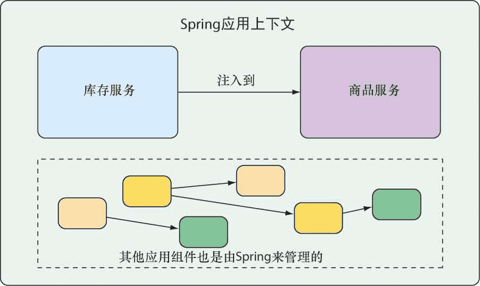
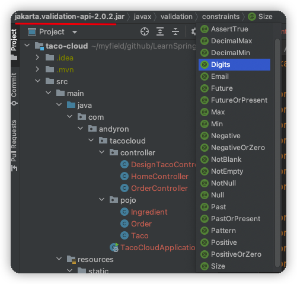
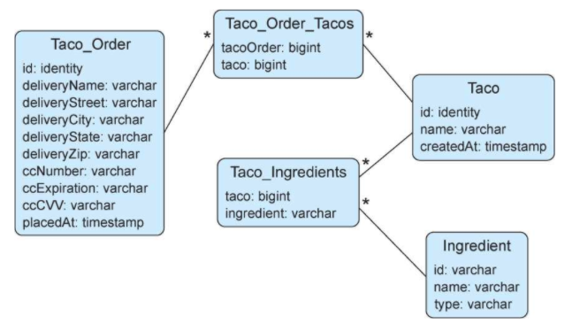
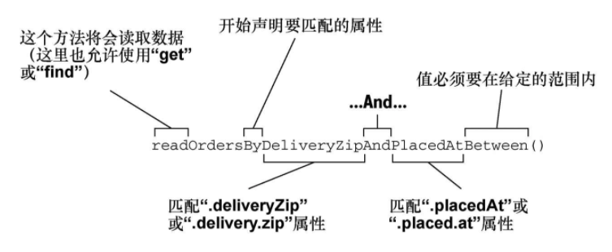

# 《Spring实战（第5版）》笔记

本书会将Spring和Spring Boot当成一回事。

# 介绍

Rod Johnson最初的目标，根据技术的发展，不断优化和革新，让Java应用的开发更加便利和高效。

我们更应该去追求一些**内在稳定不变的知识**，比如技术规范、设计原理等。

本书提供一个实用的、项目驱动的指南，将Spring的各种元素组合起来形成一个真正的应用。

Spring 5的主要功能是对反应式编程的支持，包括**Spring WebFlux**。这是一个全新的反应式Web框架。**Reactor**是一个用于处理反应式类型的Java库。

Spring Boot 2提供了比以前更多的自动配置支持，以及一个完全重新设计的**Actuator**，用于**探查和操作正在运行的应用**。

当开发人员希望将单体应用拆分为分散的微服务时，Spring Cloud提供了一些工具，使配置和发现微服务变得容易，并增强了微服务的功能，使它们更能抵御失败。

Spring和Spring Boot所做的最令人惊奇的事情之一就是**自动为应用程序提供所有的基础功能，让开发人员专注于应用程序特有的逻辑。**

作者提供的代码示例：[spring-in-action-5-samples](https://github.com/habuma/spring-in-action-5-samples)

出版社中文书籍页面：https://www.epubit.com/bookDetails?id=UB6cb48474abc65

# 一、Spring基础

## 1 Spring起步

以前，最常见的应用形式是基于浏览器的Web应用，后端由关系型数据库作为支撑（**数据库作为支撑的简单Web应用**）。尽管这种形式的开发依然有它的价值，Spring也为这种应用提供了良好的支持，但是我们现在感兴趣的还包括如何开发<u>面向云的由微服务组成的应用，这些应用会将数据保存到各种类型的数据库中</u>（**围绕微服务构建一个现代应用**）。另外一个崭新的关注点是反应式编程，它致力于**通过非阻塞操作提供更好的扩展性并提升性能**。

### 1.1 什么是Spring

Spring的核心是提供一个容器（container），通常称为<font color=#FF8C00>**Spring应用上下文**</font>（Spring application context），它们会**创建和管理应用组件**。这些组件也可以称为**bean**，会在Spring应用上下文中装配在一起，从而形成一个完整的应用程序。这就像砖块、砂浆、木材、管道和电线组合在一起，形成一栋房子似的。

将bean装配在一起的行为是通过一种基于**依赖注入**（dependency injection，**DI**）的模式实现的。此时，组件不会再去创建它所依赖的组件并管理它们的生命周期，使用依赖注入的应用依赖于单独的实体（容器）来创建和维护所有的组件，并将其注入到需要它们的bean中。通常，这是通过<u>构造器参数和属性访问方法</u>来实现的。

例图，应用组件通过Spring应用上下文来进行管理并实现互相注入：



以前，Spring应用上下文将bean装配在一起的方式是XML文件，例如，描述两个bean，并通过构造器参数将InventoryService装配到了ProductService中：

```xml
<bean id="inventoryService" class="com.example.InventoryService" />
<bean id="productService" class="com.example.ProductService" />
	<constructor-arg ref="inventoryService" />
</bean>
```

现在，Java注解配置更常见:

```java
@Configuration
public class ServiceConfiguration {
  @Bean
  public InventoryService inventoryService() {
    return new InventoryService();
  }
  
  @Bean 
  public ProductService productService() {
    return new ProductService(inventoryService());
  }
}
```

@Configuration注解，**配置类**，会为Spring应用上下文提供bean。

@Bean注解，<u>表明这些方法所返回的对象会以bean的形式添加到Spring的应用上下文中</u>（默认情况下，这些bean所对应的bean ID与定义它们的方法名称是相同的）。

Java注解配置的优势：**更强的类型安全性以及更好的重构能力**。

xml和java注解方式都可以不是必须的，因为Spring可以**自动配置**：

1. 自动**装配**（autowiring）：自动为组件注入它们所依赖的其他bean。
2. 组件**扫描**（component scanning）：自动发现应用类路径下的组件，并将它们创建成Spring应用上下文中的bean。

Spring Boot让自动配置更加方便，Spring Boot能够**基于类路径中的条目、环境变量和其他因素合理猜测需要配置的组件并将它们装配在一起**。

Spring Boot大幅度减少了构建应用所需的显式配置的数量（不管是XML配置还是Java配置）。

### 1.2 初始化Spring应用

Spring Initializr是一个基于浏览器的Web应用，同时也是一个REST API，能够生成一个Spring项目结构的骨架。使用Spring Initializr的几种方式：

- 通过地址为https://start.spring.io/的Web应用；
- 在命令行中使用curl命令；
- 在命令行中使用Spring Boot命令行接口；
- 在Spring Tool Suite中创建新项目；
- 在IntelliJ IDEA中创建新项目；
- 在NetBeans中创建新项目。

> mvnw和mvnw.cmd：这是Maven包装器（wrapper）脚本。借助这些脚本，即便你的机器上没有安装Maven，也可以构建项目。

>  **jar 与 war**
>
> war包是JavaWeb程序打的包，war文件代表了一个Web应用程序，jar是类的归档文件。

> Spring Initializr默认会使用基于JAR的打包方式。为什么不采用war？
>
> 所有的Java云平台都能够运行jar文件，尽管war文件非常适合部署到传统的Java应用服务器，但不够通用。

@SpringBootApplication是一个组合注解：

- @SpringBootConfiguration：将该类声明为配置类，是@Configuration注解的特殊形式。尽管这个类目前还没有太多的配置，但是后续我们可以按需添加基于Java的Spring框架配置。
- @EnableAutoConfiguration：启用Spring Boot的自动配置。我们随后会介绍自动配置的更多功能。就现在来说，我们只需要知道这个注解会告诉SpringBoot自动配置它认为我们会用到的组件。
- @ComponentScan：启用组件扫描。这样我们能够通过像@Component、@Controller、@Service这样的注解声明其他类，Spring会自动发现它们并将它们注册为Spring应用上下文中的组件。


### 1.3 编写Spring应用

> 可能出现的问题，static目录项新建目录后图片访问不到？


🔖 测试控制器 @WebMvcTest，MockMvc


#### 了解Spring Boot DevTools🔖

DevTools是Spring为开发人员提供了一些便利的==开发期工具==，包括：

##### 1.代码变更后应用会自动重启

当DevTools运行的时候，应用程序会被加载到Java虚拟机（Javavirtual Machine，JVM）两个独立的类加载器中。其中一个类加载器会加载你的Java代码、属性文件以及项目中“src/main/”路径下几乎所有的内容。这些条目很可能会经常发生变化。另外一个类加载器会加载依赖的库，这些库不太可能经常发生变化。

当探测到变更的时候，DevTools只会重新加载包含项目代码的类加载器，并重启Spring的应用上下文，在这个过程中另外一个类加载器和JVM会原封不动。

##### 2.当面向浏览器的资源（如模板、JavaScript、样式表）等发生变化时，会自动刷新浏览器；

LiveReload

##### 3.自动禁用模板缓存；


##### 4.如果使用H2数据库的话，内置了H2控制台。

http://localhost:8080/h2-console

### 1.4 俯瞰Spring风景线

#### Spring核心框架

核心容器，依赖注入框架，Spring MVC

数据持久化的基础支持（JdbcTemplate）

对反应式（reactive）风格编程的支持（Spring WebFlux）

#### Spring Boot

#### Spring Data

丰富了数据持久化功能：将应用程序的数据repository定义为简单的Java接口，在定义驱动存储和检索数据的方法时使用一种命名约定即可。

Spring Data能够处理多种不同类型的数据库，包括关系型数据库、文档数据库（Mongo）、图数据库（Neo4j）等。

#### Spring Security

#### Spring Integration和Spring Batch

#### Spring Cloud


## 2 开发Web应用

> 内在固然非常重要，但是外在的，也就是第一眼看到的东西同样非常重要。


 'Thymeleaf' is pronounced like this: **/ˈtaɪmˌlɪːf/**


### 2.1 展现信息

#### 构建领域类

> 应用的领域指的是它所要解决的主题范围：也就是会影响到对应用理解的理念和概念。
>
> **Eric Evans《领域驱动设计》**

此处，领域对象包括<u>taco设计、组成这些设计的配料、顾客以及顾客所下的订单</u>。

@Data由Lombok提供，它会告诉Lombok生成所有缺失的方法（equals、hasCode、toString等），同时还会生成所有以final属性作为参数的构造器。

#### 创建控制器类

@Slf4j是Lombok提供，在运行时，它会在这个类中自动生成一个SLF4J（Simple Logging Facade for Java）Logger，与在类中显示声明效果一样：

```java
private static final org.slf4j.Logger log = org.slf4j.LoggerFactory.getLogger(DesignTacoController.class);
```

一般只在类级别上使用@RequestMapping，以便于指定基本路径。在每个处理器方法上，我会使用更具体的@GetMapping、@PostMapping等注解。

`org.springframework.ui.Model`对象负责在控制器和展现数据的视图之间传递数据。实际上，放到Model属性中的数据将会复制到`ServletResponse`的属性中，这样视图就能在这里找到它们了。

#### 设计视图

Spring提供了多种定义视图的方式，包括JavaServer Pages（JSP）、Thymeleaf、FreeMarker、Mustache和基于Groovy的模板。

像Thymeleaf这样的视图库在设计时是与特定的Web框架解耦的。这样的话，它们无法感知Spring的模型抽象，因此无法与控制器放到Model中的数据协同工作。但是，它们可以与Servlet的request属性协作。所以，在Spring将请求转移到视图之前，它会把模型数据复制到**request属性**中，Thymeleaf和其他的视图模板方案就能访问到它们了。


> 问题： 复制某些文件到Idea后，运行后会出现找不到的情况？

### 2.2 处理表单提交


### 2.3 校验表单输入🔖

Spring支持Java的Bean校验API（Bean Validation API，也被称为**JSR-303**），能够更容易地声明检验规则，而不必在应用程序代码中显式编写声明逻辑。



JSR-303的有：@NotNull、@Size、@Null、@AssertTrue、@Min(value)、@Pattern(value)、@Valid等；

Hibernate Validator 附加的 constraint的有：@NotEmpty、@Email、@Length、@Range等。

#### 声明校验规则

```xml
<dependency>
  <groupId>org.springframework.boot</groupId>
  <artifactId>spring-boot-starter-validation</artifactId>
</dependency>
```

```java
package com.andyron.tacocloud.pojo;

import lombok.Data;
import org.hibernate.validator.constraints.CreditCardNumber;

import javax.validation.constraints.Digits;
import javax.validation.constraints.NotBlank;
import javax.validation.constraints.Pattern;

@Data
public class Order {
    @NotBlank(message="Name is required")
    private String name;

    @NotBlank(message="Street is required")
    private String street;

    @NotBlank(message="City is required")
    private String city;

    @NotBlank(message="State is required")
    private String state;

    @NotBlank(message="Zip code is required")
    private String zip;

    /**
     * 信用卡号
     * @CreditCardNumber 声明该属性的值必须是合法的信用卡号，它要能通过Luhn算法的检查
     */
    @CreditCardNumber(message="Not a valid credit card number")
    private String ccNumber;

    /**
     * 信用卡到期时间 MM/YY
     * 没有现成的注解实现，通过正则来校验
     */
    @Pattern(regexp="^(0[1-9]|1[0-2])([\\/])([1-9][0-9])$", message="Must be formatted MM/YY")
    private String ccExpiration;

    @Digits(integer=3, fraction=0, message="Invalid CVV")
    private String ccCVV;

}
```


#### 在表单绑定的时候执行校验

@Valid注解会告诉Spring MVC要对提交的Taco对象进行校验，而校验时机是在它绑定完表单数据之后、调用processDesign()之前。

#### 展现校验错误

Thymeleaf提供了便捷访问Errors对象的方法，这就是借助fields及其th:errors属性。

```java
@PostMapping
public String processDesign(@Valid @ModelAttribute("design") Taco design, Errors errors) {
  if (errors.hasErrors()) {
    return "design";
  }

  log.info("Processing design: " + design);
  return "redirect:/orders/current";
}
```


```html
<span class="validationError"
          th:if="${#fields.hasErrors('city')}"
          th:errors="*{city}">City Error</span>
```

fields属性的hasErrors()方法会检查city字段是否存在错误，如果存在，就将会渲染`<span>`。

### 2.4 使用视图控制器

果一个控制器非常简单，不需要填充模型或处理输入（例如HomeController），就可以定义为视图控制器，它**只将请求转发到视图**而不做其他事情。

```java
@Configuration
public class WebConfig implements WebMvcConfigurer {

    @Override
    public void addViewControllers(ViewControllerRegistry registry) {
        registry.addViewController("/").setViewName("home");
    }
}
```

WebMvcConfigurer定义了多个方法来配置Spring MVC。尽管只是一个接口，但是它提供了所有方法的默认实现，只需要覆盖所需的方法即可。

倾向于为每种配置（Web、数据、安全等）创建新的配置类，这样能够保持应用的引导配置类尽可能地整洁和简单。

### 2.5 选择视图模板库


🔖DevTools


## 3 使用数据

Java开发中处理关系型数据时，可选方案常见的是：JDBC（Java Database Connectivity）和JPA（Java Persistence API）。

### 3.1 使用JDBC读取和写入数据

JdbcTemplate

#### 1 调整领域对象以适应持久化

在将对象持久化到数据库的时候，通常最好有一个字段作为对象的唯一标识。

为Taco类添加ID和时间戳字段：

```java
@Data
public class Taco {

    private Long id;

    private Date createdAt;
  
```


#### 2 使用JdbcTemplate

添加JDBC和**H2嵌入式数据库**依赖。🔖h2

##### 定义JDBC repository

三个操作：查询所有配料信息；根据ID查询单个配料信息；保存配料对象。

```java
public interface IngredientRepository {

    Iterable<Ingredient> findAll();

    Ingredient findOne(String id);

    Ingredient save(Ingredient ingredient);   
}
```

编写`IngredientRepository`的实现类`JdbcIngredientRepository`，使用JdbcTemplate来查询数据库。

Spring的**构造型（stereotype）注解**：@Repository，@Controller、@Service和@Component。

```java
@Repository
public class JdbcIngredientRepository implements IngredientRepository {

    @Autowired
    private JdbcTemplate jdbc;

    @Override
    public Iterable<Ingredient> findAll() {
        return jdbc.query("select id, name, type from Ingredient", this::mapRowToIngredient);
    }

    private Ingredient mapRowToIngredient(ResultSet rs, int rowNum) throws SQLException {
        return new Ingredient(rs.getString("id"),
                rs.getString("name"),
                Ingredient.Type.valueOf(rs.getString("type")));
    }

    @Override
    public Ingredient findOne(String id) {
        return jdbc.queryForObject("select id, name, type from Ingredient where id = ?", this::mapRowToIngredient, id);
        // Java 8的方法引用和lambda表达式后，另一种写法
//        return jdbc.queryForObject("select id, name, type from Ingredient where id=?",
//                new RowMapper<Ingredient>() {
//                    @Override
//                    public Ingredient mapRow(ResultSet rs, int rowNum) throws SQLException {
//                        return new Ingredient(
//                                rs.getString("id"),
//                                rs.getString("name"),
//                                Ingredient.Type.valueOf(rs.getString("type")));
//                    };
//                }, id);
    }
 ... 
}
```

通过@Autowired标注将JdbcTemplate注入进来。

query()会接受要执行的SQL以及Spring RowMapper的一个实现（用来将结果集中的每行数据映射为一个对象）。

queryForObject()方法的运行方式和query()非常类似，只不过它只返回一个对象，而不是对象的List。

findAll()和findOne()中的**RowMapper**参数都是通过对mapRowToIngredient()的方法引用指定的。

##### 插入一行数据


将JdbcIngredientRepository注入到DesignTacoController中。

#### 3 定义模式和预加载数据



- Ingredient：保存配料信息。
- Taco：保存taco设计相关的信息。
- Taco_Ingredients：Taco中的每行数据都对应一行或多行，将taco和与之相关的配料映射在一起。
- Taco_Order：保存必要的订单细节。
- Taco_Order_Tacos：Taco_Order中的每行数据都对应一行或多行，将订单和与之相关的taco映射在一起。

Spring Boot，如果在应用的根类路径（resources目录）下存在名为schema.sql的文件，那么在应用启动的时候将会基于数据库执行这个文件中的SQL。还会在应用启动的时候执行根类路径下名为data.sql的文件。


#### 4 插入数据

###### 使用JdbcTemplate保存数据

保存taco和order就会比保存配料更复杂一些。


类级别的@SessionAttributes能够指定模型对象（如订单属性）要保存在session中，这样才能跨请求使用。


在用户完成操作并提交订单表单之前，Order对象会一直保存在session中，并没有保存到数据库中。

###### 使用SimpleJdbcInsert插入数据

🔖


### 3.2 使用Spring Data JPA持久化数据


##### 4-自定义JPA repository

```java
    List<Order> readOrdersByDeliveryZipAndPlacedAtBetween(String deliveryZip, Date startDate, Date endDate);
```




??暂时停止，问题比较多

## 4 保护Spring


