SpringBoot
---------------


## 回顾


Javase: OOP

Mysql: 持久化

html+css+js+jQuery+框架：视图

javaweb：独立开发MVC三层架构的网站，原始

ssm：简化了开发流程，但配置也开始较为复杂

上面👆的都是打war包在Tomcat中运行

spring再简化：SpringBoot，jar包，内嵌Tomcat，微服务架构

服务越来越多：springcloud


springboot：

是什么

配置如何编写yaml

自动装配原理（核心）

继承web开发：业务的核心

集成数据库Druid

分布式开发：Dubbo（RPC）+zookeeper

swgger：接口文档

任务调度

SpringSecuity，Shiro（相当于扩展拦截器）


SpringCloud：

微服务

springcloud入门

RESTful

Eureka（类似zookeeper）

Ribbon，Feign  （负载均衡）

HyStrix

Zuul 路由网关

SpringCloud config（git）


### Spring是如何简化Java开发的
为了降低Java开发的复杂性，Spring采用了以下4种关键策略： 

1. 基于POJO的轻量级和最小侵入性编程； 
2. 通过I0C，依赖注入（DI）和面向接口实现松耦合； 
3. 基于切面（AOP）和惯例进行声明式编程；
4. 通过切面和模版减少样式代码；

### 什么是Spring Boot
学过javaweb的同学就知道，开发一个web应用，从最初开始接触Servlet结合Tomcat，跑出一个Hello Wolrld程序，是要经历特别多的步骤；后来就用了框架Struts（http://xxxx.do），再后来是SpringMVC，到了现在的SpringBoot，过一两年又会有其他web框架出现；不知道你们有没经历过框架不断的演进，然后自己开发项目所有的技术也再不断的变化、改造，反正我是都经历过了，哈哈。言归正传，什么是Spring Boot呢，就是一个javaweb的开发框架，和SpringMVC类似，对比其他javaweb框架的好处，官方说是简化开发，约定大于配置，you can"just run"，能迅速的开发web应用，几行代码开发一个http接口。


新服务架构：服务网格


所有的技术框架的发展似乎都遵循了一条主线规律：从一个复杂应用场景衍生一种规范框架，人们只需要进行各种配置而不需要自己去实现它，这时候强大的配置功能成了优点；发展到一定程度之后，人们根据实际生产应用情况，选取其中实用功能和设计精华，重构出一些轻量级的框架；之后为了提高开发效率，嫌弃原先的各类配置过于麻烦，于是开始提倡“约定大于配置”，进而产生出一些一站式的解决方案。

是的这就是Java企业级应用-》J2EE-》spring-》springboot的过程。

随着Spring不断的发展，涉及的领域越来越多，项目整合开发需要配合各种各样的文件，慢慢变得不那么易用简单，违背了最初的理念，甚至人称配置地狱。Spring Boot正是在这样的一个背景下被抽象出来的开发框架，目的为了让大家更容易的使用Spring、更容易的集成各种常用的中间件、开源软件；

Spring Boot基于Spring开发，Spirng Boot本身并不提供Spring框架的核心特性以及扩展功能，只是用于快速、敏捷地开发新一代基于Spring框架的应用程序。也就是说，它并不是用来替代Spring的解决方案，而是和Spring框架紧密结合用于提升Spring开发者体验的工具。

Spring Boot以**约定大于配置**的核心思想，默认帮我们进行了很多设置，多数Spring Boot应用只需要很少的Spring配置。同时它集成了大量常用的第三方库配置（例如Redis、MongoDB、Jpa、RabbitMQ、Quartz等等），Spring Boot应用中这些第三方库几乎可以零配置的开箱即用，

Spring Boot出生名门，从一开始就站在一个比较高的起点，又经过这几年的发展，生态足够完善，SpringBoot已经当之无愧成为Java领域最热门的技术。
Spring Boot的主要优点：

- 为所有Spring开发者更快的入门
- 开箱即用，提供各种默认配置来简化项目配置
- 内嵌式容器简化Web项目
- 没有冗余代码生成和XML配置的要求


## 微服务

MVC  MVVM  微服务架构

业务：service：userService  ==> 模块


### 什么是微服务？

微服务是一种架构风格，它要求我们在开发一个应用的时候，这个应用必须构建成一系列小服务的组合，可以通过http的方式进行互通。要说微服务架构，先得说说过去我们的单体应用架构，

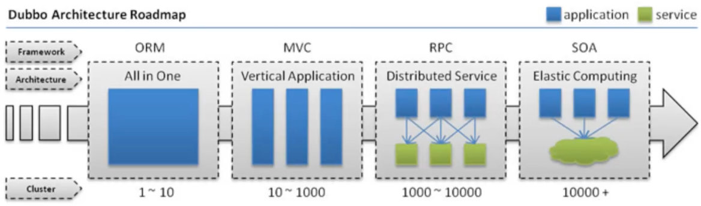

### 单体应用架构

所谓单体应用架构（all in one）是指，我们将一个应用的中的所有应用服务都封装在一个应用中。
无论是ERP、CRM或是其他什么系统，你都把数据库访问，web访问，等等各个功能放到一个war包内。

- 这样做的好处是，易于开发和测试也十分方便部署；当需要扩展时，只需要将war复制多份，然后放到多个服务器上，再做个负载均衡就可以了。

- 单体应用架构的缺点是，哪怕我要修改一个非常小的地方，我都需要停掉整个服务，重新打包、部署这个应用war包。特别是对于一个大型应用，我们不可能吧所有内容都放在一个应用里面，我们如何维护、如何分工合作都是问题。

  

### 微服务架构

all in one的架构方式，我们把所有的功能单元放在一个应用里面。然后我们把整个应用部署到服务器上。如果负载能力不行，我们将整个应用进行水平复制，进行扩展，然后在负载均衡。

所谓微服务架构，就是打破之前all in one的架构方式，把每个功能元素独立出来。把独立出来的功能元素的动态组合，需要的功能元素才去拿来组合，需要多一些时可以整合多个功能元素。所以微服务架构是对功能元素进行复制，而没有对整个应用进行复制。
这样做的好处是：

1. 节省了调用资源。
2. 每个功能元素的服务都是一个可替换的、可独立升级的软件代码。

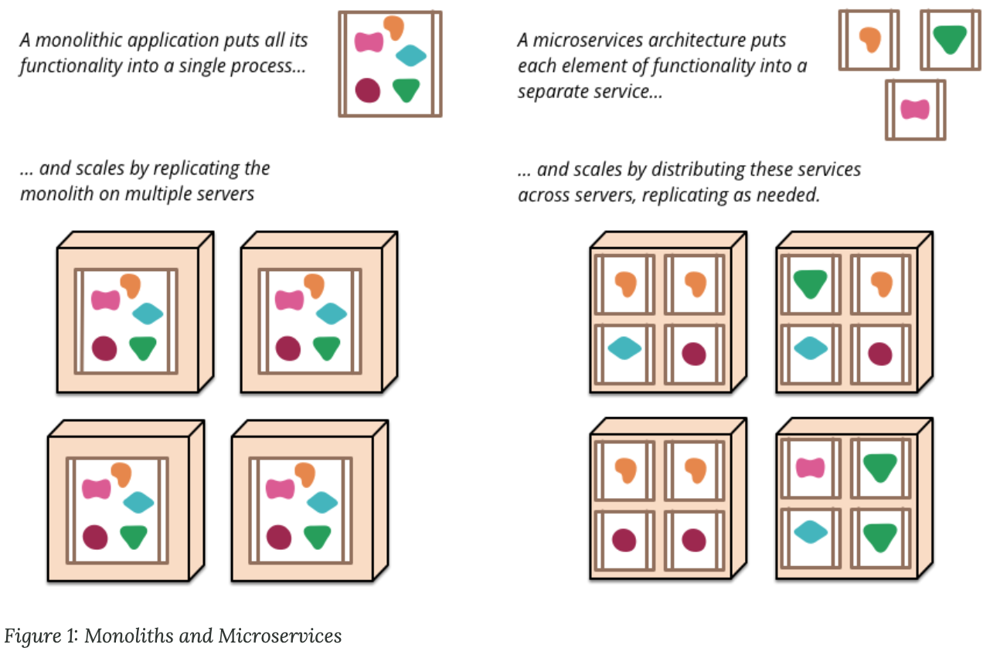


### 如何构建微服务

一个大型系统的微服务架构，就像一个复杂交织的神经网络，每一个神经元就是一个功能元素，它们各自完成自己的功能，然后通过http相互请求调用。比如一个电商系统，查缓存、连数据库、浏览页面、结账、支付等服务都是一个个独立的功能服务，都被微化了，它们作为一个个微服务共同构建了一个庞大的系统。如果修改其中的一个功能，只需要更新升级其中一个功能服务单元即可。
但是这种庞大的系统架构给部署和运维带来很大的难度。于是，spring为我们带来了构建大型分布式微服务的全套、全程产品：

- 构建一个个功能独立的微服务应用单元，可以使用springboot，可以帮我们快速构建一个应用； 
- 大型分布式网络服务的调用，这部分由spring cloud来完成，实现分布式；
- 在分布式中间，进行流式数据计算、批处理，我们有spring cloud data flow.
- spring为我们想清楚了整个从开始构建应用到大型分布式应用全流程方案。


## 第一个SpringBoot程序

官方：提供了一个快速生成的网站。IDEA集成了这个网站。


所有springboot依赖都是使用`spring-boot-starter`开头的。

`spring-boot-starter-web`用于实现HTTP接口，包含了SpringMVC，RESTful，使用Tomcat作为默认嵌入式容器。

使用maven的**package**工具可以把项目打成jar，然后独立运行

```
java -jar  jar包
```


版本号可以不写，会继承的父依赖


spring boot banner


## 自动装配原理

### pom.xml

- `spring-boot-dependencies`：核心依赖的父工程
- 上面的核心依赖，有版本号，我们引入依赖时不需要指定版本


### 启动器

```xml
<dependency
  <groupId>org.springframework.boot</groupId>
  <artifactId>spring-boot-starter</artifactId>
</dependency>
```

- 启动器就是SpringBoot的启动场景；比如`spring-boot-starter-web`就会帮我们自动导入web环境所有的依赖。
- SpringBoot将所有的功能场景，都变成了一个个的启动器
- 我们要使用什么功能，就只需要找到对应的启动器就可以了


### 主程序

```java
@SpringBootApplication
public class Springbooot01HelloworldApplication {

    public static void main(String[] args) {
        SpringApplication.run(Springbooot01HelloworldApplication.class, args);
    }

}
```

#### @SpringBootApplication

```
@SpringBootApplication：标注这个类是springboot的应用：启动类下的所有资源被导入
	@Configuration：spring配置类
	@Component：说明这个也是一个spring组件
	
@EnableAutoConfiguration：自动配置
	@AutoConfigurationPackage：自动配置包
		@Import({Registrar.class})：自动额皮质包注册
	@Import({AutoConfigurationImportSelector.class})：自动配置导入选择

```

`AutoConfigurationImportSelector`类中：
```java
// 获取所有配置
List<String> configurations = this.getCandidateConfigurations(annotationMetadata, attributes);

protected List<String> getCandidateConfigurations(AnnotationMetadata metadata, AnnotationAttributes attributes) {
        List<String> configurations = SpringFactoriesLoader.loadFactoryNames(this.getSpringFactoriesLoaderFactoryClass(), this.getBeanClassLoader());
        Assert.notEmpty(configurations, "No auto configuration classes found in META-INF/spring.factories. If you are using a custom packaging, make sure that file is correct.");
        return configurations;
    }

// loadFactoryNames -> loadSpringFactories
Properties properties = PropertiesLoaderUtils.loadProperties(resource); // 加载所有资源

```

`META-INF/spring.factories`：自动配置的核心文件。他的位置在：

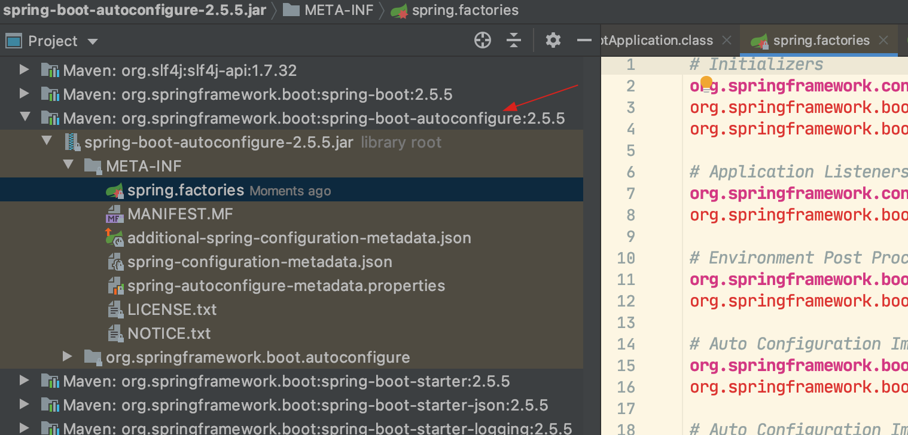

spring.factories文件中所都会被加载，但是否生效，通过下面一些列的注解来判断；

`@ConditionalOnxxx(xxx)`：核心注解，如果括号中的条件都满足，才会导入次注解注解的类。（包名为`org.springframework.boot.autoconfigure.condition`）


总结：springboot所有自动配置都是在启动的时候扫描并加载`spring.factories`文件，所有的自动配置类都在这里面，但不一定生效，要通过一系列`@ConditionalOnxxx(xxx)`注解判断。只要导入对应的start，就有对应的启动器，有了启动器，自动装配就会生效，然后配置成功！

- 整合javaEE，解决方案和自动配置的东西都在`spring-boot-autoconfigure-xxxx.jar`包下；
- 它会把所有需要导入的组件，以类名的方式返回，这些组件就会被添加到容器；
- 容器中也会存在非常多的`xxxAutoConfiguration`（`@Bean`），就是这些类给容器中导入了这个场景需要的所有组件；并自动配置，@Configuration，JavaConfig
- 有了自动配置类，免去了我们手动编写配置文件的工作

| @Conditional扩展注解            | 作用（判断是否满足当前指定条件）                 |
| ------------------------------- | ------------------------------------------------ |
| @ConditionalOnJava              | 系统的java版本是否符合要求                       |
| @ConditionalOnBean              | 容器中存在指定Bean                               |
| @ConditionalOnMissingBean       | 容器中不存在指定Bean                             |
| @ConditionalOnExpression        | 满足SpEL表达式指定                               |
| @ConditionalOnClass             | 系统中有指定的类                                 |
| @ConditionalOnMissingClass      | 系统中没有指定的类                               |
| @ConditionalOnSingleCandidate   | 容器中只有一个指定的Bean，或者这个Bean是首选Bean |
| @ConditionalOnProperty          | 系统中指定的属性是否有指定的值                   |
| @ConditionalOnResource          | 类路径下是否存在指定资源文件                     |
| @ConditionalOnWebApplication    | 当前是web环境                                    |
| @ConditionalOnNotWebApplication | 当前不是web环境                                  |
| @ConditionalOnJndi              | JNDI存在指定项                                   |

#### SpringApplication

`SpringApplication.run()`做了四件事：

1. 推断应用的类型是普通的项目还是Web项目
2. 查找并加载所有可用初始化器，设置到 initializers属性中
3. 找出所有的应用程序监听器，设置到 listeners属性中
4. 推断并设置main方法的定义类，找到运行的主类

run启动后会在springboot系统中独立开启一个java进程。

```java
public ConfigurableApplicationContext run(String... args) {
  StopWatch stopWatch = new StopWatch();
  stopWatch.start();
  DefaultBootstrapContext bootstrapContext = this.createBootstrapContext();
  ConfigurableApplicationContext context = null;
  this.configureHeadlessProperty();
  SpringApplicationRunListeners listeners = this.getRunListeners(args);
  listeners.starting(bootstrapContext, this.mainApplicationClass);

  try {
    ApplicationArguments applicationArguments = new DefaultApplicationArguments(args);
    ConfigurableEnvironment environment = this.prepareEnvironment(listeners, bootstrapContext, applicationArguments);
    this.configureIgnoreBeanInfo(environment);
    Banner printedBanner = this.printBanner(environment);
    context = this.createApplicationContext();
    context.setApplicationStartup(this.applicationStartup);
    this.prepareContext(bootstrapContext, context, environment, listeners, applicationArguments, printedBanner);
    this.refreshContext(context);
    this.afterRefresh(context, applicationArguments);
    stopWatch.stop();
    if (this.logStartupInfo) {
      (new StartupInfoLogger(this.mainApplicationClass)).logStarted(this.getApplicationLog(), stopWatch);
    }

    listeners.started(context);
    this.callRunners(context, applicationArguments);
  } catch (Throwable var10) {
    this.handleRunFailure(context, var10, listeners);
    throw new IllegalStateException(var10);
  }

  try {
    listeners.running(context);
    return context;
  } catch (Throwable var9) {
    this.handleRunFailure(context, var9, (SpringApplicationRunListeners)null);
    throw new IllegalStateException(var9);
  }
}
```

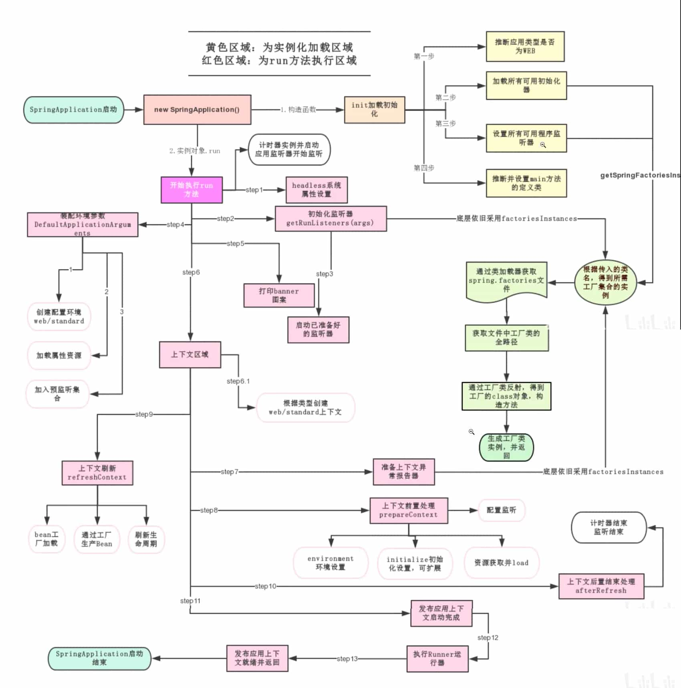


## 配置

[官方所有配置及其说明](https://docs.spring.io/spring-boot/docs/current/reference/html/application-properties.html)

SpringBoot使用一个全局的配置文件，名称固定为：

- application.properties，`key=value`
- application.yaml，`key: value`

配置文件的作用是修改springboot自动配置的默认值。

推荐使用yaml格式，

```yaml
name: andy

# 对象
student:
	name: andy
	age: 3
	
# 行内写法
student: {name: andy,age: 3}

# 数组
pets:
	- cat
	- dog
	- pig
	
pets: [cat,dog,pig]
```


yaml可以直接给实体类赋值

```java
@ConfigurationProperties(prefix = "person")
public class Person {
  ...
 
```

```yaml
person:
  name: andy
  age: 19
  happy: true
  birth: 2012/12/01
  maps: {k1: v1,k2: v2}
  lists:
    - code
    - music
    - girl
  dog:
    name: 旺财
    age: 4
```

`@ConfigurationProperties`的作用：告诉SpringBoot将本类中的所有属性和配置文件中相关配置进行绑定。

> application.properties由于编码的问题，容易产生乱码。 

yaml支持松散语法（驼峰命名和-连接是可以绑定的）、JSR303数据校验

### JSR303

@Validated

🔖p10


配置文件`application.yaml`的位置可以是（优先顺序从高到低）：

```
file:./config/
file./
classpath:/config/
classpath:/
```

`file`是指项目根目录；`classpath`指`src/main/java/`和`src/main/resources`目录。


### 多环境开发

```properties
application.properties
application-test.properties
application-dev.properties
```

在默认的`application.properties`中配置选择启用哪个配置文件

```properties
spring.profiles.active=dev
```

yaml更方便：

```yaml
server:
	port: 8081
spring:
	profiles:
		active: dev

---
server:
	port: 8082
spring:
	profiles: dev
---
server:
	port: 8083
spring:
	profiles: test
```


## 自动装配再理解

配置文件中到底能配置什么？ 配置文件与自动装配中的spring.factories是相关的

```java
// 表示这是一个配置类
@Configuration(
    proxyBeanMethods = false
)
// 自动配置属性：ServerProperties
@EnableConfigurationProperties({ServerProperties.class})
// spring的底层注解：根据
@ConditionalOnWebApplication(
    type = Type.SERVLET
)
@ConditionalOnClass({CharacterEncodingFilter.class})
@ConditionalOnProperty(
    prefix = "server.servlet.encoding",
    value = {"enabled"},
    matchIfMissing = true
)
public class HttpEncodingAutoConfiguration {
    private final Encoding properties;

    public HttpEncodingAutoConfiguration(ServerProperties properties) {
        this.properties = properties.getServlet().getEncoding();
    }

 ... 
}
```

`@EnableConfigurationProperties`


```java
@ConfigurationProperties(
    prefix = "server",
    ignoreUnknownFields = true
)
public class ServerProperties {
    private Integer port;
    private InetAddress address;
    @NestedConfigurationProperty
    private final ErrorProperties error = new ErrorProperties();
    private ServerProperties.ForwardHeadersStrategy forwardHeadersStrategy;
    private String serverHeader;
    private DataSize maxHttpHeaderSize = DataSize.ofKilobytes(8L);
    private Shutdown shutdown;
    @NestedConfigurationProperty
    private Ssl ssl;
    @NestedConfigurationProperty
    private final Compression compression;
    @NestedConfigurationProperty
    private final Http2 http2;
    private final ServerProperties.Servlet servlet;
    private final ServerProperties.Tomcat tomcat;
    private final ServerProperties.Jetty jetty;
    private final ServerProperties.Netty netty;
    private final ServerProperties.Undertow undertow;
...
  
}
```

那么server相关的配置就全是`ServerProperties`中的属性。

在配置文件中能配置的，都有一个规律，都是**xxPorperties**类的属性（属性的值就是配置的默认值），而这个类被**xxxAutoConfiguration**装配。

**xxPorperties**都有一个`@ConfigurationProperties(prefix = "spring.security")`注解。

自动装配的精髓：

1. SpringBoot启动会自动加载大量自动装配类。
2. 我们看我们需要的功能有没有在SpringBoot默认写好的自动配置类当中；
3. 我们再来看这个自动配置类中到底配置了哪些组件；（只要我们要用的组件存在在其中，我们就不需要再手动配置了）
4. 给容器中自动配置类添加组件的时候，会从properties类中获取某些属性。我们只需要在配置文件中指定这些属性的值即可；

xxxxAutoConfigurartion：自动配置类；给容器中添加组件
xxxxProperties：封装配置文件中相关属性；


配置`debug: true`，可查看，那些自动配置类生效，那些没有。


## SpringBoot Web 开发

SpringBoot到底帮我们配置了什么？我们能不能进行修改？能修改那些东西？能不能呢扩展？

web开发要解决的问题：

- 导入静态资源...
- 首页
- jsp，模板引擎Thymeleaf
- 装配扩展SpringMVC
- 增删改查
- 拦截器
- 国际化


### 静态资源

`WebMvcAutoConfiguration`

```java
@Override
public void addResourceHandlers(ResourceHandlerRegistry registry) {
  if (!this.resourceProperties.isAddMappings()) {
    logger.debug("Default resource handling disabled");
    return;
  }
  // 加载静态资源的方式一：从webjars中加载
  addResourceHandler(registry, "/webjars/**", "classpath:/META-INF/resources/webjars/");
  
  // 方式二：mvcProperties，resourceProperties
  addResourceHandler(registry, this.mvcProperties.getStaticPathPattern(), (registration) -> {
    registration.addResourceLocations(this.resourceProperties.getStaticLocations());
    if (this.servletContext != null) {
      ServletContextResource resource = new ServletContextResource(this.servletContext, SERVLET_LOCATION);
      registration.addResourceLocations(resource);
    }
  });
}

private void addResourceHandler(ResourceHandlerRegistry registry, String pattern, String... locations) {
  addResourceHandler(registry, pattern, (registration) -> registration.addResourceLocations(locations));
}

private void addResourceHandler(ResourceHandlerRegistry registry, String pattern,
                                Consumer<ResourceHandlerRegistration> customizer) {
  if (registry.hasMappingForPattern(pattern)) {
    return;
  }
  ResourceHandlerRegistration registration = registry.addResourceHandler(pattern);
  customizer.accept(registration);
  registration.setCachePeriod(getSeconds(this.resourceProperties.getCache().getPeriod()));
  registration.setCacheControl(this.resourceProperties.getCache().getCachecontrol().toHttpCacheControl());
  registration.setUseLastModified(this.resourceProperties.getCache().isUseLastModified());
  customizeResourceHandlerRegistration(registration);
}
```


什么是webjars？https://www.webjars.org/

以maven等方式引入jQuery等前端静态资源。

```xml
<dependency>
  <groupId>org.webjars</groupId>
  <artifactId>jquery</artifactId>
  <version>3.6.0</version>
</dependency>
```


地址栏中的`/webjars/**`就映射到包路径的`/META-INF/resources/webjars/`，如下

http://localhost:8080/webjars/jquery/3.6.0/jquery.js。

另外一种加载静态资源的方式：

`WebMvcProperties`

```java
private String staticPathPattern = "/**";
```

`WebProperties`

```java
// 下面优先级从上到下，越低
private static final String[] CLASSPATH_RESOURCE_LOCATIONS = { "classpath:/META-INF/resources/",
				"classpath:/resources/", "classpath:/static/", "classpath:/public/" };
```

> 默认`java/`和`resources`都属于classpath。

总结：

1. springboot中静态资源可以
   - webjars，`localhost:8080/webjars/`
   - public、static、/**、resources， `localhost:8080/`

2. 如果在配置文件中自定义`spring.mvc.static-path-pattern`会导致上面默认的静态资源目录失效。


### 首页

`WebMvcAutoConfiguration`

```java
private Resource getIndexHtml(Resource location) {
  try {
    Resource resource = location.createRelative("index.html");
    if (resource.exists() && (resource.getURL() != null)) {
      return resource;
    }
  }
  catch (Exception ex) {
  }
  return null;
}
```

首页默认就是从上一节中几个静态资源目录中寻找”index.html“。

在templates目录中的所有页面，只能通过Controller访问，需要模板引擎支持。


### 模板引擎

其实jsp就是一个模板引擎

Thymeleaf

https://www.thymeleaf.org/

https://github.com/thymeleaf


`spring-boot-starter-thymeleaf`

`ThymeleafProperties`

```java
@ConfigurationProperties(prefix = "spring.thymeleaf")
public class ThymeleafProperties {

	private static final Charset DEFAULT_ENCODING = StandardCharsets.UTF_8;

	public static final String DEFAULT_PREFIX = "classpath:/templates/";

	public static final String DEFAULT_SUFFIX = ".html";
  
  ...
```


### SpringMVC自动配置原理

[29.1.1 Spring MVC Auto-configuration](https://docs.spring.io/spring-boot/docs/2.1.6.RELEASE/reference/html/boot-features-developing-web-applications.html#boot-features-spring-mvc)


ContentNegotiatingViewResolver


自定义视图解析器：

```java
@Configuration
public class MyMvcConfig implements WebMvcConfigurer {
    // 实现了ViewResolver接口的类，都可以把它看作视图解析器

    @Bean
    public ViewResolver myViewResolver() {
        return new MyViewResolver();
    }
    // 定义一个自己的视图解析器
    public static class MyViewResolver implements ViewResolver {

        @Override
        public View resolveViewName(String viewName, Locale locale) throws Exception {
            return null;
        }
    }
}
```

所有的请求都要经过DispatcherServlet的doDispatch方法，可通过在这个方法打断点查看自定义视图解析器是否生效 

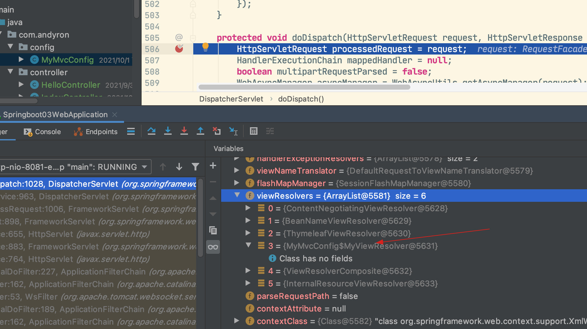

自定义视图解析器的过程：实现ViewResolver接口，然后@Bean。

结论：如果想diy一些定制化的功能，只要写这个组件，然后将它交给springboot，springboot就会帮我们自动装配。

`@EnableWebMvc`注解会是自定义视图解析器失效，因为它引入了类`DelegatingWebMvcConfiguration`，而它继承了`WebMvcConfigurationSupport`，查看`WebMvcAutoConfiguration`

的注解：

```java
@Configuration(proxyBeanMethods = false)
@ConditionalOnWebApplication(type = Type.SERVLET)
@ConditionalOnClass({ Servlet.class, DispatcherServlet.class, WebMvcConfigurer.class })
@ConditionalOnMissingBean(WebMvcConfigurationSupport.class)
@AutoConfigureOrder(Ordered.HIGHEST_PRECEDENCE + 10)
@AutoConfigureAfter({ DispatcherServletAutoConfiguration.class, TaskExecutionAutoConfiguration.class,
		ValidationAutoConfiguration.class })
public class WebMvcAutoConfiguration {
```

`@ConditionalOnMissingBean(WebMvcConfigurationSupport.class)`表示没有`WebMvcConfigurationSupport`才能生效。


在springboot中，有非常多的`xxxConfiguration`类，帮助我们进行扩展配置，只要看见这个东西，我们就要注意了，它可能改变了springboot原有的配置或者扩展了。


### 项目：员工管理系统


#### 首页配置

所有静态资源都要使用Thymeleaf接管 @{}

> 问题：html文件上次修改时间太远是，模板不能被识别
>
> ```
> org.thymeleaf.exceptions.TemplateInputException: Error resolving template [404], template might not exist or might not be accessible by any of the configured Template Resolvers
> ```

https://docs.spring.io/spring-boot/docs/2.1.6.RELEASE/reference/html/boot-features-developing-web-applications.html#boot-features-spring-mvc

#### 页面国际化

`MessageSourceAutoConfiguration`

`@{}` 地址

注意点：

1. 配置i18n文件
2. 自定义一个组件`LocaleResolver`

3. 需要将自定义组件配置到Spring容器中，`@Bean`
4. `#{}` 

### 登录


### 拦截器


Thymeleaf模板取session时使用`[[${seesion.loginUser}]]`这样的方式就报错：

```
2021-10-03 07:48:32.282 ERROR 51839 --- [nio-8081-exec-3] o.a.c.c.C.[.[.[/].[dispatcherServlet]    : Servlet.service() for servlet [dispatcherServlet] in context with path [] threw exception [Request processing failed; nested exception is org.thymeleaf.exceptions.TemplateInputException: An error happened during template parsing (template: "class path resource [templates/test.html]")] with root cause
```

又遇到同样的问题：

```
🔖复制静态文件到项目中，如果静态文件上一次修改时间比较久，就访问不到，随便修改一下报错，就能访问。
http Last-Modified  过期时间

```


🔖 p25 ~ p28


前端

- 模板：别人写好的额，拿来修改自己需要
- 框架：组件，自己动手组合拼接！Bootstrap，Layui，semantic-ui

如果快速搭建web网站

1. 前端搞定：页面长什么样子：数据
2. 设计数据库（难点！）
3. 前端让他能够自动运行，独立化工程
4. 数据接口如何对接：json，对象
5. 前后端联调测试


- 有一点自己熟悉的后台模板：工作必要[x-admin](http://x.xuebingsi.com/)

- 前端界面：至少能够通过前端框架，组合出来一个网站页面

  index

  about

  blog

  post

  user

- 让这个网站独立运行


## Data

### 整合JDBC的使用

对于数据访问层，无论是SQL还是NOSQL，Spring Boot底层都采用Spring Data的方式进行统一处理

mysql5 有时有失去问题，要配置`serverTimeZone=UTC`。


`DataSourceProperties`

`DataSourceAutoConfiguration`


> `xxxTemplate`，都是SpringBoot已经配置好的模板bean，拿来即用


### 整合Druid数据源


Druid是阿里巴巴开源平台上一个数据库连接池实现，结合了C3P0、DBCP、PROXOOL等DB池的优点，同时加入了日志监控。
Druid可以很好的监控DB池连接和SQL的执行情况，天生就是针对监控而生的DB连接池。
Spring Boot 2.0以上默认使用Hikari数据源，可以说Hikari与Driud都是当前Java Web上最优秀的数据源，我们来重点介绍Spring Boot如何集成Druid数据源，如何实现数据库监控。

`DruidDataSource`


一些特殊配置：

```yaml
# Spring Boot默认是不性入这些属性值的，需要自己绑定
# druid数据源专有配置
initialSize: 5
minIdle: 5
maxActive: 20
maxWait: 60000
timeBetweenEvictionRunsMillis: 60000
minEvictableldleTimeMillis: 300e0e
validationQuery: SELECT 1 FROM DUAL
testwhileIdle: true
testOnBorrow: false
testOnReturn: false
poolPreparedStatements: true
# 配置监控统计拦截的filters，stat：监控统计、log4j日志记录、wall：防御sql注入
# 如果允许时报错java.lang.classNotFoundException：org.apache.log4j.Priority
# 则导入log4j依赖]，Maven地址:https://mvnrepository.com/artifact/log4j/log4j
filters: stat,wall,log4j
maxPoolPreparedStatementPerConnectionSize: 20
useGlobalDataSourceStat: true
connectionProperties: druid.stat.mergesql=true;druid.stat.slowSqlMillis=500
```

log4j

### 整合MyBatis

```xml
<dependency>
  <groupId>org.mybatis.spring.boot</groupId>
  <artifactId>mybatis-spring-boot-starter</artifactI d>
  <version>2.2.0</version>
</dependency>
```

`@Mapper`

🔖 

总结：

1. 导入包
2. 配置文件
3. mybati配置
4. 编写sql
5. 业务层调用dao层
6. controller调用service


## SpringSecurity

[Spring Security Reference5.5.2](https://docs.spring.io/spring-security/site/docs/current/reference/html5/)

安全应该在设计之初考虑

安全框架：shiro、springsecurity，

> Spring Security is a powerful and highly customizable authentication and access-control framework. It is the de-facto standard for securing Spring-based applications.
>
> Spring Security is a framework that focuses on providing both authentication and authorization to Java applications. Like all Spring projects, the real power of Spring Security is found in how easily it can be extended to meet custom requirements


- 功能权限
- 访问权限
- 菜单权限，不同人不同菜单
- 以前拦截器，过滤器：大量的原生代码~冗余


 `spring-boot-starter-security`

记住几个类：

- `WebSecurityCorifigurerAdapter`：自定义Security策略.

- `AuthenticationManagerBuilder`：自定义认证策略

- `@EnableWebSecurity`：开启WebSecurity模式。`@Enablexxx`用于开启某个功能

  

Spring Security的两个主要目标是“认证”和“授权”（访问控制）：

“认证”（Authentication）
"授权”（Authorization）
这个概念是通用的，而不是只在Spring Security中存在。

> 问题：启动springboot ，一直302挑战到一个不存在的登录页面login。
>
> 原因分析：在 SpringBoot 项目中使用了 SpringSecurity ，默认的Spring Security就是生效了的，此时的接口都是被保护的，我们需要通过验证才能正常的访问。Spring Security提供了一个默认的用户，用户名是user，而密码则是启动项目的时候自动生成的。
>
> 需要配置。

看源码上的注释

前端框架：[semantic-ui](https://semantic-ui.com/introduction/getting-started.html)，比bootstrap好看一点，只要引入一个js文件。


### Spring Security与thymeleaf整合

```html
<html lang="en" xmlns:th="http://www.thymeleaf.org"
      xmlns:sec="http://www.thymeleaf.org/thymeleaf-extras-springsecurity4">
```

`xmlns` 这种导入是为了代码提示。

Spring boot的不同版本导致Spring Security与thymeleaf整合失败

降级：

```xml
<parent>
  <groupId>org.springframework.boot</groupId>
  <artifactId>spring-boot-starter-parent</artifactId>
  <version>2.0.9.RELEASE</version>
  <relativePath/> <!-- lookup parent from repository -->
</parent>
```


注销出现404，是因为为了防止攻击，而springsecurity默认开启了csrf，可以先关掉调式：

```java
http.csrf().disable();
```


菜单根据用户权限显示：

```html
<div class="column" sec:authorize="hasRole('VIP1')">
```


## Shiro

### 什么是Shiro 

- ApacherShiro是一个Java的安全（权限）框架。

- Shiro可以非常容易的开发出足够好的应用，其不仅可以用在JavaSE环境，也可以用在JavaEE环境。 

- Shiro可以完成，认证，授权，加密，会话管理，Web集成，缓存等。

- 下载地址:

  http://shiro.apache.org

  https://github.com/apache/shiro

### 有哪些功能？

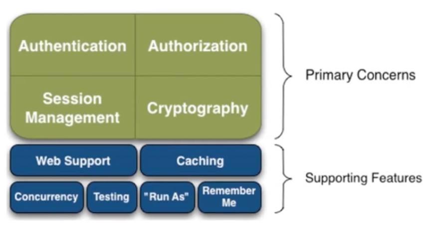


- Authentication：身份认证、登录，验证用户是不是拥有相应的身份；
- Authorization：授权，即权限验证，验证某个已认证的用户是否拥有某个权限，即判断用户能否进行什么操作，如：验证某个用户是否拥有某个角色，或者细粒度的验证某个用户对某个资源是否具有某个权限！
- Session Manager：会话管理，即用户登录后就是第一次会话，在没有退出之前，它的所有信息都在会话中； 会话可以是普通的JavaSE环境，也可以是Web环境；
- Cryptography：加密，保护数据的安全性，如密码加密存储到数据库中，而不是明文存储
- Web Support：Web支持，可以非常容易的集成到Web环境；
- Caching：缓存，比如用户登录后，其用户信息，拥有的角色、权限不必每次去查，这样可以提高效率
- Concurrency： Shiro支持多线程应用的并发验证，即，如在一个线程中开启另一个线程，能把权限自动的传播过去
- Testing：提供测试支持；
- RunAs：允许一个用户假装为另一个用户（如果他们允许）的身份进行访问；
- RememberMe：记住我，这个是非常常见的功能，即一次登录后，下次再来的话不用登录了

### Shiro架构（外部）

从外部来看Shiro，即从应用程序角度来观察如何使用shiro完成工作：

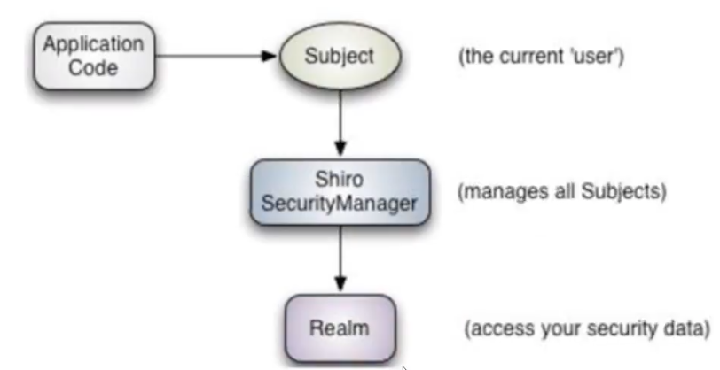

- subject：应用代码直接交互的对象是Subject，也就是说Shiro的对外API核心就是Subject，Subject代表了当前的用户，这个用户不一定是一个具体的人，与当前应用交互的任何东西都是Subject，如网络爬虫，机器人等，与Subject的所有交互都会委托给SecurityManager； Subject其实是一个门面，SecurityManageer才是实际的执行者
- SecurityManager：安全管理器，即所有与安全有关的操作都会与SercurityManager交互，并且它管理着所有的Subject，可以看出它是Shiro的核心，它负责与Shiro的其他组件进行交互，它相当于SpringMVC的
  DispatcherServlet的角色
- Realm：Shiro从Realm获取安全数据（如用户，角色，权限），就是说SecurityManager要验证用户身份，那么它需要从Realm获取相应的用户进行比较，来确定用户的身份是否合法；也需要从Realm得到用户相应的角色、权限，进行验证用户的操作是否能够进行，可以把Realm看成DataSource；

### Shiro架构（内部）

 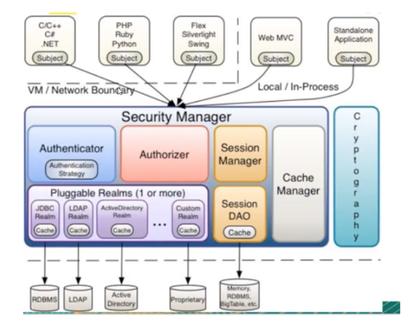

- Subject：任何可以与应用交互的‘用户；
- Security Manager：相当于SpringMVC中的DispatcherServlet；是Shiro的心脏，所有具体的交互都通过 Security Manager进行控制，它管理者所有的Subject，且负责进行认证，授权，会话，及缓存的管理。 
- Authenticator：负责Subject认证，是一个扩展点，可以自定义实现；可以使用认证策略（Authentication Strategy），即什么情况下算用户认证通过了；
- Authorizer：授权器，即访问控制器，用来决定主体是否有权限进行相应的操作；即控制着用户能访问应用中的那些功能；
- Realm：可以有一个或者多个的realm，可以认为是安全实体数据源，即用于获取安全实体的，可以用DBC实现，也可以是内存实现等等，由用户提供；所以一般在应用中都需要实现自己的realm
- SessionManager：管理Session生命周期的组件，而Shiro并不仅仅可以用在Web环境，也可以用在普通的JavaSE环境中
- CacheManager：缓存控制器，来管理如用户，角色，权限等缓存的；因为这些数据基本上很少改变，放到缓存中后可以提高访问的性能；
- Cryptography：密码模块，Shiro提高了一些常见的加密组件用于密码加密，解密等

github中的**samples/quickstart**

步骤：

1. 导入依赖
2. 配置shiro.ini
3. QuickStart

> pom 中`<scope>`
>
> 1.compile：默认值 他表示被依赖项目需要参与当前项目的编译，还有后续的测试，运行周期也参与其中，是一个比较强的依赖。打包的时候通常需要包含进去
>
> 2.test：依赖项目仅仅参与测试相关的工作，包括测试代码的编译和执行，不会被打包，例如：junit
>
> 3.runtime：表示被依赖项目无需参与项目的编译，不过后期的测试和运行周期需要其参与。与compile相比，跳过了编译而已。例如JDBC驱动，适用运行和测试阶段
>
> 4.provided：打包的时候可以不用包进去，别的设施会提供。事实上该依赖理论上可以参与编译，测试，运行等周期。相当于compile，但是打包阶段做了exclude操作
>
> 5.system：从参与度来说，和provided相同，不过被依赖项不会从maven仓库下载，而是从本地文件系统拿。需要添加systemPath的属性来定义路径

```java
Subject currentUser = SecurityUtils.getSubject();
Session session = currentUser.getSession();
currentUser.isAuthenticated()
currentUser.getPrincipal()
currentUser.hasRole("schwartz")
currentUser.isPermitted("lightsaber:wield")
currentUser.logout();
```

###  shiro集成springboot

>Subject 用户
>
>SecurityManager 管理所有用户
>
>Realm 连接数据

```xml
<dependency>
  <groupId>org.apache.shiro</groupId>
  <artifactId>shiro-spring</artifactId>
  <version>1.4.1</version>
</dependency>
```


登录拦截 


#### shiro集成MyBatis


> MD5盐值
>
> 简单说就是为了使相同的密码拥有不同的hash值的一种手段 就是盐化，盐值就是在密码hash过程中添加的额外的随机值。


```java
CredentialsMatcher
SimpleCredentialsMatcher 
Md5CredentialsMatcher
```

#### 授权

🔖p44 p45

## 分析项目

springboot项目直接修改数据库连接

https://github.com/WinterChenS/my-site

部署方式：

- docker容器部署
- 普通jar包部署

swagger

## Swagger

学习目标

- 了解Swagger的作用和概念
- 巩固前后端分离
- 在SpringBoot中集成Swagger

### 简介

前后端分离

Vue + SpringBoot

后端时代：前端只用管理静态页面；html==>后端，模板引擎JSP==> 后端是主力


前后盾分离时代：

- 后端：后端控制层，服务层，数据访问层【后端团队】
- 前端：前端控制层，视图层【前端团队】
  - 伪造后端数据，json。已经存在了，不需要后端，前端工程依旧能够跑起来
- 前后端如何交互？  ====》API
- 前后端相对独立，松耦合
- 前后端甚至可以部署在不同的服务器上；


产生一个问题：

- 

解决方案：

- 首先指定schema[计划的提纲]，实时更新最新API，降低集成的风险；
- 早些年：指定word计划文档；
- 前后端分离：
  - 前端测试后端接口：postman
  - 后端提供接口，需要实时更新最新的消息及改动


Swagger

- 号称世界上最流行的API框架；
- RESTFul API文档在线自动生成工具 ==> **API文档与API定义同步更新**
- 直接运行，可以在线测试API接口
- 支持多种语言：（Java，PHP。。。）

https://swagger.io/


### 使用Swagger

两个组件：

- swagger2
- ui


### Springboot集成Swagger

1. 新建一个springboot web项目

2. 导入相关依赖

   ```xml
   <dependency>
               <groupId>io.springfox</groupId>
               <artifactId>springfox-swagger2</artifactId>
               <version>2.9.2</version>
           </dependency>
           <dependency>
               <groupId>io.springfox</groupId>
               <artifactId>springfox-swagger-ui</artifactId>
               <version>2.9.2</version>
           </dependency>
   ```

3. 编写一个hello接口

4. 配置Swagger  ==> Config

   ```java
   @Configuration
   @EnableSwagger2     // 开启Swagger2
   public class SwaggerConfig {
       
   }
   ```

5. 测试运行：http://localhost:8080/swagger-ui.html


### 配置Swagger

Swagger的bean的实例 `Docket`

```java
// 配置Swagger的Docket的bean实例
@Bean
public Docket docket() {
  return new Docket(DocumentationType.SWAGGER_2).apiInfo(apiInfo());
}

// 配置Swagger的信息
public ApiInfo apiInfo() {
  // 作者信息
  Contact contact = new Contact("AndyRon", "http://andyron.com", "rongming.2008@163.com");

  return new ApiInfo("AndyRon的Swagger API文档",
                     "这是一个描述介绍",
                     "v1.0",
                     "http://andyron.com",
                     contact,
                     "Apache 2.0",
                     "http://www.apache.org/licenses/LICENSE-2.0",
                     new ArrayList());
}
```


> spingboot有一个自带/error接口

### Swagger配置扫描接口

```java
@Bean
public Docket docket() {
  return new Docket(DocumentationType.SWAGGER_2)
    .apiInfo(apiInfo())
    .select()
    // RequestHandlerSelectors 配置要扫描接口的方式
    // basePackage()：指定要扫描的包
    // any()：扫描全部
    // none()：不扫描
    // withMethodAnnotation(GetMapping.class)：扫描有注解GetMapping的方法
    // withClassAnnotation(RestController.class)：扫描有注解RestController的类
    .apis(RequestHandlerSelectors.basePackage("com.andyron.swagger.controller"))
    //                .apis(RequestHandlerSelectors.withMethodAnnotation(GetMapping.class))
    //paths() 过滤路径
    .paths(PathSelectors.ant("/andy/**"))
    .build();
}
```

> 我只希望swagger在生产环境中使用，在发布的时候不适用？
>
> - 判断是不是生产环境，
> - 注入enable
>
> ```java
>  // 设置要显示的Swagger环境
> Profiles profiles = Profiles.of("dev", "test");
> // 判断是否处于自己设置的环境中
> boolean flag = environment.acceptsProfiles(profiles);
> ```
>
> 


配置API文档的分组

```java
.groupName("一个组名")
```

如果配置多个分组，多个Docket实例即可：

```java
@Bean
public Docket docket1() {
  return new Docket(DocumentationType.SWAGGER_2).groupName("A");
}

@Bean
public Docket docket2() {
  return new Docket(DocumentationType.SWAGGER_2).groupName("B");
}

@Bean
public Docket docket3() {
  return new Docket(DocumentationType.SWAGGER_2).groupName("C");
}
```


实体类配置：

```java
@ApiModel("用户实体类")
public class User {

    @ApiModelProperty("用户名")
    private String username;
    @ApiModelProperty("密码")
    private String password;

    public String getUsername() {
        return username;
    }

    public void setUsername(String username) {
        this.username = username;
    }

    public String getPassword() {
        return password;
    }

    public void setPassword(String password) {
        this.password = password;
    }
}
```

```java
@ApiOperation("Hello2接口方法注释")
@GetMapping("/hello2")
public String hello2(@ApiParam("用户名") String username) {
  return "Hello, Swagger!" + username;
}
```

总结：

1. 我们可以通过Swagger给一些比较难理解的属性或接口，增加注释信息
2. 接口文档实时更新
3. 可以在线测试

【注意点】在正式发布的时候，关闭Swagger！！！


## 任务

异步任务

定时任务

邮件发送 

### 异步任务

```java
// 开启异步注解功能
@EnableAsync


// 告诉spring，这是一个异步方法
@Async
```


### 邮件发送

```xml
<dependency>
  <groupId>org.springframework.boot</groupId>
  <artifactId>spring-boot-starter-mail</artifactId>
</dependency>
```

```java
MailSenderAutoConfiguration
MailSenderJndiConfiguration
JavaMailSenderImpl
```

 

### 定时任务

```java
TaskScheduler    任务调度者
TaskExecutor		任务执行者

  
@EnableScheduling  // 开启定时功能的注解
@Scheduled 	// 什么时候执行
  
Cron表达式
```

```
秒 分 时 日 月 周几


0 0 10,14,16 * * ? 每天上午10点，下午2点，4点
0 0/30 9-17 * * ? 朝九晚五工作时间内每半小时
0 0 12 ? * WED 表示每个星期三中午12点
"0 0 12 * * ?" 每天中午12点触发
"0 15 10 ? * *" 每天上午10:15触发
"0 15 10 * * ?" 每天上午10:15触发
"0 15 10 * * ? *" 每天上午10:15触发
"0 15 10 * * ? 2005" 2005年的每天上午10:15触发
"0 * 14 * * ?" 在每天下午2点到下午2:59期间的每1分钟触发
"0 0/5 14 * * ?" 在每天下午2点到下午2:55期间的每5分钟触发
"0 0/5 14,18 * * ?" 在每天下午2点到2:55期间和下午6点到6:55期间的每5分钟触发
"0 0-5 14 * * ?" 在每天下午2点到下午2:05期间的每1分钟触发
"0 10,44 14 ? 3 WED" 每年三月的星期三的下午2:10和2:44触发
"0 15 10 ? * MON-FRI" 周一至周五的上午10:15触发
"0 15 10 15 * ?" 每月15日上午10:15触发
"0 15 10 L * ?" 每月最后一日的上午10:15触发
"0 15 10 ? * 6L" 每月的最后一个星期五上午10:15触发
"0 15 10 ? * 6L 2002-2005" 2002年至2005年的每月的最后一个星期五上午10:15触发
"0 15 10 ? * 6#3" 每月的第三个星期五上午10:15触发
```


## 集成Redis

P54-55  来源于狂神说redis

## 分布式Dubbo+Zookeeper

### 分布式理论

> **什么是分布式系统？**
> 在《分布式系统原理与范型》一书中有如下定义：<font color=#FF8C00>**“分布式系统是若干独立计算机的集合，这些计算机对于用户来说就像单个相关系统”**</font>。

分布式系统（distributed system）是由一组通过网络进行通信、为了完成**共同的任务**而协调工作的计算机节点组成的系统。分布式系统的出现是为了用廉价的、普通的机器完成单个计算机无法完成的计算、存储任务。其目的是**利用更多的机器，处理更多的数据。**

首先需要明确的是，<u>只有当单个节点的处理能力无法满足日益增长的计算、存储任务的时候，且硬件的提升（加内存、加磁盘、使用更好的CPU）高昂到得不偿失的时候，应用程序也不能进一步优化的时候，我们才需要考虑分布式系统。</u>因为，分布式系统要解决的问题本身就是和单机系统一样的，而由于分布式系统多节点、通过网络通信的拓扑结构，会引入很多单机系统没有的问题，为了解决这些问题又会引入更多的机制、协议，带来更多的问题...

#### Dubbo文档

https://dubbo.apache.org/zh/docs/

随着互联网的发展，网站应用的规模不断扩大，常规的垂直应用架构已无法应对，分布式服务架构以及流动计算架构（如stark）势在必行，急需一个治理系统确保架构有条不紊的演进。


##### 单一应用架构

当网站流量很小时，只需一个应用，将所有功能都部署在一起，以减少部署节点和成本。此时，用于**简化增删改查工作量的数据访问框架（ORM）**是关键。
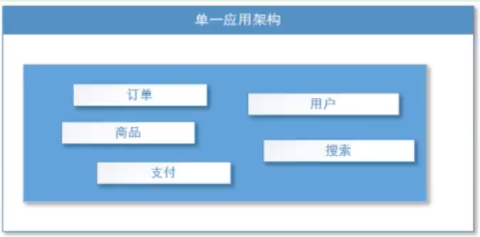
适用于小型网站，小型管理系统，将所有功能都部署到一个功能里，简单易用。缺点：
1、性能扩展比较难
2、协同开发问题
3、不利于升级维护

##### 垂直应用架构

当访问量逐渐增大，单一应用增加机器带来的加速度越来越小，将应用拆成互不相干的而几个应用，一提交效率。此时，用于加速前端页面开发的Web框架（MVC）是关键。

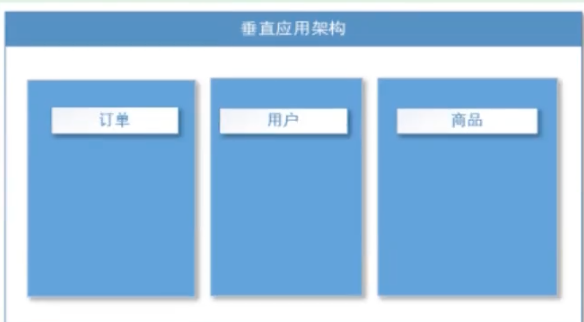

通过切分业务来实现各个模块独立部署，降低了维护和部署的难度，团队各司其职更易管理，性能扩展也更方便，更有针对性。

> 缺点：公用模块无法重复利用，开发性的浪费。

##### 分布式服务架构

当垂直应用越来越多，应用之间交互不可避免，将核心业务抽取出来，作为独立的服务，逐渐形成稳定的服务中心，使前端应用能更快速的响应多变的市场需求。此时，用于提高业务复用及整合的**分布式服务框架（RPC）**是关键。

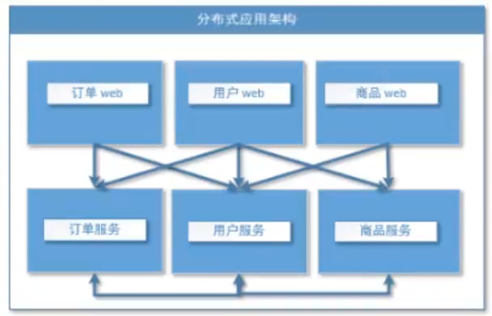

##### 流动计算架构

当服务越来越多，容量的评估，小服务资源的浪费等问题逐渐显现，此时需增加一个调度中心基于访问压力实时管理集群容量，提高集群利用率。此时，用于**提高机器利用率的资源调度和治理中心（SOA）[Service Oriented Architecture]是关键**。

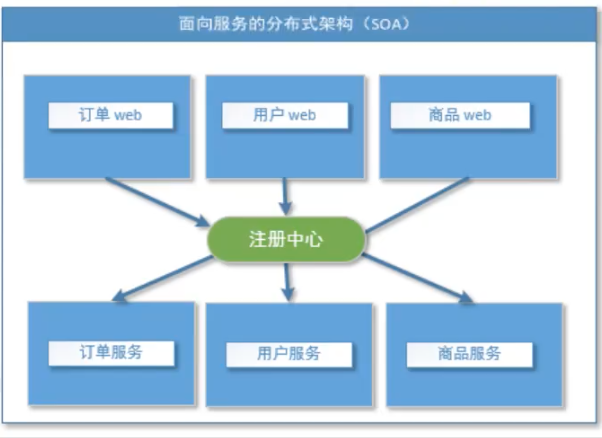

#### RPC协议

RPC 【Remote Procedure Call】是指远程过程调用，是一种进程间通信方式，他是一种**技术的思想**，而不是**规范**。它允许程序调用另一个地址空间（通常是共享网络的另一台机器上）的过程或函数，而不用程序员显式编码这个远程调用的细节。即程序员无论是调用本地的还是远程的函数，**本质上编写的调用代码基本相同**。
也就是说两台服务器A，B，一个应用部署在A服务器上，想要调用B服务器上应用提供的函数/方法，由于不在一个内存空间，不能直接调用，需要**通过网络来表达调用的语义和传达调用的数据**。

为什么要用RPC呢？就是无法在一个进程内，甚至一个计算机内通过本地调用的方式完成的需求，比如不同的系统间的通讯，甚至不同的组织间的通讯，由于计算能力需要横向扩展，需要在多台机器组成的集群上部署应用。RPC就是要像调用本地的函数一样去调远程函数。

推荐阅读文章:https://wwwjianshu.com/p/2accc2840a1b

#####  RPC基本原理

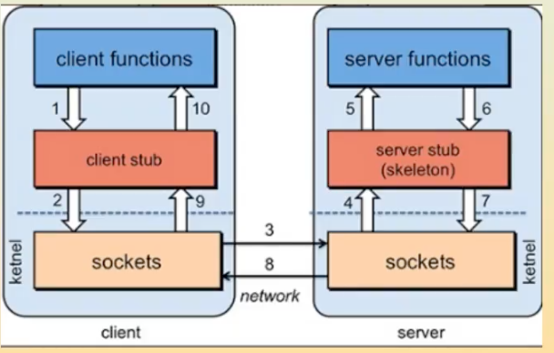

步骤解析：


RPC两个核心：**通讯，序列化**（方便数据传输）。

Dubbo+Zookeeper  使用RPC

Spring Cloud 使用 HTTP

dubbo底层使用netty进行网络通信。

dubbo起源比较早，中间停止维护5年，大约18年开始重新启动，而在这5年里spring cloud诞生发展。

Dubbo专注与RPC，而springcloud是个生态

### Dubbo

Apache Dubbo是一款高性能、轻量级的开源Java RPC框架，三大核心能力：面向接口的远程方法调用，智能容错和负载均衡，以及服务自动注册和发现。

官方：https://dubbo.apache.org/

默认端口：20880

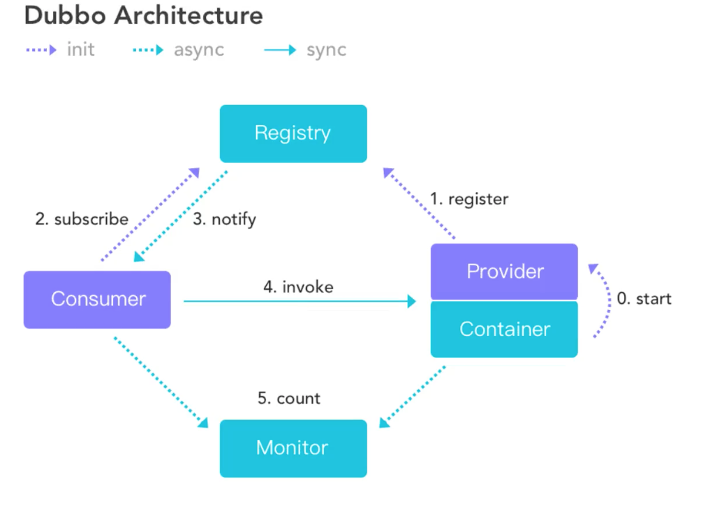


- 服务提供者（Provider）：暴露服务的服务提供方，服务提供者在启动时，向注册中心注册自己提供的服务。
- 服务消费者（Consumer）：调用远程服务的服务消费方，服务消费者在启动时，向注册中心订阅自己所需的服务，服务消费者，从提供者地址列表中，基于献负毂均衡京法，选一台提供者进行调用，如果阖用夫败，再选另一台调用。
- 注册中心（Registry）：注册中心返回服务提供者地址列表给消费者，如果有变更，注册中心将基于长连接推送变更数据给消费者
- 监控中心（Monitor）：服务消费者和提供者，在内存中累计调用次数和调用时间，定时每分钟发送一次统计数据到监控中心

**调用关系说明**

- 服务容器负责启动，加载，运行服务提供者。
- 服务提供者在启动时，向注册中心注册自己提供的服务。
- 服务消费者在启动时，向注册中心订阅自己所需的服务。
- 注册中心返回服务提供者地址列表给消费者，如果有变更，注册中心将基于长连接推送变更数据给消费者。
- 服务消费者，从提供者地址列表中，基于软负载均衡算法，选一台提供者进行调用，如果调用失败，再选另一台调用。 
- 服务消费者和提供者，在内存中累计调用次数和调用时间，定时每分钟发送一次统计数据到监控中心。

#### Dubbo环境搭建

Zookeepr注册中心

注册中心有很多种，zookeeper是其中官方推荐的一种，其它还有：

- Nacos 注册中心（阿里巴巴）

- Multicast 注册中心
- Redis 注册中心

- Simple 注册中心

zookeeper(动物园管理动物的)：hadoop  hive

> ZooKeeper是一个分布式的，开放源码的分布式应用程序协调服务，是Google的Chubby一个开源的实现，是Hadoop和Hbase的重要组件。它是一个为分布式应用提供一致性服务的软件，提供的功能包括：配置维护、域名服务、分布式同步、组服务等。
>
> ZooKeeper的目标就是封装好复杂易出错的关键服务，将简单易用的接口和性能高效、功能稳定的系统提供给用户。


##### 下载安装zookeeper

https://zookeeper.apache.org/

https://zookeeper.apache.org/releases.html

[apache-zookeeper-3.7.0.tar.gz](https://dlcdn.apache.org/zookeeper/zookeeper-3.7.0/apache-zookeeper-3.7.0.tar.gz)  源码包maven项目+bin

[apache-zookeeper-3.7.0-bin.tar.gz](https://dlcdn.apache.org/zookeeper/zookeeper-3.7.0/apache-zookeeper-3.7.0-bin.tar.gz)  打好的jar+bin

使用源码包

- 复制`conf/zoo_sample.cfg`一份为 `conf/zoo.cfg`作为配置文件
- `cd apache-zookeeper-3.7.0-bin/bin` 
- 启动zookeeper：`sudo ./zkServer.sh start`

- 查看状态：`./zkServer.sh start`  。启动失败

```shell
$ ./zkServer.sh status
ZooKeeper JMX enabled by default
Using config: /Users/andyron/myfield/java/dubbo/apache-zookeeper-3.7.0/bin/../conf/zoo.cfg
Client port found: 2182. Client address: localhost. Client SSL: false.
Error contacting service. It is probably not running.
```

使用apache-zookeeper-3.7.0-bin.tar.gz重新来一遍，看到**Mode: standalone**表示启动成功

```shell
$ ./zkServer.sh status
ZooKeeper JMX enabled by default
Using config: /Users/andyron/myfield/java/dubbo/apache-zookeeper-3.7.0-bin/bin/../conf/zoo.cfg
Client port found: 2181. Client address: localhost. Client SSL: false.
Mode: standalone
```


- 启动客户端`$ ./zkCli.sh`（之后的客服端就用java），使用`ls /`列出zookeeper根下保存的所有节点：

```shell
$ ./zkCli.sh
...

WATCHER::

WatchedEvent state:SyncConnected type:None path:null
[zk: localhost:2181(CONNECTED) 0] ls /
[zookeeper]
[zk: localhost:2181(CONNECTED) 1]
```

`create -e /andyron 456`：创建一个andyron节点，值为456；使用`get /andyron` 获取节点值：

```shell
[zk: localhost:2181(CONNECTED) 1] create -e /andyron 456
Created /andyron
Path must start with / character
[zk: localhost:2181(CONNECTED) 3] get /andyron
456
[zk: localhost:2181(CONNECTED) 4] ls /
[andyron, zookeeper]
```


> zoo.cfg配置文件中的几个参数
> dataDir=/tmp/zookeeper   临时数据存储的目录
> clientPort=2181		zookeeper的默认对client的端口号


##### 下载安装Dubbo

https://github.com/apache/dubbo

Zookeeper：注册中心（服务注册与发现）

dubbo-admin：是一个监控管理后台（网页），查看我们注册了哪些服务，哪些服务被消费了（不是必要的）

dubbo本身并不是一个服务软件，它其实就是一个jar包，能够帮我们的java程序连接到zookeeper，并利用zookeeper消费、提供服务。

为了让用户更好的管理监控众多的dubbo服务，官方提高了一个可视化的监控程序。 

-  下载dubbo-admin：

https://github.com/apache/dubbo-admin/tree/master

- 在 `dubbo-admin-server/src/main/resources/application.properties`中指定注册中心地址（如果之前zookeeper的端口没有改变，这里就不需要修改）：

  ```properties
  admin.registry.address=zookeeper://127.0.0.1:2181
  admin.config-center=zookeeper://127.0.0.1:2181
  admin.metadata-report.address=zookeeper://127.0.0.1:2181
  ```

  

- 构建jar包，在dubbo-admin项目根目录下执行：

  ```shell
  sudo mvn clean package -Dmaven.test.skip=true 
  ```

  

- 启动dubbo

  ```shell
  cd dubbo-admin-distribution/target
  
  sudo java -jar dubbo-admin-0.3.0.jar
  ```

  > dubbo-admin 启动时可能回报`  Port 8080 was already in use`错误
  >
  > 这是因为zookeeper 3.5.5版本中包含一个AdminServer默认的端口是8080，所以导致占用。
  >
  > 可在zookeeper的配置文件zoo.cfg配置：
  >
  > ```
  > admin.serverPort=8081
  > ```
  >
  > 或者dubbo-admin-server的application.properties文件中添加：
  >
  > ```
  > server.port=2333
  > ```
  
  另外一种启动方式：
  
  ```
  sudo mvn --projects dubbo-admin-server spring-boot:run
  ```
  
  

- 访问http://localhost:8080/，默认账号密码都是root


### 实战

步骤：

1. idea 空项目

2. 建立两个module，provider-server，consumer-server分别作为服务提供者和服务消费者
3. 两个引入相同的依赖

```xml
<dependency>
  <groupId>org.apache.dubbo</groupId>
  <artifactId>dubbo-spring-boot-starter</artifactId>
  <version>2.7.8</version>
</dependency>

<!-- zkclient-->
<dependency>
  <groupId>com.github.sgroschupf</groupId>
  <artifactId>zkclient</artifactId>
  <version>0.1</version>
</dependency>

<dependency>
  <groupId>org.apache.curator</groupId>
  <artifactId>curator-framework</artifactId>
  <version>2.12.0</version>
</dependency>
<dependency>
  <groupId>org.apache.curator</groupId>
  <artifactId>curator-recipes</artifactId>
  <version>2.12.0</version>
</dependency>
<dependency>
  <groupId>org.apache.zookeeper</groupId>
  <artifactId>zookeeper</artifactId>
  <version>3.4.14</version>
  <!-- 排除slf4j-log4j12 防止与spring冲突-->
  <exclusions>
    <exclusion>
      <groupId>org.slf4j</groupId>
      <artifactId>slf4j-log4j12</artifactId>
    </exclusion>
  </exclusions>
</dependency>
```

4. 在provider-server中

   ```properties
   server.port=8001
   
   # 服务应用的名字
   dubbo.application.name=provider-server
   # 注册中心地址
   dubbo.registry.address=zookeeper://127.0.0.1:2181
   # 哪些服务要被注册
   dubbo.scan.base-packages=com.andyron.service
   ```

   ```java
   package com.andyron.service;
   
   import org.apache.dubbo.config.annotation.Service;
   import org.springframework.stereotype.Component;
   
   
   // zookeeper：服务注册与发现
   
   @Service // 可以被扫描到，在项目已启动就被注册到注册中心
   @Component  // 使用了Dubbo后尽量不要是@Service注解
   public class TicketServiceImpl implements TicketService {
       @Override
       public String getTicket() {
           return "学习dubbo+zookeeper";
       }
   }
   
   ```

5. 开启zookeeper和 dubbo-admin

6. 开启provider-server，此时就能在dubbo-admin中观察到服务提供者

7. consumer-server

   ```properties
   server.port=8002
   
   # 消费者取哪里拿服务，需要暴露自己的名字
   dubbo.application.name=consumer-server
   dubbo.registry.address=zookeeper://127.0.0.1:2181
   ```

   ```java
   package com.andyron.service;
   
   public interface TicketService {
   
       public String getTicket();
   }
   ```

   ```java
   package com.andyron.service;
   
   import org.apache.dubbo.config.annotation.DubboReference;
   import org.springframework.stereotype.Service;
   
   @Service  // 放入到容器中，注意不是dubbo的
   public class UserService {
   
       // 想拿到provider-server提供的票，要去服务中线拿服务
       @DubboReference // 远程引用，对应本地的@Autowired。1 POM坐标，2定义（和provider-server）路径相同的接口（TicketService）
       TicketService ticketService;
   
       public void buyTicket() {
           String ticket = ticketService.getTicket();
           System.out.println("在注册中心拿到===>" + ticket);
       }
   }
   ```

   在consumer-server中测试就能获得注册中心服务提供者提供的服务。


总结步骤：

前提是开启zookeeper

1. 提供者提供服务
   1. 导入依赖
   2. 配置注册中心的地址，以及服务发现名，和要扫描的包
   3. 在想要被注册的服务上面增加一个注解`@Service`（Dubbo的）
2. 消费者如何消费
   1. 导入依赖
   2. 配置注册中心的地址，配置自己的服务名
   3. 从远程注入服务 `@DubboReference`


### 现在和未来

p61


