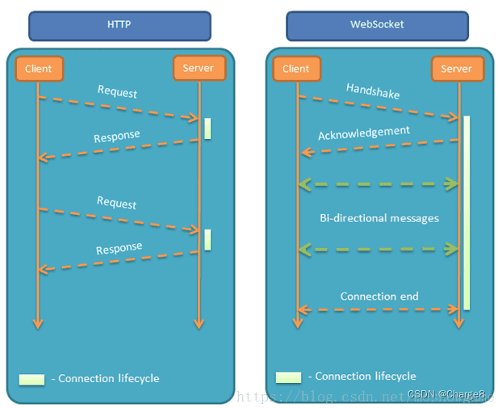
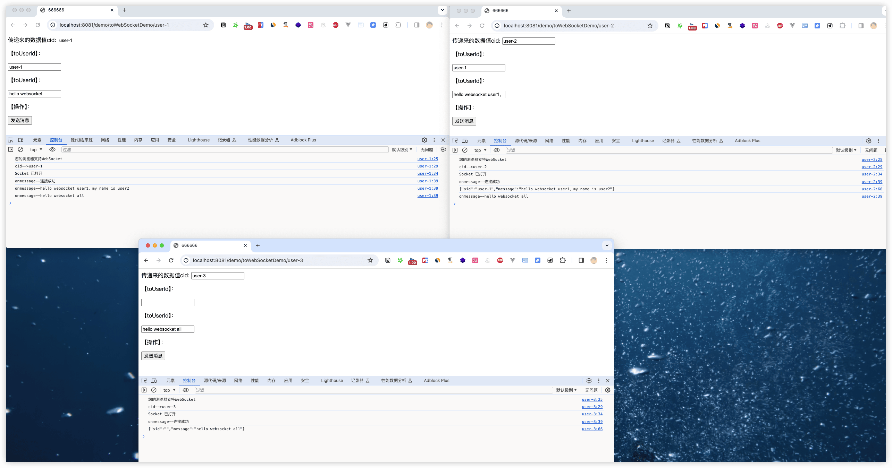

SpringBootStudy
---

运用、更深入地学习SpringBoot

https://pdai.tech/md/spring/springboot/springboot.html

https://github.com/ityouknow/spring-boot-examples


spring-boot-starter-web的依赖


## 内存数据库H2


## 日志

https://pdai.tech/md/develop/package/dev-package-x-log.html


## 统一封装接口 sb-01

> 原因：现在大多数项目采用前后分离的模式进行开发，统一返回方便前端进行开发和封装，以及出现时给出响应编码和信息。


## 如何对参数进行校验 sb-01

### 什么是不优雅的参数校验

后端对前端传过来的参数也是需要进行校验的，如果在controller中直接校验需要用大量的if else做判断，如：

```java
@RestController
@RequestMapping("/user")
public class UserController {

    @PostMapping("add")
    public ResponseEntity<String> add(User user) {
        if(user.getName()==null) {
            return ResponseResult.fail("user name should not be empty");
        } else if(user.getName().length()<5 || user.getName().length()>50){
            return ResponseResult.fail("user name length should between 5-50");
        }
        if(user.getAge()< 1 || user.getAge()> 150) {
            return ResponseResult.fail("invalid age");
        }
        // ...
        return ResponseEntity.ok("success");
    
    }
}
```

针对这个普遍的问题，Java开发者在Java API规范 (JSR303) 定义了Bean校验的标准**validation-api**，但没有提供实现。

**hibernate validation是对这个规范的实现**，并增加了校验注解如@Email、@Length等。

**Spring Validation是对hibernate validation的二次封装**，用于支持spring mvc参数自动校验。

### 案列

1. 添加依赖
2. 请求参数封装
3. Controller中获取参数绑定结果
4. 检验结果


#### Validation分组校验

UserParam既可以作为add的参数（id为空），又可以作为update的参数（id不能为空），需要分组校验

1. 定义分组接口（不需要实现）

```java
public interface AddValidationGroup {
}
public interface EditValidationGroup {
}
```

2. 在UserParam的userId字段添加分组

```java
@NotEmpty(message = "{user.msg.userId.notEmpty}", groups = {EditValidationGroup.class}) // 这里
private String userId;
```


3. controller中的接口使用校验时使用分组

```java
@PostMapping("add")
public ResponseEntity<UserParam> add(@Validated(AddValidationGroup.class) @RequestBody UserParam userParam) {
  return ResponseEntity.ok(userParam);
}
```


### Validation分组校验

在检验Controller的入参是否符合规范时，使用@Validated或者@Valid在基本验证功能上没有太多区别。但是在分组、注解地方、嵌套验证等功能上两个有所不同：

- **分组**

@Validated：提供了一个分组功能，可以在入参验证时，根据不同的分组采用不同的验证机制，这个网上也有资料，不详述。@Valid：作为标准JSR-303规范，还没有吸收分组的功能。

- **注解地方**

@Validated：可以用在类型、方法和方法参数上。但是不能用在成员属性（字段）上

@Valid：可以用在方法、构造函数、方法参数和成员属性（字段）上

- **嵌套类型**

比如本文例子中的address是user的一个嵌套属性, 只能用@Valid


### 有哪些常用的校验？

三类

- **JSR303/JSR-349**: JSR303是一项标准,只提供规范不提供实现，规定一些校验规范即校验注解，如@Null，@NotNull，@Pattern，位于javax.validation.constraints包下。**JSR-349是其的升级版本，添加了一些新特性**。

```java
@AssertFalse            被注释的元素只能为false
@AssertTrue             被注释的元素只能为true
@DecimalMax             被注释的元素必须小于或等于{value}
@DecimalMin             被注释的元素必须大于或等于{value}
@Digits                 被注释的元素数字的值超出了允许范围(只允许在{integer}位整数和{fraction}位小数范围内)
@Email                  被注释的元素不是一个合法的电子邮件地址
@Future                 被注释的元素需要是一个将来的时间
@FutureOrPresent        被注释的元素需要是一个将来或现在的时间
@Max                    被注释的元素最大不能超过{value}
@Min                    被注释的元素最小不能小于{value}
@Negative               被注释的元素必须是负数
@NegativeOrZero         被注释的元素必须是负数或零
@NotBlank               被注释的元素不能为空
@NotEmpty               被注释的元素不能为空
@NotNull                被注释的元素不能为null
@Null                   被注释的元素必须为null
@Past                   被注释的元素需要是一个过去的时间
@PastOrPresent          被注释的元素需要是一个过去或现在的时间
@Pattern                被注释的元素需要匹配正则表达式"{regexp}"
@Positive               被注释的元素必须是正数
@PositiveOrZero         被注释的元素必须是正数或零
@Size                   被注释的元素个数必须在{min}和{max}之间

```

- **hibernate validation**：hibernate validation是对这个规范的实现，并增加了一些其他校验注解，如@Email，@Length，@Range等等

```java
@CreditCardNumber       被注释的元素不合法的信用卡号码
@Currency               被注释的元素不合法的货币 (必须是{value}其中之一)
@EAN                    被注释的元素不合法的{type}条形码
@Email                  被注释的元素不是一个合法的电子邮件地址  (已过期)
@Length                 被注释的元素长度需要在{min}和{max}之间
@CodePointLength        被注释的元素长度需要在{min}和{max}之间
@LuhnCheck              被注释的元素${validatedValue}的校验码不合法, Luhn模10校验和不匹配
@Mod10Check             被注释的元素${validatedValue}的校验码不合法, 模10校验和不匹配
@Mod11Check             被注释的元素${validatedValue}的校验码不合法, 模11校验和不匹配
@ModCheck               被注释的元素${validatedValue}的校验码不合法, ${modType}校验和不匹配  (已过期)
@NotBlank               被注释的元素不能为空  (已过期)
@NotEmpty               被注释的元素不能为空  (已过期)
@ParametersScriptAssert 被注释的元素执行脚本表达式"{script}"没有返回期望结果
@Range                  被注释的元素需要在{min}和{max}之间
@SafeHtml               被注释的元素可能有不安全的HTML内容
@ScriptAssert           被注释的元素执行脚本表达式"{script}"没有返回期望结果
@URL                    被注释的元素需要是一个合法的URL
@DurationMax            被注释的元素必须小于${inclusive == true ? '或等于' : ''}${days == 0 ? '' : days += '天'}${hours == 0 ? '' : hours += '小时'}${minutes == 0 ? '' : minutes += '分钟'}${seconds == 0 ? '' : seconds += '秒'}${millis == 0 ? '' : millis += '毫秒'}${nanos == 0 ? '' : nanos += '纳秒'}
@DurationMin            被注释的元素必须大于${inclusive == true ? '或等于' : ''}${days == 0 ? '' : days += '天'}${hours == 0 ? '' : hours += '小时'}${minutes == 0 ? '' : minutes += '分钟'}${seconds == 0 ? '' : seconds += '秒'}${millis == 0 ? '' : millis += '毫秒'}${nanos == 0 ? '' : nanos += '纳秒'}

```


- **spring validation**：spring validation对hibernate validation进行了二次封装，在springmvc模块中添加了自动校验，并将校验信息封装进了特定的类中


## 如何提供多个版本接口 sb-02

https://pdai.tech/md/spring/springboot/springboot-x-interface-version.html

> 在以SpringBoot开发Restful接口时，由于模块，系统等业务的变化，需要对同一接口提供不同版本的参数实现（老的接口还有模块或者系统在用，不能直接改，所以需要不同版本）。如何更加优雅的实现多版本接口呢？


### 有哪些控制接口多版本的方式？

- 相同URL，用**不同的版本参数**区分
  - `api.pdai.tech/user?version=v1` 表示 v1版本的接口, 保持原有接口不动
  - `api.pdai.tech/user?version=v2` 表示 v2版本的接口，更新新的接口
- 区分**不同的接口域名**，不同的版本有不同的子域名, 路由到不同的实例:
  - `v1.api.pdai.tech/user` 表示 v1版本的接口, 保持原有接口不动, 路由到instance1
  - `v2.api.pdai.tech/user` 表示 v2版本的接口，更新新的接口, 路由到instance2
- 网关路由不同子目录到**不同的实例**（不同package也可以）
  - `api.pdai.tech/v1/user` 表示 v1版本的接口, 保持原有接口不动, 路由到instance1
  - `api.pdai.tech/v2/user` 表示 v2版本的接口，更新新的接口, 路由到instance2
- **同一实例**，用注解隔离不同版本控制
  - `api.pdai.tech/v1/user` 表示 v1版本的接口, 保持原有接口不动，匹配@ApiVersion("1")的handlerMapping
  - `api.pdai.tech/v2/user` 表示 v2版本的接口，更新新的接口，匹配@ApiVersion("2")的handlerMapping

这里主要展示第四种单一实例中如何优雅的控制接口的版本。


## websocket sb-03

https://blog.csdn.net/qq_42402854/article/details/130948270

websocket协议是基于TCP的一种新的网络协议,它实现了浏览器与服务器的**全双工通讯**——允许服务器主动发起信息个客户端,websocket是一种持久协议,http是非持久协议。

在WebSocket应用程序中，服务器发布WebSocket端点，客户端使用url连接到服务器。建立连接后，服务器和客户端就可以互相发送消息。客户端通常连接到一台服务器，服务器接受多个客户端的连接。

> WebSocket的最大特点就是，服务器可以主动向客户端推送信息，客户端也可以主动向服务器发送信息，是真正的双向平等对话。

### WebSocket特点：

1. 建立在 TCP 协议之上，服务器端的实现比较容易。
2. 与 HTTP 协议有着良好的兼容性。默认端口也是80和443，并且握手阶段采用 HTTP 协议，因此握手时不容易屏蔽，能通过各种 HTTP 代理服务器。
3. 数据格式比较轻量，性能开销小，通信高效。
4. 可以发送文本，也可以发送二进制数据。
5. 没有同源限制，客户端可以与任意服务器通信。
6. 协议标识符是ws（如果加密，则为wss），服务器网址就是 URL。




