SpringCloud
----------


[【狂神说Java】SpringCloud最新教程IDEA版](https://www.bilibili.com/video/BV1jJ411S7xr)


## 1 这个阶段如何学

```
三层框架 + MVC

框架：
	Spring IOC AOP
	
	SpringBoot，新一代的JavaEE开发标准，自动装配，约定大于配置
	
	模块化~ （用户业务、支付业务、订单业务、物流业务、交易业务）
	
微服务架构4个核心问题？
	1. 服务很多，客户端该怎么访问？
	2. 这么多服务？服务之间如何通信？
	3. 这么多服务？如何治理？
	4. 服务挂了怎么办？
	
解决方案：
	Spring Cloud  生态
	
	1. Spring Cloud NetFlix 一站式解决方案！（4个问题都能解决，不过已经停更）
		api网关，zuul组件
		Feign  --HttpC李net  ---- Http通信方式式，同步，阻塞
		服务注册发现：Eureka
		熔断机制：Hystrix
		。。。
	
	2. Apache Dubbo Zookeeper 半自动，需要整合别人的！
		API：没有，找第三方组件或自己实现
		Dubbo，比Feign优秀
		Zookeeper
		没有，借助Hystrix
	
	3. Spring Cloud Alibaba  一站式解决方案！更简单
	
	

新概念：服务网格~  Server Mesh
	istio
	

万变不离其宗
	1. API
	2. HTTP，RPC
	3. 注册和发现
	4. 熔断机制
	
4个问题产生的本质就是：网络不可靠。
```


> 1、常见面试题
> 1.1、什么是微服务？
> 1.2、微服务之间是如何独立通讯的？
> 1.3、 SpringCloud和Dubbo有哪些区别？
> 1.4、SpringBoot和SpringCloud，请你谈谈对他们的理解
> 1.5、什么是服务熔断？什么是服务降级
> 1.6、微服务的优缺点是分别是什么？说下你在项目开发中遇到的坑
> 1.7、你所知道的微服务技术栈有哪些？请列举一二
> 1.8、eureka和zookeeper都可以提供服务注册与发现的功能，请说说两个的区别？
>
> ...


## 2、微服务概述

### 2.1 什么是微服务

- 就目前而言，对于微服务，业界并没有一个统一的，标准的定义
- 但通常而言，微服务架构是一种架构模式，或者说是一种架构风格，它**<font color=#FF8C00>提倡将单一的应用程序划分成一组小的服务</font>**，每个服务运行在其独立的自己的进程内，服务之间互相协调，互相配置，为用户提供最终价值。服务之间采用**轻量级的通信机制**互相沟通，每个服务都围绕着具体的业务进行构建，并且能够被独立的部署到生产环境中，另外，应尽量避免统一的、集中式的服务管理机制，对具体的一个服务而言，应根据业务上下文，选择合适的语言、工具（如Maven等）对其进行构建，可以有一个非常轻量级的集中式管理来协调这些服务，可以使用不同的语言来编写服务，也可以使用不同的数据存储。

可能有的人觉得官方的话太过生涩，我们从技术维度来理解下：

- 微服务化的核心就是将传统的一站式应用，根据业务拆分成一个一个的服务，彻底地去耦合，「每一个微服务提供单个业务功能的服务，一个服务做一件事情，从技术角度看就是一种小而独立的处理过程，类似进程的概念，能够自行单独启动或销毁，拥有自己独立的数据库。


### 2.2 微服务与微服务架构

#### 微服务

强调的是服务的大小，他关注的是某一个点，是具体解决某一个问题/提供落地对应服务的一个服务应用，狭义的看，可以看做是IDEA中的一个个微服务工程，或者Moudle

```
IDEA工具里面使用Maven开发的一个个独立的小Moudle，它具体是使用springboot开发的一个小模块，专业的事情交给专业的模块来做，一个模块就做着一件事情
强调的是一个个的个体，每个个体完成一个具体的任务或者功能！
```

#### 微服务架构

一种新的架构形式，Martin Fowler，2014提出

微服务架构是一种架构模式，它提倡将单一应用程序划分成一组小的服务，服务之间互相协调，互相配合，为用户提供最终价值。每个服务运行在其独立的进程中，服务于服务间采用轻量级的通信机制互相协作，每个服务都围绕着具体的业务进行构建，并且能够被独立的部署到生产环境中，另外，应尽量避免统一的，集中式的服务管理机制，对具体的一个服务而言，应根据业务上下文，选择合适的语言，工具对其进行构建。


### 2.3 微服务优缺点

#### 优点

- 单一职责原则
- 每个服务足够内聚，足够小，代码容易理解，这样能聚焦一个指定的业务功能或业务需求；
- 开发简单，开发效率提高，一个服务可能就是专一的只干一件事；
- 微服务能够被小团队单独开发，这个小团队是2~5人的开发人员组成；
- 微服务是松耦合的，是有功能意义的服务，无论是在开发阶段或部署阶段都是独立的。
- 微服务能使用不同的语言开发。
- 易于和第三方集成，微服务允许容易且灵活的方式集成自动部署，通过持续集成工具，如jenkins，Hudson，bamboo
- 微服务易于被一个开发人员理解，修改和维护，这样小团队能够更关注自己的工作成果。无需通过合作才能体现价值。
- 微服务允许你利用融合最新技术。
- 微服务只是业务逻辑的代码，不会和HTML，CSS或其他界面混合
- 每个微服务都有自己的存储能力，可以有自己的数据库，也可以有统一数据库

### 缺点

- 开发人员要处理分布式系统的复杂性
- 多服务运维难度，随着服务的增加，运维的压力也在增大
- 系统部署依赖
- 服务间通信成本
- 数据一致性
- 系统集成测试
- 性能监控。。。


### 2.4 微服务技术栈有哪些？


| 微服务条目                               | 落地技术                                                     |
| ---------------------------------------- | ------------------------------------------------------------ |
| 服务开发                                 | Spring，SpringBoot，SpringMVC                                |
| 服务配置与管理                           | Netflix公司的Archaius、阿里的Diamond等                       |
| 服务注册与发现                           | Eureka、Consul、Zookeeper等                                  |
| 服务调用                                 | Rest、RPC、gRPC                                              |
| 服务熔断器                               | Hystrix、Envoy等                                             |
| 负载均衡                                 | Ribbon、Nginx等                                              |
| 服务接口调用（客户端调用服务的简化工具） | Feign等                                                      |
| 消息队列                                 | Kafka、RabbitMQ、ActiveMQ等                                  |
| 服务配置中心管理                         | SpringCloudConfig、Chef等                                    |
| 服务路由（API网关）                      | Zuul等                                                       |
| 服务监控                                 | Zabbix、Nagios、Metrics、Specatator等                        |
| 全链路追踪                               | Zipkin、Brave、Dapper等                                      |
| 服务部署                                 | Docker、OpenStack、Kubernetes等                              |
| 数据流操作开发包                         | SpringCloud Stream（封装与Redis，Rabbit，Kafka等发送接收消息） |
| 事件消息总线                             | SpringCloud Bus                                              |
|                                          |                                                              |


### 2.5 为什么选择SpringCloud作为微服务架构

#### 1、选择依据

- 整体解决方案和框架成熟度
- 社区热度
- 可维护性
- 学习曲线（实际开发中，只需要配置一些注解）

#### 2、当前各大IT公司用的微服务架构有哪些？

- 阿里：dubbo+HFS
- 京东：JSF
- 新浪：Motan
- 当当 DubboX
- ...

#### 3、各微服务框架对比

| 功能点/服务框架 | Netflix/SpringCloud                                          | Motan                                                        | gRPC                      | Thrift   | Dubbo/DubboX       |
| --------------- | ------------------------------------------------------------ | ------------------------------------------------------------ | ------------------------- | -------- | ------------------ |
| 功能定位        | 完整的微服务框架                                             | RPC框架，但整合了ZK或Consul，实现集群环境的基本服务注册/发现 | RPC框架                   | RPC框架  | 服务框架           |
| 支持Rest        | 是，Ribbon支持多种可插拔的序列化选择                         | 否                                                           | 否                        | 否       | 否                 |
| 支持RPC         | 否                                                           | 是（Hession2）                                               | 是                        | 是       | 是                 |
| 支持多语言      | 是                                                           | 否                                                           | 是                        | 是       | 否                 |
| 负载均衡        | 是（服务端zuul+客户端Ribbon），zuul-服务，动态路由，远端负载均衡Eureka（针对中间层服务器） | 是（客户端）                                                 | 否                        | 否       | 是（客户端）       |
| 配置服务        | Netflix Archaius、Spring Cloud Config Server集中配置         | 是（ZK）                                                     | 否                        | 否       | 否                 |
| 服务调用链监控  | 是，zuul提供边缘服务，API网关                                | 否                                                           | 否                        | 否       | 否                 |
| 高可用/容错     | 是（服务端Hystrix+客户端Ribbon）                             | 是（客户端）                                                 | 否                        | 否       | 是（客户端）       |
| 典型应用案例    | Netflix                                                      | Sina                                                         | Google                    | Facebook |                    |
| 社区活跃度      | 高                                                           | 一般                                                         | 高                        | 一般     | 2017年重新开始维护 |
| 学习难度        | 中                                                           | 低                                                           | 高                        | 高       | 低                 |
| 文档丰富程度    | 高                                                           | 一般                                                         | 一般                      | 一般     | 高                 |
| 其他            | Spring Cloud Bus提供更多管理端点                             | 支持降级                                                     | Netflix内部在开发继承gRPC | IDL定义  | 实践的公司比较多   |

## 3、SpringCloud概述

SpringCloud，基于SpringBoot提供了一套微服务解决方案，包括服务注册与发现，配置中心，全链路监控，服务网关，负载均衡，熔断器等组件，除了基于NetFlix的开源组件做高度抽象封装之外，还有一些选型中立的开源组件。

SpringCloud利用SpringBoot的开发便利性，巧妙地简化了分布式系统基础设施的开发，SpringCloud为开发人员提供了快速构建分布式系统的一些工具，包括**配置管理，服务发现，断路器，路由，微代理，事件总线，全局锁，决策竞选，分布式会话**等等，他们都可以用SpringBoot的开发风格做到一键启动和部署。
SpringBoot并没有重复造轮子，它只是将目前各家公司开发的比较成熟，经得起实际考研的服务框架组合起来，通过SpringBoot风格进行再封装，屏蔽掉了复杂的配置和实现原理，<u>最终给开发者留出了一套简单易懂，易部署和易维护的分布式系统开发工具包</u>。

SpringCloud是分布式微服务架构下的一站式解决方案，是各个微服务架构落地技术的集合体，俗称微服务全家桶。


### SpringBoot和SpringCloud关系

开发  和 协调

- SpringBoot专注于快速方便的开发单个个体微服务。（也就是一个个Jar包）
- Springcloud是关注全局的微服务协调整理治理框架，之好SpringBoot开发的一个个单体徽服务整合并管理起来，为各个微服务之间提供：配置管理，服务发现，断路器，路由，微代理，事件总线，全局锁，决策竞选，分布式会话等等集成服务。
- SpringBoot可以高开Springlooud独立使用，开发项目，但是Springcioud商不开SpringBoot.
  系
- SpringBoot专注于快速、方便的开发单个个体微服务，Springcloud关注全局的服务治理框架


### Dubbo和SpringCloud技术选项


分布式文件系统（Distributed File System，DFS）

GFS

Hadoop分布式文件系统(HDFS)

#### 1、分布式+服务治理Dubbo

目前成熟的互联网架构：应用服务化拆分 + 消息中间体

  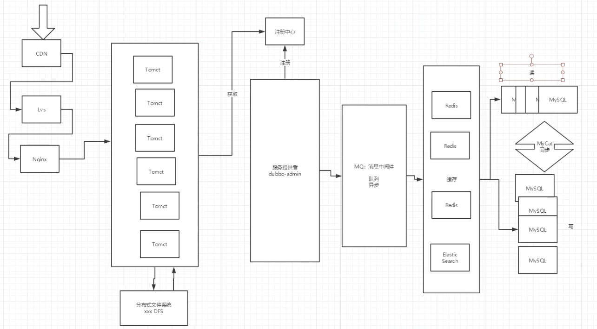

#### 2、Dubbo和SpringCloud对比

|              | Dubbo         | Spring Cloud                 |
| ------------ | ------------- | ---------------------------- |
| 服务注册中心 | Zookeeper     | Spring Cloud Netflix Eureka  |
| 服务调用方式 | RPC           | REST API                     |
| 服务监控     | Dubbo-monitor | Spring Boot Admin            |
| 断路器       | 不完善        | Spring Cloud Netflix Hystrix |
| 服务网关     | 无            | Spring Cloud Netflix Zuul    |
| 分布式配置   | 无            | Spring Cloud Config          |
| 服务跟踪     | 无            | Spring Cloud Sleuth          |
| 消息总线     | 无            | Spring Cloud Bus             |
| 数据流       | 无            | Spring Cloud Stream          |
| 批量任务     | 无            | Spring Cloud Task            |


最大区别：**SpringCloud拋弃了Dubbo的RPC通信，采用的是基于HTTP的REST方式。**
严格来说，这两种方式各有优劣。当然从一定程度上来说，后者牺牲了服务调用的性能，但也避免了上面提到的原生RPC带来的问题。而目REST相比RPC更为灵活，服务提供方和调用方的依赖只依靠一纸契约，不存在代码级别的强依赖，这在强调快速演化的微服务环境下，显得更加合适。

**品牌机与组装机的区别**

很明显，Spring Cioud的功能比DUBBO更加强大，汤盖面更广，而且作为Spring的拳头项目，它也能够与SpringFramework， Spring Boot， Spring Data， Spring Batch等其他Spring项目完美融合，这些对于微服务而言是至关重要的。使用Dubbo构建的微股务架构就像组装电脑，各环节我们的选择自由度很高，但是最终结果很有可能因为一条内存质量不行就点不究了，总是让人不怎么放心，但是如果你是一名高手，那这些都不是问题；而SpringCloud就像品牌机，在Spring Source的整合下，做了大量的兼客性测试，保证了机器拥有更高的稳定性，但是如果要在使用非原装组件外的东西，就需要对其基础有足够的了解。

**社区支持与更新力度**

最为重要的是，DUBBO停止了5年左右的更新，虽然2017.7重启了。对于技术发展的新需求，需要由开发者自行拓展升级（比如当当网弄出了DubboX)，这对于很多想要采用微服务架构的中小软件组织，显然是不太合适的，中小公司没有这么强大的技术能力去修改Dubbo源码+周边的一路套解决方案，井不是每一个公司都有阿里的大牛+真实的线上生产环境测试过。


> 设计模式 + 微服务拆分思想

**总结：**

曾风靡国内的开源 RPC 服务框架 Dubbo 在重启维护后，令许多用户为之省跃，但同时，也迎来了一些质疑的声音。互联网技术发展迅速，Dubbo 是否还能跟上时代？Dubbo 与 Springcioud 相比又有何优势和差异？是否会有相关举措保证 Dubbo 的后续更新频率？

人物：Dubbo重启维护开发的刘军，主要负责人之一。

刘军，阿里巴巴中间件高级研发工程师，主导了 Dubbo 重启维护以后的几个发版计划，专注于高性能 RPC 框架的研发及指导在内部使用，参与了服务治理平台、分布式跟踪系统、分布式一致性框架等从无到有的设计与开发过程。

解决的问题域不一样：**Dubbo的定位是一款RPC框架，Spring cloud的目标是微服务架构下的一站式解决方案**。

### SpringCloud能干什么

https://spring.io/projects/spring-cloud

- Distributed/versioned configuration
- Service registration and discovery
- Routing
- Service-to-service calls
- Load balancing
- Circuit Breakers
- Global locks
- Leadership election and cluster state
- Distributed messaging


### Spring Cloud的版本

https://spring.io/projects/spring-cloud#learn

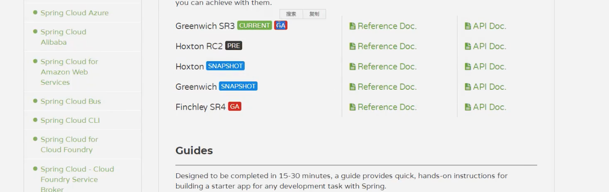

GA：通用稳定版本

- spring cloud是一个由众生独立子项目组成的大型综合項目，每个子项目有不用的发行节奏，都维护着自己的发布版本号。Spring Cloud通过一个资源清单BoM (Bill of Materials）来管理每个版本的子项目清单。为了避免与子项目的发不好混淆，所以没有采用版本号的方式，而是通过命名的方法。
- 这些版木名称的命名方式采用伦敦地铁站的名称，同时根据字母表的顺序来对应版本时间顺序，比如：最早的Release版本：Ange1，第：而个Release版本： Brixton，然后Camden、Dalston、 Edgware，自崩最新的是Finchley版本。

参考网站：

[SpringCloud中文网](https://www.springcloud.cc/)

[Spring Cloud中国社区](http://docs.springcloud.cn/)

实际开发版本关系

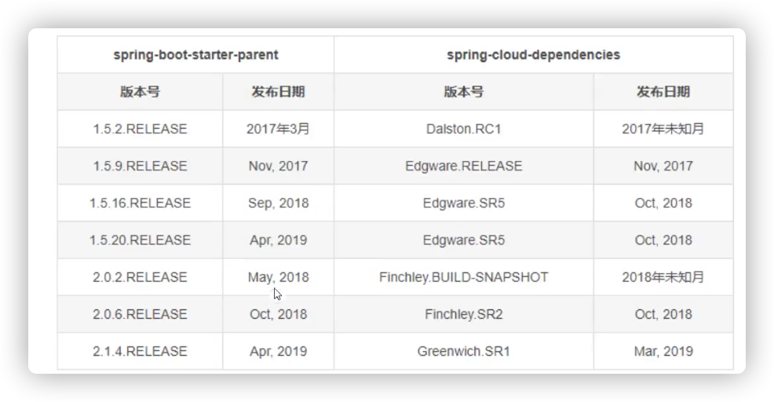

## 4、Rest风格环境搭建

springcloud-api
springcloud-provider-dept-8001
springcloud-consumer-dept-80

https://www.springcloud.cc/spring-cloud-greenwich.html

1. 普通的maven项目，删掉src，作为父项目。打包方式、依赖管理

 [Spring Cloud Dependencies](https://mvnrepository.com/artifact/org.springframework.cloud/spring-cloud-dependencies)

2. 新建数据库**db01**，表**dept**

   ```sql
   CREATE TABLE `dept` (
     `deptno` bigint NOT NULL AUTO_INCREMENT,
     `dname` varchar(60) DEFAULT NULL,
     `db_source` varchar(60) DEFAULT NULL,
     PRIMARY KEY (`deptno`)
   ) ENGINE=InnoDB AUTO_INCREMENT=1 DEFAULT CHARSET=utf8mb3 COMMENT='部门表';
   ```

   ```mysql
   insert into dept (dname, db_source) values ("开发部", Database());
   insert into dept (dname, db_source) values ("人事部", Database());
   insert into dept (dname, db_source) values ("财务部", Database());
   insert into dept (dname, db_source) values ("市场部", Database());
   insert into dept (dname, db_source) values ("运维部", Database());
   ```

   

3. 新建一个子模块**springcloud-api**，只包含实体类

4. 新建子模块**springcloud-provider-dept-8001**，作为服务提供者

5. 新建子模块**springcloud-consumer-dept-80**，作为消费者

   - RestTemplate默认没有@Bean，没有交给spring容器管理，需要在此配置一下


> Bean的注册方式有几种？


## 5、Eureka服务注册于发现

### 5.1 什么事Eureka

[juˈriːkə]
Eureka是Netflix的一个子模块，也是核心模块之一，遵循的就是AP原则。Eureka是一个基于REST的服务，用于定位服务，以实现云端中间层服务发现和故障转转移，服务注册与发现对于微服务来说是非常重要的，有了服务发现与注册，只需要使用服务的标识符，就可以访问到服务，而不需要修改服务调用的配置文件了，功能类似于Dubbo的注册中心，比如Zookeeper。

### 5.2 原理

Eureka的基本架构

- SpringCloud 封装了NetFlix公司开发的Eureka模块来实现服务注册和发现（对比Zookeeper)
- Eureka采用了C-S的架构设计，EurekaServer作为服务注册功能的服务器，他是服务注册中心
- 而系统中的其他微服务。使用Eureka的客户端连接到Eurekaserver并维持心跳连接。这样系统的维护人
  员就可以通过EurekaServer来监控系统中各个微服务是否正常运行，SpringCloud的一些其他模块（比如
  Zuul）就可以通过EurekaServer来发现系统中的其他微服务，并执行相关的逻辑；

和Dubbo架构对比


- Eureka 包含两个组件：**Eureka Server** 和 **Eureka Client**。
- Eureka Server提供服务注册服务，各个节点启动后，会在Eurekaserver中进行注册，这样Eureka Server
  中的服务注册表中将会村粗所有可用服务节点的信息，服务节点的信息可以在界面中直观的看到。
- Eureka Client是一ava客户端，用于简化Eurekaserver的交互，客户端同时也具备一个内置的，使用轮
  询负载算法的负载均衡器。在应用启动后，将会向Eurekaserver发送心跳（默认周期为30秒）。如果
  Eureka Server在多个心跳周期内没有接收到某个节点的心跳，Eurekaserver将会从服务注册表中把这个
  服务节点移除掉（默认周期为90秒）


Eureka的三大角色

- Eureka Server：提供服务的注册于发现。
- Service Provider ：将自身服务注册到Eureka中，从而使消费方能够找到。
- Service Consumer：服务消费方从Eureka中获取注册服务列表，从而找到消费服务。


### 5.3 基本操作

Eureka服务端

1. 新建模块**springcloud-eureka-7001**

2. 导入依赖

   ```xml
   <dependency>
     <groupId>org.springframework.cloud</groupId>
     <artifactId>spring-cloud-starter-netflix-eureka-server</artifactId>
     <version>1.4.6.RELEASE</version>
   </dependency>
   ```

3. 配置文件

   ```yaml
   server:
     port: 7001
   eureka:
     instance:
       hostname: localhost  # Eureka服务端的实例名称
     client:
       register-with-eureka: false  # 表示是否向Eureka注册中心注册自己。此处自己不需要注册
       fetch-registry: false   # false 表示自己为注册中心
       service-url:    # 监控页面。defaultZone参数可在EurekaClientConfigBean（cmd+点击 进入查看）中查看
         defaultZone: http://${eureka.instance.hostname}:${server.port}/eureka/
   ```

4. 写启动类，并开启Eureka服务端功能

   ```java
   @SpringBootApplication
   @EnableEurekaServer
   public class EurekaServer_7001 {
       public static void main(String[] args) {
           SpringApplication.run(EurekaServer_7001.class, args);
       }
   }
   ```


**springcloud-provider-dept-8001**

1. 引入依赖：

   ```xml
   <dependency>
     <groupId>org.springframework.cloud</groupId>
     <artifactId>spring-cloud-starter-netflix-eureka-client</artifactId>
     <version>1.4.6.RELEASE</version>
   </dependency>
   ```

2. 添加配置

   ```yaml
   # Eureka配置，服务注册到哪里
   eureka:
     client:
       service-url:
         defaultZone: http://localhost:7001/eureka/
     instance:
       instance-id: springcloud-provider-dept8001  # 修改Eureka默认的描述信息（Status）
   ```

3. 添加注解`@EnableEurekaClient`

   ```java
   /**
    * `@EnableEurekaClient` 表示服务启动后会自动注册到Eureka服务端中
    * @author Andy Ron
    */
   @SpringBootApplication
   @EnableEurekaClient
   public class DeptProvider_8001 {
       public static void main(String[] args) {
           SpringApplication.run(DeptProvider_8001.class, args);
       }
   }
   ```

4. 先启动7001，后启动8001，观察http://localhost:7001/，发现已经注册成功。

   如果强制停掉8001，7001会过一段时间才会提醒错误，这是一种保护机制

   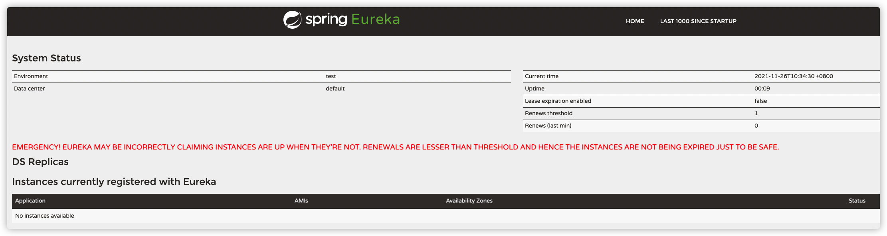

完善监控信息：

- 引入依赖

  ```xml
  <!-- actuator完善监控信息 -->
  <dependency>
    <groupId>org.springframework.boot</groupId>
    <artifactId>spring-boot-starter-actuator</artifactId>
  </dependency>
  ```

- 配置文件中，随意配置一些信息

  ```yaml
  # info配置
  info:
    app.name: andyron-springcloud
    company: andyron.com
  ```

- 点击注册的springcloud-provider-dept8001链接，跳转到http://192.168.0.104:8001/actuator/info，查看到上面的配置的信息

  ```json
  {"app":{"name":"andyron-springcloud"},"company":"andyron.com"}
  ```


#### 自我保护机制：好死不如赖活着

<font color=#FF263D>**EMERGENCY! EUREKA MAY BE INCORRECTLY CLAIMING INSTANCES ARE UP WHEN THEY'RE NOT. RENEWALS ARE LESSER THAN THRESHOLD AND HENCE THE INSTANCES ARE NOT BEING EXPIRED JUST TO BE SAFE.**</font>

一句话总结：某时刻某一个微服务不可以用了，eureka不会立刻清理，依旧会对该微服务的信息进行保存！

- 默认情况下，如果Eurekaserver在一定时间内没有接收到某个微服务实例的心跳，EurekaServer将会注销该
  实例（默认90秒）。但是当网络分区故障发生时，微服务与Eureka之间无法正常通行，以上行为可能变得非
  常危险了——因为微服务本身其实是健康的，**此时本不应该注销这个服务**。Eureka通过 **自我保护机制** 来解决这个问题——当Eurekaserver节点在短时间内丢失过多客户端时（可能发生了网络分区故障），那么这个节点就会进入自我保护模式。一旦进入该模式，Eurekaserver就会保护服务注册表中的信息，不再删除服务注册表中的数据（也就是不会注销任何微服务）。当网络故障恢复后，该Eurekaserver节点会自动退出自我保护模式。
- 在自我保护模式中，Eurekaserver会保护服务注册表中的信息，不再注销任何服务实例。当它收到的心跳数
  重新恢复到阈值以上时，该Eurekaserver节点就会自动退出自我保护模式。它的设计哲学就是**宁可保留错误**
  **的服务注册信息，也不盲目注销任何可能健康的服务实例**。一句话：好死不如赖活着
- 综上，自我保护模式是一种应对网络异常的安全保护措施。它的架构哲学是宁可同时保留所有微服务（健康的微服务和不健康的微服务都会保留），也不盲目注销任何健康的微服务。使用自我保护模式，可以让Eureka集群更加的健壮和稳定
- 在Springcloud中，可以使用`eureka.server.enable-self-preservation = false` 禁用自我保护模式
  【不推荐关闭自我保护机制】

### 服务发现

```java
@EnableDiscoveryClient

DiscoveryClient
```


### Eureka集群

- 新建两个module，**springcloud-eureka-7002**，**springcloud-eureka-7003**，与7002相同的依赖，类似的配置文件，启动类文件。

- 在系统hosts中配置域名映射，模拟三个电脑

  ```
  127.0.0.1   eureka7001.com
  127.0.0.1   eureka7002.com
  127.0.0.1   eureka7003.com
  ```

- 在配置文件中通过修改对应hostname（eureka服务的实例名称）；通过修改defaultZone来关联三个模块

  ```yaml
  server:
    port: 7001
  eureka:
    instance:
      hostname: eureka7001.com  # Eureka服务端的实例名称
    client:
      register-with-eureka: false  # 表示是否向Eureka注册中心注册自己。此处自己不需要注册
      fetch-registry: false   # false 表示自己为注册中心
      service-url:    # 监控页面。defaultZone参数可在EurekaClientConfigBean（cmd+点击 进入查看）中查看
  #      defaultZone: http://${eureka.instance.hostname}:${server.port}/eureka/
        defaultZone: http://eureka7002.com:7002/eureka/,http://eureka7003.com:7003/eureka/
  ```

  ```yaml
  server:
    port: 7002
  eureka:
    instance:
      hostname: eureka7002.com  # Eureka服务端的实例名称
    client:
      register-with-eureka: false  # 表示是否向Eureka注册中心注册自己。此处自己不需要注册
      fetch-registry: false   # false 表示自己为注册中心
      service-url:    # 监控页面。defaultZone参数可在EurekaClientConfigBean（cmd+点击 进入查看）中查看
        defaultZone: http://eureka7001.com:7001/eureka/,http://eureka7003.com:7003/eureka/
  ```

  ```yaml
  server:
    port: 7003
  eureka:
    instance:
      hostname: eureka7003.com  # Eureka服务端的实例名称
    client:
      register-with-eureka: false  # 表示是否向Eureka注册中心注册自己。此处自己不需要注册
      fetch-registry: false   # false 表示自己为注册中心
      service-url:    # 监控页面。defaultZone参数可在EurekaClientConfigBean（cmd+点击 进入查看）中查看
        defaultZone: http://eureka7002.com:7002/eureka/,http://eureka7001.com:7001/eureka/
  ```

- 修改8001的配置文件，让服务注册到三个Eureka集群中

  ```yaml
  # Eureka配置，服务注册到哪里
  eureka:
    client:
      service-url:
        defaultZone: http://eureka7001.com:7001/eureka/,http://eureka7002.com:7002/eureka/,http://eureka7003.com:7003/eureka/
  ```

- 分别启动7001、7002、7003、8001


### 对比Zookeeper

#### 回顾CAP原则

RDBMS（MySQL、Oracle、SQLServer） ===》ACID

NoSQL（Redis、mongdb）  ===》 CAP

ACID：

- A（Atomicity）原子性
- C（Consistency）一致性
- I（Isolation）隔离性
- D（Durability）持久性

CAP：

- C（Consistency）强一致性
- A（Availability）可用性
- P（Partition tolerance）分区容错性

CAP理论的核心：

- 一个分布式系统不可能同时很好的满足一致性，可用性和分区容错性这三个需求
- 根据CAP原理，将NOSQL数据库分成了满足CA原则，满足CP原则和满足AP原则三大类：
  - CA：单点集群，满足一致性，可用性的系统，通常可扩展性较差
  - CP：满足一致性，分区容错性的系统，通常性能不是特别高
  - AP：满足可用性，分区容错性的系统，通常可能对一致性要求低

#### 作为服务注册中心，Eureka比zookeeper好在哪里？

著名的CAP理论指出，一个分布式系统不可能同时满足C （一致性）、A（可用性）、P（容错性）．
由于分区容错性P在分布式系统中是必须要保证的，因此我们只能在A和C之问进行权衡。

- zookeeper保证的是CP；
- Eureka保证的是AP；

##### Zookeeper保证的是CP

当向注册中心查询服务列表时，我们可以容忍注册中心返回的是几分钟以前的注册信息，但不能接受服务直接
down掉不可用。也就是说，服务注册功能对可用性的要求要高于一致性。但是zk会出现这样一种情况，当master
节点因为网络故障与其他节点失去联系时，剩余节点会重新进行leader选举。问题在于，选举leader的时间太长，
30~120s，<u>且选举期间整个zk集群都是不可用的</u>，这就导致在选举期间注册服务瘫痪。在云部署的环境下，因为网
络问题使得zk集群失去master节点是较大概率会发生的事件，虽然服务最终能够恢复，但是漫长的选举时间导致
的注册长期不可用是不能容忍的。

##### Eureka保证的是AP

Eureka看明白了这一点，因此在设计时就优先保证可用性。Eureka各个节点都是**平等的**，几个节点挂掉不会影
响正常节点的工作，剩余的节点依然可以提供注册和查询服务。而Eureka的客户端在向某个Eureka注册时，如果
发现连接失败，则会自动切换至其他节点，只要有一台Eureka还在，就能保住注册服务的可用性，只不过查到的
信息可能不是最新的，除此之外，Eureka还有一种自我保护机制，如果在15分钟内超过85%的节点都没有正常的
心跳，那么Eureka就认为客户端与注册中心出现了网络故障，此时会出现以下几种情况：

1. Eureka不再从注册列表中移除因为长时间没收到心跳而应该过期的服务
2. Eureka仍然能够接受新服务的注册和查询请求，但是不会被同步到其他节点上（即保证当前节点依然可用）

3. 当网络稳定时，当前实例新的注册信息会被同步到其他节点中

因此，Eureka可以很好的应对因网络故障导致部分节点失去联系的情况，而不会像Zookeeper那样使整个注册
服务瘫痪。


## 6、Ribbon负载均衡

[/'rɪbən/] 

### ribbon是什么？

- Spring Cloud Ribbon是基于Netflix Ribbon实现的一套**客户端负载均衡的工具**。
- 简单的说，Ribbon是Netflix发布的开源项目，主要功能是提供客户端的软件负载均衡算法，将NetFlix的中间
  层服务连接在一起。Ribbon的客户端组件提供一系列完整的配置项如：连接超时、重试等等。简单的说，就
  是在配置文件中列出**LoadBalancer**(简称LB：负载均衡）后面所有的机器，Ribbon会自动的帮助你基于某种
  规则（如简单轮询，随机连接等等）去连接这些机器。我们也很容易使用Ribbon实现自定义的负载均衡算
  法！

### ribbon能干嘛？

- LB，即负载均衡(Load Balance），在微服务或分布式集群中经常用的一种应用。

- 负载均衡简单的说就是将用户的请求平摊的分配到多个服务上，从而达到系统的HA（高可用）。

- 常见的负载均衡软件有 Nginx，Lvs（章文嵩），Apache+Tomcat等等

- dubbo、SpringCloud中均给我们提供了负载均衡，**Springcloud的负载均衡算法可以自定义**

- 负载均衡简单分类：

  + 集中式LB
    即在服务的消费方和提供方之间使用独立的LB设施，如Nginx（反向代理服务器），由该设施负责把访问请求通过某种策
    略转发至服务的提供方！

  + 进程式LB
    **将LB逻辑集成到消费方**，消费方从服务注册中心获知有哪些地址可用，然后自己再从这些地址中选出一个合适的服务器。

    Ribbon就属于进程内LB，它只是一个类库，集成于消费方进程，消费方通过它来获取到服务提供方的地址

### 体验

1. 客服端80，添加依赖

   ```xml
   <!-- ribbon -->
   <dependency>
     <groupId>org.springframework.cloud</groupId>
     <artifactId>spring-cloud-starter-netflix-ribbon</artifactId>
     <version>1.4.6.RELEASE</version>
   </dependency>
   <!-- Eureka -->
   <dependency>
     <groupId>org.springframework.cloud</groupId>
     <artifactId>spring-cloud-starter-netflix-eureka-client</artifactId>
     <version>1.4.6.RELEASE</version>
   </dependency>
   ```

2. 配置文件

   ```yaml
   server:
     port: 80
   
   eureka:
     client:
       register-with-eureka: false  # 消费者不要像Eureka注册
       service-url:
         defaultZone: http://eureka7001.com:7001/eureka/,http://eureka7002.com:7002/eureka/,http://eureka7003.com:7003/eureka/
   ```

3. 启动类添加`@EnableEurekaClient`

4. 在配置类配置负载均衡，只需要添加一个注解`@LoadBalanced`

   ```java
   @Configuration
   public class ConfigBean {
   
       /**
        * RestTemplate默认没有@Bean，没有交给spring容器管理，需要在此配置一下
        */
       @Bean
       @LoadBalanced  // Ribbon负载均衡
       public RestTemplate getRestTemplate() {
           return new RestTemplate();
       }
   }
   ```

5. 修改控制器访问地址

   ```java
   //    private static final String REST_URL_PREFIX = "http://localhost:8001";
       // Ribbon。访问地址应该是变量，通过服务名来访问
       private static final String RE    ST_URL_PREFIX = "http://SPRINGCLOUD-PROVIDER-DEPT";
   ```

Ribbon和Eureka整合以后，客户端可以直接调用，不用关心iPhone地址和端口号。


### 建立多个服务提供者

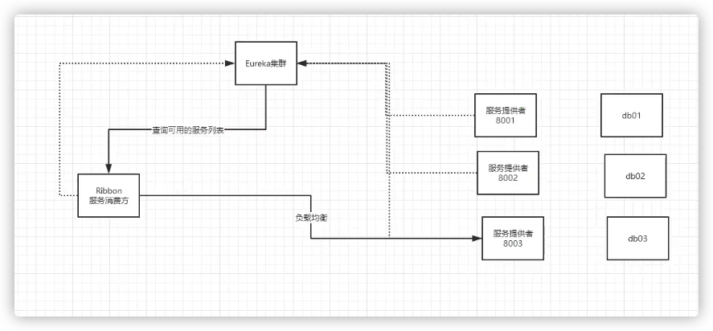


1. 新建两个数据库db02、db03，并分别创建相同表和数据：

```mysql
CREATE TABLE `dept` (
  `deptno` bigint NOT NULL AUTO_INCREMENT,
  `dname` varchar(60) DEFAULT NULL,
  `db_source` varchar(60) DEFAULT NULL,
  PRIMARY KEY (`deptno`)
) ENGINE=InnoDB AUTO_INCREMENT=1 DEFAULT CHARSET=utf8mb3 COMMENT='部门表';


insert into dept (dname, db_source) values ("开发部", Database());
insert into dept (dname, db_source) values ("人事部", Database());
insert into dept (dname, db_source) values ("财务部", Database());
insert into dept (dname, db_source) values ("市场部", Database());
insert into dept (dname, db_source) values ("运维部", Database());
```

2. 新建两个module，**springcloud-provider-dept-8002**，**springcloud-provider-dept-8003**；并复制8001的依赖；复制配置文件，修改端口号、数据库、Eureka默认的描述信息（instance-id）；复制mybatis配置文件；复制项目文件，修改启动类名称。

   这样三个模块除了数据库不同，其它完全相同。

3. 启动三个服务中心，三个服务提供者、一个消费者

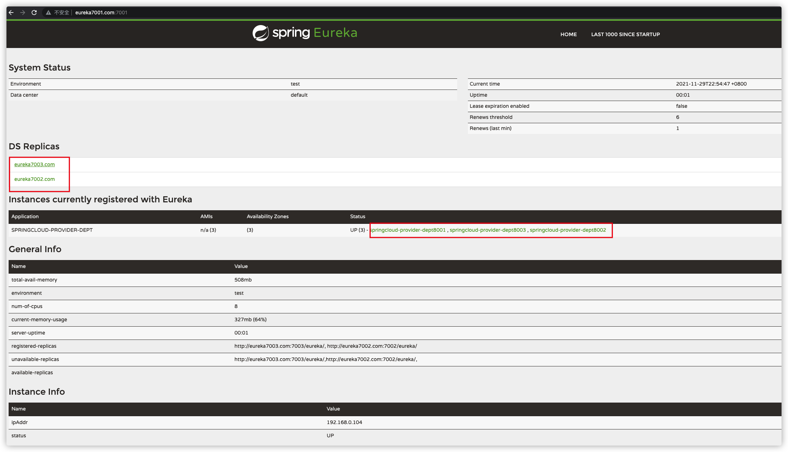

此时访问http://localhost/consumer/dept/list，数据会根据情况从不同服务提供者获取


### 自定义服务接口

`IRule`是ribbon负载均衡规则的接口，它有的几个实现类：

`RoundRobinRule` 轮询，默认的

`RandomRule`  随机

`AvailabilityFilteringRule` 会优先过滤掉，跳闸、访问故障的服务，对剩下的进行轮询

`RetryRule` 先轮询，如果失败，则在指定时间内重试


尝试修改默认的

```java
@Configuration
public class ConfigBean {

    /**
     * RestTemplate默认没有@Bean，没有交给spring容器管理，需要在此配置一下
     * @LoadBalanced Ribbon负载均衡
     */
    @Bean
    @LoadBalanced
    public RestTemplate getRestTemplate() {
        return new RestTemplate();
    }

    /**
     * 把默认的Ribbon负载均衡轮询方式，改为了随机。此时查询的数据就不是按固定顺序（db01、db02、db03）获取的，而是随机的。
     * IRule
     */
    @Bean
    public IRule myRule() {
        return new RandomRule();
    }
}
```


把自定义规则独立在包内：

1. 自定义ribbon规则文件`com.andyron.myrule.AndyRule`，注意它不在主应用程序的上下文，不被`@ComponentScan`扫描.

   ```java
   public class AndyRule {
   
       @Bean
       public IRule myRule() {
           return new AndyRandomRule();
       }
   }
   ```

2. 在主启动类添加注解`@RibbonClient`。

   ```java
   @SpringBootApplication
   @EnableEurekaClient
   @RibbonClient(name = "SPRINGCLOUD-PROVIDER-DEPT", configuration = AndyRule.class)  // 让启动时就能加载自定义的ribbon类
   public class DeptConsumer_80 {
       public static void main(String[] args) {
           SpringApplication.run(DeptConsumer_80.class, args);
       }
   }
   ```

3. 模仿`RandomRule` 自定义 `AndyRandomRule`

   ```java
   /**
    * 模仿RandomRule，自定义负载均衡规则
    * 自定义规则：每个服务访问5次，换下一个服务
    */
   public class AndyRandomRule extends AbstractLoadBalancerRule {
   
       private int total = 0;      // 被调用的次数
       private int currentIndex = 0; // 当前谁在提供服务
   
       @SuppressWarnings({"RCN_REDUNDANT_NULLCHECK_OF_NULL_VALUE"})
       public Server choose(ILoadBalancer lb, Object key) {
           if (lb == null) {
               return null;
           } else {
               Server server = null;
   
               while(server == null) {
                   if (Thread.interrupted()) {
                       return null;
                   }
   
                   List<Server> upList = lb.getReachableServers();  // 获得活着的服务
                   List<Server> allList = lb.getAllServers();  // 获得全部的服务
                   int serverCount = allList.size();
                   if (serverCount == 0) {
                       return null;
                   }
   
   //                int index = this.chooseRandomInt(serverCount);  // 生成区间随机数
   //                server = (Server)upList.get(index);     // 从活着的服务，随机获取一个
   
                  // 自定义算法规则==============<
                   if (total < 5) {
                       server = upList.get(currentIndex);
                       total++;
                   } else {
                       total = 0;
                       currentIndex++;
                       if (currentIndex >= upList.size()) {
                           currentIndex = 0;
                       }
                       server = upList.get(currentIndex);
                   }
                   // =====================>
   
                   if (server == null) {
                       Thread.yield();
                   } else {
                       if (server.isAlive()) {
                           return server;
                       }
   
                       server = null;
                       Thread.yield();
                   }
               }
   
               return server;
           }
       }
   
       protected int chooseRandomInt(int serverCount) {
           return ThreadLocalRandom.current().nextInt(serverCount);
       }
   
       @Override
       public Server choose(Object key) {
           return this.choose(this.getLoadBalancer(), key);
       }
   
       @Override
       public void initWithNiwsConfig(IClientConfig clientConfig) {
       }
   }
   ```


## 7、Feign负载均衡

### 7.1 简介

feign是声明式的web service客户端，它让微服务之问的调用变得更简单了，类似controller调用service。 SpringCloud集成了Ribbon和Eureka，可在使用Feign时提供负载均衡的http客户端。
只需要创建一个接口，然后添加注解即可！

feign[fen]，主要是社区，大家都习惯面向接口编程。这个是很多开发人员的规范。调用微服务访问两种方法

1. 微服务名字 【ribbon】
2. 接口和注解【feign 】

#### Feign能干什么？

- Feign旨在使编写Java Http客户端变得更容易
- 前面在使用Ribbon + RestTemplate时，利用RestTemplate对Http请求的封装处理，形成了一套模板化的调用方法。但是在实际开发中，由于对服务依赖的调用可能不止一处，往往一个接口会被多处调用，所以通常都会针对每个微服务自行封装一些客户端类来包装这些依赖服务的调用。所以，Feign在此基础上做了进一步封装，由他来帮助我们定义和实现依赖服务接口的定义，**在Feign的实现下，我们只需要创建一个接口并使用注解的方式来配置它（类似于以前Dao接口上标注Mapper注解，现在是一个微服务接口上面标注一个Feign注解即可。）**即可完成对服务提供方的接口綁定，简化了使用Spring Cloud Ribbon时，自动封装服务调用客户端的开发量。

#### Feign集成了Ribbon

利用Ribbon维护了MicroServiceCloud-Dept的服务列表信息，并且通过轮询实现了客户端的负载均衡，而与Ribbon不同的是，通过Feign只需要定义服务绑定接口且以声明式的方法，优雅而且简单的实现了服务调用。

### 7.2 Feign的使用

1. 新建module**springcloud-consumer-dept-feign**，复制80中内容，去除ribbon相关内容（依赖，自定义负载均衡配置）。主启动类改为`FeignDeptConsumer_80`。

   ```java
   @SpringBootApplication
   @EnableEurekaClient
   @EnableFeignClients(basePackages = {"com.andyron.springcloud"})
   @ComponentScan("com.andyron.springcloud")
   public class FeignDeptConsumer_80 {
       public static void main(String[] args) {
           SpringApplication.run(FeignDeptConsumer_80.class, args);
       }
   }
   ```

2. 在module **springcloud-api**导入feign依赖

   ```xml
   <!-- feign -->
   <dependency>
     <groupId>org.springframework.cloud</groupId>
     <artifactId>spring-cloud-starter-openfeign</artifactId>
     <version>2.2.10.RELEASE</version>
   </dependency>
   ```

3. 在**springcloud-api**中新建service`DeptClientService`

   ```java
   @Component
   @FeignClient(value = "SPRINGCLOUD-PROVIDER-DEPT")
   public interface DeptClientService {
   
       @GetMapping("/dept/get/{id}")
       public Dept queryById(@PathVariable("id") Long id);
   
       @GetMapping("/dept/list")
       public List<Dept> queryAll();
   
       @PostMapping("/dept/add")
       public boolean addDept(Dept dept);
   }
   ```

4. 修改**springcloud-consumer-dept-feign**的controller：

   ```java
   @RestController
   public class DeptConsumerController {
   
       @Autowired
       private DeptClientService service = null;
   
       @RequestMapping("/consumer/dept/get/{id}")
       public Dept get(@PathVariable("id") Long id) {
           return this.service.queryById(id);
       }
   
       @RequestMapping("/consumer/dept/add")
       public Boolean add(Dept dept) {
           return this.service.addDept(dept);
       }
   
       @RequestMapping("/consumer/dept/list")
       public List<Dept> list() {
           return this.service.queryAll();
       }
   }
   ```

5. 启动测试


## 8、Hystrix

[Hystrix](https://github.com/Netflix/Hystrix)

Hystrix [hɪst'rɪks]，中文含义是豪猪，因其背上长满棘刺，从而拥有了自我保护的能力。

### 分布式系统面临的问题

复杂分布式体系结构中的应用程序有数十个依赖关系，每个依赖关系在某些时候将不可避免的失败！

#### 服务雪崩

多个微服务之间调用的时候，假设微服务A调用微服务B和微服务C，微服务B 和微服务C又调用其他的微服务，这就是所谓的“扇出〞如果扇出的链路上某个微服务的调用响应时问过长或者不可用，对微服务A的调用就会占用越来越多的系统资源，进而引起系统崩溃，所谓的"**雪崩效应**”。

对于高流量的应用来说，单一的后端依赖可能会导致所有服务器上的所有资源都在几秒中内饱和。比失败更糟糕的是，这些应用程序还可能导致服务之间的延迟增加，备份队列，线程和其他系统资源紧张，导致整个系统发生更多的级联故障，这些都表示需要对故障和延迟进行隔离和管理，以便单个依赖关系的失败，不能取消整个应用程序或系统。

我们需要•弃车保帅

### 什么是Hystrix

Hystrix是一个用于处理分布式系统的延迟和容错的开源库，在分布式系统里，许多依赖不可避免的会调用失
败，比如超时，异常等，Hystrix**能够保证在一个依赖出问题的情况下，不会导致整体服务失败，避免级联故障以提高分布式系统的弹性。**

“断路器” 本身是一种开关装置，当某个服务单元发生故障之后，通过断路器的故障监控（类似熔断保险丝），**向调用方返回一个服务预期的，可处理的备选响应 (FallBack) ，而不是长时间的等待或者抛出调用方法无法处理的异常，这样就可以保证了服务调用方的线程不会被长时间**，不必要的占用，从而避免了故障在分布式系统中的蔓延，乃至雪崩。

#### Hystrix能干嘛

- 服务降级
- 服务熔断
- 服务限流
- 接近实时的监控
- ...

在分布式系统中，不可避免地会出现许多依赖的服务不可用的情况。Hystrix通过实现容错和延时容忍逻辑来实现对相互依赖的分布式服务的控制。Hystrix主要通过隔离服务的调用，阻止级联的服务调用失败以及提供降级策略来提升系统的整体可伸缩性（resiliency）。

Hystrix 在2011年开始由Netflix的API团队开发，并逐渐在Netflix内部得到广泛使用。

分布式系统中存在众多的服务，每个服务都难免出现不可用的情况。如果主应用（关注的应用）没有和这些不可用的服务隔离，将遭受被这些服务拖垮的危险。

例如，对于一个依赖30个可用性为99.99%服务的应用，其本身的可用性将是：

> 0.9999^30=99.7%
>
> 这意味着，10,000,000次前端中，将有30,000次失败
>
> 每个月中，应用不可用的时间将至少是2小时

实际情况往往比这更差。

在一切都正常时，客户发来的请求的调用示意如下：

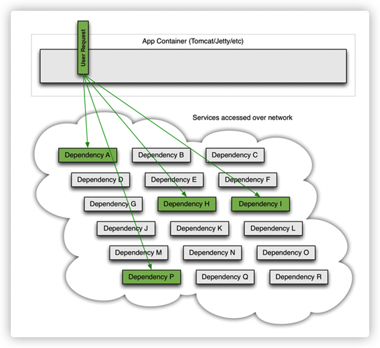

当某一个后台服务出现超时，或者不可用，它将阻塞整个请求：

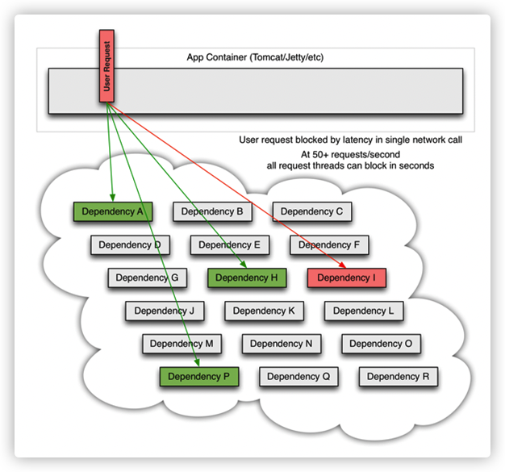

对于访问量大的后台服务，如果一旦出现超时，数秒内整个应用的系统资源可能会被立刻耗尽。

在应用中，任何一个通过网络实现的外部调用都是可能失败的。更甚的是，这些不可用的服务，将会逐渐耗尽所有调用其提供服务的其他应用的资源，最终可能导致整个系统的雪崩。

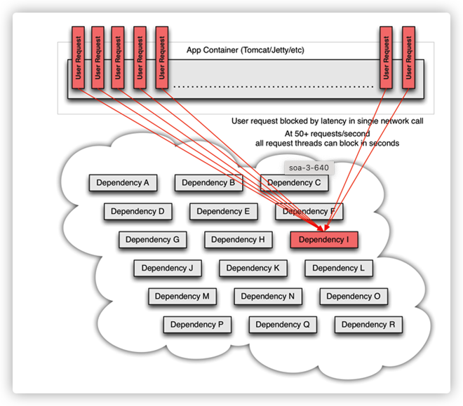

对于通过第三方组件实现网络访问的情况，这种问题更加严重。第三方组件对于应用来说是一个黑盒，其实现细节不可见，对于不同的客户端组件，网络和资源的配置情况各不相同，并且通常难以修改和监控。

更糟糕的是，还可能存在那些我们并不知道的由第三方组件引入的可变的依赖，引起巨大的网络资源消耗或者错误的远程调用。

网络不可用；服务或者节点失效；新组件引入的功能改变；组件的bug。凡此种种，都是需要隔离起来的错误，避免一个服务的不可用导致整个应用或者系统的不可用。

#### Hystrix 遵循的设计原则：

- 防止单个依赖耗尽整个容器用户线程。
- 采用去掉负荷和快速失败，而不是排队
- 在任何可行的情况下通过降级避免失败
- 通过隔离策略（隔离舱bulkhead,泳道swimlan,断路器circuit break 设计模式）来限制单个依赖可能引起的影响
- 通过近实时的指标、监控和告警来降低错误发现时间
- 配置修改快速生效，支持动态属性设置，提供实时修改配置功能
- 避免应用受到所有的依赖的失败带来的影响，而不只是网络拥堵

#### Hystrix如何实现其目标？

- 将对外部系统的调用封装到HystrixCommand或者HystrixObserverbalCommand对象中，此对象通常在独立的线程中执行（命令模式）
- 根据给定的配置，对于超过时间上上限的调用进行统计
- 对每个依赖维护一个线程池（或者信号量），当线程池满时，触发该依赖的请求将被直接拒绝，而不是排队等待
- 统计调用的成功、失败、超时、线程拒绝次数
- 当失败的调用超过一定预设的阈值后，在一定时间内触发熔断
- 在请求失败、拒绝、超时、或者熔断时，执行降级逻辑
- 对各项指标进行近实时的监控和配置修改

当采用Hystrix封装各依赖时，服务调用示意图如下：

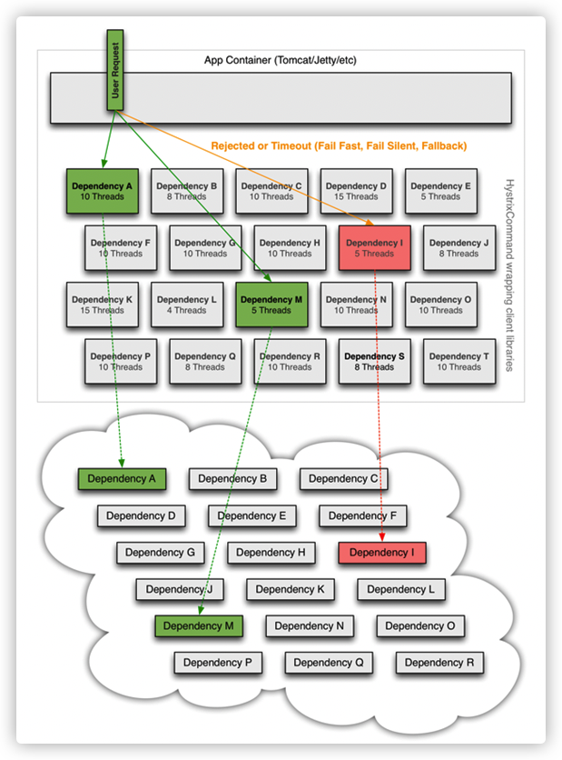


### 服务熔断

熔断机制是对应雪崩效应的一种微服务链路保护机制。
当扇出链路的某个微服务不可用或者响应时间太长时，会进行服务的降级，**进而熔析该节点微服务的调用，快速返回 错误的响应信息**。当检测到该节点微服务调用响应正常后恢复调用链路。在SpringCloud框架里熔断机制通过Hystrix实现。Hystrix会监控微服务问调用的状况，当失败的调用到一定國值，**默认是5秒内20次调用失败就会启动熔断机制。**熔断机制的注解是 `@HystrixCommand`。


### 服务熔断实现

1. 新建module **springcloud-provider-dept-hystrix-8001**，复制服务提供者**springcloud-provider-dept-8001**相关内容。

   依赖中多添加一个hystrix依赖：

   ```xml
   <dependency>
     <groupId>org.springframework.cloud</groupId>
     <artifactId>spring-cloud-starter-netflix-hystrix</artifactId>
     <version>1.4.6.RELEASE</version>
   </dependency>
   ```

   启动类修改为`DeptProviderHystrix_8001`。

   配置文件做相关修改。

2. 在要熔断的方法指定，熔断后调用的方法

   ```java
   @RestController
   public class DeptController {
   
       @Autowired
       private DeptService service;
   
       @GetMapping("/dept/get/{id}")
       @HystrixCommand(fallbackMethod = "HystrixGet")
       public Dept get(@PathVariable("id") Long id) {
           Dept dept = service.queryById(id);
           if (dept == null) {
               throw new RuntimeException("id=>" + id + ", 不存在该用户，或者信息无法找到");
           }
           return dept;
       }
   
       /**
        * 备选方法
        */
       public Dept HystrixGet(@PathVariable("id") Long id) {
           return new Dept()
                   .setDeptno(id)
                   .setDname("id=>" + id + "没有对应的信息, null--@Hystrix")
                   .setDb_source("no this database in MySQL");
       }
   }
   ```

3. 在启动类`DeptProviderHystrix_8001`添加注解`@EnableCircuitBreaker`(新版本有所不同)，实现对服务熔断的支持。

4. 启动测试，当请求id不存在时，就会调用`HystrixGet`方法


### 服务降级

**客服端**

服务降级，当服务器压力剧增的情况下，根据当前业务情况及流量对一些服务和页面有策略的降级，以此释放服务器资源以保证核心任务的正常运行。比如电商平台，在针对618、双11等高峰情形下采用部分服务不出现或者延时出现的情形。

有些服务整体不要用，就忍痛关掉，把资源给需要的：

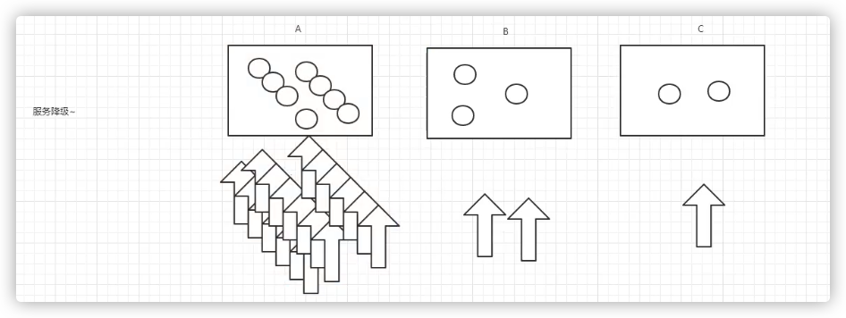


在A服务请求很多时，可以考虑把B、C先关掉，把资源让给A服务


测试

1. 在**springcloud-api**，中添加一个实现`FallbackFactory`  的类`DeptClientServiceFallbackFactory`：

   ```java
   /**
    * 服务降级
    */
   @Component
   public class DeptClientServiceFallbackFactory implements FallbackFactory {
   
       /**
        * 失败就创建DeptClientService
        */
       @Override
       public DeptClientService create(Throwable throwable) {
           return new DeptClientService() {  // 匿名内部类
               @Override
               public Dept queryById(Long id) {
                   return new Dept()
                           .setDeptno(id)
                           .setDname("id=>" + id + "没有对应的信息，客户端提供了降级的信息，这个服务现在已经被关闭")
                           .setDb_source("没有数据");
               }
   
               @Override
               public List<Dept> queryAll() {
                   return null;
               }
   
               @Override
               public boolean addDept(Dept dept) {
                   return false;
               }
           };
       }
   }
   ```

2. 在`DeptClientService`上的注解`@FeignClient`中添加`fallbackFactory`参数，来实现服务降级时的执行类 

   ```java
   @FeignClient(value = "SPRINGCLOUD-PROVIDER-DEPT", fallbackFactory = DeptClientServiceFallbackFactory.class)
   ```

3. 测试

   - 在**springcloud-consumer-dept-feign**

     ```yaml
     # 开启 feign.hystrix
     feign:
       hystrix:
         enabled: true
     ```

   - 开启服务注册中心7001等，开启服务提供者8001，启动**springcloud-consumer-dept-feign**，http://localhost/consumer/dept/get/1能正常访问

   - 关闭服务提供者8001，访问结果为

     ```json
     {"deptno":1,"dname":"id=>1没有对应的信息，客户端提供了降级的信息，这个服务现在已经被关闭","db_source":"没有数据"}
     ```

### 服务熔断 vs 服务降级

服务熔断：服务端；某个服务超时或异常，引起熔断，保险丝。

服务降级：客户端；从整体网站请求负载考虑，当某个服务熔断或者关闭之后，服务将不在被调用；此时在客户端，可以准备一个FallbackFactory，返回一个默认的值，当然这样整体服务水平下降了，但是好歹能用，比直接挂掉强。

### 监控

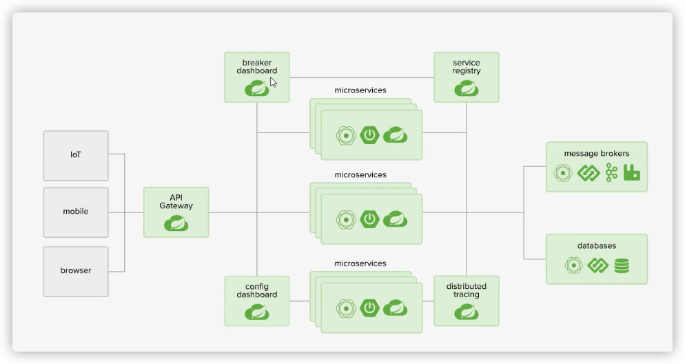

1. 新建module，**springcloud-consumer-hystrix-dashboard**

2. 复制80的依赖，添加新依赖：

```xml
<!-- hystrix -->
<dependency>
  <groupId>org.springframework.cloud</groupId>
  <artifactId>spring-cloud-starter-netflix-hystrix</artifactId>
  <version>1.4.6.RELEASE</version>
</dependency>
<dependency>
  <groupId>org.springframework.cloud</groupId>
  <artifactId>spring-cloud-starter-netflix-hystrix-dashboard</artifactId>
  <version>1.4.6.RELEASE</version>
</dependency>
```

3. 添加配置文件

   ```yaml
   server:
     port: 9001
   ```

4. 添加主启动类：

   ```java
   @SpringBootApplication
   @EnableHystrixDashboard
   public class DeptConsumerDashboard_9001 {
       public static void main(String[] args) {
           SpringApplication.run(DeptConsumerDashboard_9001.class, args);
       }
   }
   ```

5. 保证服务提供者8001等中有监控的依赖

   ```xml
   <!-- actuator完善监控信息 -->
   <dependency>
     <groupId>org.springframework.boot</groupId>
     <artifactId>spring-boot-starter-actuator</artifactId>
   </dependency>
   ```

6. 启动`DeptConsumerDashboard_9001`，访问http://localhost:9001/hystrix

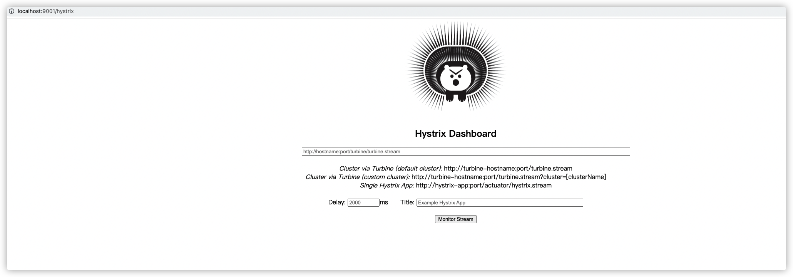

监控的地址、多长时间监控一次、监控实例的名字

7. 在**springcloud-provider-dept-hystrix-8001**的启动类中添加Servlet，并开启8001

   ```java
   @SpringBootApplication
   @EnableEurekaClient
   @EnableDiscoveryClient
   @EnableCircuitBreaker
   public class DeptProviderHystrix_8001 {
       public static void main(String[] args) {
           SpringApplication.run(DeptProviderHystrix_8001.class, args);
       }
   
       /**
        * 添加一个Servlet
        */
       @Bean
       public ServletRegistrationBean servletRegistrationBean() {
           ServletRegistrationBean registrationBean = new ServletRegistrationBean(new HystrixMetricsStreamServlet());
           registrationBean.addUrlMappings("/actuator/hystrix.stream");
           return registrationBean;
       }
   }
   ```

8. 先访问一下http://localhost:8001/dept/get/1 查看是否能访问，然后访问http://localhost:8001/actuator/hystrix.stream ：

   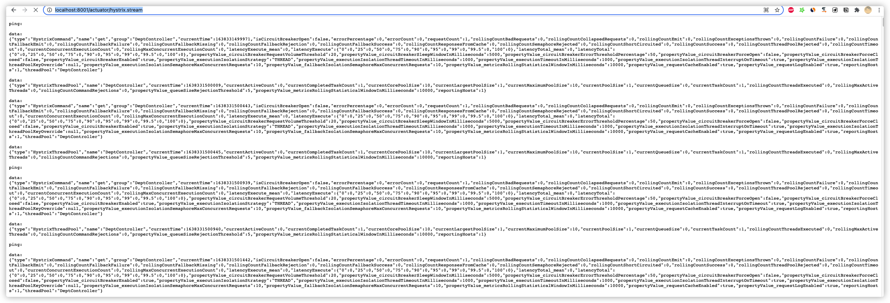

9. 在http://localhost:9001/hystrix中填写相关数据（http://localhost:8001/actuator/hystrix.stream，2000，demo），得到监控页面，这个页面的数据，会随着http://localhost:8001/dept/get/1 的访问而变化

   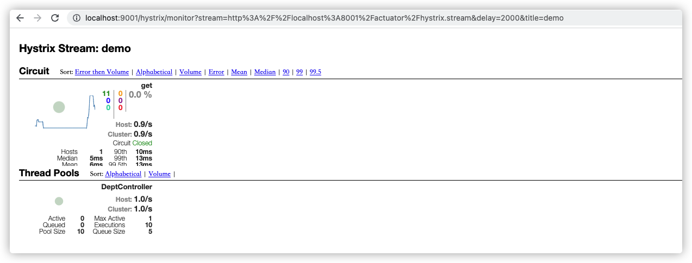

#### 监控页面分析

整图说明：

 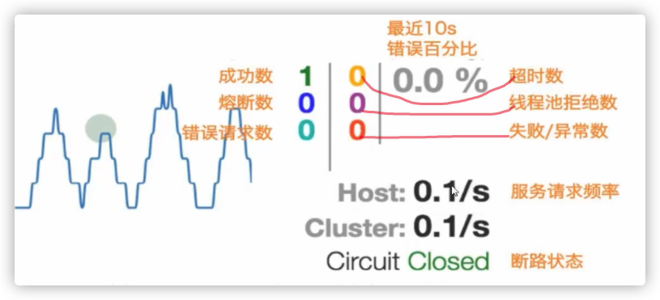

##### 七色

##### 圆圈

颜色表示健康程度，绿色 黄色 橙色 红色，健康程度递减

圆的大小表示流量大小

##### 曲线

记录2分钟内流量的相对变化，可以用来观察流量的上升和下降趋势。


复杂一点的

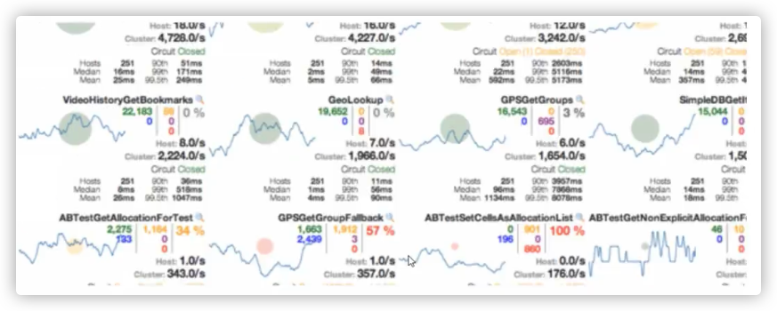


## 9、Zuul路由网关

### 概述

https://github.com/Netflix/zuul

zuul包含了对请求的**路由和过滤**两个最主要的功能：
其中路由功能负责将外部请求转发到具体的微服务实例上，是实现外部访问统一入口的基础，而过滤器功能则负责对请求的处理过程进行干预，是实现请求校验，服务聚合等功能的基础。Zuul和Eureka进行整合，将zuul自身注册为Eureka服务治理下的应用，同时从Eureka中获得其他微服务的消息，也即以后的访问微服务都是通过Zuul跳转后获得。

注意：Zuul服务最终还是会注册进Eureka。 
提供：代理＋路由＋过滤 三大功能！


### 实践

1. 新建module，**springcloud-zuul-9527**，复制**springcloud-consumer-hystrix-dashboard**的依赖，并添加新依赖：

   ```xml
   <!-- zuul -->
   <dependency>
     <groupId>org.springframework.cloud</groupId>
     <artifactId>spring-cloud-starter-netflix-zuul</artifactId>
   </dependency>
   ```

2. 新建配置文件

   ```yaml
   server:
     port: 9527
   
   spring:
     application:
       name: springcloud-zuul-gateway
   
   eureka:
     client:
       service-url:
         defaultZone: http://eureka7001.com:7001/eureka/,http://eureka7002.com:7002/eureka/,http://eureka7003.com:7003/eureka/
     instance:
       instance-id: zuul9527.com
       prefer-ip-address: true
   
   info:
     app.name: andyron-springcloud
     company.name: andyron.com
   ```

3. 新建主启动类

   ```java
   @SpringBootApplication
   @EnableZuulProxy
   public class ZuulApplication_9527 {
       public static void main(String[] args) {
           SpringApplication.run(ZuulApplication_9527.class, args);
       }
   }
   ```

4. 启动7001等注册中心，启动**springcloud-provider-dept-hystrix-8001**，启动9527

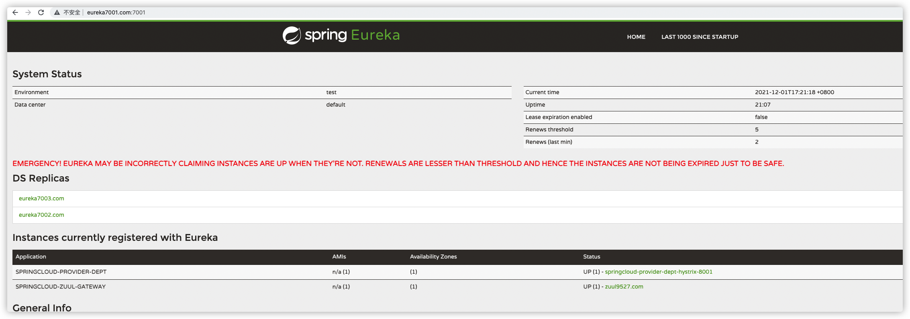

正常通过http://localhost:8001/dept/get/1可以访问，先在可通过网关访问http://localhost:9527/springcloud-provider-dept/dept/get/1

可在配置文件配置，把微服务名springcloud-provider-dept隐藏起来：

```yaml
zuul:
  routes:
    mydept.serviceId: springcloud-provider-dept
    mydept.path: /mydept/**
  ignored-services: springcloud-provider-dept  # 不能再使用这个路径访问了
#  ignored-services: *  # 隐藏全部微服务名
#   prefix: /andy   # 设置公共的前缀
```

此时可用http://localhost:9527/mydept/dept/get/1访问


## 10、SpringCloud config分布式配置

### 概述

分布式系统面临的--**配置文件的问题**
微服务意味着要将单体应用中的业务拆分成一个个子服务，每个服务的粒度相对较小，因此系统中会出现大量的服务，由于每个服务都需要必要的配置信息才能运行，所以一套集中式的，动态的配置管理设施是必不可少的。
SpringCloud提供了ConfigServer来解决这个问题，我们每一个微服务自己带着一个application.yml，那上百的的配置文件要修改起来，岂不是要发疯！

#### 什么是SpringCloud config分布式配置中心

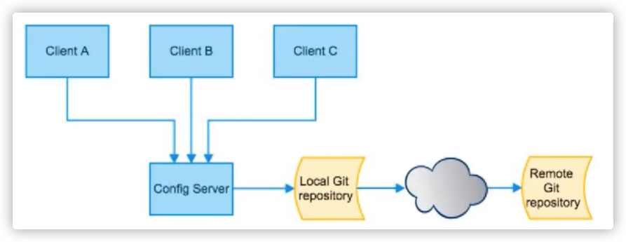

Spring Cloud Config 为微服务架构中的微服务提供集中化的外部配置支持，配置服务器为**各个不同微服务应用**的所有环节提供了一个**中心化的外部配置**。

Spring Cloud Config 分为**服务端**和**客户端**两部分；

服务端也称为 分布式配置中心， 它是一个独立的微服务应用，用来连接配置服务器并为客户端提供获取配置信息，加密，解密信息等访问接口。
客户端则是通过指定的配置中心来管理应用资源，以及与业务相关的配置内容，并在启动的时候从配置中心获取和加载配置信息。配置服务器默认采用git来存储配置信息，这样就有助于对环境配置进行版本管理。并且可以通过git客户端工具来方便的管理和访问配置内容。

#### SpringCloud config分布式配置中心能干嘛

- 集中管理配置文件
- 不同环境，不同配置，动态化的配置更新，分环境部署，比如 /dev /test/ /prod /beta /release
- 运行期间动态调整配置，不再需要在每个服务部署的机器上编写配置文件，服务会向配置中心统一拉取配置自己的信息。
- 当配置发生变动时，服务不需要重启，即可感知到配置的变化，并应用新的配置
- 将配置信息以REST接口的形式暴露


#### SpringCloud config分布式配置中心与github整合

由于Spring Cloud Config 默认使用Git来存储配置文件（也有其他方式，比如支持SVN和本地文件），但是最推荐的还是Git，而且使用的是http / https 访问的形式；


### 在码云新建项目

1. 在码云新建项目 **springcloud-config** 

2. `git clone`到本地

3. 新建`application.yml`

   ```yaml
   spring:
     profiles:
       active: dev
   
   ---
   spring:
     profiles: dev
     application: 
       name: springcloud-config-dev
   
   ---
   spring:
     profiles: test
     application: 
       name: springcloud-config-test
   ```

4. 提交

   ```bash
   git add .
   git commit -m "first commit"
   git push origin master
   ```

### 实践-spring cloud config服务端

1. 新建module，**springcloud-config-server-3344**，添加依赖

   ```xml
   <dependencies>
     <dependency>
       <groupId>org.springframework.boot</groupId>
       <artifactId>spring-boot-starter-web</artifactId>
     </dependency>
     <dependency>
       <groupId>org.springframework.cloud</groupId>
       <artifactId>spring-cloud-config-server</artifactId>
       <version>2.1.1.RELEASE</version>
     </dependency>
   </dependencies>
   ```

2. 编写配置文件：

   ```yaml
   server:
   	port: 3344
   
   spring:
   	application:
   		name: springcloud-config-server
   	cloud:
   		config:
   			server:
   				git:
   					uri: https://gitee.com/andyron/springcloud-config.git
   ```

3. 编写主启动类

   ```java
   @SpringBootApplication
   @EnableConfigServer
   public class ConfigServer_3344 {
       public static void main(String[] args) {
           SpringApplication.run(ConfigServer_3344.class, args);
       }
   }
   ```

4. 启动，现在就可以通过http://localhost:3344/application-dev.yml （url格式有多种，参考手册），访问到码云application.yml中对应的配置信息：

   ```yaml
   spring:
     application:
       name: springcloud-config-dev
     profiles:
       active: dev
   ```


### 实践-spring cloud config客户端

1. 在码云的项目**springcloud-config** 中新建文件**config-client.yml**，并推送到远程：

```yaml
spring:
  profiles:
    active: dev

---
server:
  port: 8201
spring:
  profiles: dev
  application:
    name: springcloud-provider-dept

eureka:
  client:
    service-url:
      defaultZone: http://eureka7001.com:7001/eureka/,http://eureka7002.com:7002/eureka/,http://eureka7003.com:7003/eureka/

---
server:
  port: 8202
spring:
  profiles: test
  application:
    name: springcloud-provider-dept

eureka:
  client:
    service-url:
      defaultZone: http://eureka7001.com:7001/eureka/,http://eureka7002.com:7002/eureka/,http://eureka7003.com:7003/eureka/
```

2. 新建module，**springcloud-config-client-3355**

3. 添加依赖

   ```xml
   <dependencies>
     <dependency>
       <groupId>org.springframework.boot</groupId>
       <artifactId>spring-boot-starter-web</artifactId>
     </dependency>
   
     <dependency>
       <groupId>org.springframework.cloud</groupId>
       <artifactId>spring-cloud-starter-config</artifactId>
       <version>2.1.1.RELEASE</version>
     </dependency>
   </dependencies>
   ```

4. 添加配置文件。

   `bootstrap.yml`(系统级别的配置，优先级别比用户级别配置要高)：

   ```yaml
   # 系统级别的配置
   
   spring:
   	cloud:
   		config:
   			name: config-client  # 需要从git上读取的资源名称，不要后缀
   			profile: dev
   			label: master
   			uri: http://localhost:3344
   ```

   `application.yml`（用户级别配置）

   ```yaml
   # 用户级别的配置
   
   spring:
   	application:
   		name: springcloud-config-client-3355
   ```

5. 添加启动类

6. 添加控制器

   ```java
   @RestController
   public class ConfigClientController {
   
       @Value("${spring.application.name}")
       private String applicationName;
   
       @Value("${eureka.client.service-url.defaultZone}")
       private String eurekaServer;
   
       @Value("${server.port}")
       private String port;
   
       @GetMapping("/config")
       public String getConfig() {
           return "applicationName = " + applicationName + ", eurekaServer = " + eurekaServer + ", port = " + port;
       }
   }
   ```

7. 启动，访问http://localhost:8201/config（端口号也是读取的git中的）可获得远程配置

    

这样就实现了配置和代码的解耦，修改配置不需要更新代码。

### 远程配置实战测试

1. 在码云的项目**springcloud-config** 中新建文件**config-eureka.yml**(**springcloud-eureka-7001**中的配置)，**config-dept.yml**（**springcloud-provider-dept-8001**中的配置）


2.  为了不影响之后查看看， 新建module，**springcloud-config-eureka-7001**，作为7001的改造项目；拷贝7001的内容；设置依赖，配置文件；

   **bootstrap.yml**

   ```yaml
   spring:
     cloud:
       config:
         name: config-eureka  # 需要从git上读取的资源名称，不要后缀
         profile: dev
         label: master
         uri: http://localhost:3344
   ```

   **application.yml**

   ```yaml
   spring:
     application:
       name: springcloud-config-eureka-7001
   ```

   

3. 启动3344（测试 http://localhost:3344/master/config-eureka-dev.yml），

   启动**springcloud-config-eureka-7001**，能访问到http://localhost:7001/，说明已经读取远程配置了

4. 再新建一个module，**springcloud-config-dept-8001**，类似上面的操作，拷贝**springcloud-provider-dept-8001**的内容；设置依赖，配置文件;
5. 启动**springcloud-config-dept-8001**，查看http://localhost:7001/，发现服务已经注册，访问http://localhost:8001/dept/get/1，可获得数据


## 总结

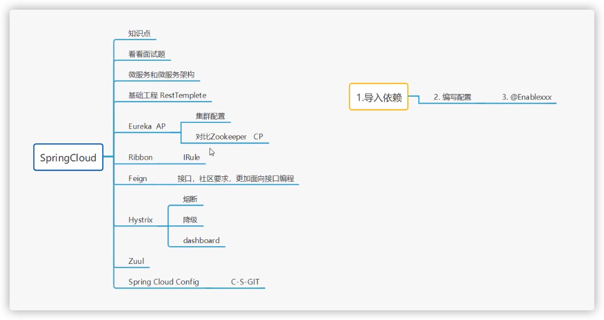

Spring cloud 面试题
