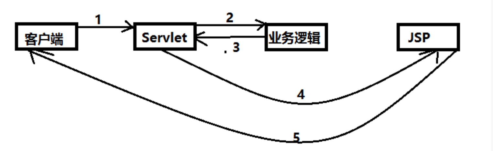
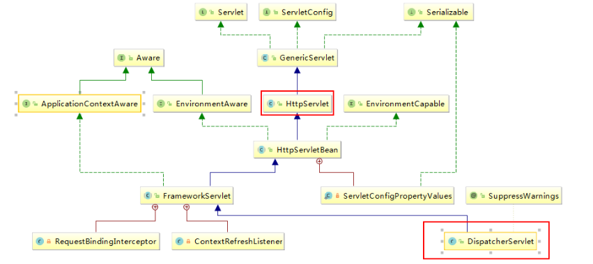
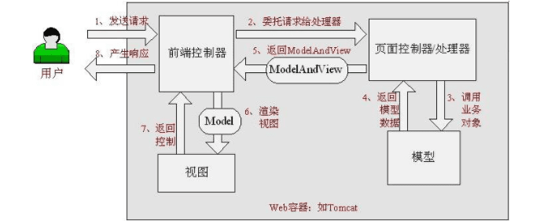
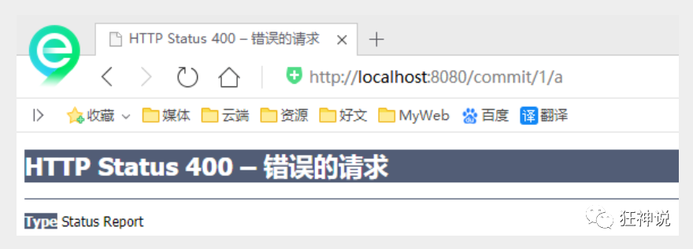
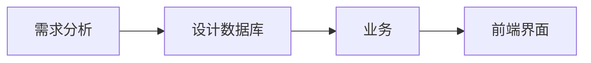
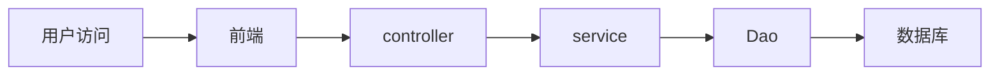

SpringMVC
--------------

[【狂神说Java】SpringMVC最新教程IDEA版通俗易懂](https://www.bilibili.com/video/BV1aE41167Tu)

ssm：mybatis + Spring + SpringMVC  **MVC三层框架**

JavaSE：认真学习，老师带，人们快

JavaWeb：认真学习，老师带，人们快

SSM框架：研究官方文档，锻炼自学能力，锻炼笔记能力，锻炼项目能力

[SpringMVC文档](https://docs.spring.io/spring-framework/docs/current/reference/html/web.html)

**SpringMVC的执行流程**

SSM框架整合

Spring所有版本的下载地址：https://repo.spring.io/ui/native/release/org/springframework/spring

Spring系列所有框架的所有版本下载地址：https://repo.spring.io/ui/native/release/org/springframework/

## 回顾MVC

MVC：模型（dao，service）， 视图（jsp）， 控制器（Servlet）（转发、重定向）

### 什么是MVC？

- MVC是模型(Model)、视图(View)、控制器(Controller)的简写，是一种软件设计规范。
- 是将业务逻辑、数据、显示分离的方法来组织代码。
- MVC主要作用是**降低了视图与业务逻辑间的双向偶合**。
- MVC不是一种设计模式，**MVC是一种架构模式**。当然不同的MVC存在差异。


实体类 pojo：User 有的项目还会细分视图对象、数据传输对象等

vo：UserVo 

dto


JSP：本质就是一个Servlet


**Model（模型）：**数据模型，提供要展示的数据，因此包含数据和行为，可以认为是领域模型或JavaBean组件（包含数据和行为），不过现在一般都分离开来：Value Object（数据Dao） 和 服务层（行为Service）。也就是模型提供了模型数据查询和模型数据的状态更新等功能，包括数据和业务。

**View（视图）：**负责进行模型的展示，一般就是我们见到的用户界面，客户想看到的东西。

**Controller（控制器）：**接收用户请求，委托给模型进行处理（状态改变），处理完毕后把返回的模型数据返回给视图，由视图负责展示。 也就是说控制器做了个调度员的工作。

**最典型的MVC就是JSP + servlet + javabean的模式。**

### Model1时代

### Model2时代

Model2把一个项目分成三部分，包括**视图、控制、模型。**




1. 用户发请求
2. Servlet接收请求数据，并调用对应的业务逻辑方法
3. 业务处理完毕，返回更新后的数据给servlet
4. servlet转向到JSP，由JSP来渲染页面
5. 响应给前端更新后的页面

**职责分析：**

**Controller：控制器**

1. 取得表单数据
2. 调用业务逻辑
3. 转向指定的页面

**Model：模型**

1. 业务逻辑
2. 保存数据的状态

**View：视图**

显示页面

Model2这样不仅提高的代码的复用率与项目的扩展性，且大大降低了项目的维护成本。Model 1模式的实现比较简单，适用于快速开发小规模项目，Model1中JSP页面身兼View和Controller两种角色，将控制逻辑和表现逻辑混杂在一起，从而导致代码的重用性非常低，增加了应用的扩展性和维护的难度。Model2消除了Model1的缺点。

### 回顾Servlet

- 建立正常的maven项目SpringMVC，导入一些依赖，
- 再创建子项目springmvc-01
- 右击子项目，**Add Framework Support..**， 添加web框架支持
- 导入子项目中servlet和jsp依赖

```xml
<dependency>
  <groupId>javax.servlet</groupId>
  <artifactId>servlet-api</artifactId>
  <version>2.5</version>
</dependency>
<dependency>
  <groupId>javax.servlet.jsp</groupId>
  <artifactId>jsp-api</artifactId>
  <version>2.2</version>
</dependency>
```

- 创建一个`HttpServlet`的子类

```java
public class HelloServlet extends HttpServlet {
    @Override
    protected void doGet(HttpServletRequest req, HttpServletResponse resp) throws ServletException, IOException {
        // 1 获取前端参数
        String method = req.getParameter("method");
        if (method.equals("add")) {
            req.getSession().setAttribute("msg", "执行了add方法");
        }
        if (method.equals("delete")) {
            req.getSession().setAttribute("msg", "执行了delete方法");
        }
        // 2 调用业务层

        // 3 视图转发或重定向
        req.getRequestDispatcher("/WEB-INF/jsp/test.jsp").forward(req, resp);
    }
    @Override
    protected void doPost(HttpServletRequest req, HttpServletResponse resp) throws ServletException, IOException {
        doGet(req, resp);
    }
}
```

- 在web.xml中注册servlet

```xml
    <servlet>
        <servlet-name>hello</servlet-name>
        <servlet-class>com.andyron.servlet.HelloServlet</servlet-class>
    </servlet>
    <servlet-mapping>
        <servlet-name>hello</servlet-name>
        <url-pattern>/hello</url-pattern>
    </servlet-mapping>

```

- 配置Tomcat服务器
- 运行 http://localhost:8080/hello?method=add


### MVC框架要做哪些事情：

1. 将url映射到java类或java类的方法

2. 封装用户提交的数据

3. 处理请求——调用相关的业务处理——封装响应数据

4. 将响应的数据进行渲染jsp/html等表示层数据


> 常见的服务器端MVC框架有：Struts、Spring MVC、ASP.NET MVC、Zend Framework、JSF；
>
> 常见前端MVC框架：vue、angularjs、react、backbone；
>
> 由MVC演化出了另外一些模式如：MVP、MVVM 等等....

## 初始SpringMVC

Spring MVC是Spring Framework的一部分，底层还是Servlet。

> Spring Web MVC is the original web framework built on the Servlet API and has been included in the Spring Framework from the very beginning. The formal name, “Spring Web MVC,” comes from the name of its source module ([`spring-webmvc`](https://github.com/spring-projects/spring-framework/tree/master/spring-webmvc)), but it is more commonly known as “Spring MVC”.


Spring:大杂烩，可以将SpringMVC中所有要用到的bean，注册到Spring中！

Spring MVC的特点：

1. 轻量级，简单易学
2. 高效 , 基于请求响应的MVC框架
3. 与Spring兼容性好，无缝结合
4. 约定优于配置
5. 功能强大：RESTful、数据验证、格式化、本地化、主题等
6. 简洁灵活

Spring的web框架围绕`DispatcherServlet`设计。

DispatcherServlet的作用是==将请求分发到不同的处理器==。

现在版本都可以采用基于注解形式进行开发，十分简洁。


Spring MVC框架像许多其他MVC框架一样, **==以请求为驱动==** , **围绕一个中心Servlet分派请求及提供其他功能**，**DispatcherServlet是一个实际的Servlet (它继承自HttpServlet基类)**。



### hellospring（配置版）

1. 新建一个Moudle ， springmvc-02-hello ， 添加web的支持！

2. 确定导入了SpringMVC的依赖！

3. 配置web.xml ， 注册DispatcherServlet

   ```xml
   <?xml version="1.0" encoding="UTF-8"?>
   <web-app xmlns="http://xmlns.jcp.org/xml/ns/javaee"
            xmlns:xsi="http://www.w3.org/2001/XMLSchema-instance"
            xsi:schemaLocation="http://xmlns.jcp.org/xml/ns/javaee http://xmlns.jcp.org/xml/ns/javaee/web-app_4_0.xsd"
            version="4.0">
       <!--1.注册DispatcherServlet-->
       <servlet>
           <servlet-name>springmvc</servlet-name>
           <servlet-class>org.springframework.web.servlet.DispatcherServlet</servlet-class>
           <!--关联一个springmvc的配置文件:【servlet-name】-servlet.xml-->
           <init-param>
               <param-name>contextConfigLocation</param-name>
               <param-value>classpath:springmvc-servlet.xml</param-value>
           </init-param>
           <!--启动级别-1-->
           <load-on-startup>1</load-on-startup>
       </servlet>
       <!--/ 匹配所有的请求；（不包括.jsp）-->
       <!--/* 匹配所有的请求；（包括.jsp）-->
       <servlet-mapping>
           <servlet-name>springmvc</servlet-name>
           <url-pattern>/</url-pattern>
       </servlet-mapping>
   </web-app>
   ```

4. 在resourcee、s目录下编写SpringMVC的配置文件：springmvc-servlet.xml

   ```xml
   <?xml version="1.0" encoding="UTF-8"?>
   <beans xmlns="http://www.springframework.org/schema/beans"
          xmlns:xsi="http://www.w3.org/2001/XMLSchema-instance"
          xsi:schemaLocation="http://www.springframework.org/schema/beans
           http://www.springframework.org/schema/beans/spring-beans.xsd">
   
       <!-- 添加 处理映射器 -->
       <bean class="org.springframework.web.servlet.handler.BeanNameUrlHandlerMapping"/>
   
       <!-- 添加 处理器适配器 -->
       <bean class="org.springframework.web.servlet.mvc.SimpleControllerHandlerAdapter"/>
   
   
       <!-- 添加视图解析器:DispatcherServlet给他的ModelAndView
       1. 获取了ModelAndView的数据
       2. 解析ModelAndView视图的名字
       3. 拼接视图名字，找到对应的视图，/WEB-INF/jsp/hello.jsp
       4. 将数据渲染到这个视图上
       -->
       <bean class="org.springframework.web.servlet.view.InternalResourceViewResolver" id="InternalResourceViewResolver">
           <!--前缀-->
           <property name="prefix" value="/WEB-INF/jsp/"/>
           <!--后缀-->
           <property name="suffix" value=".jsp"/>
       </bean>
   
   
       <!--Handler-->
       <bean id="/hello" class="com.andyron.controller.HelloController"/>
   </beans>
   ```

5. 编写操作业务Controller。

   ```java
   package com.andyron.controller;
   
   import org.springframework.web.servlet.ModelAndView;
   import org.springframework.web.servlet.mvc.Controller;
   
   import javax.servlet.http.HttpServletRequest;
   import javax.servlet.http.HttpServletResponse;
   
   public class HelloController implements Controller {
       public ModelAndView handleRequest(HttpServletRequest httpServletRequest, HttpServletResponse httpServletResponse) throws Exception {
           //ModelAndView 模型和视图
           ModelAndView mv = new ModelAndView();
           //封装对象，放在ModelAndView中。Model
           mv.addObject("msg","HelloSpringMVC!");
           //封装要跳转的视图，放在ModelAndView中
           mv.setViewName("hello"); //: /WEB-INF/jsp/hello.jsp
           return mv;
       }
   }
   
   ```

6. 将自己的类交给SpringIOC容器，注册bean

   ```xml
   <bean id="/hello" class="com.andyron.controller.HelloController"/>
   ```

6. 在**WEB-INF**目录添加jsp：`jsp/hello.jsp`

8. 配置Tomcat启动测试


### SpringMVC原理



**前端控制器**相当于DispatcherServlet，**页面控制器/处理器**相当于Controller。

SpringMVC的一个较完整的流程图，实线表示SpringMVC框架提供的技术，不需要开发者实现，虚线表示需要开发者实现：


简要分析执行流程

1. DispatcherServlet表示前置控制器，是整个SpringMVC的控制中心。用户发出请求，DispatcherServlet接收请求并拦截请求。
   - 我们假设请求的url为 : `http://localhost:8080/SpringMVC/hello`

   - 如上url拆分成三部分：

     `http://localhost:8080` 是服务器域名

     `SpringMVC` 是部署在服务器上的web站点

     `hello` 表示控制器

   - 通过分析，如上url表示为：请求位于服务器`localhost:8080`上的`SpringMVC`站点的`hello`控制器。

2. HandlerMapping为处理器映射。DispatcherServlet调用HandlerMapping，HandlerMapping根据请求url查找Handler。

3. HandlerExecution表示具体的Handler,其主要作用是根据url查找控制器，如上url被查找控制器为：hello。

4. HandlerExecution将解析后的信息传递给DispatcherServlet,如解析控制器映射等。

5. HandlerAdapter表示处理器适配器，其按照特定的规则去执行Handler。

6. Handler让具体的Controller执行。

7. Controller将具体的执行信息返回给HandlerAdapter,如`ModelAndView`。

8. HandlerAdapter将视图逻辑名或模型传递给DispatcherServlet。

9. DispatcherServlet调用视图解析器(ViewResolver)来解析HandlerAdapter传递的逻辑视图名。

10. 视图解析器将解析的逻辑视图名传给DispatcherServlet。

11. DispatcherServlet根据视图解析器解析的视图结果，调用具体的视图。

12. 最终视图呈现给用户。


### 使用注解开发SpringMVC

1. 新建一个module，**springmvc-03-hello-annotation**，添加web支持

2. 由于Maven可能存在资源过滤的问题，将配置完善

   ```xml
       <build>
           <resources>
               <resource>
                   <directory>src/main/java</directory>
                   <includes>
                       <include>**/*.properties</include>
                       <include>**/*.xml</include>
                   </includes>
                   <filtering>false</filtering>
               </resource>
               <resource>
                   <directory>src/main/resources</directory>
                   <includes>
                       <include>**/*.properties</include>
                       <include>**/*.xml</include>
                   </includes>
                   <filtering>false</filtering>
               </resource>
           </resources>
       </build>
   ```

3. 导入相关jar包（在符项目中已导入）

4. 编写web.xml , 注册DispatcherServlet

```xml
<?xml version="1.0" encoding="UTF-8"?>
<web-app xmlns="http://xmlns.jcp.org/xml/ns/javaee"
         xmlns:xsi="http://www.w3.org/2001/XMLSchema-instance"
         xsi:schemaLocation="http://xmlns.jcp.org/xml/ns/javaee http://xmlns.jcp.org/xml/ns/javaee/web-app_4_0.xsd"
         version="4.0">

    <!--1.注册servlet-->
    <servlet>
        <servlet-name>SpringMVC</servlet-name>
        <servlet-class>org.springframework.web.servlet.DispatcherServlet</servlet-class>
        <!--通过初始化参数指定SpringMVC配置文件的位置，进行关联-->
        <init-param>
            <param-name>contextConfigLocation</param-name>
            <param-value>classpath:springmvc-servlet.xml</param-value>
        </init-param>
        <!-- 启动顺序，数字越小，启动越早 -->
        <load-on-startup>1</load-on-startup>
    </servlet>
    <!--所有请求都会被springmvc拦截 -->
    <servlet-mapping>
        <servlet-name>SpringMVC</servlet-name>
        <url-pattern>/</url-pattern>
    </servlet-mapping>
</web-app>
```

> `<url-pattern>`中的`/`和 `/*`的区别：
>
> - `/`不会匹配到.jsp， 只针对我们编写的请求；即：.jsp不会进入spring的 DispatcherServlet类 。
> - `/*`会匹配 *.jsp，会出现返回 jsp视图 时再次进入spring的DispatcherServlet 类，导致找不到对应的controller所以报404错。


5. 编写springmvc配置文件

为了支持基于注解的IOC，设置了自动扫描包的功能

```xml
<?xml version="1.0" encoding="UTF-8"?>
<beans xmlns="http://www.springframework.org/schema/beans"
       xmlns:xsi="http://www.w3.org/2001/XMLSchema-instance"
       xmlns:context="http://www.springframework.org/schema/context"
       xmlns:mvc="http://www.springframework.org/schema/mvc"
       xsi:schemaLocation="http://www.springframework.org/schema/beans
        http://www.springframework.org/schema/beans/spring-beans.xsd
        http://www.springframework.org/schema/context
        https://www.springframework.org/schema/context/spring-context.xsd
        http://www.springframework.org/schema/mvc
        https://www.springframework.org/schema/mvc/spring-mvc.xsd">

    <!-- 自动扫描包，让指定包下的注解生效,由IOC容器统一管理 -->
    <context:component-scan base-package="com.andyron.controller"/>
    
    <!-- 下面的几个配置，一般不需要修改 -->
    <!-- 让Spring MVC不处理静态资源，如.css .js .html .mp3 ... -->
    <mvc:default-servlet-handler />

    <!--
    支持mvc注解驱动
        在spring中一般采用@RequestMapping注解来完成映射关系
        要想使@RequestMapping注解生效
        必须向上下文中注册DefaultAnnotationHandlerMapping
        和一个AnnotationMethodHandlerAdapter实例
        这两个实例分别在类级别和方法级别处理。
        而annotation-driven配置帮助我们自动完成上述两个实例的注入。
     -->
    <mvc:annotation-driven />

    <!-- 视图解析器 -->
    <bean class="org.springframework.web.servlet.view.InternalResourceViewResolver"
          id="internalResourceViewResolver">
        <!-- 前缀 -->
        <property name="prefix" value="/WEB-INF/jsp/" />
        <!-- 后缀 -->
        <property name="suffix" value=".jsp" />
    </bean>
</beans>
```

> 1. 在视图解析器中我们把所有的视图都存放在/WEB-INF/目录下，这样可以保证视图安全，因为这个目录下的文件，客户端不能直接访问。
>
> 2. - 让IOC的注解生效
>
> 3. - 静态资源过滤 ：HTML . JS . CSS . 图片 ， 视频 .....
>    - MVC的注解驱动
>    - 配置视图解析器


6. 创建controller

```java
@Controller
//@RestController   // 不会调用视图，直接返回数据，用于json数据返回
@RequestMapping("/HelloController")
public class HelloController {

    // 真实访问地址 : 项目名/HelloController/hello
    @RequestMapping("/hello")
    public String hello(Model model) {
        // 封装数据
        model.addAttribute("msg", "Hello, Spring MVC Annotation!");

        return "hello"; // 会被视图解析器处理
    }
}
```

> - @Controller是为了让Spring IOC容器初始化时自动扫描到；@RestController是不会调用视图，直接返回数据，用于json数据返回；
> - @RequestMapping是为了映射请求路径，这里因为类与方法上都有映射所以访问时应该是/HelloController/hello；
> - 方法中声明Model类型的参数是为了把Action中的数据带到视图中；
> - 方法返回的结果是视图的名称hello，加上配置文件中的前后缀变成WEB-INF/jsp/**hello**.jsp。


7. 创建视图

在WEB-INF/ jsp目录中创建hello.jsp ， 视图可以直接取出并展示从Controller带回的信息；

可以通过EL表示取出Model中存放的值，或者对象；

```jsp
<%@ page contentType="text/html;charset=UTF-8" language="java" %>
<html>
<head>
   <title>SpringMVC</title>
</head>
<body>
${msg}
</body>
</html>
```


8. 配置Tomcat运行调试

http://localhost:8080/s3/HelloController/hello


> 使用springMVC必须配置的三大件：
>
> **处理器映射器、处理器适配器、视图解析器**
>
> 通常，我们只需要**手动配置视图解析器**，而**处理器映射器**和**处理器适配器**只需要开启**注解驱动**即可，而省去了大段的xml配置。


## Controller及Restful风格

### 控制器Controller

- 控制器负责提供访问应用程序的行为，通常通过接口定义或注解定义两种方法实现。
- 控制器负责解析用户的请求并将其转换为一个模型。
- 在Spring MVC中一个控制器类可以包含多个方法
- 在Spring MVC中，对于Controller的配置方式有很多种

### 实现Controller接口

`org.springframework.stereotype.Controller`是注解。

`org.springframework.web.servlet.mvc.Controller`是函数接口，只有一个方法：

```java
//实现该接口的类获得控制器功能
@FunctionalInterface
public interface Controller {
   //处理请求且返回一个模型与视图对象
   ModelAndView handleRequest(HttpServletRequest var1, HttpServletResponse var2) throws Exception;
}
```


#### 测试

- 新建模块 springmvc-04-controller（可以拷贝03模块），springmvc配置文件只留下视图解析器

```xml
    <!-- 视图解析器 -->
    <mvc:default-servlet-handler />
    <mvc:annotation-driven />
    <bean class="org.springframework.web.servlet.view.InternalResourceViewResolver"
          id="internalResourceViewResolver">
        <property name="prefix" value="/WEB-INF/jsp/" />
        <property name="suffix" value=".jsp" />
    </bean>
```


- 编一些一个继承Controller的ControllerTest1

```java
//定义控制器
//注意点：不要导错包，实现Controller接口，重写方法；
public class ControllerTest1 implements Controller {

   public ModelAndView handleRequest(HttpServletRequest httpServletRequest, HttpServletResponse httpServletResponse) throws Exception {
       //返回一个模型视图对象
       ModelAndView mv = new ModelAndView();
       mv.addObject("msg","Test1Controller");
       mv.setViewName("test");
       return mv;
  }
}
```

- 在配置文件中注册请求的bean；name对应请求路径，class对应处理请求的类

```xml
<bean name="/t1" class="com.andyron.controller.ControllerTest1"/>
```

- 编写前端test.jsp，注意在WEB-INF/jsp目录下编写，对应视图解析器

- 配置Tomcat运行测试


**说明：**

- 实现接口Controller定义控制器是较老的办法
- 缺点是：一个控制器中只有一个方法，如果要多个方法则需要定义多个Controller；定义的方式比较麻烦；

#### 使用注解@Controller

- @Controller注解类型用于声明Spring类的实例是一个控制器（在讲IOC时还提到了另外3个注解）；
- Spring可以使用扫描机制来找到应用程序中所有基于注解的控制器类，为了保证Spring能找到你的控制器，需要在配置文件中声明组件扫描。

```xml
    <!-- 自动扫描指定的包，下面所有有注解类交给IOC容器管理 -->
    <context:component-scan base-package="com.andyron.controller"/>
```

- 增加一个ControllerTest2类，使用注解实现

```java
@Controller // 代表这个类会被spring接管，被它注解的类中所有方法，如果返回值是String，并且有具体的页面可以跳转，那么就会被视图解析器解析
public class ControllerTest2 {
    // 映射访问路径
    @RequestMapping("/t2")
    public String test(Model model) {
        // Spring MVC会自动实例化一个Model对象用于向视图中传值
        model.addAttribute("msg", "ControllerTest2-test");
        // 返回视图位置
        return "test";
    }
    @RequestMapping("/t3")
    public String test3(Model model) {
        model.addAttribute("msg", "ControllerTest2-test3");
        return "test";
    }
}
```

- 运行tomcat测试

http://localhost:8080/s4/t2

http://localhost:8080/s4/t3

**两个请求都可以指向一个视图，但是页面结果的结果是不一样的，从这里可以看出视图是被复用的，而控制器与视图之间是弱偶合关系。**

> 改了java代码就reload
>
> 改了配置文件就要重启Tomcat


#### @RequestMapping说明

`@RequestMapping`注解用于映射url到控制器类或一个特定的处理程序方法。用于类上，表示类中的所有响应请求的方法都是以该地址作为父路径。

几个变体：

```java
@GetMapping
@PostMapping
@PutMapping
@DeleteMapping
@PatchMapping
```


### RESTful风格

就是一个资源定位及资源操作的风格。不是标准也不是协议，只是一种**风格**。基于这个风格设计的软件可以更简洁，更有层次，更易于实现缓存等机制。 

资源：互联网所有的事物都可以被抽象为资源
资源操作：使用POST、DELETE、PUT、GET，使用不同方法对资源进行操作。分别对应 添加、 删除、修改、查询。

**传统方式操作资源** ：通过**不同的参数**来实现不同的效果！方法单一，post 和 get

 http://127.0.0.1/item/queryItem.action?id=1 查询,GET
​ http://127.0.0.1/item/saveItem.action 新增,POST
​ http://127.0.0.1/item/updateItem.action 更新,POST
​ http://127.0.0.1/item/deleteItem.action?id=1 删除,GET或POST

**使用RESTful操作资源** ： 可以通过不同的**请求方式**来实现不同的效果！如下：请求地址一样，但是功能可以不同！

 http://127.0.0.1/item/1 查询,GET
​ http://127.0.0.1/item 新增,POST
​ http://127.0.0.1/item 更新,PUT
​ http://127.0.0.1/item/1 删除,DELETE


使用 `@PathVariable` 注解（==路径变量==），让方法参数的值对应绑定到一个URI模板变量上。

使用路径变量的好处？

- 使路径变得更加简洁；

- 获得参数更加方便，框架会自动进行类型转换。

- 通过路径变量的类型可以约束访问参数，如果类型不一样，则访问不到对应的请求方法，如这里访问是的路径是/commit/1/a，则路径与方法不匹配，而不会是参数转换失败。



需要修改下对应的参数类型为字符串

```java
@RequestMapping("/commit/{p1}/{p2}")
public String index(@PathVariable int p1, @PathVariable String p2, Model model){
   String result = p1+p2;
   model.addAttribute("msg", "结果："+result);
   return "test";
}
```


#### 小黄鸭调试法🔖

场景一：我们都有过向别人（甚至可能向完全不会编程的人）提问及解释编程问题的经历，但是很多时候就在我们解释的过程中自己却想到了问题的解决方案，然后对方却一脸茫然。

场景二：你的同行跑来问你一个问题，但是当他自己把问题说完，或说到一半的时候就想出答案走了，留下一脸茫然的你。

其实上面两种场景现象就是所谓的==小黄鸭调试法（Rubber Duck Debuging）==，又称橡皮鸭调试法，它是我们软件工程中最常使用调试方法之一。


## 数据处理及跳转

### 结果跳转方式

#### ModelAndView 老办法

设置ModelAndView对象, 根据view的名称, 和视图解析器跳到指定的页面。

页面 : `{视图解析器前缀} + viewName +{视图解析器后缀}`

```xml
<!-- 视图解析器 -->
<bean class="org.springframework.web.servlet.view.InternalResourceViewResolver"
      id="internalResourceViewResolver">
    <!-- 前缀 -->
    <property name="prefix" value="/WEB-INF/jsp/" />
    <!-- 后缀 -->
    <property name="suffix" value=".jsp" />
</bean>
```

```java
public class ControllerTest1 implements Controller {
    public ModelAndView handleRequest(HttpServletRequest httpServletRequest, HttpServletResponse httpServletResponse) throws Exception {
        //返回一个模型视图对象
        ModelAndView mv = new ModelAndView();
        mv.addObject("msg","ControllerTest1");
        mv.setViewName("test");
        return mv;
    }
}
```

#### ServletAPI 原生

通过设置ServletAPI , 不需要视图解析器。使用HttpServletResponse可以进行输出、重定向、转发。

```java
@Controller
public class ResultGo {
    @RequestMapping("/result/t1")
    public void test1(HttpServletRequest req, HttpServletResponse rsp) throws IOException {
        rsp.getWriter().println("Hello,Spring BY servlet API");
    }
    @RequestMapping("/result/t2")
    public void test2(HttpServletRequest req, HttpServletResponse rsp) throws IOException {
        rsp.sendRedirect("/index.jsp");
    }
    @RequestMapping("/result/t3")
    public void test3(HttpServletRequest req, HttpServletResponse rsp) throws Exception {
        //转发
        req.setAttribute("msg","/result/t3");
        req.getRequestDispatcher("/WEB-INF/jsp/test.jsp").forward(req,rsp);
    }
}
```


#### SpringMVC

##### 通过SpringMVC来实现转发和重定向 - 无需视图解析器

测试前，需要在配置文件中把视图解析器配置去掉

```java
@Controller
public class TiaozhuanController {
    @RequestMapping("/rsm/t1")
    public String test1(){
        //转发
        return "/index.jsp";
    }
    @RequestMapping("/rsm/t2")
    public String test2(){
        //转发二
        return "forward:/index.jsp";
    }
    @RequestMapping("/rsm/t3")
    public String test3(){
        //重定向
        return "redirect:/index.jsp";
    }
}
```

##### 通过SpringMVC来实现转发和重定向 - 有视图解析器

重定向, 本质就是重新请求一个新地方嘛,有没有视图解析器都一样写法。

```java
@Controller
public class TiaozhuanController2 {
    @RequestMapping("/rsm2/t1")
    public String test1(){
        // 默认就可以转发
        return "test";
    }
    @RequestMapping("/rsm2/t2")
    public String test2(){
        //重定向
        return "redirect:/index.jsp";
    }
}
```


### 数据处理

#### 处理提交数据

##### **1、提交的域名称和处理方法的参数名一致**

```java
// http://localhost:8080/s4/test?name=andy
@RequestMapping("/test")
public String test(String name){
  System.out.println(name);
  return "test";
}
```

##### **2、提交的域名称和处理方法的参数名不一致**


```java
// http://localhost:8080/s4/test2?username=andy
@RequestMapping("/test2")
public String test2(@RequestParam("username") String name){
  System.out.println(name);
  return "test";
}
```

`@RequestParam`和mybatis中的`@Param`类似

##### 3、提交的是一个对象

```java
// http://localhost:8080/s4/test3?name=andy&id=1&age=18
@RequestMapping("/test3")
public String test3(User user) {
  System.out.println(user);
  return "test";
}
```

要求提交的表单域和对象的属性名一致，方法参数使用对象即可

参数和user中属性一致就接受，没有的属性为null


#### 数据显示到前端

##### 1 通过ModelAndView

##### 2 通过Model

```java
// http://localhost:8080/s4/t1?username=andy
@GetMapping("/t1")
public String test1(@RequestParam("username") String name, Model model) {
  // 1 接受前端参数
  System.out.println("前端参数为：" + name);
  // 2 将返回结果返回给前端，使用Model
  model.addAttribute("msg", name);
  // 3 视图跳转
  return "test";
}
```

##### 3 通过ModelMap 🔖

```java
    // http://localhost:8080/s4/test5?username=tom
    @RequestMapping("/test5")
    public String test5(@RequestParam("username") String name, ModelMap model){
        //封装要显示到视图中的数据
        model.addAttribute("name",name);
        System.out.println(name);
        return "hello";
    }
```

##### 对比

- `Model` 只有寥寥几个方法只适合用于储存数据，简化了新手对于Model对象的操作和理解；
- `ModelMap` 继承了 `LinkedHashMap`，除了实现了自身的一些方法，同样的继承 `LinkedHashMap`的方法和特性；
- `ModelAndView` 可以在储存数据的同时，可以进行设置返回的逻辑视图，进行控制展示层的跳转。


**请使用80%的时间打好扎实的基础，剩下18%的时间研究框架，2%的时间去学点英文，框架的官方文档永远是最好的教程。**

### 乱码问题🔖

#### 方式一：使用SpringMVC的过滤器

在web.xml中配置：

```xml
<!-- 配置SpringMVC的乱码过滤器 -->
<filter>
  <filter-name>encoding</filter-name>
  <filter-class>org.springframework.web.filter.CharacterEncodingFilter</filter-class>
  <init-param>
    <param-name>encoding</param-name>
    <param-value>utf-8</param-value>
  </init-param>
</filter>
<filter-mapping>
  <filter-name>encoding</filter-name>
  <url-pattern>/*</url-pattern>
</filter-mapping>
```

#### 方式二：修改tomcat配置文件 ： 设置编码！

```xml
<Connector URIEncoding="utf-8" port="8080" protocol="HTTP/1.1"
           connectionTimeout="20000"
           redirectPort="8443" />
```


#### 方式三：自定义过滤器

如果换不能解决，自定义过滤器

```java
package com.andyron.filter;

import javax.servlet.*;
import javax.servlet.http.HttpServletRequest;
import javax.servlet.http.HttpServletRequestWrapper;
import javax.servlet.http.HttpServletResponse;
import java.io.IOException;
import java.io.UnsupportedEncodingException;
import java.util.Map;
/**
 * 自定义过滤器
 * 解决get和post请求 全部乱码的过滤器
 */
public class GenericEncodingFilter implements Filter {

    public void destroy() {
    }

    public void doFilter(ServletRequest request, ServletResponse response, FilterChain chain) throws IOException, ServletException {
        //处理response的字符编码
        HttpServletResponse myResponse=(HttpServletResponse) response;
        myResponse.setContentType("text/html;charset=UTF-8");
        // 转型为与协议相关对象
        HttpServletRequest httpServletRequest = (HttpServletRequest) request;
        // 对request包装增强
        HttpServletRequest myrequest = new MyRequest(httpServletRequest);
        chain.doFilter(myrequest, response);
    }

    public void init(FilterConfig filterConfig) throws ServletException {
    }
}
//自定义request对象，HttpServletRequest的包装类
class MyRequest extends HttpServletRequestWrapper {
    private HttpServletRequest request;
    //是否编码的标记
    private boolean hasEncode;
    //定义一个可以传入HttpServletRequest对象的构造函数，以便对其进行装饰
    public MyRequest(HttpServletRequest request) {
        super(request);// super必须写
        this.request = request;
    }
    // 对需要增强方法 进行覆盖
    @Override
    public Map getParameterMap() {
        // 先获得请求方式
        String method = request.getMethod();
        if (method.equalsIgnoreCase("post")) {
            // post请求
            try {
                // 处理post乱码
                request.setCharacterEncoding("utf-8");
                return request.getParameterMap();
            } catch (UnsupportedEncodingException e) {
                e.printStackTrace();
            }
        } else if (method.equalsIgnoreCase("get")) {
            // get请求
            Map<String, String[]> parameterMap = request.getParameterMap();
            if (!hasEncode) { // 确保get手动编码逻辑只运行一次
                for (String parameterName : parameterMap.keySet()) {
                    String[] values = parameterMap.get(parameterName);
                    if (values != null) {
                        for (int i = 0; i < values.length; i++) {
                            try {
                                // 处理get乱码
                                values[i] = new String(values[i]
                                        .getBytes("ISO-8859-1"), "utf-8");
                            } catch (UnsupportedEncodingException e) {
                                e.printStackTrace();
                            }
                        }
                    }
                }
                hasEncode = true;
            }
            return parameterMap;
        }
        return super.getParameterMap();
    }
    //取一个值
    @Override
    public String getParameter(String name) {
        Map<String, String[]> parameterMap = getParameterMap();
        String[] values = parameterMap.get(name);
        if (values == null) {
            return null;
        }
        return values[0]; // 取回参数的第一个值
    }
    //取所有值
    @Override
    public String[] getParameterValues(String name) {
        Map<String, String[]> parameterMap = getParameterMap();
        String[] values = parameterMap.get(name);
        return values;
    }
}
```


```xml
<!-- 自定义过滤器 -->
    <filter>
        <filter-name>encoding</filter-name>
        <filter-class>com.andyron.filter.GenericEncodingFilter</filter-class>
    </filter>
    <filter-mapping>
        <filter-name>encoding</filter-name>
        <url-pattern>/*</url-pattern>
    </filter-mapping>
```


## JSON交互处理

前后端分离：

后端部署后端，提供接口和数据；

前端独立部署，负责渲染后端的数据；

他们之间通过json等传输数据

`@ResponseBody`

`@RestController`

### Java生成json字符串

**Jackson**应该是目前比较好的json解析工具了，另外还有阿里的 fastjson等。


#### Jackson

导入Jackson包：

```xml
<!-- https://mvnrepository.com/artifact/com.fasterxml.jackson.core/jackson-databind -->
<dependency>
  <groupId>com.fasterxml.jackson.core</groupId>
  <artifactId>jackson-databind</artifactId>
  <version>2.12.4</version>
</dependency>
```


```java
@GetMapping("/j2")
    public String test2() throws JsonProcessingException {
        User user = new User(1, "小王", 18);

        ObjectMapper objectMapper = new ObjectMapper();  // 使用jackson

        return objectMapper.writeValueAsString(user);

    }
```

#### FastJson

FastJson可以方便的实现json对象与JavaBean对象的转换，实现JavaBean对象与json字符串的转换，实现json对象与json字符串的转换。

```xml
<dependency>
    <groupId>com.alibaba</groupId>
    <artifactId>fastjson</artifactId>
    <version>1.2.60</version>
</dependency>
```

fastjson 三个主要的类：

【`JSONObject` 代表 json 对象 】

- JSONObject实现了Map接口, 猜想 JSONObject底层操作是由Map实现的。
- JSONObject对应json对象，通过各种形式的get()方法可以获取json对象中的数据，也可利用诸如size()，isEmpty()等方法获取”键：值”对的个数和判断是否为空。其本质是通过实现Map接口并调用接口中的方法完成的。

【`JSONArray` 代表 json 对象数组】

- 内部是有List接口中的方法来完成操作的。

【`JSON` 代表 JSONObject和JSONArray的转化】

- JSON类源码分析与使用
- 仔细观察这些方法，主要是实现json对象，json对象数组，javabean对象，json字符串之间的相互转化。

### Json乱码解决

```xml
<!-- JSON乱码问题配置 -->
<mvc:annotation-driven>
  <mvc:message-converters register-defaults="true">
    <bean class="org.springframework.http.converter.StringHttpMessageConverter">
      <constructor-arg value="UTF-8"/>
    </bean>
    <bean class="org.springframework.http.converter.json.MappingJackson2HttpMessageConverter">
      <property name="objectMapper">
        <bean class="org.springframework.http.converter.json.Jackson2ObjectMapperFactoryBean">
          <property name="failOnEmptyBeans" value="false"/>
        </bean>
      </property>
    </bean>
  </mvc:message-converters>
</mvc:annotation-driven>
```


## 整合SSM



### 环境需求

### 创建数据库

```sql
CREATE DATABASE `ssmbuild`;
USE `ssmbuild`;
DROP TABLE IF EXISTS `books`;
CREATE TABLE `books` (
  `bookID` INT(10) NOT NULL AUTO_INCREMENT COMMENT '书id',
  `bookName` VARCHAR(100) NOT NULL COMMENT '书名',
  `bookCounts` INT(11) NOT NULL COMMENT '数量',
  `detail` VARCHAR(200) NOT NULL COMMENT '描述',
  KEY `bookID` (`bookID`)
) ENGINE=INNODB DEFAULT CHARSET=utf8;
INSERT  INTO `books`(`bookID`,`bookName`,`bookCounts`,`detail`)VALUES 
(1,'Java',1,'从入门到放弃'),
(2,'MySQL',10,'从删库到跑路'),
(3,'Linux',5,'从进门到进牢');
```


### 基本环境搭建

新建一Maven项目！ ssmbuild ， 添加web的支持 

导入相关的pom依赖！

Maven资源过滤设置

建立基本结构和配置框架！


### Mybatis层编写

数据库配置文件 **db.properties**

编写MyBatis的核心配置文件

编写数据库对应的实体类 com.kuang.pojo.Books

编写Dao层的 Mapper接口

编写接口对应的 Mapper.xml 文件。

编写Service层的接口和实现类


### Spring层

配置**Spring整合MyBatis**，数据源使用c3p0连接池；

编写Spring整合Mybatis的相关的配置文件； spring-dao.xml

**Spring整合service层**


### SpringMVC层

1. 添加web应用支持

2. web.xml

   DispatcherServlet

   乱码过滤

3. 配置springMVC配置文件：**spring-mvc.xml**
4. Spring配置整合文件，applicationContext.xml


### Controller 和 视图层编写


修改删除需要提交事务，配置AOP


#### 查询




编码时一般反过来


## Ajax

**AJAX = Asynchronous JavaScript and XML（异步的 JavaScript 和 XML）。**

> 新建SpringMVC项目的一般过程：
>
> 1. maven普通项目
>
> 2. 添加web支持
>
> 3. 在web.xml中添加DispatcherServlet和乱码过滤
>
> 4. 配置spring配置文件applicationContext.xml
>
>    指定自动扫描目录
>
>    添加注解驱动
>
>    配置视图解析器
>
> 5. 配置Tomcat
>
> 6. 在**Project Structure**中，新建lib导入所有依赖包
>
> 7. 测试项目是否可以走通

🔖p24 14:30


## SpringMVC拦截器

SpringMVC的处理器拦截器类似于Servlet开发中的过滤器Filter,用于对处理器进行预处理和后处理。开发者可以自己定义一些拦截器来实现特定的功能。

**过滤器与拦截器的区别：**拦截器是AOP思想的具体应用。

**过滤器**

- servlet规范中的一部分，任何java web工程都可以使用
- 在url-pattern中配置了/*之后，可以对所有要访问的资源进行拦截

**拦截器**

- 拦截器是SpringMVC框架自己的，只有使用了SpringMVC框架的工程才能使用
- 拦截器只会拦截访问的控制器方法， 如果访问的是jsp/html/css/image/js是不会进行拦截的

### 自定义拦截器

想要自定义拦截器，必须实现 HandlerInterceptor 接口。


🔖 p28 p29 p30
