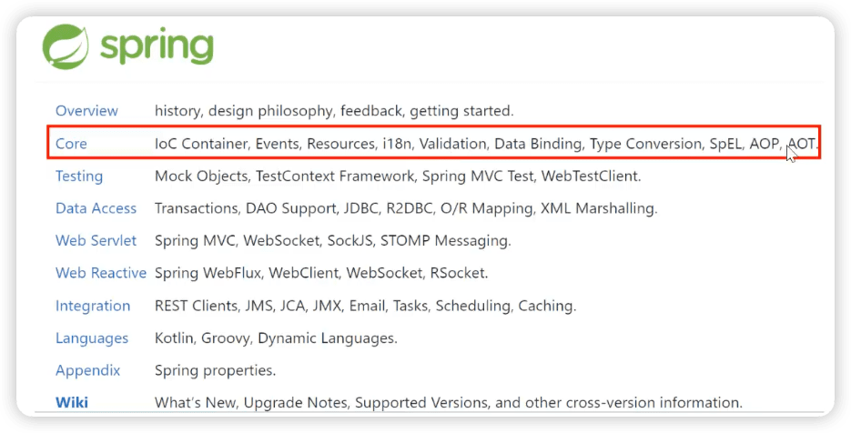
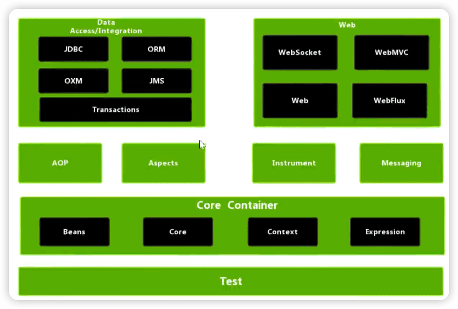
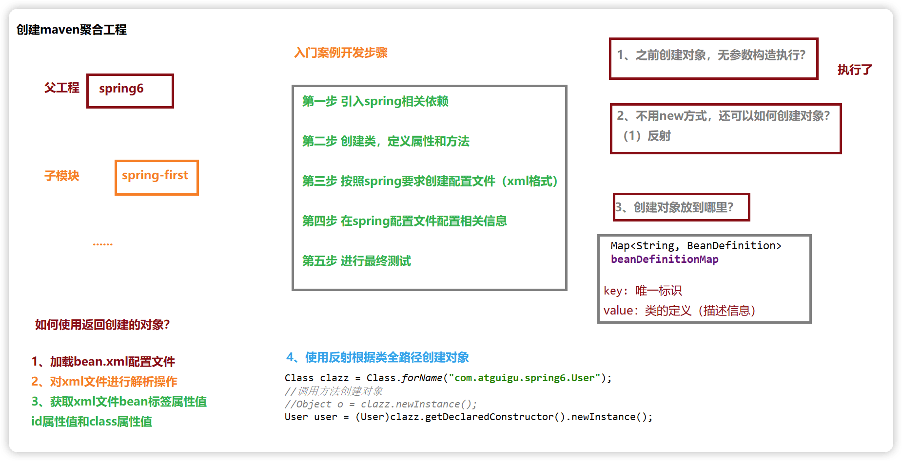
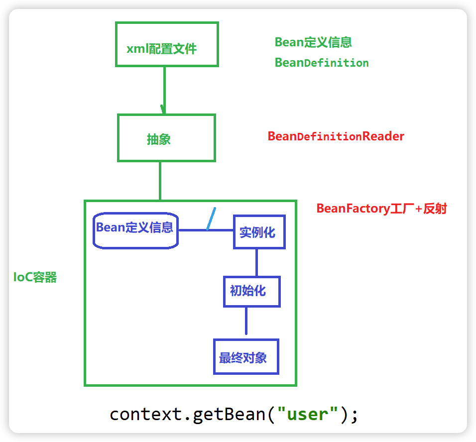
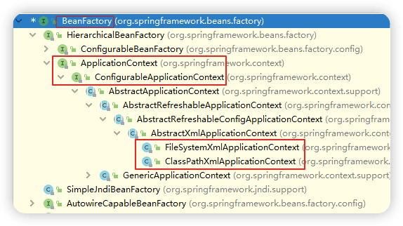
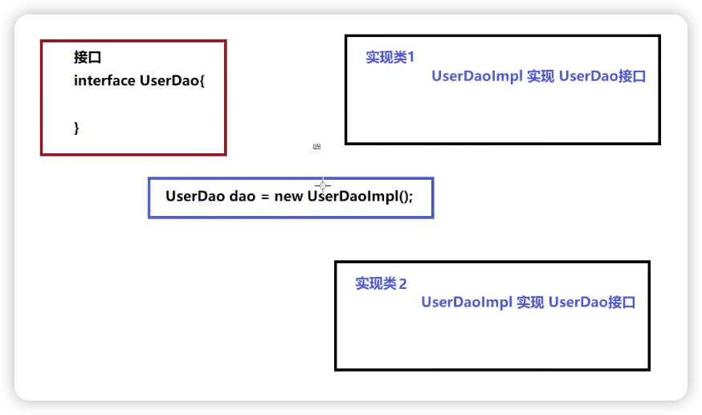
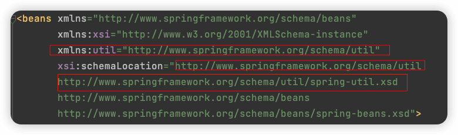
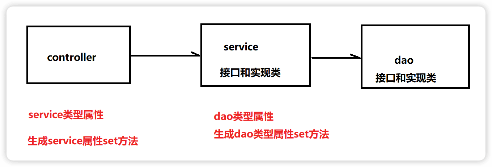

spring6
-----


https://www.bilibili.com/video/BV1kR4y1b7Qc


Spring6.0.2


## 1 概述

### Spring 的狭义和广义

**广义的 Spring：Spring 技术栈**

广义上的 Spring 泛指以 Spring Framework 为核心的 Spring 技术栈。

经过十多年的发展，Spring 已经不再是一个单纯的应用框架，而是逐渐发展成为一个由多个不同子项目（模块）组成的成熟技术，例如 Spring Framework、Spring MVC、SpringBoot、Spring Cloud、Spring Data、Spring Security 等，其中 Spring Framework 是其他子项目的基础。

这些子项目涵盖了从企业级应用开发到云计算等各方面的内容，能够帮助开发人员解决软件发展过程中不断产生的各种实际问题，给开发人员带来了更好的开发体验。

**狭义的 Spring：Spring Framework**

狭义的 Spring 特指 Spring Framework，通常我们将它称为 Spring 框架。

Spring 框架是一个分层的、面向切面的 Java 应用程序的一站式轻量级解决方案，它是 Spring 技术栈的核心和基础，是为了解决企业级应用开发的复杂性而创建的。

Spring 有两个最核心模块： IoC 和 AOP。

**IoC**：Inverse of Control 的简写，译为“控制反转”，指把创建对象过程交给 Spring 进行管理。

**AOP**：Aspect Oriented Programming 的简写，译为“面向切面编程”。AOP 用来封装多个类的公共行为，将那些与业务无关，却为业务模块所共同调用的逻辑封装起来，减少系统的重复代码，降低模块间的耦合度。另外，AOP 还解决一些系统层面上的问题，比如日志、事务、权限等。

### Spring Framework特点

- 非侵入式：使用 Spring Framework 开发应用程序时，Spring 对应用程序本身的结构影响非常小。对领域模型可以做到零污染；对功能性组件也只需要使用几个简单的注解进行标记，完全不会破坏原有结构，反而能将组件结构进一步简化。这就使得基于 Spring Framework 开发应用程序时结构清晰、简洁优雅。

- 控制反转：IoC——Inversion of Control，翻转资源获取方向。把自己创建资源、向环境索取资源变成环境将资源准备好，我们享受资源注入。

- 面向切面编程：AOP——Aspect Oriented Programming，在不修改源代码的基础上增强代码功能。

- 容器：Spring IoC 是一个容器，因为它包含并且管理组件对象的生命周期。组件享受到了容器化的管理，替程序员屏蔽了组件创建过程中的大量细节，极大的降低了使用门槛，大幅度提高了开发效率。

- 组件化：Spring 实现了使用简单的组件配置组合成一个复杂的应用。在 Spring 中可以使用 XML 和 Java 注解组合这些对象。这使得我们可以基于一个个功能明确、边界清晰的组件有条不紊的搭建超大型复杂应用系统。

- 一站式：在 IoC 和 AOP 的基础上可以整合各种企业应用的开源框架和优秀的第三方类库。而且 Spring 旗下的项目已经覆盖了广泛领域，很多方面的功能性需求可以在 Spring Framework 的基础上全部使用 Spring 来实现。

### spring模块组成





上图中包含了 Spring 框架的所有模块，这些模块可以满足一切企业级应用开发的需求，在开发过程中可以根据需求有选择性地使用所需要的模块。下面分别对这些模块的作用进行简单介绍。

1. **Spring Core（核心容器）**

spring core提供了IOC,DI,Bean配置装载创建的核心实现。核心概念： Beans、BeanFactory、BeanDefinitions、ApplicationContext。

- spring-core ：IOC和DI的基本实现

- spring-beans：BeanFactory和Bean的装配管理(BeanFactory)
- spring-context：Spring context上下文，即IOC容器(AppliactionContext)
- spring-expression：spring表达式语言

2. **Spring AOP**

- spring-aop：面向切面编程的应用模块，整合ASM，CGLib，JDK Proxy
- spring-aspects：集成AspectJ，AOP应用框架
- spring-instrument：动态Class Loading模块

3. **Spring Data Access**

- spring-jdbc：spring对JDBC的封装，用于简化jdbc操作
- spring-orm：java对象与数据库数据的映射框架
- spring-oxm：对象与xml文件的映射框架
- spring-jms： Spring对Java Message Service(java消息服务)的封装，用于服务之间相互通信
- spring-tx：spring jdbc事务管理

4. **Spring Web**

- spring-web：最基础的web支持，建立于spring-context之上，通过servlet或listener来初始化IOC容器
- spring-webmvc：实现web mvc
- spring-websocket：与前端的全双工通信协议
- spring-webflux：Spring 5.0提供的，用于取代传统java servlet，非阻塞式Reactive Web框架，异步，非阻塞，事件驱动的服务

5. **Spring Message**

- Spring-messaging：spring 4.0提供的，为Spring集成一些基础的报文传送服务

6. **Spring test**

- spring-test：集成测试支持，主要是对junit的封装


### Spring6特点

最低要求jdk17


## 2 入门



### 入门程序


### 程序分析

#### **1 底层是怎么创建对象的？是通过反射机制调用无参数构造方法吗？**

- 使用无参构造创建了

- 不适用new方式，还可以如何创建对象？

#### 2 Spring是如何创建对象的呢？原理是什么？

```java
// dom4j解析beans.xml文件，从中获取class属性值，类的全类名
 // 通过反射机制调用无参数构造方法创建对象
 Class clazz = Class.forName("com.atguigu.spring6.bean.HelloWorld");
 //Object obj = clazz.newInstance();
 Object object = clazz.getDeclaredConstructor().newInstance();
```


#### 3 创建对象存储的哪里？

`DefaultListableBeanFactory` 

```java
private final Map<String, BeanDefinition> beanDefinitionMap;

this.beanDefinitionMap = new ConcurrentHashMap(256);
```

Spring容器加载到Bean类时 , 会把这个类的描述信息, 以包名加类名的方式存到beanDefinitionMap 中,
Map<String,BeanDefinition> , 其中 String是Key , 默认是类名首字母小写 , `BeanDefinition` , 存的是类的定义(描述信息) , 我们通常叫BeanDefinition接口为 : bean的定义对象。

### 启用Log4j2日志框架

- 日志信息的优先级，日志信息的优先级从高到低有**TRACE < DEBUG < INFO < WARN < ERROR < FATAL**
                  TRACE：追踪，是最低的日志级别，相当于追踪程序的执行
                  DEBUG：调试，一般在开发中，都将其设置为最低的日志级别
                  INFO：信息，输出重要的信息，使用较多
                  WARN：警告，输出警告的信息
                  ERROR：错误，输出错误信息
                  FATAL：严重错误

这些级别分别用来指定这条日志信息的重要程度；**级别高的会自动屏蔽级别低的日志**，也就是说，设置了WARN的日志，则INFO、DEBUG的日志级别的日志不会显示。

- 日志信息的输出目的地指定了日志将打印到**控制台**还是**文件中**。
- 日志输出格式则控制了日志信息的显示内容。


```xml
<!--log4j2的依赖-->
<dependency>
    <groupId>org.apache.logging.log4j</groupId>
    <artifactId>log4j-core</artifactId>
    <version>2.19.0</version>
</dependency>
<dependency>
    <groupId>org.apache.logging.log4j</groupId>
    <artifactId>log4j-slf4j2-impl</artifactId>
    <version>2.19.0</version>
</dependency>
```


## 3 容器：IoC

IoC 是 Inversion of Control 的简写，译为“控制反转”，它不是一门技术，而是一种==设计思想==，是一个重要的面向对象编程法则，能够指导我们如何设计出松耦合、更优良的程序。

Spring 通过 ==IoC容器==来管理==所有Java对象的实例化和初始化，控制对象与对象之间的依赖关系==。我们将由 IoC 容器管理的 Java 对象称为 ==Spring Bean==，它与使用关键字 new 创建的 Java 对象没有任何区别。

IoC 容器是 Spring 框架中最重要的核心组件之一，它贯穿了 Spring 从诞生到成长的整个过程。

**容器放bean对象，使用map集合**

### 3.1 IoC容器



`BeanDefinition`是Spring中bean的定义信息，接口`BeanDefinitionReader`的实现类读取xml或者注解获取bean信息【可修改】，通过`BeanFactory`工厂和反射实现对象的实例化，最终通过类似`context.getBean("user");`这样获得最终对象。


#### 控制反转（IoC）

控制反转是一种思想。

控制反转是为了降低程序耦合度，提高程序扩展力。

控制反转，反转的是什么？

- 将对象的创建权利交出去，交给第三方容器负责。
- 将对象和对象之间关系的维护权交出去，交给第三方容器负责。

#### 依赖注入

DI（Dependency Injection）：依赖注入，依赖注入实现了控制反转的思想。

**指Spring创建对象的过程中，将对象依赖属性通过配置进行注入**。

依赖注入常见的实现方式包括两种：

- 第一种：set注入
- 第二种：构造注入

所以结论是：IOC 就是一种控制反转的思想， 而 DI 是对IoC的一种具体实现。

**Bean管理说的是：Bean对象的创建，以及Bean对象中属性的赋值（或者叫做Bean对象之间关系的维护）。**

#### IoC容器在Spring的实现

Spring 的 IoC 容器就是 IoC思想的一个落地的产品实现。IoC容器中管理的组件也叫做 bean。在创建 bean 之前，首先需要创建IoC 容器。Spring 提供了IoC 容器的两种实现方式：

1. **BeanFactory**

这是 IoC 容器的基本实现，是 Spring 内部使用的接口。面向 Spring 本身，不提供给开发人员使用。

2. **ApplicationContext**

BeanFactory 的子接口，提供了更多高级特性。面向 Spring 的使用者，几乎所有场合都使用 ApplicationContext 而不是底层的 BeanFactory。

**ApplicationContext的主要实现类**



| 类型名                          | 简介                                                         |
| ------------------------------- | ------------------------------------------------------------ |
| ClassPathXmlApplicationContext  | 通过读取类路径下的 XML 格式的配置文件创建 IOC 容器对象       |
| FileSystemXmlApplicationContext | 通过文件系统路径读取 XML 格式的配置文件创建 IOC 容器对象     |
| ConfigurableApplicationContext  | ApplicationContext 的子接口，包含一些扩展方法 refresh() 和 close() ，让 ApplicationContext 具有启动、关闭和刷新上下文的能力。 |
| WebApplicationContext           | 专门为 Web 应用准备，基于 Web 环境创建 IOC 容器对象，并将对象引入存入 ServletContext 域中。 |


https://xie.infoq.cn/article/75405cc2cb4d512e80e8065a1?utm_source=rss&utm_medium=article


### 3.2 基于XML管理Bean

#### 搭建子模块spring6-ioc-xml


#### 实验一：获取bean

1. 根据id获取
2. 根据类型获取
3. 根据id和类型


```java
User user = (User) context.getBean("user");
User user = context.getBean(User.class);
User user = context.getBean("user", User.class);
```


> 注意：
>
> 当根据类型获取bean时，要求IOC容器中指定类型的bean有且只能有一个。否则异常：`NoUniqueBeanDefinitionException`。
>
> 扩展知识：
>
> - 如果组件类实现了接口，根据接口类型可以获取 bean 吗？可以，前提是bean唯一
>
> 
>
> - 如果一个接口有多个实现类，这些实现类都配置了 bean，根据接口类型可以获取 bean 吗？不行，因为bean不唯一

**结论**

根据类型来获取bean时，在满足bean唯一性的前提下，其实只是看：『对象 **instanceof** 指定的类型』的返回结果，只要返回的是true就可以认定为和类型匹配，能够获取到。

java中，instanceof运算符用于判断前面的对象是否是后面的类，或其子类、实现类的实例。如果是返回true，否则返回false。也就是说：用instanceof关键字做判断时， instanceof 操作符的左右操作必须有继承或实现关系

#### 实验二：依赖注入之setter注入

> 依赖注入
>
> 1 类有属性，创建对象过程中，向属性设置值
>
> 基于set方法
>
> 基于构造器


#### 实验三：依赖注入之构造器注入


#### 实验四：特殊值处理

1. 字面量赋值


2. null值

```xml
<property name="name">
    <null />
</property>
```

3. xml实体

转义字符

```xml
<!-- 小于号在XML文档中用来定义标签的开始，不能随便使用 -->
<!-- 解决方案一：使用XML实体来代替 -->
<property name="expression" value="a &lt; b"/>
```

4. CDATA节点

不想转义

```xml
<property name="expression">
    <!-- 解决方案二：使用CDATA节 -->
    <!-- CDATA中的C代表Character，是文本、字符的含义，CDATA就表示纯文本数据 -->
    <!-- XML解析器看到CDATA节就知道这里是纯文本，就不会当作XML标签或属性来解析 -->
    <!-- 所以CDATA节中写什么符号都随意 -->
    <value><![CDATA[a < b]]></value>
</property>
```


#### 实验五：为对象类型属性赋值

1. 引入外部bean

2. 内部bean注入

3. 级联赋值

```xml
	<!--
    第一种方式：引入外部bean
        1 创建两个类对象：dept和emp
        2 在emp的bean标签里面，使用property引入dept的bean
    -->
    <bean id="dept" class="com.andyron.spring6.iocxml.ditest.Dept">
        <property name="dname" value="安保部"></property>
    </bean>
    <bean id="emp" class="com.andyron.spring6.iocxml.ditest.Emp">
        <property name="ename" value="Tom"></property>
        <property name="age" value="51"></property>
        <property name="dept" ref="dept"></property>
    </bean>

    <!-- 第二种方式 内部bean注入 -->
    <bean id="emp2" class="com.andyron.spring6.iocxml.ditest.Emp">
        <property name="ename" value="jerry"></property>
        <property name="age" value="53"></property>
        <property name="dept">
            <bean id="dept2" class="com.andyron.spring6.iocxml.ditest.Dept">
                <property name="dname" value="财务部"></property>
            </bean>
        </property>
    </bean>

    <!-- 第三种方式 级联赋值 -->
    <bean id="dept3" class="com.andyron.spring6.iocxml.ditest.Dept">
        <property name="dname" value="技术部"></property>
    </bean>
    <bean id="emp3" class="com.andyron.spring6.iocxml.ditest.Emp">
        <property name="ename" value="Tom"></property>
        <property name="age" value="51"></property>
        <property name="dept" ref="dept3"></property>
        <property name="dept.dname" value="测试部"></property>
    </bean>
```


#### 实验六：为数组类型属性赋值

```xml
<!-- 为数组类型属性赋值 -->
<bean id="dept4" class="com.andyron.spring6.iocxml.ditest.Dept">
  <property name="dname" value="技术部"></property>
</bean>
<bean id="emp4" class="com.andyron.spring6.iocxml.ditest.Emp">
  <property name="ename" value="Tom"></property>
  <property name="age" value="51"></property>
  <property name="dept" ref="dept4"></property>
  <property name="loves">
    <array>
      <value>吃饭</value>
      <value>code</value>
      <value>music</value>
    </array>
  </property>
</bean>
```


#### 实验七：为集合类型属性赋值

1. List集合

```xml
    <!-- 为集合类型属性赋值 list -->
    <bean id="empone" class="com.andyron.spring6.iocxml.ditest.Emp">
        <property name="ename" value="jack"></property>
        <property name="age" value="18"></property>
    </bean>
    <bean id="emptwo" class="com.andyron.spring6.iocxml.ditest.Emp">
        <property name="ename" value="rose"></property>
        <property name="age" value="28"></property>
    </bean>
    <bean id="dept5" class="com.andyron.spring6.iocxml.ditest.Dept">
        <property name="dname" value="技术部"></property>
        <property name="empList">
            <list>
                <ref bean="empone"></ref>
                <ref bean="emptwo"></ref>
            </list>
        </property>
    </bean>
```

2. map集合

```xml
<!-- 为集合类型属性赋值 map -->
    <bean id="teacher1" class="com.andyron.spring6.iocxml.dimap.Teacher">
        <property name="teacherId" value="101"></property>
        <property name="teacherName" value="李讲师"></property>
    </bean>
    <bean id="teacher2" class="com.andyron.spring6.iocxml.dimap.Teacher">
        <property name="teacherId" value="102"></property>
        <property name="teacherName" value="赵讲师"></property>
    </bean>

    <bean id="student" class="com.andyron.spring6.iocxml.dimap.Student">
        <property name="sid" value="202"></property>
        <property name="sname" value="小张"></property>
        <property name="teacherMap">
            <map>
                <entry>
                    <key>
                        <value>10010</value>
                    </key>
                    <ref bean="teacher1"></ref>
                </entry>
                <entry>
                    <key>
                        <value>10020</value>
                    </key>
                    <ref bean="teacher2"></ref>
                </entry>
            </map>
        </property>
    </bean>
```

3. 引用集合类型的bean

使用util:list、util:map标签必须引入相应的命名空间



```xml
<?xml version="1.0" encoding="UTF-8"?>
<beans xmlns="http://www.springframework.org/schema/beans"
       xmlns:xsi="http://www.w3.org/2001/XMLSchema-instance"
       xmlns:util="http://www.springframework.org/schema/util"
       xsi:schemaLocation="http://www.springframework.org/schema/util
       http://www.springframework.org/schema/util/spring-util.xsd
       http://www.springframework.org/schema/beans
       http://www.springframework.org/schema/beans/spring-beans.xsd">

    <bean id="student" class="com.andyron.spring6.iocxml.dimap.Student">
        <property name="sid" value="1000"></property>
        <property name="sname" value="小张"></property>
        <!-- 注入list、map类型属性 -->
        <property name="lessonList" ref="lessionList"></property>
        <property name="teacherMap" ref="teacherMap"></property>
    </bean>

    <util:list id="lessionList">
        <ref bean="lesson1"></ref>
        <ref bean="lesson2"></ref>
    </util:list>
    <util:map id="teacherMap">
        <entry>
            <key>
                <value>10010</value>
            </key>
            <ref bean="teacher1"></ref>
        </entry>
        <entry>
            <key>
                <value>10086</value>
            </key>
            <ref bean="teacher2"></ref>
        </entry>
    </util:map>

    <bean id="teacher1" class="com.andyron.spring6.iocxml.dimap.Teacher">
        <property name="teacherId" value="101"></property>
        <property name="teacherName" value="李讲师"></property>
    </bean>
    <bean id="teacher2" class="com.andyron.spring6.iocxml.dimap.Teacher">
        <property name="teacherId" value="102"></property>
        <property name="teacherName" value="赵讲师"></property>
    </bean>

    <bean id="lesson1" class="com.andyron.spring6.iocxml.dimap.Lesson">
        <property name="lessonName" value="Java后端"></property>
    </bean>
    <bean id="lesson2" class="com.andyron.spring6.iocxml.dimap.Lesson">
        <property name="lessonName" value="前端"></property>
    </bean>
</beans>
```


#### 实验八：p命名空间


```xml
xmlns:p="http://www.springframework.org/schema/p"

// ...
<!-- p命名空间注入 -->
    <bean id="studentP" class="com.andyron.spring6.iocxml.dimap.Student" p:sid="100" p:sname="mary"
          p:lessonList-ref="lessionList" p:teacherMap-ref="teacherMap"></bean>

```


#### 实验九：引入外部属性文件

把一些固定值放入外部文件中，比如数据库配置。

1. 引入数据库相关依赖

```xml
 <!-- MySQL驱动 -->
<dependency>
    <groupId>mysql</groupId>
    <artifactId>mysql-connector-java</artifactId>
    <version>8.0.30</version>
</dependency>

<!-- 数据源 -->
<dependency>
    <groupId>com.alibaba</groupId>
    <artifactId>druid</artifactId>
    <version>1.2.15</version>
</dependency>
```

2. 创建外部属性文件，properties格式，定义数据信息：用户名、密码、地址等

`jdbc.properties`

```properties
jdbc.user=root
jdbc.password=root
jdbc.url=jdbc:mysql://localhost:3306/spring?serverTimezone=Asia/Shanghai&useUnicode=true&characterEncoding=utf-8&zeroDateTimeBehavior=convertToNull&useSSL=false&allowPublicKeyRetrieval=true
jdbc.driver=com.mysql.cj.jdbc.Driver
```


3. 创建spring配置文件，引入context命名空间，引入属性文件，使用表达式完成注入

注意要在在一级标签 `<beans>` 中添加 context 相关的约束

```xml
<?xml version="1.0" encoding="UTF-8"?>
<beans xmlns="http://www.springframework.org/schema/beans"
       xmlns:xsi="http://www.w3.org/2001/XMLSchema-instance"
       xmlns:context="http://www.springframework.org/schema/context"
       xsi:schemaLocation="
       http://www.springframework.org/schema/context
       http://www.springframework.org/schema/context/spring-context.xsd
       http://www.springframework.org/schema/beans
       http://www.springframework.org/schema/beans/spring-beans.xsd">

    <!-- 引入外部属性文件 -->
    <context:property-placeholder location="classpath:jdbc.properties"/>

    <!-- 完成数据库信息注入 -->
    <bean id="druidDataSource" class="com.alibaba.druid.pool.DruidDataSource">
        <property name="url" value="${jdbc.url}"/>
        <property name="driverClassName" value="${jdbc.driver}"/>
        <property name="username" value="${jdbc.user}"/>
        <property name="password" value="${jdbc.password}"/>
    </bean>
</beans>
```

4. 测试

```java
        ApplicationContext context = new ClassPathXmlApplicationContext("bean-jdbc.xml");
        DruidDataSource dataSource = context.getBean(DruidDataSource.class);
        System.out.println(dataSource.getUrl());
```


#### 实验十：bean的作用域

**①概念**

在Spring中可以通过配置bean标签的scope属性来指定bean的作用域范围，各取值含义参加下表：

| 取值              | 含义                                    | 创建对象的时机  |
| ----------------- | --------------------------------------- | --------------- |
| singleton（默认） | 在IOC容器中，这个bean的对象始终为单实例 | IOC容器初始化时 |
| prototype         | 这个bean在IOC容器中有多个实例           | 获取bean时      |

如果是在WebApplicationContext环境下还会有另外几个作用域（但不常用）：

| 取值    | 含义                 |
| ------- | -------------------- |
| request | 在一个请求范围内有效 |
| session | 在一个会话范围内有效 |


#### 实验十一：bean生命周期

1. bean对象创建（调用无参数构造）
2. 给bean对象设置相关属性
3. bean后置处理器（初始化之前）
4. bean对象初始化（调用制定初始化方法）
5. bean后置处理器（初始化之后）
6. bean对象创建完成了，可以使用了
7. bean对象销毁（配置指定销毁的方法）
8. IoC容器关闭


##### User

```java
public class User {
    private String name;

    public User() {
        System.out.println("1 bean对象创建（调用无参数构造）");
    }
    public String getName() {
        return name;
    }
    public void setName(String name) {
        System.out.println("2 给bean对象设置相关属性");
        this.name = name;
    }
    // 初始化的方法
    public void initMethod() {
        System.out.println("4 bean对象初始化（调用制定初始化方法）");
    }
    // 销毁的方法
    public void destroyMethod() {
        System.out.println("7 bean对象销毁，调用指定销毁的方法");
    }
}
```

##### 配置bean

```xml
<bean id="user" class="com.andyron.spring6.iocxml.life.User" init-method="initMethod" destroy-method="destroyMethod">
  <property name="name" value="andy"></property>
</bean>
```

##### bean的后置处理器

bean的后置处理器会在生命周期的初始化前后添加额外的操作，需要实现`BeanPostProcessor`接口，且配置到IOC容器中，需要注意的是，bean后置处理器不是单独针对某一个bean生效，而是针对IOC容器中所有bean都会执行。

```java
import org.springframework.beans.BeansException;
import org.springframework.beans.factory.config.BeanPostProcessor;

public class MyBeanPost implements BeanPostProcessor {
    @Override
    public Object postProcessBeforeInitialization(Object bean, String beanName) throws BeansException {
        System.out.println("3 bean后置处理器（初始化之前）");
        System.out.println(beanName + "::" + bean);
        return bean;
    }
    @Override
    public Object postProcessAfterInitialization(Object bean, String beanName) throws BeansException {
        System.out.println("5 bean后置处理器（初始化之后）");
        System.out.println(beanName + "::" + bean);
        return bean;
    }
}
```

在IOC容器中配置后置处理器：

```xml
<!-- bean的后置处理器要放入IOC容器才能生效 -->
<bean id="myBeanPost" class="com.andyron.spring6.iocxml.life.MyBeanPost"></bean>
```


#### 实验十二：FactoryBean

`FactoryBean`是Spring提供的一种整合第三方框架的常用机制。和普通的bean不同，配置一个FactoryBean类型的bean，在获取bean的时候得到的并不是class属性中配置的这个类的对象，而是getObject()方法的返回值。通过这种机制，Spring可以帮我们把复杂组件创建的详细过程和繁琐细节都屏蔽起来，只把最简洁的使用界面展示给我们。

将来我们整合Mybatis时，Spring就是通过FactoryBean机制来帮我们创建SqlSessionFactory对象的。🔖

```java
public class MyFactoryBean implements FactoryBean<User> {
    @Override
    public User getObject() throws Exception {
        return new User();
    }

    @Override
    public Class<?> getObjectType() {
        return User.class;
    }
}
```

```xml
    <bean id="user" class="com.andyron.spring6.iocxml.factorybean.MyFactoryBean"></bean>
```

```java
ApplicationContext context = new ClassPathXmlApplicationContext("bean-factorybean.xml");
User user = context.getBean("user", User.class);
System.out.println(user);
```

#### 实验十三：基于xml自动装配

> 自动装配：
>
> 根据指定的策略，在IOC容器中匹配某一个bean，自动为指定的bean中所依赖的类类型或接口类型属性赋值

##### 场景模拟



```java
public class UserController {
    private UserService userService;
    public void setUserService(UserService userService) {
        this.userService = userService;
    }

    public void addUser() {
        System.out.println("UserController方法执行了。。。");
        // 调用service的方法
        userService.addUserService();
    }
}
```

```java
public interface UserService {
    void addUserService();
}

public class UserServiceImpl implements UserService {
    private UserDao userDao;
    public void setUserDao(UserDao userDao) {
        this.userDao = userDao;
    }

    @Override
    public void addUserService() {
        System.out.println("userService方法执行了。。。。");
        userDao.addUserDao();
    }
}
```

```java
public interface UserDao {
    void addUserDao();
}

```

```java
public class UserDaoImpl implements UserDao {
    @Override
    public void addUserDao() {
        System.out.println("userDao方法执行了。。。");
    }
}
```

##### 配置bean

```xml
<bean id="userController" class="com.andyron.spring6.iocxml.auto.controller.UserController" autowire="byType"></bean>
<bean id="userService" class="com.andyron.spring6.iocxml.auto.service.UserServiceImpl" autowire="byType"></bean>
<bean id="userDao" class="com.andyron.spring6.iocxml.auto.dao.UserDaoImpl"></bean>
```

> 使用bean标签的autowire属性设置自动装配效果
>
> 自动装配方式：byType
>
> byType：根据类型匹配IOC容器中的某个兼容类型的bean，为属性自动赋值
>
> 若在IOC中，没有任何一个兼容类型的bean能够为属性赋值，则该属性不装配，即值为默认值null
>
> 若在IOC中，有多个兼容类型的bean能够为属性赋值，则抛出异常NoUniqueBeanDefinitionException


> 自动装配方式：byName
>
> byName：将自动装配的属性的属性名，作为bean的id在IOC容器中匹配相对应的bean进行赋值

```xml
<!-- 根据属性自动装配，要保证id名称与对应属性名相同 -->
<bean id="userController" class="com.andyron.spring6.iocxml.auto.controller.UserController" autowire="byName"></bean>
<bean id="userService" class="com.andyron.spring6.iocxml.auto.service.UserServiceImpl" autowire="byName"></bean>
<bean id="userDao" class="com.andyron.spring6.iocxml.auto.dao.UserDaoImpl"></bean>
```


### 3.3 基于注解管理Bean❤️


Spring 通过注解实现自动装配的步骤如下：

1. 引入依赖
2. 开启组件扫描
3. 使用注解定义 Bean
4. 依赖注入

#### 搭建子模块spring6-ioc-annotation


#### 开启组件扫描


#### 使用注解定义 Bean

| 注解        | 说明                                                         |
| ----------- | ------------------------------------------------------------ |
| @Component  | 该注解用于描述 Spring 中的 Bean，它是一个泛化的概念，仅仅表示容器中的一个组件（Bean），并且可以作用在应用的任何层次，例如 Service 层、Dao 层等。  使用时只需将该注解标注在相应类上即可。 |
| @Repository | 该注解用于将数据访问层（Dao 层）的类标识为 Spring 中的 Bean，其功能与 @Component 相同。 |
| @Service    | 该注解通常作用在业务层（Service 层），用于将业务层的类标识为 Spring 中的 Bean，其功能与 @Component 相同。 |
| @Controller | 该注解通常作用在控制层（如SpringMVC 的 Controller），用于将控制层的类标识为 Spring 中的 Bean，其功能与 @Component 相同。 |


#### 实验一：@Autowired注入


#### 实验二：@Resource注入


#### Spring全注解开发


## 4 原理-手写IoC


### 4.1 回顾Java反射


### 4.2 实现Spring的IoC


## 5 面向切面：AOP

**搭建子模块：spring6-aop**


### 5.2 代理模式


### 5.3 AOP概念及相关术语


### 5.4 基于注解的AOP


#### 各种通知


#### 切入点表达式语法


#### 重用切入点表达式


#### 获取通知的相关信息


#### 环绕通知


#### 切面的优先级


### 5.5 基于XML的AOP


## 6 单元测试：JUnit


## 7 事务

### 7.1 JdbcTemplate

搭建子模块：spring-jdbc-tx


### 7.2 声明式事务概念

#### 事务基本概念

##### ①什么是事务

数据库事务( transaction)是访问并可能操作各种数据项的一个数据库操作序列，这些操作要么全部执行,要么全部不执行，是一个不可分割的工作单位。事务由事务开始与事务结束之间执行的全部数据库操作组成。

##### ②事务的特性

**A：原子性(Atomicity)**

一个事务(transaction)中的所有操作，要么全部完成，要么全部不完成，不会结束在中间某个环节。事务在执行过程中发生错误，会被回滚（Rollback）到事务开始前的状态，就像这个事务从来没有执行过一样。

**C：一致性(Consistency)**

事务的一致性指的是在一个事务执行之前和执行之后数据库都必须处于一致性状态。

如果事务成功地完成，那么系统中所有变化将正确地应用，系统处于有效状态。

如果在事务中出现错误，那么系统中的所有变化将自动地回滚，系统返回到原始状态。

**I：隔离性(Isolation)**

指的是在并发环境中，当不同的事务同时操纵相同的数据时，每个事务都有各自的完整数据空间。由并发事务所做的修改必须与任何其他并发事务所做的修改隔离。事务查看数据更新时，数据所处的状态要么是另一事务修改它之前的状态，要么是另一事务修改它之后的状态，事务不会查看到中间状态的数据。

**D：持久性(Durability)**

指的是只要事务成功结束，它对数据库所做的更新就必须保存下来。即使发生系统崩溃，重新启动数据库系统后，数据库还能恢复到事务成功结束时的状态。


#### 编程式事务


#### 声明式事务

既然事务控制的代码有规律可循，代码的结构基本是确定的，所以框架就可以将固定模式的代码抽取出来，进行相关的封装。

封装起来后，我们只需要在配置文件中进行简单的配置即可完成操作。

- 好处1：提高开发效率
- 好处2：消除了冗余的代码
- 好处3：框架会综合考虑相关领域中在实际开发环境下有可能遇到的各种问题，进行了健壮性、性能等各个方面的优化

所以，我们可以总结下面两个概念：

- **编程式**：**自己写代码**实现功能
- **声明式**：通过**配置**让**框架**实现功能


### 7.3 基于注解的声明式事务


#### 加入事务


#### 事务属性：只读


#### 事务属性：超时


#### 事务属性：回滚策略


#### 事务属性：隔离级别


#### 事务属性：传播行为


#### 全注解配置事务


### 7.4 基于XML的声明式事务


## 8 资源操作：Resources


Java的标准java.net.URL类和各种URL前缀的标准处理程序无法满足所有对low-level资源的访问，比如：没有标准化的 URL 实现可用于访问需要从类路径或相对于 ServletContext 获取的资源。并且缺少某些Spring所需要的功能，例如检测某资源是否存在等。**而Spring的Resource声明了访问low-level资源的能力。**


### 8.2 Resource接口


### 8.3 Resource的实现类


### 8.4 Resource类图


### 8.5 ResourceLoader 接口


### 8.6 ResourceLoaderAware接口


### 8.7 使用Resource 作为属性


### 8.8 应用程序上下文和资源路径


## 9 国际化：i18n

子模块spring6-i18n


## 10 数据校验：Validation

### 10.1 Spring Validation概述

在开发中，我们经常遇到参数校验的需求，比如用户注册的时候，要校验用户名不能为空、用户名长度不超过20个字符、手机号是合法的手机号格式等等。如果使用普通方式，我们会把校验的代码和真正的业务处理逻辑耦合在一起，而且如果未来要新增一种校验逻辑也需要在修改多个地方。而spring validation允许通过注解的方式来定义对象校验规则，把校验和业务逻辑分离开，让代码编写更加方便。Spring Validation其实就是对Hibernate Validator进一步的封装，方便在Spring中使用。

在Spring中有多种校验的方式

**第一种是通过实现org.springframework.validation.Validator接口，然后在代码中调用这个类**

**第二种是按照Bean Validation方式来进行校验，即通过注解的方式。**

**第三种是基于方法实现校验**

**除此之外，还可以实现自定义校验**


## 11 提前编译：AOT