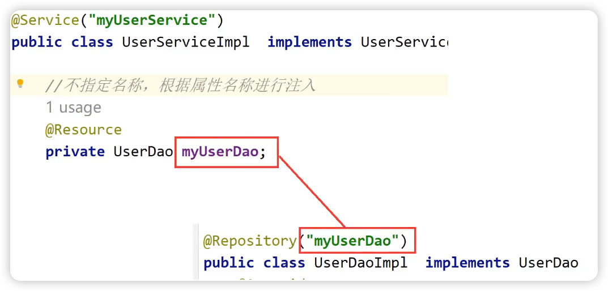

spring6
-----

https://www.bilibili.com/video/BV1kR4y1b7Qc

Spring6.0.2

## 1 概述

### Spring 的狭义和广义

**广义的 Spring：Spring 技术栈**

广义上的 Spring 泛指以 Spring Framework 为核心的 Spring 技术栈。

经过十多年的发展，Spring 已经不再是一个单纯的应用框架，而是逐渐发展成为一个由多个不同子项目（模块）组成的成熟技术，例如 Spring Framework、Spring MVC、SpringBoot、Spring Cloud、Spring Data、Spring Security 等，其中 Spring Framework 是其他子项目的基础。

这些子项目涵盖了从企业级应用开发到云计算等各方面的内容，能够帮助开发人员解决软件发展过程中不断产生的各种实际问题，给开发人员带来了更好的开发体验。

**狭义的 Spring：Spring Framework**，通常我们将它称为 Spring 框架。

Spring 框架是一个分层的、面向切面的 Java 应用程序的一站式轻量级解决方案，它是 Spring 技术栈的核心和基础，是为了解决企业级应用开发的复杂性而创建的。

Spring 有两个最核心模块： IoC 和 AOP。

**IoC**：Inverse of Control 的简写，译为“控制反转”，指把创建对象过程交给 Spring 进行管理。

**AOP**：Aspect Oriented Programming 的简写，译为“面向切面编程”。AOP 用来封装多个类的公共行为，将那些与业务无关，却为业务模块所共同调用的逻辑封装起来，减少系统的重复代码，降低模块间的耦合度。另外，AOP 还解决一些系统层面上的问题，比如日志、事务、权限等。

### Spring Framework特点

- 非侵入式：使用 Spring Framework 开发应用程序时，Spring 对应用程序本身的结构影响非常小。对领域模型可以做到零污染；对功能性组件也只需要使用几个简单的注解进行标记，完全不会破坏原有结构，反而能将组件结构进一步简化。这就使得基于 Spring Framework 开发应用程序时结构清晰、简洁优雅。

- 控制反转：IoC——Inversion of Control，翻转资源获取方向。把自己创建资源、向环境索取资源变成环境将资源准备好，我们享受资源注入。

- 面向切面编程：AOP——Aspect Oriented Programming，在不修改源代码的基础上增强代码功能。

- 容器：Spring IoC 是一个容器，因为它包含并且管理组件对象的生命周期。组件享受到了容器化的管理，替程序员屏蔽了组件创建过程中的大量细节，极大的降低了使用门槛，大幅度提高了开发效率。

- 组件化：Spring 实现了使用简单的组件配置组合成一个复杂的应用。在 Spring 中可以使用 XML 和 Java 注解组合这些对象。这使得我们可以基于一个个功能明确、边界清晰的组件有条不紊的搭建超大型复杂应用系统。

- 一站式：在 IoC 和 AOP 的基础上可以整合各种企业应用的开源框架和优秀的第三方类库。而且 Spring 旗下的项目已经覆盖了广泛领域，很多方面的功能性需求可以在 Spring Framework 的基础上全部使用 Spring 来实现。

### spring模块组成


上图中包含了 Spring 框架的所有模块，这些模块可以满足一切企业级应用开发的需求，在开发过程中可以根据需求有选择性地使用所需要的模块。下面分别对这些模块的作用进行简单介绍。

1. **Spring Core（核心容器）**

spring core提供了IOC,DI,Bean配置装载创建的核心实现。核心概念： Beans、BeanFactory、BeanDefinitions、ApplicationContext。

- spring-core ：IOC和DI的基本实现

- spring-beans：BeanFactory和Bean的装配管理(BeanFactory)

- spring-context：Spring context上下文，即IOC容器(AppliactionContext)

- spring-expression：spring表达式语言
2. **Spring AOP**
- spring-aop：面向切面编程的应用模块，整合ASM，CGLib，JDK Proxy

- spring-aspects：集成AspectJ，AOP应用框架

- spring-instrument：动态Class Loading模块
3. **Spring Data Access**
- spring-jdbc：spring对JDBC的封装，用于简化jdbc操作

- spring-orm：java对象与数据库数据的映射框架

- spring-oxm：对象与xml文件的映射框架

- spring-jms： Spring对Java Message Service(java消息服务)的封装，用于服务之间相互通信

- spring-tx：spring jdbc事务管理
4. **Spring Web**
- spring-web：最基础的web支持，建立于spring-context之上，通过servlet或listener来初始化IOC容器

- spring-webmvc：实现web mvc

- spring-websocket：与前端的全双工通信协议

- spring-webflux：Spring 5.0提供的，用于取代传统java servlet，非阻塞式Reactive Web框架，异步，非阻塞，事件驱动的服务
5. **Spring Message**
- Spring-messaging：spring 4.0提供的，为Spring集成一些基础的报文传送服务
6. **Spring test**
- spring-test：集成测试支持，主要是对junit的封装

### Spring6特点

最低要求jdk17

## 2 入门


### 入门程序

### 程序分析

#### **1 底层是怎么创建对象的？是通过反射机制调用无参数构造方法吗？**

- 使用无参构造创建了

- 不适用new方式，还可以如何创建对象？

#### 2 Spring是如何创建对象的呢？原理是什么？

```java
// dom4j解析beans.xml文件，从中获取class属性值，类的全类名
 // 通过反射机制调用无参数构造方法创建对象
 Class clazz = Class.forName("com.atguigu.spring6.bean.HelloWorld");
 //Object obj = clazz.newInstance();
 Object object = clazz.getDeclaredConstructor().newInstance();
```

#### 3 创建对象存储的哪里？

`DefaultListableBeanFactory` 

```java
private final Map<String, BeanDefinition> beanDefinitionMap;

this.beanDefinitionMap = new ConcurrentHashMap(256);
```

Spring容器加载到Bean类时 , 会把这个类的描述信息, 以包名加类名的方式存到beanDefinitionMap 中,
Map<String,BeanDefinition> , 其中 String是Key , 默认是类名首字母小写 , `BeanDefinition` , 存的是类的定义(描述信息) , 我们通常叫BeanDefinition接口为 : bean的定义对象。

### 启用Log4j2日志框架

- 日志信息的优先级，日志信息的优先级从高到低有**TRACE < DEBUG < INFO < WARN < ERROR < FATAL**
  
                  TRACE：追踪，是最低的日志级别，相当于追踪程序的执行
                  DEBUG：调试，一般在开发中，都将其设置为最低的日志级别
                  INFO：信息，输出重要的信息，使用较多
                  WARN：警告，输出警告的信息
                  ERROR：错误，输出错误信息
                  FATAL：严重错误

这些级别分别用来指定这条日志信息的重要程度；**级别高的会自动屏蔽级别低的日志**，也就是说，设置了WARN的日志，则INFO、DEBUG的日志级别的日志不会显示。

- 日志信息的输出目的地指定了日志将打印到**控制台**还是**文件中**。
- 日志输出格式则控制了日志信息的显示内容。

```xml
<!--log4j2的依赖-->
<dependency>
    <groupId>org.apache.logging.log4j</groupId>
    <artifactId>log4j-core</artifactId>
    <version>2.19.0</version>
</dependency>
<dependency>
    <groupId>org.apache.logging.log4j</groupId>
    <artifactId>log4j-slf4j2-impl</artifactId>
    <version>2.19.0</version>
</dependency>
```

## 3 容器：IoC

IoC 是 Inversion of Control 的简写，译为“控制反转”，它不是一门技术，而是一种==设计思想==，是一个重要的面向对象编程法则，能够指导我们如何设计出松耦合、更优良的程序。

Spring 通过 ==IoC容器==来管理==所有Java对象的实例化和初始化，控制对象与对象之间的依赖关系==。我们将由 IoC 容器管理的 Java 对象称为 ==Spring Bean==，它与使用关键字 new 创建的 Java 对象没有任何区别。

IoC 容器是 Spring 框架中最重要的核心组件之一，它贯穿了 Spring 从诞生到成长的整个过程。

**容器放bean对象，使用map集合**

### 3.1 IoC容器


`BeanDefinition`是Spring中bean的定义信息，接口`BeanDefinitionReader`的实现类读取xml或者注解获取bean信息【可修改】，通过`BeanFactory`工厂和反射实现对象的实例化，最终通过类似`context.getBean("user");`这样获得最终对象。

#### 控制反转（IoC）

控制反转是一种思想。

控制反转是为了降低程序耦合度，提高程序扩展力。

控制反转，反转的是什么？

- 将对象的创建权利交出去，交给第三方容器负责。
- 将对象和对象之间关系的维护权交出去，交给第三方容器负责。

#### 依赖注入

DI（Dependency Injection）：依赖注入，依赖注入实现了控制反转的思想。

**指Spring创建对象的过程中，将对象依赖属性通过配置进行注入**。

依赖注入常见的实现方式包括两种：

- 第一种：set注入
- 第二种：构造注入

所以结论是：IOC 就是一种控制反转的思想， 而 DI 是对IoC的一种具体实现。

**Bean管理说的是：Bean对象的创建，以及Bean对象中属性的赋值（或者叫做Bean对象之间关系的维护）。**

#### IoC容器在Spring的实现

Spring 的 IoC 容器就是 IoC思想的一个落地的产品实现。IoC容器中管理的组件也叫做 bean。在创建 bean 之前，首先需要创建IoC 容器。Spring 提供了IoC 容器的两种实现方式：

1. **BeanFactory**

这是 IoC 容器的基本实现，是 Spring 内部使用的接口。面向 Spring 本身，不提供给开发人员使用。

2. **ApplicationContext**

BeanFactory 的子接口，提供了更多高级特性。面向 Spring 的使用者，几乎所有场合都使用 ApplicationContext 而不是底层的 BeanFactory。

**ApplicationContext的主要实现类**


| 类型名                             | 简介                                                                                           |
| ------------------------------- | -------------------------------------------------------------------------------------------- |
| ClassPathXmlApplicationContext  | 通过读取类路径下的 XML 格式的配置文件创建 IOC 容器对象                                                             |
| FileSystemXmlApplicationContext | 通过文件系统路径读取 XML 格式的配置文件创建 IOC 容器对象                                                            |
| ConfigurableApplicationContext  | ApplicationContext 的子接口，包含一些扩展方法 refresh() 和 close() ，让 ApplicationContext 具有启动、关闭和刷新上下文的能力。 |
| WebApplicationContext           | 专门为 Web 应用准备，基于 Web 环境创建 IOC 容器对象，并将对象引入存入 ServletContext 域中。                                |

https://xie.infoq.cn/article/75405cc2cb4d512e80e8065a1?utm_source=rss&utm_medium=article

### 3.2 基于XML管理Bean

#### 搭建子模块spring6-ioc-xml

#### 实验一：获取bean

1. 根据id获取
2. 根据类型获取
3. 根据id和类型

```java
User user = (User) context.getBean("user");
User user = context.getBean(User.class);
User user = context.getBean("user", User.class);
```

> 注意：
> 
> 当根据类型获取bean时，要求IOC容器中指定类型的bean有且只能有一个。否则异常：`NoUniqueBeanDefinitionException`。
> 
> 扩展知识：
> 
> - 如果组件类实现了接口，根据接口类型可以获取 bean 吗？可以，前提是bean唯一
> 
> 
> 
> - 如果一个接口有多个实现类，这些实现类都配置了 bean，根据接口类型可以获取 bean 吗？不行，因为bean不唯一

**结论**

根据类型来获取bean时，在满足bean唯一性的前提下，其实只是看：『对象 **instanceof** 指定的类型』的返回结果，只要返回的是true就可以认定为和类型匹配，能够获取到。

java中，instanceof运算符用于判断前面的对象是否是后面的类，或其子类、实现类的实例。如果是返回true，否则返回false。也就是说：用instanceof关键字做判断时， instanceof 操作符的左右操作必须有继承或实现关系

#### 实验二：依赖注入之setter注入

> 依赖注入
> 
> 1 类有属性，创建对象过程中，向属性设置值
> 
> 基于set方法
> 
> 基于构造器

#### 实验三：依赖注入之构造器注入

#### 实验四：特殊值处理

1. 字面量赋值

2. null值

```xml
<property name="name">
    <null />
</property>
```

3. xml实体

转义字符

```xml
<!-- 小于号在XML文档中用来定义标签的开始，不能随便使用 -->
<!-- 解决方案一：使用XML实体来代替 -->
<property name="expression" value="a < b"/>
```

4. CDATA节点

不想转义

```xml
<property name="expression">
    <!-- 解决方案二：使用CDATA节 -->
    <!-- CDATA中的C代表Character，是文本、字符的含义，CDATA就表示纯文本数据 -->
    <!-- XML解析器看到CDATA节就知道这里是纯文本，就不会当作XML标签或属性来解析 -->
    <!-- 所以CDATA节中写什么符号都随意 -->
    <value><![CDATA[a < b]]></value>
</property>
```

#### 实验五：为对象类型属性赋值

1. 引入外部bean

2. 内部bean注入

3. 级联赋值

```xml
    <!--
    第一种方式：引入外部bean
        1 创建两个类对象：dept和emp
        2 在emp的bean标签里面，使用property引入dept的bean
    -->
    <bean id="dept" class="com.andyron.spring6.iocxml.ditest.Dept">
        <property name="dname" value="安保部"></property>
    </bean>
    <bean id="emp" class="com.andyron.spring6.iocxml.ditest.Emp">
        <property name="ename" value="Tom"></property>
        <property name="age" value="51"></property>
        <property name="dept" ref="dept"></property>
    </bean>

    <!-- 第二种方式 内部bean注入 -->
    <bean id="emp2" class="com.andyron.spring6.iocxml.ditest.Emp">
        <property name="ename" value="jerry"></property>
        <property name="age" value="53"></property>
        <property name="dept">
            <bean id="dept2" class="com.andyron.spring6.iocxml.ditest.Dept">
                <property name="dname" value="财务部"></property>
            </bean>
        </property>
    </bean>

    <!-- 第三种方式 级联赋值 -->
    <bean id="dept3" class="com.andyron.spring6.iocxml.ditest.Dept">
        <property name="dname" value="技术部"></property>
    </bean>
    <bean id="emp3" class="com.andyron.spring6.iocxml.ditest.Emp">
        <property name="ename" value="Tom"></property>
        <property name="age" value="51"></property>
        <property name="dept" ref="dept3"></property>
        <property name="dept.dname" value="测试部"></property>
    </bean>
```

#### 实验六：为数组类型属性赋值

```xml
<!-- 为数组类型属性赋值 -->
<bean id="dept4" class="com.andyron.spring6.iocxml.ditest.Dept">
  <property name="dname" value="技术部"></property>
</bean>
<bean id="emp4" class="com.andyron.spring6.iocxml.ditest.Emp">
  <property name="ename" value="Tom"></property>
  <property name="age" value="51"></property>
  <property name="dept" ref="dept4"></property>
  <property name="loves">
    <array>
      <value>吃饭</value>
      <value>code</value>
      <value>music</value>
    </array>
  </property>
</bean>
```

#### 实验七：为集合类型属性赋值

1. List集合

```xml
    <!-- 为集合类型属性赋值 list -->
    <bean id="empone" class="com.andyron.spring6.iocxml.ditest.Emp">
        <property name="ename" value="jack"></property>
        <property name="age" value="18"></property>
    </bean>
    <bean id="emptwo" class="com.andyron.spring6.iocxml.ditest.Emp">
        <property name="ename" value="rose"></property>
        <property name="age" value="28"></property>
    </bean>
    <bean id="dept5" class="com.andyron.spring6.iocxml.ditest.Dept">
        <property name="dname" value="技术部"></property>
        <property name="empList">
            <list>
                <ref bean="empone"></ref>
                <ref bean="emptwo"></ref>
            </list>
        </property>
    </bean>
```

2. map集合

```xml
<!-- 为集合类型属性赋值 map -->
    <bean id="teacher1" class="com.andyron.spring6.iocxml.dimap.Teacher">
        <property name="teacherId" value="101"></property>
        <property name="teacherName" value="李讲师"></property>
    </bean>
    <bean id="teacher2" class="com.andyron.spring6.iocxml.dimap.Teacher">
        <property name="teacherId" value="102"></property>
        <property name="teacherName" value="赵讲师"></property>
    </bean>

    <bean id="student" class="com.andyron.spring6.iocxml.dimap.Student">
        <property name="sid" value="202"></property>
        <property name="sname" value="小张"></property>
        <property name="teacherMap">
            <map>
                <entry>
                    <key>
                        <value>10010</value>
                    </key>
                    <ref bean="teacher1"></ref>
                </entry>
                <entry>
                    <key>
                        <value>10020</value>
                    </key>
                    <ref bean="teacher2"></ref>
                </entry>
            </map>
        </property>
    </bean>
```

3. 引用集合类型的bean

使用util:list、util:map标签必须引入相应的命名空间


```xml
<?xml version="1.0" encoding="UTF-8"?>
<beans xmlns="http://www.springframework.org/schema/beans"
       xmlns:xsi="http://www.w3.org/2001/XMLSchema-instance"
       xmlns:util="http://www.springframework.org/schema/util"
       xsi:schemaLocation="http://www.springframework.org/schema/util
       http://www.springframework.org/schema/util/spring-util.xsd
       http://www.springframework.org/schema/beans
       http://www.springframework.org/schema/beans/spring-beans.xsd">

    <bean id="student" class="com.andyron.spring6.iocxml.dimap.Student">
        <property name="sid" value="1000"></property>
        <property name="sname" value="小张"></property>
        <!-- 注入list、map类型属性 -->
        <property name="lessonList" ref="lessionList"></property>
        <property name="teacherMap" ref="teacherMap"></property>
    </bean>

    <util:list id="lessionList">
        <ref bean="lesson1"></ref>
        <ref bean="lesson2"></ref>
    </util:list>
    <util:map id="teacherMap">
        <entry>
            <key>
                <value>10010</value>
            </key>
            <ref bean="teacher1"></ref>
        </entry>
        <entry>
            <key>
                <value>10086</value>
            </key>
            <ref bean="teacher2"></ref>
        </entry>
    </util:map>

    <bean id="teacher1" class="com.andyron.spring6.iocxml.dimap.Teacher">
        <property name="teacherId" value="101"></property>
        <property name="teacherName" value="李讲师"></property>
    </bean>
    <bean id="teacher2" class="com.andyron.spring6.iocxml.dimap.Teacher">
        <property name="teacherId" value="102"></property>
        <property name="teacherName" value="赵讲师"></property>
    </bean>

    <bean id="lesson1" class="com.andyron.spring6.iocxml.dimap.Lesson">
        <property name="lessonName" value="Java后端"></property>
    </bean>
    <bean id="lesson2" class="com.andyron.spring6.iocxml.dimap.Lesson">
        <property name="lessonName" value="前端"></property>
    </bean>
</beans>
```

#### 实验八：p命名空间

```xml
xmlns:p="http://www.springframework.org/schema/p"

// ...
<!-- p命名空间注入 -->
    <bean id="studentP" class="com.andyron.spring6.iocxml.dimap.Student" p:sid="100" p:sname="mary"
          p:lessonList-ref="lessionList" p:teacherMap-ref="teacherMap"></bean>
```

#### 实验九：引入外部属性文件

把一些固定值放入外部文件中，比如数据库配置。

1. 引入数据库相关依赖

```xml
 <!-- MySQL驱动 -->
<dependency>
    <groupId>mysql</groupId>
    <artifactId>mysql-connector-java</artifactId>
    <version>8.0.30</version>
</dependency>

<!-- 数据源 -->
<dependency>
    <groupId>com.alibaba</groupId>
    <artifactId>druid</artifactId>
    <version>1.2.15</version>
</dependency>
```

2. 创建外部属性文件，properties格式，定义数据信息：用户名、密码、地址等

`jdbc.properties`

```properties
jdbc.user=root
jdbc.password=root
jdbc.url=jdbc:mysql://localhost:3306/spring?serverTimezone=Asia/Shanghai&useUnicode=true&characterEncoding=utf-8&zeroDateTimeBehavior=convertToNull&useSSL=false&allowPublicKeyRetrieval=true
jdbc.driver=com.mysql.cj.jdbc.Driver
```

3. 创建spring配置文件，引入context命名空间，引入属性文件，使用表达式完成注入

注意要在在一级标签 `<beans>` 中添加 context 相关的约束

```xml
<?xml version="1.0" encoding="UTF-8"?>
<beans xmlns="http://www.springframework.org/schema/beans"
       xmlns:xsi="http://www.w3.org/2001/XMLSchema-instance"
       xmlns:context="http://www.springframework.org/schema/context"
       xsi:schemaLocation="
       http://www.springframework.org/schema/context
       http://www.springframework.org/schema/context/spring-context.xsd
       http://www.springframework.org/schema/beans
       http://www.springframework.org/schema/beans/spring-beans.xsd">

    <!-- 引入外部属性文件 -->
    <context:property-placeholder location="classpath:jdbc.properties"/>

    <!-- 完成数据库信息注入 -->
    <bean id="druidDataSource" class="com.alibaba.druid.pool.DruidDataSource">
        <property name="url" value="${jdbc.url}"/>
        <property name="driverClassName" value="${jdbc.driver}"/>
        <property name="username" value="${jdbc.user}"/>
        <property name="password" value="${jdbc.password}"/>
    </bean>
</beans>
```

4. 测试

```java
        ApplicationContext context = new ClassPathXmlApplicationContext("bean-jdbc.xml");
        DruidDataSource dataSource = context.getBean(DruidDataSource.class);
        System.out.println(dataSource.getUrl());
```

#### 实验十：bean的作用域

**①概念**

在Spring中可以通过配置bean标签的scope属性来指定bean的作用域范围，各取值含义参加下表：

| 取值            | 含义                      | 创建对象的时机   |
| ------------- | ----------------------- | --------- |
| singleton（默认） | 在IOC容器中，这个bean的对象始终为单实例 | IOC容器初始化时 |
| prototype     | 这个bean在IOC容器中有多个实例      | 获取bean时   |

如果是在WebApplicationContext环境下还会有另外几个作用域（但不常用）：

| 取值      | 含义         |
| ------- | ---------- |
| request | 在一个请求范围内有效 |
| session | 在一个会话范围内有效 |

#### 实验十一：bean生命周期

1. bean对象创建（调用无参数构造）
2. 给bean对象设置相关属性
3. bean后置处理器（初始化之前）
4. bean对象初始化（调用制定初始化方法）
5. bean后置处理器（初始化之后）
6. bean对象创建完成了，可以使用了
7. bean对象销毁（配置指定销毁的方法）
8. IoC容器关闭

##### User

```java
public class User {
    private String name;

    public User() {
        System.out.println("1 bean对象创建（调用无参数构造）");
    }
    public String getName() {
        return name;
    }
    public void setName(String name) {
        System.out.println("2 给bean对象设置相关属性");
        this.name = name;
    }
    // 初始化的方法
    public void initMethod() {
        System.out.println("4 bean对象初始化（调用制定初始化方法）");
    }
    // 销毁的方法
    public void destroyMethod() {
        System.out.println("7 bean对象销毁，调用指定销毁的方法");
    }
}
```

##### 配置bean

```xml
<bean id="user" class="com.andyron.spring6.iocxml.life.User" init-method="initMethod" destroy-method="destroyMethod">
  <property name="name" value="andy"></property>
</bean>
```

##### bean的后置处理器

bean的后置处理器会在生命周期的初始化前后添加额外的操作，需要实现`BeanPostProcessor`接口，且配置到IOC容器中，需要注意的是，bean后置处理器不是单独针对某一个bean生效，而是针对IOC容器中所有bean都会执行。

```java
import org.springframework.beans.BeansException;
import org.springframework.beans.factory.config.BeanPostProcessor;

public class MyBeanPost implements BeanPostProcessor {
    @Override
    public Object postProcessBeforeInitialization(Object bean, String beanName) throws BeansException {
        System.out.println("3 bean后置处理器（初始化之前）");
        System.out.println(beanName + "::" + bean);
        return bean;
    }
    @Override
    public Object postProcessAfterInitialization(Object bean, String beanName) throws BeansException {
        System.out.println("5 bean后置处理器（初始化之后）");
        System.out.println(beanName + "::" + bean);
        return bean;
    }
}
```

在IOC容器中配置后置处理器：

```xml
<!-- bean的后置处理器要放入IOC容器才能生效 -->
<bean id="myBeanPost" class="com.andyron.spring6.iocxml.life.MyBeanPost"></bean>
```

#### 实验十二：FactoryBean

`FactoryBean`是Spring提供的一种整合第三方框架的常用机制。和普通的bean不同，配置一个FactoryBean类型的bean，在获取bean的时候得到的并不是class属性中配置的这个类的对象，而是getObject()方法的返回值。通过这种机制，Spring可以帮我们把复杂组件创建的详细过程和繁琐细节都屏蔽起来，只把最简洁的使用界面展示给我们。

将来我们整合Mybatis时，Spring就是通过FactoryBean机制来帮我们创建SqlSessionFactory对象的。🔖

```java
public class MyFactoryBean implements FactoryBean<User> {
    @Override
    public User getObject() throws Exception {
        return new User();
    }

    @Override
    public Class<?> getObjectType() {
        return User.class;
    }
}
```

```xml
    <bean id="user" class="com.andyron.spring6.iocxml.factorybean.MyFactoryBean"></bean>
```

```java
ApplicationContext context = new ClassPathXmlApplicationContext("bean-factorybean.xml");
User user = context.getBean("user", User.class);
System.out.println(user);
```

#### 实验十三：基于xml自动装配

> 自动装配：
> 
> 根据指定的策略，在IOC容器中匹配某一个bean，自动为指定的bean中所依赖的类类型或接口类型属性赋值

##### 场景模拟


```java
public class UserController {
    private UserService userService;
    public void setUserService(UserService userService) {
        this.userService = userService;
    }

    public void addUser() {
        System.out.println("UserController方法执行了。。。");
        // 调用service的方法
        userService.addUserService();
    }
}
```

```java
public interface UserService {
    void addUserService();
}

public class UserServiceImpl implements UserService {
    private UserDao userDao;
    public void setUserDao(UserDao userDao) {
        this.userDao = userDao;
    }

    @Override
    public void addUserService() {
        System.out.println("userService方法执行了。。。。");
        userDao.addUserDao();
    }
}
```

```java
public interface UserDao {
    void addUserDao();
}
```

```java
public class UserDaoImpl implements UserDao {
    @Override
    public void addUserDao() {
        System.out.println("userDao方法执行了。。。");
    }
}
```

##### 配置bean

```xml
<bean id="userController" class="com.andyron.spring6.iocxml.auto.controller.UserController" autowire="byType"></bean>
<bean id="userService" class="com.andyron.spring6.iocxml.auto.service.UserServiceImpl" autowire="byType"></bean>
<bean id="userDao" class="com.andyron.spring6.iocxml.auto.dao.UserDaoImpl"></bean>
```

> 使用bean标签的autowire属性设置自动装配效果
> 
> 自动装配方式：byType
> 
> byType：根据类型匹配IOC容器中的某个兼容类型的bean，为属性自动赋值
> 
> 若在IOC中，没有任何一个兼容类型的bean能够为属性赋值，则该属性不装配，即值为默认值null
> 
> 若在IOC中，有多个兼容类型的bean能够为属性赋值，则抛出异常NoUniqueBeanDefinitionException

> 自动装配方式：byName
> 
> byName：将自动装配的属性的属性名，作为bean的id在IOC容器中匹配相对应的bean进行赋值

```xml
<!-- 根据属性自动装配，要保证id名称与对应属性名相同 -->
<bean id="userController" class="com.andyron.spring6.iocxml.auto.controller.UserController" autowire="byName"></bean>
<bean id="userService" class="com.andyron.spring6.iocxml.auto.service.UserServiceImpl" autowire="byName"></bean>
<bean id="userDao" class="com.andyron.spring6.iocxml.auto.dao.UserDaoImpl"></bean>
```

### 3.3 基于注解管理Bean❤️

Spring 通过注解实现自动装配的步骤如下：

1. 引入依赖
2. 开启组件扫描
3. 使用注解定义 Bean
4. 依赖注入

#### 搭建子模块spring6-ioc-annotation

#### 开启组件扫描

Spring 默认不使用注解装配 Bean，因此我们需要在 Spring 的 XML 配置中，通过 `<context:component-scan>` 元素开启 Spring Beans的自动扫描功能。开启此功能后，Spring 会自动从扫描指定的包（base-package 属性设置）及其子包下的所有类，如果类上使用了 @Component 注解，就将该类装配到容器中。

```xml
<?xml version="1.0" encoding="UTF-8"?>
<beans xmlns="http://www.springframework.org/schema/beans"
       xmlns:xsi="http://www.w3.org/2001/XMLSchema-instance"
       xmlns:context="http://www.springframework.org/schema/context"
       xsi:schemaLocation="http://www.springframework.org/schema/beans
       http://www.springframework.org/schema/beans/spring-beans-3.0.xsd
       http://www.springframework.org/schema/context
       http://www.springframework.org/schema/context/spring-context.xsd">

    <!-- 开启组件扫描 -->
    <context:component-scan base-package="com.andyron"></context:component-scan>
</beans>
```

##### 情况一：最基本的扫描方式

```xml
<context:component-scan base-package="com.andyron"></context:component-scan>
```

##### 情况二：指定要排除的组件

```xml
<context:component-scan base-package="com.andyron.spring6">
  <!-- context:exclude-filter标签：指定排除规则 -->
  <!--
             type：设置排除或包含的依据
            type="annotation"，根据注解排除，expression中设置要排除的注解的全类名
            type="assignable"，根据类型排除，expression中设置要排除的类型的全类名
        -->
  <context:exclude-filter type="annotation" expression="org.springframework.stereotype.Controller"/>
  <!--<context:exclude-filter type="assignable" expression="com.atguigu.spring6.controller.UserController"/>-->
</context:component-scan>
```

##### 情况三：仅扫描指定组件

```xml
<context:component-scan base-package="com.atguigu" use-default-filters="false">
    <!-- context:include-filter标签：指定在原有扫描规则的基础上追加的规则 -->
    <!-- use-default-filters属性：取值false表示关闭默认扫描规则 -->
    <!-- 此时必须设置use-default-filters="false"，因为默认规则即扫描指定包下所有类 -->
    <!-- 
         type：设置排除或包含的依据
        type="annotation"，根据注解排除，expression中设置要排除的注解的全类名
        type="assignable"，根据类型排除，expression中设置要排除的类型的全类名
    -->
    <context:include-filter type="annotation" expression="org.springframework.stereotype.Controller"/>
    <!--<context:include-filter type="assignable" expression="com.atguigu.spring6.controller.UserController"/>-->
</context:component-scan>
```

#### 使用注解定义 Bean

Spring 提供了以下多个注解，这些注解可以直接标注在 Java 类上，将它们定义成 Spring Bean。

| 注解          | 说明                                                                                                           |
| ----------- | ------------------------------------------------------------------------------------------------------------ |
| @Component  | 该注解用于描述 Spring 中的 Bean，它是一个泛化的概念，仅仅表示容器中的一个组件（Bean），并且可以作用在应用的任何层次，例如 Service 层、Dao 层等。  使用时只需将该注解标注在相应类上即可。 |
| @Repository | 该注解用于将数据访问层（Dao 层）的类标识为 Spring 中的 Bean，其功能与 @Component 相同。                                                   |
| @Service    | 该注解通常作用在业务层（Service 层），用于将业务层的类标识为 Spring 中的 Bean，其功能与 @Component 相同。                                        |
| @Controller | 该注解通常作用在控制层（如SpringMVC 的 Controller），用于将控制层的类标识为 Spring 中的 Bean，其功能与 @Component 相同。                          |

```java
@Component(value = "user") // 类似 <bean id="user" class="...">，value默认值就是类名（首字母小写）可省略
public class User {
}
```

#### 实验一：@Autowired注入

单独使用@Autowired注解，**默认根据类型装配**。【默认是byType】

```java
package org.springframework.beans.factory.annotation;

import java.lang.annotation.Documented;
import java.lang.annotation.ElementType;
import java.lang.annotation.Retention;
import java.lang.annotation.RetentionPolicy;
import java.lang.annotation.Target;

@Target({ElementType.CONSTRUCTOR, ElementType.METHOD, ElementType.PARAMETER, ElementType.FIELD, ElementType.ANNOTATION_TYPE})
@Retention(RetentionPolicy.RUNTIME)
@Documented
public @interface Autowired {
    boolean required() default true;
}
```

- 注解可以标注在：构造方法上、方法上、形参上、属性上、注解上

- 该注解有一个required属性，默认值是true，表示在注入的时候要求被注入的Bean必须是存在的，如果不存在则报错。如果required属性设置为false，表示注入的Bean存在或者不存在都没关系，存在的话就注入，不存在的话，也不报错。

##### 场景一：属性注入

```java
    // 第一种方式 属性注入
    @Autowired
    private UserService userService;
```

##### 场景二：set注入

```java
    // 第二种方式 set方式注入
    private UserService userService;
    @Autowired
    public void setUserService1(UserService userService) {
        this.userService = userService;
    }
```

##### 场景三：构造方法注入

```java
    // 第三种方式 构造方法注入
    private UserService userService;
    @Autowired
    public UserController(UserService userService) {
        this.userService = userService;
    }
```

##### 场景四：形参上注入

```java
    // 第四种方式 形参上注入
    private UserService userService;
    public UserController(@Autowired UserService userService) {
        this.userService = userService;
    }
```

##### 场景五：只有一个构造函数，无注解

```java
    // 第五种方式 只有一个有参构造函数式，不需要@Autowired
    private UserService userService;
    public UserController(UserService userService) {
        this.userService = userService;
    }
```

##### 场景六：@Autowired注解和@Qualifier注解联合

```java
    // 第六种方式：两个注解，根据名称注入
    @Autowired
    @Qualifier(value = "userRedisDaoImpl")
    private UserDao userDao;
```

当UserDao有多个实现bean时，可使用@`Qualifier`进行根据名称装配。

#### 实验二：@Resource注入

@Resource注解也可以完成属性注入。那它和@Autowired注解有什么区别？

- @Resource注解是JDK扩展包中的，也就是说属于JDK的一部分。所以该注解是标准注解，更加具有通用性。(JSR-250标准中制定的注解类型。JSR是Java规范提案。)
- @Autowired注解是Spring框架自己的。
- **@Resource注解默认根据名称装配byName，未指定name时，使用属性名作为name。通过name找不到的话会自动启动通过类型byType装配。**
- **@Autowired注解默认根据类型装配byType，如果想根据名称装配，需要配合@Qualifier注解一起用。**
- @Resource注解用在属性上、setter方法上。
- @Autowired注解用在属性上、setter方法上、构造方法上、构造方法参数上。

@Resource注解属于JDK扩展包，所以不在JDK当中，需要额外引入以下依赖：【**如果是JDK8的话不需要额外引入依赖。高于JDK11或低于JDK8需要引入以下依赖。**】

```xml
<dependency>
    <groupId>jakarta.annotation</groupId>
    <artifactId>jakarta.annotation-api</artifactId>
    <version>2.1.1</version>
</dependency>
```

##### 场景一：根据name注入


##### 场景二：根据属性名注入



##### 场景三：根据类型注入

```java
    // 根据类型注入
    @Resource
    private UserService userService;
```

> **总结：**
> 
> @Resource注解：默认byName注入，没有指定name时把属性名当做name，根据name找不到时，才会byType注入。byType注入时，某种类型的Bean只能有一个

#### Spring全注解开发

全注解开发就是不再使用spring配置文件了，写一个配置类来代替配置文件。

```java
@Configuration
@ComponentScan("com.andyron.spring6")
public class SpringConfig {
}
```

```java
ApplicationContext context = new AnnotationConfigApplicationContext(SpringConfig.class);
UserController bean = context.getBean(UserController.class);
bean.add();
```

## 4 原理-手写IoC

### 4.1 回顾Java反射

#### 获取Class对象多种方式

```java
//1 类名.class
Class clazz1 = Car.class;

//2 对象.getClass()
Class clazz2 = new Car().getClass();

//3 Class.forName("全路径")
Class clazz3 = Class.forName("com.atguigu.reflect.Car");

//实例化
Car car = (Car)clazz3.getConstructor().newInstance();
System.out.println(car);
```

#### 获取构造方法

```java
Class clazz = Car.class;
//获取所有构造
// getConstructors()获取所有public的构造方法
//        Constructor[] constructors = clazz.getConstructors();
// getDeclaredConstructors()获取所有的构造方法public  private
Constructor[] constructors = clazz.getDeclaredConstructors();
for (Constructor c:constructors) {
  System.out.println("方法名称："+c.getName()+" 参数个数："+c.getParameterCount());
}

//指定有参数构造创建对象
//1 构造public
// Constructor c1 = clazz.getConstructor(String.class, int.class, String.class);
// Car car1 = (Car)c1.newInstance("夏利", 10, "红色");
// System.out.println(car1);

//2 构造private
Constructor c2 = clazz.getDeclaredConstructor(String.class, int.class, String.class);
c2.setAccessible(true);
Car car2 = (Car)c2.newInstance("捷达", 15, "白色");
System.out.println(car2);
```

#### 获取属性

```java
Class clazz = Car.class;
Car car = (Car)clazz.getDeclaredConstructor().newInstance();
//获取所有public属性
//Field[] fields = clazz.getFields();
//获取所有属性（包含私有属性）
Field[] fields = clazz.getDeclaredFields();
for (Field field:fields) {
  if(field.getName().equals("name")) {
    //设置允许访问
    field.setAccessible(true);
    field.set(car,"五菱宏光");
    System.out.println(car);
  }
  System.out.println(field.getName());
}
```

#### 获取方法

```java
Car car = new Car("奔驰",10,"黑色");
Class clazz = car.getClass();
//1 public方法
Method[] methods = clazz.getMethods();
for (Method m1:methods) {
  //System.out.println(m1.getName());
  //执行方法 toString
  if(m1.getName().equals("toString")) {
    String invoke = (String)m1.invoke(car);
    //System.out.println("toString执行了："+invoke);
  }
}

//2 private方法
Method[] methodsAll = clazz.getDeclaredMethods();
for (Method m:methodsAll) {
  //执行方法 run
  if(m.getName().equals("run")) {
    m.setAccessible(true);
    m.invoke(car);
  }
}
```

### 4.2 实现Spring的IoC❤️

子模块 andyron-spring

## 5 面向切面：AOP

### 5.1 场景模拟

**搭建子模块：spring6-aop**


#### 提出问题

**①现有代码缺陷**

针对带日志功能的实现类，我们发现有如下缺陷：

- 对核心业务功能有干扰，导致程序员在开发核心业务功能时分散了精力
- 附加功能分散在各个业务功能方法中，不利于统一维护

**②解决思路**

解决这两个问题，核心就是：解耦。我们需要把附加功能从业务功能代码中抽取出来。

**③困难**

解决问题的困难：要抽取的代码在方法内部，靠以前把子类中的重复代码抽取到父类的方式没法解决。所以需要引入新的技术。

### 5.2 代理模式

#### 概念

二十三种设计模式中的一种，属于结构型模式。它的作用就是通过提供一个代理类，让我们在调用目标方法的时候，不再是直接对目标方法进行调用，而是通过代理类**间接**调用。让不属于目标方法核心逻辑的代码从目标方法中剥离出来——**解耦**。调用目标方法时先调用代理对象的方法，减少对目标方法的调用和打扰，同时让附加功能能够集中在一起也有利于统一维护。


使用代理后：


**生活中的代理**

- 广告商找大明星拍广告需要经过经纪人
- 合作伙伴找大老板谈合作要约见面时间需要经过秘书
- 房产中介是买卖双方的代理

**相关术语**

- 代理：将非核心逻辑剥离出来以后，封装这些非核心逻辑的类、对象、方法。
- 目标：被代理“套用”了非核心逻辑代码的类、对象、方法。

#### 静态代理

```java
public class CalculatorStaticProxy implements Calculator {

    // 将被代理的目标对象声明为成员变量
    private Calculator target;

    public CalculatorStaticProxy(Calculator target) {
        this.target = target;
    }

    @Override
    public int add(int i, int j) {

        // 附加功能由代理类中的代理方法来实现
        System.out.println("[日志] add 方法开始了，参数是：" + i + "," + j);

        // 通过目标对象来实现核心业务逻辑
        int addResult = target.add(i, j);

        System.out.println("[日志] add 方法结束了，结果是：" + addResult);

        return addResult;
    }
}
```

> 静态代理确实实现了解耦，但是由于代码都写死了，完全不具备任何的灵活性。就拿日志功能来说，将来其他地方也需要附加日志，那还得再声明更多个静态代理类，那就产生了大量重复的代码，日志功能还是分散的，没有统一管理。
> 
> 提出进一步的需求：将日志功能集中到一个代理类中，将来有任何日志需求，都通过这一个代理类来实现。这就需要使用动态代理技术了。

#### 动态代理


### 5.3 AOP概念及相关术语

#### 概述

AOP（Aspect Oriented Programming）是一种设计思想，是软件设计领域中的面向切面编程，它是面向对象编程的一种补充和完善，它以==通过预编译方式和运行期动态代理方式实现，在不修改源代码的情况下，给程序动态统一添加额外功能的一种技术==。利用AOP可以对业务逻辑的各个部分进行隔离，从而使得业务逻辑各部分之间的耦合度降低，提高程序的可重用性，同时提高了开发的效率。

#### 相关术语

##### ①横切关注点

分散在每个各个模块中解决==同一样的问题==，如==用户验证、日志管理、事务处理、数据缓存==都属于横切关注点。

从每个方法中抽取出来的==同一类非核心业务==。在同一个项目中，我们可以使用多个横切关注点对相关方法进行多个不同方面的增强。

这个概念不是语法层面的，而是根据附加功能的逻辑上的需要：有十个附加功能，就有十个横切关注点。


##### ②通知（增强）

**增强，通俗说，就是你想要增强的功能，比如 安全，事务，日志等。**

每一个横切关注点上要做的事情都需要写一个方法来实现，这样的方法就叫==通知方法==。

- 前置通知：在被代理的目标方法**前**执行
- 返回通知：在被代理的目标方法**成功结束**后执行（**寿终正寝**）
- 异常通知：在被代理的目标方法**异常结束**后执行（**死于非命**）
- 后置通知：在被代理的目标方法**最终结束**后执行（**盖棺定论**）
- 环绕通知：使用try...catch...finally结构围绕**整个**被代理的目标方法，包括上面四种通知对应的所有位置


##### ③切面

封装通知方法的类。


##### ④目标

被代理的目标对象。

##### ⑤代理

向目标对象应用通知之后创建的代理对象。

##### ⑥连接点

这也是一个纯逻辑概念，不是语法定义的。

把方法排成一排，每一个横切位置看成x轴方向，把方法从上到下执行的顺序看成y轴，x轴和y轴的交叉点就是连接点。**通俗说，就是spring允许你使用通知的地方**


##### ⑦切入点

定位连接点的方式。

每个类的方法中都包含多个连接点，所以连接点是类中客观存在的事物（从逻辑上来说）。

如果把连接点看作数据库中的记录，那么切入点就是查询记录的 SQL 语句。

**Spring 的 AOP 技术可以通过切入点定位到特定的连接点。通俗说，要实际去增强的方法**

切点通过 org.springframework.aop.Pointcut 接口进行描述，它使用类和方法作为连接点的查询条件。

#### 作用

- 简化代码：把方法中固定位置的重复的代码**抽取**出来，让被抽取的方法更专注于自己的核心功能，提高内聚性。

- 代码增强：把特定的功能封装到切面类中，看哪里有需要，就往上套，被**套用**了切面逻辑的方法就被切面给增强了。

### 5.4 基于注解的AOP

两种动态代理：


- 动态代理分为JDK动态代理和cglib动态代理
- 当目标类有接口的情况使用JDK动态代理和cglib动态代理，没有接口时只能使用cglib动态代理
- JDK动态代理动态生成的代理类会在com.sun.proxy包下，类名为$proxy1，和目标类实现相同的接口
- cglib动态代理动态生成的代理类会和目标在在相同的包下，会继承目标类
- 动态代理（InvocationHandler）：JDK原生的实现方式，需要被代理的目标类必须实现接口。因为这个技术要求**代理对象和目标对象实现同样的接口**（兄弟两个拜把子模式）。
- cglib：通过**继承被代理的目标类**（认干爹模式）实现代理，所以不需要目标类实现接口。
- AspectJ：是AOP思想的一种实现。本质上是静态代理，**将代理逻辑“织入”被代理的目标类编译得到的字节码文件**，所以最终效果是动态的。weaver就是织入器。Spring只是借用了AspectJ中的注解。

#### 准备工作

在子模块：spring6-aop

```xml
    <!--spring aop依赖-->
    <dependency>
        <groupId>org.springframework</groupId>
        <artifactId>spring-aop</artifactId>
        <version>6.0.2</version>
    </dependency>
    <!--spring aspects依赖-->
    <dependency>
        <groupId>org.springframework</groupId>
        <artifactId>spring-aspects</artifactId>
        <version>6.0.2</version>
    </dependency>
```

```java
<?xml version="1.0" encoding="UTF-8"?>
<beans xmlns="http://www.springframework.org/schema/beans"
       xmlns:xsi="http://www.w3.org/2001/XMLSchema-instance"
       xmlns:context="http://www.springframework.org/schema/context"
       xmlns:aop="http://www.springframework.org/schema/aop"
       xsi:schemaLocation="http://www.springframework.org/schema/beans
       http://www.springframework.org/schema/beans/spring-beans.xsd
       http://www.springframework.org/schema/context
       http://www.springframework.org/schema/context/spring-context.xsd
       http://www.springframework.org/schema/aop
       http://www.springframework.org/schema/aop/spring-aop.xsd">
    <!-- 开启组件扫描 -->
    <context:component-scan base-package="com.andyron.aop.annoaop"></context:component-scan>

    <!-- 开启aspectj自动代理，为目标对象生成代理，让spring认识注解@Aspect-->
    <aop:aspectj-autoproxy />
</beans>
```

#### 创建切面类并配置

```java
package com.andyron.aop.annoaop;

import org.aspectj.lang.JoinPoint;
import org.aspectj.lang.ProceedingJoinPoint;
import org.aspectj.lang.annotation.*;
import org.springframework.stereotype.Component;

import java.util.Arrays;

/**
 * 切面类
 * @author andyron
 **/
@Aspect
@Component
public class LogAspect {
    // 设置切入点和通知类型
    // 五种通知类型
    /*
    切入点表达式：`execution(访问修饰符 增强方法返回类型 增强方法所在类全类名.方法名 (参数列表)`
     */

    // 前置 @Before(value="切入点表达式配置切入点")
    @Before(value = "execution(public int com.andyron.aop.annoaop.CalculatorImpl.*(..))")
    public void beforeMethod(JoinPoint joinPoint) {
        String methodName = joinPoint.getSignature().getName();
        Object[] args = joinPoint.getArgs();
        System.out.println("Logger --> 前置通知，方法名称：" + methodName + "，参数：" + Arrays.toString(args));
    }

    // 后置 @After
    @After(value = "execution(* com.andyron.aop.annoaop.CalculatorImpl.*(..))")
    public void afterMethod(JoinPoint joinPoint) {
        String methodName = joinPoint.getSignature().getName();
        System.out.println("Logger --> 后置通知，方法名称：" + methodName);
    }

    /**
     * 返回 @AfterReturning
     * @param res  增强目标方法的返回值 参数名要与注解中returning的值相同
     */
    @AfterReturning(value = "execution(* com.andyron.aop.annoaop.CalculatorImpl.*(..))", returning = "res")
    public void afterReturningMethod(JoinPoint joinPoint, Object res) { //
        String methodName = joinPoint.getSignature().getName();
        System.out.println("Logger --> 返回通知，方法名称：" + methodName + "，返回结果：" + res);
    }

    // 异常 @AfterThrowing
    @AfterThrowing(value = "execution(* com.andyron.aop.annoaop.CalculatorImpl.*(..))", throwing = "ex")
    public void afterThrowingMethod(JoinPoint joinPoint, Throwable ex) {
        String methodName = joinPoint.getSignature().getName();
        System.out.println("Logger --> 异常通知，方法名称：" + methodName + "异常：" + ex);
    }

    // 环绕 @Around
    @Around(value = "execution(* com.andyron.aop.annoaop.CalculatorImpl.*(..))")
    public Object aroundMethod(ProceedingJoinPoint joinPoint) {
        String methodName = joinPoint.getSignature().getName();
        String argString = Arrays.toString(joinPoint.getArgs());
        Object res = null;
        try {
            System.out.println("环绕通知===目标方法之前执行");

            // 调用目标方法
            res = joinPoint.proceed();
            System.out.println("环绕通知===目标方法返回值之后");
        } catch (Throwable throwable) {
            throwable.printStackTrace();
            System.out.println("环绕通知===目标方法出现异常执行");
        } finally {
            System.out.println("环绕通知===目标方法执行完毕执行");
        }
        return res;
    }
}
```

#### 各种通知

> 各种通知的执行顺序：
> 
> - Spring版本5.3.x以前：
>   - 前置通知
>   - 目标操作
>   - 后置通知
>   - 返回通知或异常通知
> - Spring版本5.3.x以后：
>   - 前置通知
>   - 目标操作
>   - 返回通知或异常通知
>   - 后置通知

#### 切入点表达式语法

**语法细节**

- 用*号代替“权限修饰符”和“返回值”部分表示“权限修饰符”和“返回值”不限

- 在包名的部分，一个“*”号只能代表包的层次结构中的一层，表示这一层是任意的。
  
  - 例如：*.Hello匹配com.Hello，不匹配com.atguigu.Hello

- 在包名的部分，使用“*..”表示包名任意、包的层次深度任意

- 在类名的部分，类名部分整体用*号代替，表示类名任意

- 在类名的部分，可以使用*号代替类名的一部分
  
  - 例如：*Service匹配所有名称以Service结尾的类或接口

- 在方法名部分，可以使用*号表示方法名任意

- 在方法名部分，可以使用*号代替方法名的一部分
  
  - 例如：*Operation匹配所有方法名以Operation结尾的方法

- 在方法参数列表部分，使用(..)表示参数列表任意

- 在方法参数列表部分，使用(int,..)表示参数列表以一个int类型的参数开头

- 在方法参数列表部分，基本数据类型和对应的包装类型是不一样的
  
  - 切入点表达式中使用 int 和实际方法中 Integer 是不匹配的

- 在方法返回值部分，如果想要明确指定一个返回值类型，那么必须同时写明权限修饰符
  
  - 例如：execution(public int *..*Service.*(.., int))    正确
    例如：execution(* int *..*Service.*(.., int))    错误


#### 重用切入点表达式

```java
// 重用切入点表达式（就是重复使用切入点表达式）
@Pointcut(value = "execution(* com.andyron.aop.annoaop.CalculatorImpl.*(..))")
public void pointcut() {}
```

```java
// 后置 @After
//    @After(value = "com.andyron.aop.annoaop.LogAspect.pointcut()") // 不在同一个类里
@After(value = "pointcut()")
public void afterMethod(JoinPoint joinPoint) {
}
```

#### 获取通知的相关信息

**①获取连接点信息**

获取连接点信息可以在通知方法的参数位置设置JoinPoint类型的形参

```java
@Before("execution(public int com.atguigu.aop.annotation.CalculatorImpl.*(..))")
public void beforeMethod(JoinPoint joinPoint){
    //获取连接点的签名信息
    String methodName = joinPoint.getSignature().getName();
    //获取目标方法到的实参信息
    String args = Arrays.toString(joinPoint.getArgs());
    System.out.println("Logger-->前置通知，方法名："+methodName+"，参数："+args);
}
```

**②获取目标方法的返回值**

@AfterReturning中的属性returning，用来将通知方法的某个形参，接收目标方法的返回值

```java
@AfterReturning(value = "execution(* com.atguigu.aop.annotation.CalculatorImpl.*(..))", returning = "result")
public void afterReturningMethod(JoinPoint joinPoint, Object result){
    String methodName = joinPoint.getSignature().getName();
    System.out.println("Logger-->返回通知，方法名："+methodName+"，结果："+result);
}
```

**③获取目标方法的异常**

@AfterThrowing中的属性throwing，用来将通知方法的某个形参，接收目标方法的异常

```java
@AfterThrowing(value = "execution(* com.atguigu.aop.annotation.CalculatorImpl.*(..))", throwing = "ex")
public void afterThrowingMethod(JoinPoint joinPoint, Throwable ex){
    String methodName = joinPoint.getSignature().getName();
    System.out.println("Logger-->异常通知，方法名："+methodName+"，异常："+ex);
}
```

#### 环绕通知

#### 切面的优先级

相同目标方法上同时存在多个切面时，切面的优先级控制切面的**内外嵌套**顺序。

- 优先级高的切面：外面
- 优先级低的切面：里面

使用@Order注解可以控制切面的优先级：

- @Order(较小的数)：优先级高
- @Order(较大的数)：优先级低


### 5.5 基于XML的AOP

```xml
<!-- 开启组件扫描 -->
    <context:component-scan base-package="com.andyron.aop.xmlaop"></context:component-scan>

    <!-- 配置aop五种通知类型 -->
    <aop:config>
        <!-- 配置切面类 -->
        <aop:aspect ref="logAspect">
            <aop:pointcut id="pointCut" expression="execution(* com.andyron.aop.xmlaop.CalculatorImpl.*(..))"/>
            <aop:before method="beforeMethod" pointcut-ref="pointCut"></aop:before>
            <aop:after method="afterMethod" pointcut-ref="pointCut"></aop:after>
            <aop:after-returning method="afterReturningMethod" returning="res" pointcut-ref="pointCut"></aop:after-returning>
            <aop:after-throwing method="afterThrowingMethod" throwing="ex" pointcut-ref="pointCut"></aop:after-throwing>
            <aop:around method="aroundMethod" pointcut-ref="pointCut"></aop:around>
        </aop:aspect>
    </aop:config>
```

## 6 单元测试：JUnit

在之前的测试方法中，几乎都能看到以下的两行代码：

```java
ApplicationContext context = new ClassPathXmlApplicationContext("xxx.xml");
Xxxx xxx = context.getBean(Xxxx.class);
```

这两行代码的作用是创建Spring容器，最终获取到对象，但是每次测试都需要重复编写。针对上述问题，我们需要的是程序能自动帮我们创建容器。我们都知道JUnit无法知晓我们是否使用了 Spring 框架，更不用说帮我们创建 Spring 容器了。Spring提供了一个运行器，可以读取配置文件（或注解）来创建容器。我们只需要告诉它配置文件位置就可以了。这样一来，我们通过Spring整合JUnit可以使程序创建spring容器了

搭建spring6-junit模块。

junit5：

```java
@SpringJUnitConfig(locations = "classpath:bean.xml")
public class SpringTestJunit5 {
    @Autowired
    private User user;

    @Test
    public void testUser() {
        System.out.println(user);
        user.run();
    }
}
```

junit4:

```java
@RunWith(SpringJUnit4ClassRunner.class)
@ContextConfiguration("classpath:bean.xml")
public class SpringTestJunit4 {
    @Autowired
    private User user;

    @Test
    public void testUser4() {
        System.out.println(user);
        user.run();
    }
}
```

> 注意：junit5的`@Test`的是`org.junit.jupiter.api.Test`，而junit4的是`org.junit.Test`。

## 7 事务

### 7.1 JdbcTemplate

搭建子模块：spring-jdbc-tx

### 7.2 声明式事务概念

#### 事务基本概念

##### ①什么是事务

数据库事务( transaction)是访问并可能操作各种数据项的一个数据库操作序列，这些操作要么全部执行,要么全部不执行，是一个不可分割的工作单位。事务由事务开始与事务结束之间执行的全部数据库操作组成。

##### ②事务的特性

**A：原子性(Atomicity)**

一个事务(transaction)中的所有操作，要么全部完成，要么全部不完成，不会结束在中间某个环节。事务在执行过程中发生错误，会被回滚（Rollback）到事务开始前的状态，就像这个事务从来没有执行过一样。

**C：一致性(Consistency)**

事务的一致性指的是在一个事务执行之前和执行之后数据库都必须处于一致性状态。

如果事务成功地完成，那么系统中所有变化将正确地应用，系统处于有效状态。

如果在事务中出现错误，那么系统中的所有变化将自动地回滚，系统返回到原始状态。

**I：隔离性(Isolation)**

指的是在并发环境中，当不同的事务同时操纵相同的数据时，每个事务都有各自的完整数据空间。由并发事务所做的修改必须与任何其他并发事务所做的修改隔离。事务查看数据更新时，数据所处的状态要么是另一事务修改它之前的状态，要么是另一事务修改它之后的状态，事务不会查看到中间状态的数据。

**D：持久性(Durability)**

指的是只要事务成功结束，它对数据库所做的更新就必须保存下来。即使发生系统崩溃，重新启动数据库系统后，数据库还能恢复到事务成功结束时的状态。

#### 编程式事务

事务功能的相关操作全部通过自己编写代码来实现：

```java
Connection conn = ...;

try {

    // 开启事务：关闭事务的自动提交
    conn.setAutoCommit(false);

    // 核心操作

    // 提交事务
    conn.commit();

}catch(Exception e){

    // 回滚事务
    conn.rollBack();

}finally{

    // 释放数据库连接
    conn.close();

}
```

编程式的实现方式存在缺陷：

- 细节没有被屏蔽：具体操作过程中，所有细节都需要程序员自己来完成，比较繁琐。
- 代码复用性不高：如果没有有效抽取出来，每次实现功能都需要自己编写代码，代码就没有得到复用。

#### 声明式事务

既然事务控制的代码有规律可循，代码的结构基本是确定的，所以框架就可以将固定模式的代码抽取出来，进行相关的封装。

封装起来后，我们只需要在配置文件中进行简单的配置即可完成操作。

- 好处1：提高开发效率
- 好处2：消除了冗余的代码
- 好处3：框架会综合考虑相关领域中在实际开发环境下有可能遇到的各种问题，进行了健壮性、性能等各个方面的优化

所以，我们可以总结下面两个概念：

- **编程式**：**自己写代码**实现功能
- **声明式**：通过**配置**让**框架**实现功能

### 7.3 基于注解的声明式事务


#### 加入事务

在spring配置文件中引入tx命名空间

```xml
<?xml version="1.0" encoding="UTF-8"?>
<beans xmlns="http://www.springframework.org/schema/beans"
       xmlns:xsi="http://www.w3.org/2001/XMLSchema-instance"
       xmlns:context="http://www.springframework.org/schema/context"
       xmlns:tx="http://www.springframework.org/schema/tx"
       xsi:schemaLocation="http://www.springframework.org/schema/beans
       http://www.springframework.org/schema/beans/spring-beans.xsd
       http://www.springframework.org/schema/context
       http://www.springframework.org/schema/context/spring-context.xsd
       http://www.springframework.org/schema/tx
       http://www.springframework.org/schema/tx/spring-tx.xsd">
```

在Spring的配置文件中添加配置：

```xml
<bean id="transactionManager" class="org.springframework.jdbc.datasource.DataSourceTransactionManager">
        <property name="dataSource" ref="druidDataSource"></property>
    </bean>
    <!--
     开启事务的注解驱动
     通过注解@Transactional所标识的方法或标识的类中所有的方法，都会被事务管理器管理事务
     transaction-manager属性的默认值是transactionManager，如果事务管理器bean的id正好就是这个默认值，则可以省略这个属性
     -->
    <tx:annotation-driven transaction-manager="transactionManager"></tx:annotation-driven>
```

在业务层添加注解`@Transactional`，可以在类上（影响类中所有的方法），也可以在具体方法上（只会影响该方法）。

```java
@Target({ElementType.TYPE, ElementType.METHOD})
@Retention(RetentionPolicy.RUNTIME)
@Inherited
@Documented
@Reflective
public @interface Transactional {
    @AliasFor("transactionManager")
    String value() default "";

    @AliasFor("value")
    String transactionManager() default "";

    String[] label() default {};

    Propagation propagation() default Propagation.REQUIRED;

    Isolation isolation() default Isolation.DEFAULT;

    int timeout() default -1;

    String timeoutString() default "";

    boolean readOnly() default false;

    Class<? extends Throwable>[] rollbackFor() default {};

    String[] rollbackForClassName() default {};

    Class<? extends Throwable>[] noRollbackFor() default {};

    String[] noRollbackForClassName() default {};
}
```

#### 事务属性：只读

对一个查询操作来说，如果我们把它设置成只读，就能够明确告诉数据库，这个操作不涉及写操作。这样数据库就能够针对查询操作来进行优化。

```
Caused by: java.sql.SQLException: Connection is read-only. Queries leading to data modification are not allowed
```

#### 事务属性：超时

事务在执行过程中，有可能因为遇到某些问题，导致程序卡住，从而长时间占用数据库资源。而长时间占用资源，大概率是因为程序运行出现了问题（可能是Java程序或MySQL数据库或网络连接等等）。此时这个很可能出问题的程序应该被回滚，撤销它已做的操作，事务结束，把资源让出来，让其他正常程序可以执行。

概括来说就是一句话：超时回滚，释放资源。（抛出异常）

```java
//超时时间单位秒
@Transactional(timeout = 3)
```

#### 事务属性：回滚策略

声明式事务默认只针对运行时异常回滚，编译时异常不回滚。

可以通过@Transactional中相关属性设置回滚策略

- rollbackFor属性：需要设置一个Class类型的对象
- rollbackForClassName属性：需要设置一个字符串类型的全类名
- noRollbackFor属性：需要设置一个Class类型的对象
- rollbackFor属性：需要设置一个字符串类型的全类名

```java
@Transactional(noRollbackFor = ArithmeticException.class)
//@Transactional(noRollbackForClassName = "java.lang.ArithmeticException")
```

设置哪些异常不回滚

#### 事务属性：隔离级别🔖

**①介绍**

数据库系统必须具有隔离并发运行各个事务的能力，使它们不会相互影响，避免各种并发问题。一个事务与其他事务隔离的程度称为隔离级别。SQL标准中规定了多种事务隔离级别，不同隔离级别对应不同的干扰程度，隔离级别越高，数据一致性就越好，但并发性越弱。

隔离级别一共有四种：

- 读未提交：READ UNCOMMITTED
  
  允许Transaction01读取Transaction02未提交的修改。

- 读已提交：READ COMMITTED、
  
  要求Transaction01只能读取Transaction02已提交的修改。

- 可重复读：REPEATABLE READ
  
  确保Transaction01可以多次从一个字段中读取到相同的值，即Transaction01执行期间禁止其它事务对这个字段进行更新。

- 串行化：SERIALIZABLE
  
  确保Transaction01可以多次从一个表中读取到相同的行，在Transaction01执行期间，禁止其它事务对这个表进行添加、更新、删除操作。可以避免任何并发问题，但性能十分低下。

各个隔离级别解决并发问题的能力见下表：

| 隔离级别             | ==脏读== | 不可重复读 | ==幻读== |
| ---------------- | ------ | ----- | ------ |
| READ UNCOMMITTED | 有      | 有     | 有      |
| READ COMMITTED   | 无      | 有     | 有      |
| REPEATABLE READ  | 无      | 无     | 有      |
| SERIALIZABLE     | 无      | 无     | 无      |

各种数据库产品对事务隔离级别的支持程度：

| 隔离级别             | Oracle | MySQL |
| ---------------- | ------ | ----- |
| READ UNCOMMITTED | ×      | √     |
| READ COMMITTED   | √(默认)  | √     |
| REPEATABLE READ  | ×      | √(默认) |
| SERIALIZABLE     | √      | √     |

**②使用方式**

```java
@Transactional(isolation = Isolation.DEFAULT)//使用数据库默认的隔离级别
@Transactional(isolation = Isolation.READ_UNCOMMITTED)//读未提交
@Transactional(isolation = Isolation.READ_COMMITTED)//读已提交
@Transactional(isolation = Isolation.REPEATABLE_READ)//可重复读
@Transactional(isolation = Isolation.SERIALIZABLE)//串行化
```

#### 事务属性：传播行为

事务方法之间调用，事务如何使用

**①介绍**

什么是事务的传播行为？

在service类中有a()方法和b()方法，a()方法上有事务，b()方法上也有事务，当a()方法执行过程中调用了b()方法，事务是如何传递的？合并到一个事务里？还是开启一个新的事务？这就是事务传播行为。

一共有七种传播行为：

- ==REQUIRED==：支持当前事务，如果不存在就新建一个(默认)**【没有就新建，有就加入】**
- SUPPORTS：支持当前事务，如果当前没有事务，就以非事务方式执行**【有就加入，没有就不管了】**
- MANDATORY：必须运行在一个事务中，如果当前没有事务正在发生，将抛出一个异常**【有就加入，没有就抛异常】**
- ==REQUIRES_NEW==：开启一个新的事务，如果一个事务已经存在，则将这个存在的事务挂起**【不管有没有，直接开启一个新事务，开启的新事务和之前的事务不存在嵌套关系，之前事务被挂起】**
- NOT_SUPPORTED：以非事务方式运行，如果有事务存在，挂起当前事务**【不支持事务，存在就挂起】**
- NEVER：以非事务方式运行，如果有事务存在，抛出异常**【不支持事务，存在就抛异常】**
- NESTED：如果当前正有一个事务在进行中，则该方法应当运行在一个嵌套式事务中。被嵌套的事务可以独立于外层事务进行提交或回滚。如果外层事务不存在，行为就像REQUIRED一样。**【有事务的话，就在这个事务里再嵌套一个完全独立的事务，嵌套的事务可以独立的提交和回滚。没有事务就和REQUIRED一样。】**

**②测试**


创建接口CheckoutService：

```java
package com.atguigu.spring6.service;

public interface CheckoutService {
    void checkout(Integer[] bookIds, Integer userId);
}
```

创建实现类CheckoutServiceImpl：

```java
package com.atguigu.spring6.service.impl;

@Service
public class CheckoutServiceImpl implements CheckoutService {

    @Autowired
    private BookService bookService;

    @Override
    @Transactional
    //一次购买多本图书
    public void checkout(Integer[] bookIds, Integer userId) {
        for (Integer bookId : bookIds) {
            bookService.buyBook(bookId, userId);
        }
    }
}
```

在BookController中添加方法：

```java
@Autowired
private CheckoutService checkoutService;

public void checkout(Integer[] bookIds, Integer userId){
    checkoutService.checkout(bookIds, userId);
}
```

在数据库中将用户的余额修改为100元

**③观察结果**

可以通过@Transactional中的propagation属性设置事务传播行为

修改BookServiceImpl中buyBook()上，注解@Transactional的propagation属性

`@Transactional(propagation = Propagation.REQUIRED)`，默认情况，表示如果当前线程上有已经开启的事务可用，那么就在这个事务中运行。经过观察，购买图书的方法buyBook()在checkout()中被调用，checkout()上有事务注解，因此在此事务中执行。所购买的两本图书的价格为80和50，而用户的余额为100，因此在购买第二本图书时余额不足失败，导致整个checkout()回滚，即只要有一本书买不了，就都买不了

`@Transactional(propagation = Propagation.REQUIRES_NEW)`，表示不管当前线程上是否有已经开启的事务，都要开启新事务。同样的场景，每次购买图书都是在buyBook()的事务中执行，因此第一本图书购买成功，事务结束，第二本图书购买失败，只在第二次的buyBook()中回滚，购买第一本图书不受影响，即能买几本就买几本。

🔖p69

#### 全注解配置事务

### 7.4 基于XML的声明式事务

🔖

## 8 资源操作：Resources

Java的标准java.net.URL类和各种URL前缀的标准处理程序无法满足所有对low-level资源的访问，比如：没有标准化的 URL 实现可用于访问需要从类路径或相对于 ServletContext 获取的资源。并且缺少某些Spring所需要的功能，例如检测某资源是否存在等。**而Spring的Resource声明了访问low-level资源的能力。**

### 8.2 Resource接口

Spring 的 Resource 接口位于 org.springframework.core.io 中。 旨在成为一个更强大的接口，用于抽象对低级资源的访问。以下显示了Resource接口定义的方法

```java
public interface Resource extends InputStreamSource {

    boolean exists();

    boolean isReadable();

    boolean isOpen();

    boolean isFile();

    URL getURL() throws IOException;

    URI getURI() throws IOException;

    File getFile() throws IOException;

    ReadableByteChannel readableChannel() throws IOException;

    long contentLength() throws IOException;

    long lastModified() throws IOException;

    Resource createRelative(String relativePath) throws IOException;

    String getFilename();

    String getDescription();
}
```

Resource接口继承了InputStreamSource接口，提供了很多InputStreamSource所没有的方法。InputStreamSource接口，只有一个方法：

```java
public interface InputStreamSource {

    InputStream getInputStream() throws IOException;

}
```

**其中一些重要的方法：**

getInputStream(): 找到并打开资源，返回一个InputStream以从资源中读取。预计每次调用都会返回一个新的InputStream()，调用者有责任关闭每个流
exists(): 返回一个布尔值，表明某个资源是否以物理形式存在
isOpen: 返回一个布尔值，指示此资源是否具有开放流的句柄。如果为true，InputStream就不能够多次读取，只能够读取一次并且及时关闭以避免内存泄漏。对于所有常规资源实现，返回false，但是InputStreamResource除外。
getDescription(): 返回资源的描述，用来输出错误的日志。这通常是完全限定的文件名或资源的实际URL。

**其他方法：**

isReadable(): 表明资源的目录读取是否通过getInputStream()进行读取。
isFile(): 表明这个资源是否代表了一个文件系统的文件。
getURL(): 返回一个URL句柄，如果资源不能够被解析为URL，将抛出IOException
getURI(): 返回一个资源的URI句柄
getFile(): 返回某个文件，如果资源不能够被解析称为绝对路径，将会抛出FileNotFoundException
lastModified(): 资源最后一次修改的时间戳
createRelative(): 创建此资源的相关资源
getFilename(): 资源的文件名是什么 例如：最后一部分的文件名 myfile.txt

### 8.3 Resource的实现类

Resource 接口是 Spring 资源访问策略的抽象，它本身并不提供任何资源访问实现，具体的资源访问由该接口的实现类完成——每个实现类代表一种资源访问策略。Resource一般包括这些实现类：UrlResource、ClassPathResource、FileSystemResource、ServletContextResource、InputStreamResource、ByteArrayResource

#### 1 UrlResource访问网络资源

Resource的一个实现类，用来访问网络资源，它支持URL的绝对路径。

http:------该前缀用于访问基于HTTP协议的网络资源。

ftp:------该前缀用于访问基于FTP协议的网络资源

file: ------该前缀用于从文件系统中读取资源

#### 2 ClassPathResource 访问类路径下资源

ClassPathResource 用来访问类加载路径下的资源，相对于其他的 Resource 实现类，其主要优势是方便访问类加载路径里的资源，尤其对于 Web 应用，ClassPathResource 可自动搜索位于 classes 下的资源文件，无须使用绝对路径访问。

#### 3 FileSystemResource 访问文件系统资源

Spring 提供的 FileSystemResource 类用于访问文件系统资源，使用 FileSystemResource 来访问文件系统资源并没有太大的优势，因为 Java 提供的 File 类也可用于访问文件系统资源。

#### 4 ServletContextResource

这是ServletContext资源的Resource实现，它解释相关Web应用程序根目录中的相对路径。它始终支持流(stream)访问和URL访问，但只有在扩展Web应用程序存档且资源实际位于文件系统上时才允许java.io.File访问。无论它是在文件系统上扩展还是直接从JAR或其他地方（如数据库）访问，实际上都依赖于Servlet容器。

#### 5 InputStreamResource

InputStreamResource 是给定的输入流(InputStream)的Resource实现。它的使用场景在没有特定的资源实现的时候使用(感觉和@Component 的适用场景很相似)。与其他Resource实现相比，这是已打开资源的描述符。 因此，它的isOpen()方法返回true。如果需要将资源描述符保留在某处或者需要多次读取流，请不要使用它。

#### 6 ByteArrayResource

字节数组的Resource实现类。通过给定的数组创建了一个ByteArrayInputStream。它对于从任何给定的字节数组加载内容非常有用，而无需求助于单次使用的InputStreamResource。

### 8.4 Resource类图

### 8.5 ResourceLoader 接口

Spring 提供如下两个标志性接口：

**（1）ResourceLoader ：** 该接口实现类的实例可以获得一个Resource实例。

**（2） ResourceLoaderAware ：** 该接口实现类的实例将获得一个ResourceLoader的引用。

在ResourceLoader接口里有如下方法：

（1）**Resource getResource（String location）** ： 该接口仅有这个方法，用于返回一个Resource实例。ApplicationContext实现类都实现ResourceLoader接口，因此ApplicationContext可直接获取Resource实例。

#### ResourceLoader 总结

Spring将采用和ApplicationContext相同的策略来访问资源。也就是说，如果ApplicationContext是FileSystemXmlApplicationContext，res就是FileSystemResource实例；如果ApplicationContext是ClassPathXmlApplicationContext，res就是ClassPathResource实例

当Spring应用需要进行资源访问时，实际上并不需要直接使用Resource实现类，而是调用ResourceLoader实例的getResource()方法来获得资源，ReosurceLoader将会负责选择Reosurce实现类，也就是确定具体的资源访问策略，从而将应用程序和具体的资源访问策略分离开来

另外，使用ApplicationContext访问资源时，可通过不同前缀指定强制使用指定的ClassPathResource、FileSystemResource等实现类

```java
Resource res = ctx.getResource("calsspath:bean.xml");
Resrouce res = ctx.getResource("file:bean.xml");
Resource res = ctx.getResource("http://localhost:8080/beans.xml");
```

### 8.6 ResourceLoaderAware接口

🔖p75

### 8.7 使用Resource 作为属性

>  通俗的讲就是，通过依赖注入的方式，把资源位置从代码中转移到配置文件中。

前面介绍了 Spring 提供的资源访问策略，但这些依赖访问策略要么需要使用 Resource 实现类，要么需要使用 ApplicationContext 来获取资源。实际上，当应用程序中的 Bean 实例需要访问资源时，Spring 有更好的解决方法：直接利用依赖注入。从这个意义上来看，Spring 框架不仅充分利用了策略模式来简化资源访问，而且还将策略模式和 IoC 进行充分地结合，最大程度地简化了 Spring 资源访问。

归纳起来，**如果 Bean 实例需要访问资源，有如下两种解决方案：**

- **代码中获取 Resource 实例。**
- **使用依赖注入。**

对于第一种方式，当程序获取 Resource 实例时，总需要提供 Resource 所在的位置，不管通过 FileSystemResource 创建实例，还是通过 ClassPathResource 创建实例，或者通过 ApplicationContext 的 getResource() 方法获取实例，都需要提供资源位置。这意味着：资源所在的物理位置将被耦合到代码中，如果资源位置发生改变，则必须改写程序。因此，通常建议采用第二种方法，让 Spring 为 Bean 实例**依赖注入**资源。

### 8.8 应用程序上下文和资源路径

🔖p77

## 9 国际化：i18n

子模块spring6-i18n

### Java国际化

1. Java自身是支持国际化的，java.util.Locale用于指定当前用户所属的语言环境等信息，java.util.ResourceBundle用于查找绑定对应的资源文件。Locale包含了language信息和country信息。

2. 配置文件命名规则：
    **basename_language_country.properties**
    必须遵循以上的命名规则，java才会识别。其中，basename是必须的，语言和国家是可选的。这里存在一个优先级概念，如果同时提供了messages.properties和messages_zh_CN.propertes两个配置文件，如果提供的locale符合en_CN，那么优先查找messages_en_CN.propertes配置文件，如果没查找到，再查找messages.properties配置文件。最后，提示下，所有的配置文件必须放在classpath中，一般放在resources目录下

### Spring6国际化

#### MessageSource接口

spring中国际化是通过MessageSource这个接口来支持的

**常见实现类**

**ResourceBundleMessageSource**

这个是基于Java的ResourceBundle基础类实现，允许仅通过资源名加载国际化资源

**ReloadableResourceBundleMessageSource**

这个功能和第一个类的功能类似，多了定时刷新功能，允许在不重启系统的情况下，更新资源的信息

**StaticMessageSource**

它允许通过编程的方式提供国际化信息，一会我们可以通过这个来实现db中存储国际化信息的功能。

动态参数

```
andyron.com=welcome {0}, time:{1}
```

```xml
<bean id="messageSource" class="org.springframework.context.support.ResourceBundleMessageSource">
  <property name="basenames">
    <list>
      <value>andyron</value>
    </list>
  </property>
  <property name="defaultEncoding">
    <value>utf-8</value>
  </property>
</bean>
```

```java
ApplicationContext context = new ClassPathXmlApplicationContext("beans.xml");
// 传递动态参数，使用数组形式对应{0} {1}顺序
Object[] objs = new Object[]{"world", new Date().toString()};

String message = context.getMessage("andyron.com", objs, Locale.CHINA);
System.out.println(message);
```

乱码时注意修改：


## 10 数据校验：Validation

### 10.1 Spring Validation概述

在开发中，我们经常遇到参数校验的需求，比如用户注册的时候，要校验用户名不能为空、用户名长度不超过20个字符、手机号是合法的手机号格式等等。如果使用普通方式，我们会把校验的代码和真正的业务处理逻辑耦合在一起，而且如果未来要新增一种校验逻辑也需要在修改多个地方。而spring validation允许通过注解的方式来定义对象校验规则，把校验和业务逻辑分离开，让代码编写更加方便。Spring Validation其实就是对Hibernate Validator进一步的封装，方便在Spring中使用。

在Spring中有多种校验的方式

**第一种是通过实现org.springframework.validation.Validator接口，然后在代码中调用这个类**

**第二种是按照Bean Validation方式来进行校验，即通过注解的方式。**

**第三种是基于方法实现校验**

**除此之外，还可以实现自定义校验**

子模块 spring6-validator

```xml
<dependencies>
    <dependency>
        <groupId>org.hibernate.validator</groupId>
        <artifactId>hibernate-validator</artifactId>
        <version>7.0.5.Final</version>
    </dependency>

    <dependency>
        <groupId>org.glassfish</groupId>
        <artifactId>jakarta.el</artifactId>
        <version>4.0.1</version>
    </dependency>
</dependencies>
```

### 10.2 实验一：通过Validator接口实现

```java
import org.springframework.validation.Errors;
import org.springframework.validation.ValidationUtils;
import org.springframework.validation.Validator;

public class PersonValidator implements Validator {
    // 指定校验的类型
    @Override
    public boolean supports(Class<?> clazz) {
        return Person.class.equals(clazz);
    }
    // 校验规则
    @Override
    public void validate(Object target, Errors errors) {
        // name不能为空
        ValidationUtils.rejectIfEmpty(errors, "name", "name.empty", "name is null");
        // age 不能小于0，不能大于200
        Person p = (Person) target;
        if (p.getAge() < 0) {
            errors.rejectValue("age", "age.value.error", "age < 0");
        } else if (p.getAge() > 200) {
            errors.rejectValue("age", "age.value.error.old", "age > 200");
        }
    }
}
```

```java
Person person = new Person();
person.setAge(-10);
person.setName("andy");

// 创建person对应dtabinder
DataBinder binder = new DataBinder(person);

// 设置校验器
binder.setValidator(new PersonValidator());

// 调用方法执行校验
binder.validate();

// 输出校验结果
BindingResult result = binder.getBindingResult();
System.out.println(result.getAllErrors());
```

### 10.3 实验二：Bean Validation注解实现

使用Bean Validation校验方式，就是如何将Bean Validation需要使用的javax.validation.ValidatorFactory 和javax.validation.Validator注入到容器中。spring默认有一个实现类LocalValidatorFactoryBean，它实现了上面Bean Validation中的接口，并且也实现了org.springframework.validation.Validator接口。

1. 创建配置类

```java
@Configuration
@ComponentScan("com.andyron.spring6.validator2")
public class ValidationConfig {
    @Bean
    public LocalValidatorFactoryBean validator() {
        return new LocalValidatorFactoryBean();
    }
}
```

2. 在实体类，使用注解定义校验规则

```java
    @NotNull
    private String name;
    @Max(120)
    @Min(0)
    private int age;
```

> **常用注解说明**
> @NotNull    限制必须不为null
> @NotEmpty    只作用于字符串类型，字符串不为空，并且长度不为0
> @NotBlank    只作用于字符串类型，字符串不为空，并且trim()后不为空串
> @DecimalMax(value)    限制必须为一个不大于指定值的数字
> @DecimalMin(value)    限制必须为一个不小于指定值的数字
> @Max(value)    限制必须为一个不大于指定值的数字
> @Min(value)    限制必须为一个不小于指定值的数字
> @Pattern(value)    限制必须符合指定的正则表达式
> @Size(max,min)    限制字符长度必须在min到max之间
> @Email    验证注解的元素值是Email，也可以通过正则表达式和flag指定自定义的email格式

3. 使用两种不同的校验器实现

`jakarta.validation.Validator`

`org.springframework.validation.Validator`

### 10.4 实验三：基于方法实现校验

### 10.5 实验四：实现自定义校验

**第一步 自定义校验注解**

```java
package com.atguigu.spring6.validation.method4;

import jakarta.validation.Constraint;
import jakarta.validation.Payload;
import java.lang.annotation.*;

@Target({ElementType.METHOD, ElementType.FIELD, ElementType.ANNOTATION_TYPE, ElementType.CONSTRUCTOR, ElementType.PARAMETER})
@Retention(RetentionPolicy.RUNTIME)
@Documented
@Constraint(validatedBy = {CannotBlankValidator.class})
public @interface CannotBlank {
    //默认错误消息
    String message() default "不能包含空格";

    //分组
    Class<?>[] groups() default {};

    //负载
    Class<? extends Payload>[] payload() default {};

    //指定多个时使用
    @Target({ElementType.METHOD, ElementType.FIELD, ElementType.ANNOTATION_TYPE, ElementType.CONSTRUCTOR, ElementType.PARAMETER, ElementType.TYPE_USE})
    @Retention(RetentionPolicy.RUNTIME)
    @Documented
    @interface List {
        CannotBlank[] value();
    }
}
```

**第二步 编写真正的校验类**

```java
package com.atguigu.spring6.validation.method4;

import jakarta.validation.ConstraintValidator;
import jakarta.validation.ConstraintValidatorContext;

public class CannotBlankValidator implements ConstraintValidator<CannotBlank, String> {

        @Override
        public void initialize(CannotBlank constraintAnnotation) {
        }

        @Override
        public boolean isValid(String value, ConstraintValidatorContext context) {
                //null时不进行校验
                if (value != null && value.contains(" ")) {
                  //获取默认提示信息
                  String defaultConstraintMessageTemplate = context.getDefaultConstraintMessageTemplate();
                  System.out.println("default message :" + defaultConstraintMessageTemplate);
                  //禁用默认提示信息
                  context.disableDefaultConstraintViolation();
                  //设置提示语
                  context.buildConstraintViolationWithTemplate("can not contains blank").addConstraintViolation();
                  return false;
                }
                return true;
        }
}
```

## 11 提前编译：AOT

### 11.1、AOT概述


#### 11.1.1、JIT与AOT的区别

JIT和AOT 这个名词是指两种不同的编译方式，这两种编译方式的主要区别在于是否在“运行时”进行编译

**（1）JIT， Just-in-time,动态(即时)编译，边运行边编译；**

在程序运行时，根据算法计算出热点代码，然后进行 JIT 实时编译，这种方式吞吐量高，有运行时性能加成，可以跑得更快，并可以做到动态生成代码等，但是相对启动速度较慢，并需要一定时间和调用频率才能触发 JIT 的分层机制。JIT 缺点就是编译需要占用运行时资源，会导致进程卡顿。

**（2）AOT，Ahead Of Time，指运行前编译，预先编译。**

AOT 编译能直接将源代码转化为机器码，内存占用低，启动速度快，可以无需 runtime 运行，直接将 runtime 静态链接至最终的程序中，但是无运行时性能加成，不能根据程序运行情况做进一步的优化，AOT 缺点就是在程序运行前编译会使程序安装的时间增加。                                                           

**简单来讲：**JIT即时编译指的是在程序的运行过程中，将字节码转换为可在硬件上直接运行的机器码，并部署至托管环境中的过程。而 AOT 编译指的则是，在程序运行之前，便将字节码转换为机器码的过程。

```
.java -> .class -> (使用jaotc编译工具) -> .so（程序函数库,即编译好的可以供其他程序使用的代码和数据）
```


**（3）AOT的优点**

**简单来讲，**Java 虚拟机加载已经预编译成二进制库，可以直接执行。不必等待及时编译器的预热，减少 Java 应用给人带来“第一次运行慢” 的不良体验。

在程序运行前编译，可以避免在运行时的编译性能消耗和内存消耗
可以在程序运行初期就达到最高性能，程序启动速度快
运行产物只有机器码，打包体积小

**AOT的缺点**

由于是静态提前编译，不能根据硬件情况或程序运行情况择优选择机器指令序列，理论峰值性能不如JIT
没有动态能力，同一份产物不能跨平台运行

第一种即时编译 (JIT) 是默认模式，Java Hotspot 虚拟机使用它在运行时将字节码转换为机器码。后者提前编译 (AOT)由新颖的 GraalVM 编译器支持，并允许在构建时将字节码直接静态编译为机器码。

现在正处于云原生，降本增效的时代，Java 相比于 Go、Rust 等其他编程语言非常大的弊端就是启动编译和启动进程非常慢，这对于根据实时计算资源，弹性扩缩容的云原生技术相冲突，Spring6 借助 AOT 技术在运行时内存占用低，启动速度快，逐渐的来满足 Java 在云原生时代的需求，对于大规模使用 Java 应用的商业公司可以考虑尽早调研使用 JDK17，通过云原生技术为公司实现降本增效。

#### 11.1.2、Graalvm

Spring6 支持的 AOT 技术，这个 GraalVM  就是底层的支持，Spring 也对 GraalVM 本机映像提供了一流的支持。GraalVM 是一种高性能 JDK，旨在加速用 Java 和其他 JVM 语言编写的应用程序的执行，同时还为 JavaScript、Python 和许多其他流行语言提供运行时。 GraalVM 提供两种运行 Java 应用程序的方法：在 HotSpot JVM 上使用 Graal 即时 (JIT) 编译器或作为提前 (AOT) 编译的本机可执行文件。 GraalVM 的多语言能力使得在单个应用程序中混合多种编程语言成为可能，同时消除了外语调用成本。GraalVM 向 HotSpot Java 虚拟机添加了一个用 Java 编写的高级即时 (JIT) 优化编译器。

GraalVM 具有以下特性：

（1）一种高级优化编译器，它生成更快、更精简的代码，需要更少的计算资源

（2）AOT 本机图像编译提前将 Java 应用程序编译为本机二进制文件，立即启动，无需预热即可实现最高性能

（3）Polyglot 编程在单个应用程序中利用流行语言的最佳功能和库，无需额外开销

（4）高级工具在 Java 和多种语言中调试、监视、分析和优化资源消耗

总的来说对云原生的要求不算高短期内可以继续使用 2.7.X 的版本和 JDK8，不过 Spring 官方已经对 Spring6 进行了正式版发布。

#### 11.1.3、Native Image

目前业界除了这种在JVM中进行AOT的方案，还有另外一种实现Java AOT的思路，那就是直接摒弃JVM，和C/C++一样通过编译器直接将代码编译成机器代码，然后运行。这无疑是一种直接颠覆Java语言设计的思路，那就是GraalVM Native Image。它通过C语言实现了一个超微缩的运行时组件 —— Substrate VM，基本实现了JVM的各种特性，但足够轻量、可以被轻松内嵌，这就让Java语言和工程摆脱JVM的限制，能够真正意义上实现和C/C++一样的AOT编译。这一方案在经过长时间的优化和积累后，已经拥有非常不错的效果，基本上成为Oracle官方首推的Java AOT解决方案。
Native Image 是一项创新技术，可将 Java 代码编译成独立的本机可执行文件或本机共享库。在构建本机可执行文件期间处理的 Java 字节码包括所有应用程序类、依赖项、第三方依赖库和任何所需的 JDK 类。生成的自包含本机可执行文件特定于不需要 JVM 的每个单独的操作系统和机器体系结构。

🔖
