## 尚硅谷SpringBoot教程

https://www.bilibili.com/video/av38657363


### 一、Spring Boot入门

#### 1、spring boot简介

2014

> 简化Spring应用开发的一个框架；
>
> 整个Spring技术栈的一个大整合；
>
> J2EE开发的一站式解决方案；

优点:
 – 快速创建独立运行的Spring项目以及与主流框架集成 – 使用嵌入式的Servlet容器，应用无需打成WAR包
 – starters自动依赖与版本控制
 – 大量的自动配置，简化开发，也可修改默认值
 – 无需配置XML，无代码生成，开箱即用
 – 准生产环境的运行时应用监控
 – 与云计算的天然集成


#### 2、微服务

[Martin Fowler](https://martinfowler.com/)  2014

微服务：架构风格（服务微化）

一个应用应该是一组小型服务；可以通过HTTP的方式进行互通；

**每一个功能元素最终都是一个可独立替换和独立升级的软件单元**；

[详细参照微服务文档](https://martinfowler.com/articles/microservices.html#MicroservicesAndSoa)


单体应用：ALL IN ONE

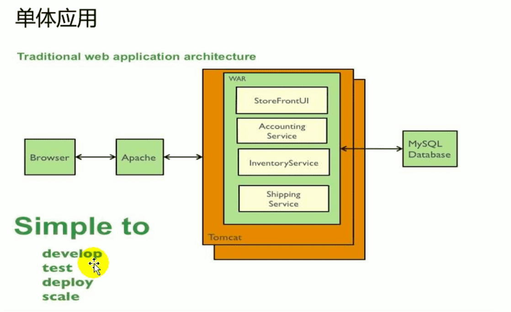


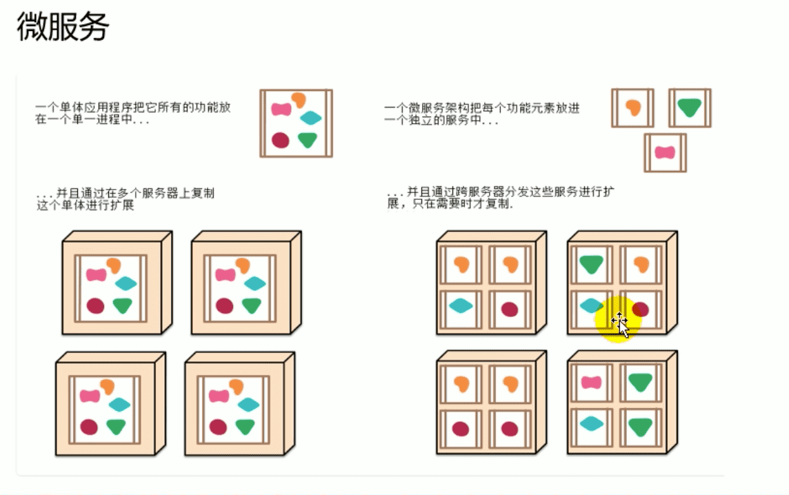

#### 3、开发环境准备

配置使用自己下载的maven

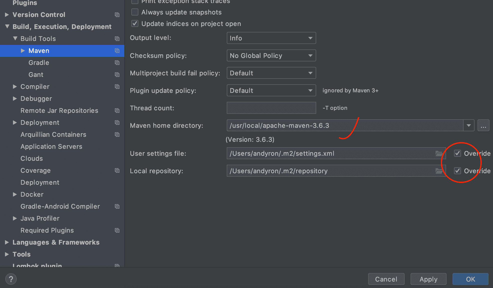


#### 4、Helloworld

##### 1、创建一个Maven工程；（jar）

##### 2、导入springboot相关依赖

##### 3、主程序

```java
/**
 *  @SpringBootApplication 来标注一个主程序类，说明这是一个Spring Boot应用
 */
@SpringBootApplication
public class HelloWorldMainApplication {

    public static void main(String[] args) {

        // Spring应用启动起来
        SpringApplication.run(HelloWorldMainApplication.class,args);
    }
}
```


##### 4、编写相关Controller、service等

```java
@Controller
public class HelloController {

    @ResponseBody
    @RequestMapping("/hello")
    public String hello(){
        return "Hello World!";
    }
}
```


##### 5、运行主程序测试

##### 6、简化部署

```xml
    <!-- 这个插件，可以将应用打包成一个可执行的jar包 --->
		<build>
        <plugins>
            <plugin>
                <groupId>org.springframework.boot</groupId>
                <artifactId>spring-boot-maven-plugin</artifactId>
            </plugin>
        </plugins>
    </build>
```

将应用打包成jar包后，可直接使用`java -jar`命令运行。


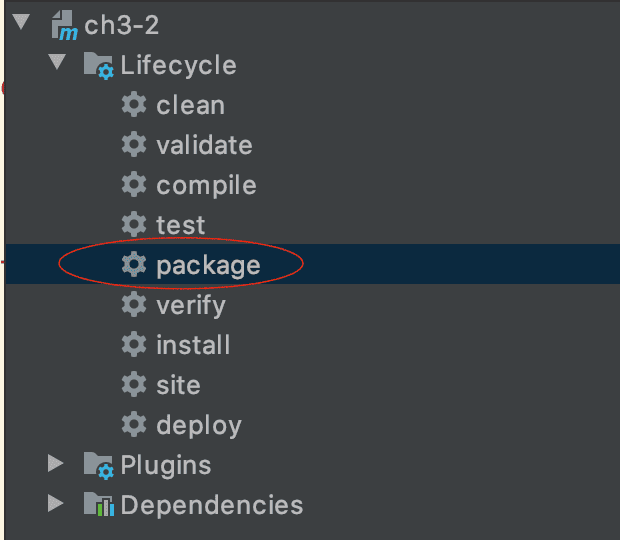

包位置：

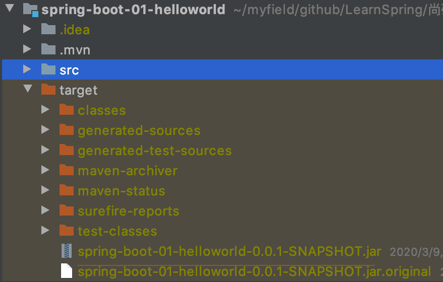

`java -jar spring-boot-01-helloworld-0.0.1-SNAPSHOT.jar`

jar包内部结构：

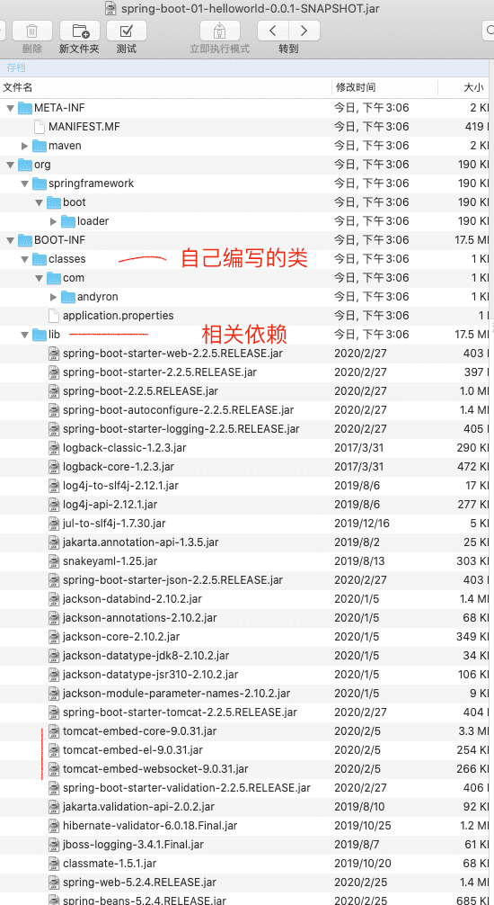

#### 5、Hello World项目探究

##### 1、POM文件

###### 父项目

```xml
<parent>
  <groupId>org.springframework.boot</groupId>
  <artifactId>spring-boot-starter-parent</artifactId>
  <version>2.2.5.RELEASE</version>
  <relativePath/> <!-- lookup parent from repository -->
</parent>
```

在pom.xml中**command+点击** `<artifactId>spring-boot-starter-parent</artifactId>` 跳转到父项目文件 **spring-boot-starter-parent-2.2.5.RELEASE.pom**

```xml
<parent>
  <groupId>org.springframework.boot</groupId>
  <artifactId>spring-boot-dependencies</artifactId>
  <version>2.2.5.RELEASE</version>
  <relativePath>../../spring-boot-dependencies</relativePath>
</parent>
```

**command+点击** 跳转到父项目文件 **spring-boot-dependencies-2.2.5.RELEASE.pom**。
这个文件是**最终包的依赖关系管理文件**，Spring Boot的版本仲裁中心。

这个文件中包括了各种依赖包的版本号，这就是我们导入依赖包，默认不需要写版本了（当然如果没有在这里，就是要写的）

两个`.pom`文件的具体地址：

```
.m2/repository/org/springframework/boot/spring-boot-starter-parent/2.2.5.RELEASE/spring-boot-starter-parent-2.2.5.RELEASE.pom

.m2/repository/org/springframework/boot/spring-boot-dependencies/2.2.5.RELEASE/spring-boot-dependencies-2.2.5.RELEASE.pom
```


###### 启动器

```xml
<dependency>
  <groupId>org.springframework.boot</groupId>
  <artifactId>spring-boot-starter-web</artifactId>
</dependency>
```

**spring-boot-starter**-web:

​		spring-boot-starter-*是spring-boot的场景启动器；帮我们导入了web模块正常运行所依赖的组件；

Spring Boot将所有的功能场景都抽取出来，做成一个个的[starter](https://docs.spring.io/spring-boot/docs/2.3.0.BUILD-SNAPSHOT/reference/html/using-spring-boot.html#using-boot-starter)（启动器），只需要在项目里面引入这些starter，相关场景的所有依赖都会导入进来。


##### 2、主程序类、主入口类??

```java
@SpringBootApplication
public class HelloWorldMainApplication {

    public static void main(String[] args) {
        SpringApplication.run(HelloWorldMainApplication.class, args);
    }
}
```


`@SpringBootApplication`： spring boot的主配置类，Spring Boot就应该运行这个类的main方法来启动spring boot应用；

组合注解

```java
@Target({ElementType.TYPE})
@Retention(RetentionPolicy.RUNTIME)
@Documented
@Inherited
@SpringBootConfiguration
@EnableAutoConfiguration
@ComponentScan(
    excludeFilters = {@Filter(
    type = FilterType.CUSTOM,
    classes = {TypeExcludeFilter.class}
), @Filter(
    type = FilterType.CUSTOM,
    classes = {AutoConfigurationExcludeFilter.class}
)}
)
public @interface SpringBootApplication {
```

**@SpringBootConfiguration** ：表示是Spring Boot的配置类；

​		`@Configuration`：  配置类替代以前的配置文件；配置类也是容器中的一个组件；`@Component`

**@EnableAutoConfiguration**： 开启自动配置功能；

```java
@AutoConfigurationPackage
@Import({AutoConfigurationImportSelector.class})
public @interface EnableAutoConfiguration {
```

**@AutoConfigurationPackage**：自动配置包

​	`@Import({Registrar.class})`：Spring的底层注解`@Import`

​			**将主配置类（`@SpringBootApplication`标注的类）的所在包及下面所有子包里面的所有组件扫描到Spring容器；**

​		`@Import({AutoConfigurationImportSelector.class})` ： 导入那些组件到选择器中。


**Spring Boot在启动的时候从类路径下的META-INF/spring.factories中获取EnableAutoConfiguration指定的值，将这些值作为自动配置类导入到容器中，自动配置类就生效，帮我们进行自动配置工作；**

J2EE的整体整合解决方案和自动配置都在`spring-boot-autoconfigure-2.2.5.RELEASE.jar` (`.m2/repository/org/springframework/boot/spring-boot-autoconfigure/2.2.5.RELEASE/spring-boot-autoconfigure-2.2.5.RELEASE.jar!/org/springframework/boot/autoconfigure`)


#### 6、使用Spring Initializer快速创建Spring Boot项目

`@ResponseBody`  


resource文件夹目录结构

	- static：
	- templates：保存所有模板页面（SringBoot默认使用jar包嵌入式的Tomcat，默认不支持JSP页面）；可以使用模板引起（freemarker、thymeleaf）


### 二、Spring Boot配置

#### 1、配置文件

`application.properties`

`application.yml`

YAML:以数据为中心，比json、xml等更适合做配置文件；

#### 2、YAML语法

##### 基本语法

k:(空格)v：表示一对键值对（空格必须有）；

以**空格**的缩进来控制层级关系；只要是左对齐的一列数据，都是同一个层级的

```yaml
server:
    port: 8081
    path: /hello
```

属性和值也是大小写敏感；

##### 值的写法

- 字面量：普通的值（数字、字符串、布尔）

  k:v   

  字符串默认不用加上单引号或双引号；（单引号中特殊字符是普通字符，双引号中则会看成本身的意思）	

- 对象、Map（属性和值）（键值对）：

  k:v​：

  ```yaml
  friends:
  		lastName: andyron
  		age: 20
  ```

  行内写法：

  ```yaml
  friends: {lastName: andyron, age: 18}
  ```

- 数组(List, Set)：

  用- 值表示数组的一个元素

  ```yaml
  pets:
  	- cat 
  	- dog
  	- pig
  ```

  行内写法：

  ```yaml
  pets: [cat,dog,pig]
  ```


3、配置文件注入

配置文件：

```yaml
person:
    lastName: zhangsn
    age: 18
    boss: false
    birth: 2020/3/1
    maps: {k1: v1,k2: 12}
    lists:
      - lisi
      - zhaoliu
    dog:
      name: 小狗
      age: 4
```

javaBean：

```java
/**
 * 将配置文件中配置的每一个属性的值，隐射到这个组件中
 * @ConfigurationProperties 告诉SpringBoot将本类中的所有属性和配置文件中相关的配置进行绑定
 *
 * 只有这个组件是容器中的组件（@Component），才能使用容器提供的@ConfigurationProperties功能；
 */
@Component
@ConfigurationProperties(prefix = "person")
public class Person {

    private String  lastNmae;
    private Integer age;
    private Boolean boss;
    private Date birth;

    private Map<String, Object> maps;
    private List<Object> lists;
    private Dog dog;
```

配置依赖：

```xml
				<!-- 导入配置文件处理器，配置文件进行绑定就会有提示 -->
        <dependency>
            <groupId>org.springframework.boot</groupId>
            <artifactId>spring-boot-configuration-processor</artifactId>
            <optional>true</optional>
        </dependency>
```


#### 3、配置文件值注入

##### @ConfigurationProperties

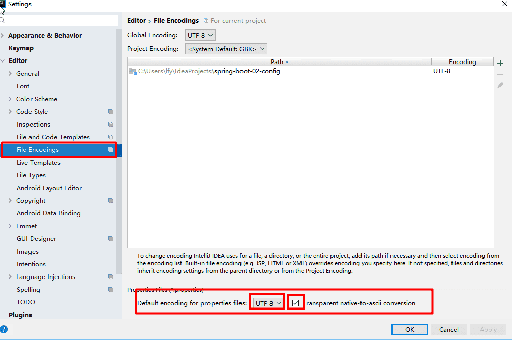

?? 依旧输出乱码

##### @Value获取值和@ConfigurationProperties获取值的比较

```java
@Value()
```


如果只是在某个业务逻辑中需要获取一下配置文件中的某项值，使用@Value；

如果专门编写了一个javaBean来和配置文件进行隐射，就直接使用@ConfigurationProperties；


##### @PropertySource()

```java
@PropertySource(value = {"classpath:person.properties"})
```

从非全局配置文件中获取值

##### @ImportResource() 

导入自定义的Spring的配置文件（如，这边的`beans.xml`），让配置文件里面的内容生效；

```java
@ImportResource(locations = {"classpath:beans.xml"})
```

springboot不推荐使用@ImportResource() 方式添加组件了。

springboot推荐**全注解的方式**给容器中添加组件：配置类替代spring配置文件，`@Bean`给容器添加组件。

#### 4、配置文件占位符

##### 随机数

##### 指定默认值


#### 5、Profile

不同环境提供不同配置功能

##### 多profile文件形式

`application-{profile}.properties`

##### yml支持多文档块方式

```yaml
server:
  port: 8081
spring:
  profiles:
    active: dev
---
server:
  port: 8083

spring:
  profiles: dev
---
server:
  port: 8084

spring:
  profiles: prod

```


##### 激活指定profile

- Spring.profiles.active=dev

- 命令行参数 `--spring.profiles.active=dev`

  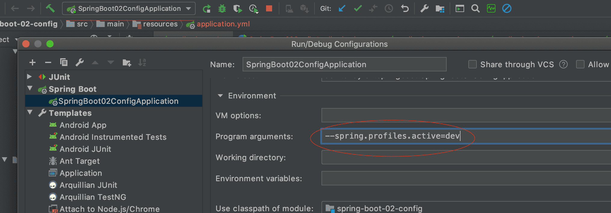

- 虚拟机参数 `-Dspring.profiles.active=dev`


#### 6、配置文件加载位置

springboot 启动会扫描以下位置的application.properties或者application.yml文件作为Spring boot的默认配置文件

- file:./config/

- file:./

- classpath:/config/

- classpath:/

**优先级由高到底**，高优先级的配置会覆盖低优先级的配置；

SpringBoot会从这四个位置全部加载主配置文件；**互补配置**；


我们还可以通过spring.config.location来改变默认的配置文件位置。

在命令行中指定配置文件，在项目打完包后很好的测试。

```shell
java -jar spring-boot-02-config-02-0.0.1-SNAPSHOT.jar --spring.config.location=/Users/andyron/myfield/tmp/application.properties
```


#### 7、外部配置加载顺序

**SpringBoot也可以从以下位置加载配置； 优先级从高到低；高优先级的配置覆盖低优先级的配置，所有的配置会形成互补配置**

1. **命令行参数**

所有的配置都可以在命令行上进行指定

java -jar spring-boot-02-config-02-0.0.1-SNAPSHOT.jar --server.port=8087  --server.context-path=/abc

多个配置用空格分开； --配置项=值

2. 来自java:comp/env的JNDI属性

3. Java系统属性（System.getProperties()）

4. 操作系统环境变量

5. RandomValuePropertySource配置的random.*属性值

   **由jar包外向jar包内进行寻找；**

   **优先加载带profile**

6. **jar包外部的application-{profile}.properties或application.yml(带spring.profile)配置文件**

7. **jar包内部的application-{profile}.properties或application.yml(带spring.profile)配置文件**

​	**再来加载不带profile**

8. **jar包外部的application.properties或application.yml(不带spring.profile)配置文件**

9. **jar包内部的application.properties或application.yml(不带spring.profile)配置文件**

10. @Configuration注解类上的@PropertySource

11. 通过SpringApplication.setDefaultProperties指定的默认属性

所有支持的配置加载来源；

参考官方文档： [Externalized Configuration](https://docs.spring.io/spring-boot/docs/2.3.0.BUILD-SNAPSHOT/reference/html/spring-boot-features.html#boot-features-external-config)

#### 8、自动配置原理??

[配置文件]()


精髓：

1）SpringBoot启动会加载大量的自动配置类；

2）

3）

4）给容器中自动配置类添加组件的时候，会从properties类中获取某些属性。我们就可以在配置文件中指定


##### 细节


### 三、日志

#### 1、日志框架

 小张；开发一个大型系统；

​		1、System.out.println("")；将关键数据打印在控制台；去掉？写在一个文件？

​		2、框架来记录系统的一些运行时信息；日志框架 ；  zhanglogging.jar；

​		3、高大上的几个功能？异步模式？自动归档？xxxx？  zhanglogging-good.jar？

​		4、将以前框架卸下来？换上新的框架，重新修改之前相关的API；zhanglogging-prefect.jar；

​		5、JDBC---数据库驱动；

​			写了一个统一的接口层；日志门面（日志的一个抽象层）；logging-abstract.jar；

​			给项目中导入具体的日志实现就行了；我们之前的日志框架都是实现的抽象层


市面上的日志框架：

JUL、JCL、Jboss-logging、logback、log4就、log4j2、slf4j...

| 日志门面（日志的抽象层）                                     | 日志实现                                           |
| ------------------------------------------------------------ | -------------------------------------------------- |
| ~~JCK(Jakarta Commons Logging)~~, **SLF4J**(Simple Logging Facade for Java), ~~jboss-logging~~ | Log4j, JUL(java.util.logging), Log4j2, **Logback** |

SpringBoot选用 **SLF4J** + **Logback**

#### 2、SLF4J使用

##### 如何在系统中使用SLF4J

以后开发的时候，日志记录方法的调用，不应该直接调用日志的实现类，而是调用日志抽象层里的方法。

先导入slf4j和logback的jar。[slf4j用户手册](http://www.slf4j.org/manual.html)

```java
import org.slf4j.Logger;
import org.slf4j.LoggerFactory;

public class HelloWorld {
  public static void main(String[] args) {
    Logger logger = LoggerFactory.getLogger(HelloWorld.class);
    logger.info("Hello World");
  }
}
```

默认实现是使用logback，当然也可以使用其他实现。

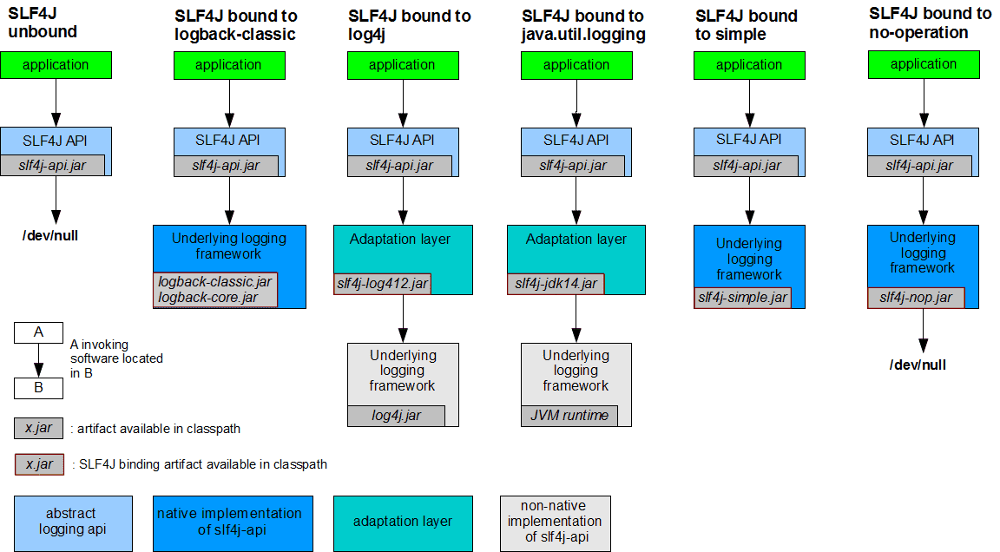

每一个日志的实现框架都有自己的配置文件。使用slf4j以后，**配置文件还是做层日志实现框架自己的配置文件**；

##### 遗留问题

a(slf4j+logback）：Spring（commons-logging）、Hibernate（jboss-logging）、MyBatis、...

不同框架使用了不同日志系统。

统一日志记录，即使是别的框架也可以一起统一使用slf4j进行输出：

图片来源是[官方遗留问题处理](http://www.slf4j.org/legacy.html)

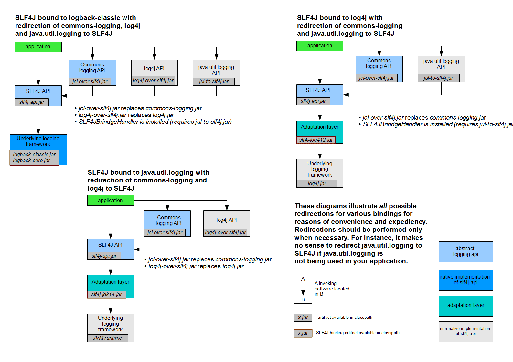


如何让系统中所有的日志都统一到slf4j：

1. 将系统中其它日志框架先排除出去；
2. 用中间包来替代原有的日志框架（如上图的jcl-over-slf4j.jar等）；
3. 导入slf4j其它的实现。

#### 3、SpringBoot日志关系

在pom文件中**右击-Diagrams**产生依赖图表关系图。

每一个场景启动器都需要依赖`spring-boot-starter`：

```xml
		<dependency>
      <groupId>org.springframework.boot</groupId>
      <artifactId>spring-boot-starter</artifactId>
      <version>2.2.5.RELEASE</version>
      <scope>compile</scope>
    </dependency>
```

日志功能依赖：

```xml
    <dependency>
      <groupId>org.springframework.boot</groupId>
      <artifactId>spring-boot-starter-logging</artifactId>
      <version>2.2.5.RELEASE</version>
      <scope>compile</scope>
    </dependency>
```

底层依赖关系(最新版本的有所变化)

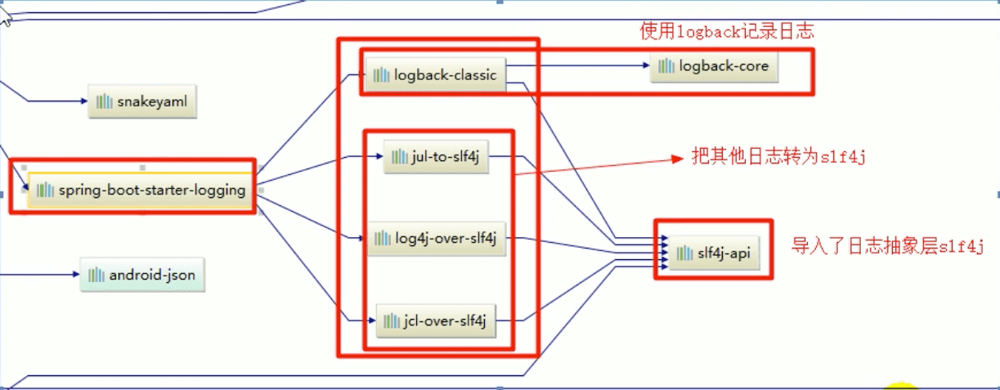

总结：

​	1）、SpringBoot底层也是使用slf4j+logback的方式进行日志记录；

​	2）、SpringBoot也把其他的日志都替换成了slf4j；

​	3）、中间替换包？

```java
@SuppressWarnings("rawtypes")
public abstract class LogFactory {

    static String UNSUPPORTED_OPERATION_IN_JCL_OVER_SLF4J = "http://www.slf4j.org/codes.html#unsupported_operation_in_jcl_over_slf4j";

    static LogFactory logFactory = new SLF4JLogFactory();
```

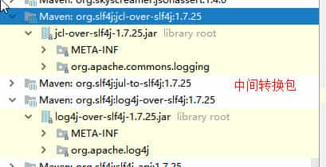		

​	4）、如果引入其他框架，一定要把这个框架的默认日志依赖移除掉。

​			spring框架用的commons-logging,默认也移除了（新版可能有点变化）：

```xml
		<dependency>
			<groupId>org.springframework</groupId>
			<artifactId>spring-core</artifactId>
			<exclusions>
				<exclusion>
					<groupId>commons-logging</groupId>
					<artifactId>commons-logging</artifactId>
				</exclusion>
			</exclusions>
		</dependency>
```


**SpringBoot能自动适配所有的日志，而且底层使用slf4j+logback的方式记录日志，引入其他框架的时候，只需要把这个框架依赖的日志框架排除掉。**

#### 4、日志使用

##### 默认配置

```java
    // 记录器
    Logger logger = LoggerFactory.getLogger(getClass());

    @Test
    void contextLoads() {

        // 日志的级别有低到高： trace < debug < info < warn < error
        // 可以调整输出的日志级别；日志就会在这个级别以后的高级别生效
        // Spring Boot默认日志界别是info，在配置文件里配置
        logger.trace("这是trace日志...");
        logger.debug("这是debug日志...");
        logger.info("这是info日志...");
        logger.warn("这是warn日志...");
        logger.error("这是error日志...");
    }
```


配置

```properties

# 当前项目下生成日志
#logging.file=springboot.log
# 也可以指定完整路径，默认在指定路径下生成一个spring.log文件
logging.file.path=/Users/andyron/myfield/tmp

# 在控制台输出的日志格式
logging.pattern.console=%d{yyyy-MM-dd}  [%thread] %-5level %logger{50} - %msg%n
# 指定文件中输出的日志格式
logging.pattern.file=%{yyyy-MM-dd} === [%thread] === %-5level === %logger{50} ==== - %msg%n
```

```
    日志输出格式：
		%d表示日期时间，
		%thread表示线程名，
		%-5level：级别从左显示5个字符宽度
		%logger{50} 表示logger名字最长50个字符，否则按照句点分割。 
		%msg：日志消息，
		%n是换行符
    -->
    %d{yyyy-MM-dd HH:mm:ss.SSS} [%thread] %-5level %logger{50} - %msg%n
```

SpringBoot修改日志的默认配置

```properties
logging.level.com.atguigu=trace


#logging.path=
# 不指定路径在当前项目下生成springboot.log日志
# 可以指定完整的路径；
#logging.file=G:/springboot.log

# 在当前磁盘的根路径下创建spring文件夹和里面的log文件夹；使用 spring.log 作为默认文件
logging.path=/spring/log

#  在控制台输出的日志的格式
logging.pattern.console=%d{yyyy-MM-dd} [%thread] %-5level %logger{50} - %msg%n
# 指定文件中日志输出的格式
logging.pattern.file=%d{yyyy-MM-dd} === [%thread] === %-5level === %logger{50} ==== %msg%n
```

| logging.file | logging.path | Example  | Description                        |
| ------------ | ------------ | -------- | ---------------------------------- |
| (none)       | (none)       |          | 只在控制台输出                     |
| 指定文件名   | (none)       | my.log   | 输出日志到my.log文件               |
| (none)       | 指定目录     | /var/log | 输出到指定目录的 spring.log 文件中 |


##### 指定配置

给类路径下放上每个日志框架自己的配置文件接口；SpringBoot就不使用他默认配置的了。

| Logging System          | Customization                                                |
| :---------------------- | :----------------------------------------------------------- |
| Logback                 | `logback-spring.xml`, `logback-spring.groovy`, `logback.xml`, or `logback.groovy` |
| Log4j2                  | `log4j2-spring.xml` or `log4j2.xml`                          |
| JDK (Java Util Logging) | `logging.properties`                                         |

 `logback.xml`：直接被日志框架识别了；

`logback-spring.xml` 或 `log4j2-spring.xml`：日志框架就不直接加载日志的配置项，有SpringBoot加载，就可以有`<springProfile>`标签功能

```xml
<springProfile name="dev | staging">
    <!-- configuration to be enabled when the "dev" or "staging" profiles are active -->
  	可以指定某段配置只在某个环境下生效
</springProfile>
```


#### 5、切换日志框架??

可以按照slf4j的日志适配图，进行相关的切换；


### 四、Spring Boot与Web开发

#### 1、简介

使用SpringBoot：

1）、创建SpringBoot应用，选中我们需要的模块；

2）、SpringBoot已经默认将这些场景配置好了，只需要在配置文件中指定少量配置就可以运行起来

3）、编写业务代码；


**自动配置原理**

```
xxxxAutoConfiguration：帮我们给容器中自动配置组件；
xxxxProperties：配置类来封装配置文件的内容；
```


#### 2、SpringBoot对静态资源的映射规则

Spring MVC的相关配置都在`org.springframework.boot.autoconfigure.web.servlet。WebMvcAutoConfiguration`里，添加资源映射：

```java
        public void addResourceHandlers(ResourceHandlerRegistry registry) {
            if (!this.resourceProperties.isAddMappings()) {
                logger.debug("Default resource handling disabled");
            } else {
                Duration cachePeriod = this.resourceProperties.getCache().getPeriod();
                CacheControl cacheControl = this.resourceProperties.getCache().getCachecontrol().toHttpCacheControl();
              	// 访问`/webjars/**`时
                if (!registry.hasMappingForPattern("/webjars/**")) {
                    this.customizeResourceHandlerRegistration(registry.addResourceHandler(new String[]{"/webjars/**"}).addResourceLocations(new String[]{"classpath:/META-INF/resources/webjars/"}).setCachePeriod(this.getSeconds(cachePeriod)).setCacheControl(cacheControl));
                }

                String staticPathPattern = this.mvcProperties.getStaticPathPattern();
              	// 我们自己的静态资源
                if (!registry.hasMappingForPattern(staticPathPattern)) {
                    this.customizeResourceHandlerRegistration(registry.addResourceHandler(new String[]{staticPathPattern}).addResourceLocations(WebMvcAutoConfiguration.getResourceLocations(this.resourceProperties.getStaticLocations())).setCachePeriod(this.getSeconds(cachePeriod)).setCacheControl(cacheControl));
                }

            }
        }
```

```java
@ConfigurationProperties(
    prefix = "spring.resources",
    ignoreUnknownFields = false
)
public class ResourceProperties {
  // 可以设置和静态资源有关的参数，缓存时间
```

```java
this.staticPathPattern = "/**";
```


1）、所有`/webjars/**`，都去`classpath:/META-INF/resources/webjars/`中找资源；

webjars：以jar包的方式引入静态资源；

https://www.webjars.org/

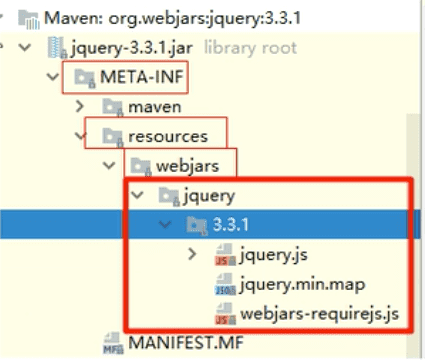

`localhost:8080/webjars/jquery/3.4.1/jquery.js`

```xml
				<!-- 引入jQuery webjars -->
        <dependency>
            <groupId>org.webjars</groupId>
            <artifactId>jquery</artifactId>
            <version>3.4.1</version>
        </dependency>
```


2）、`/**`   访问当前项目的任何静态资源，在下面目录寻找

```
"classpath:/META-INF/resources/", 
"classpath:/resources/", 
"classpath:/static/", 
"classpath:/public/"
"/"			当前项目的根目录
```

`classpath:`是指 `src/main/java`或`src/main/resources`路径下的。

例如：`src/main/resources/static/js/my.js` 可以通过`http://localhost:8080/js/my.js`访问，

  `src/main/resources/resources/test.html` 可以通过`http://localhost:8080/test.html`访问

> 静态目录也是可以在配置文件中配置的  `spring.resources.static-locations=classpath:xxx`

3)、欢迎页；静态资源的

```java
				@Bean
        public WelcomePageHandlerMapping welcomePageHandlerMapping(ApplicationContext applicationContext, FormattingConversionService mvcConversionService, ResourceUrlProvider mvcResourceUrlProvider) {
            WelcomePageHandlerMapping welcomePageHandlerMapping = new WelcomePageHandlerMapping(new TemplateAvailabilityProviders(applicationContext), applicationContext, this.getWelcomePage(), this.mvcProperties.getStaticPathPattern());
            welcomePageHandlerMapping.setInterceptors(this.getInterceptors(mvcConversionService, mvcResourceUrlProvider));
            return welcomePageHandlerMapping;
        }
```

4)、所有的 /favicon.ico


#### 3、模板引擎

SpringBoot推荐的Thymeleaf，语法简单，功能强大


##### 引入Thymeleaf

```xml
				<dependency>
            <groupId>org.springframework.boot</groupId>
            <artifactId>spring-boot-starter-thymeleaf</artifactId>
        </dependency>
```


##### Thymeleaf使用和语法

```java
org.springframework.boot.autoconfigure.thymeleaf.ThymeleafProperties
```

```java
@ConfigurationProperties(
    prefix = "spring.thymeleaf"
)
public class ThymeleafProperties {
    private static final Charset DEFAULT_ENCODING;
    public static final String DEFAULT_PREFIX = "classpath:/templates/";
    public static final String DEFAULT_SUFFIX = ".html";
    private boolean checkTemplate = true;
    private boolean checkTemplateLocation = true;
    private String prefix = "classpath:/templates/";
    private String suffix = ".html";
    private String mode = "HTML";
```

https://www.thymeleaf.org/

使用：

1. 导入thymeleaf的名称空间，在IDEA中就会有语法提示了：

   ```html
   <html lang="en" xmlns:th="http://www.thymeleaf.org">
   ```

2. 使用thymeleaf的语法

```html
<!DOCTYPE html>
<html lang="en" xmlns:th="http://www.thymeleaf.org">
<head>
    <meta charset="UTF-8">
    <title>Success</title>
</head>
<body>

    <h1>成功</h1>
    <div th:text="${hello}" ></div>
</body>
</html>
```


##### 语法规则

1）、th:text : 改变当前元素里面的文本内容；

​	th ： 任意html属性，来替换原生属性的值。

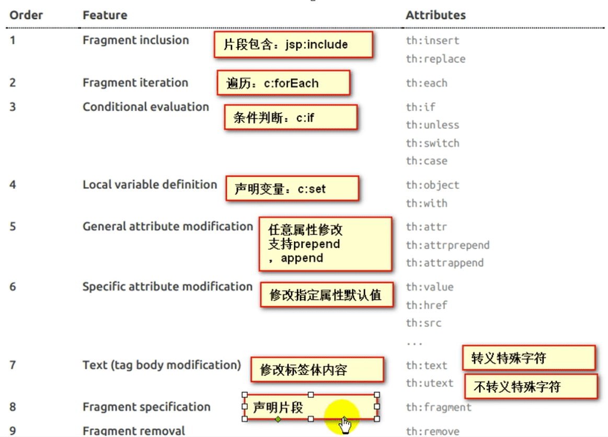

2）、表达式

```properties
- Simple expressions:
    VariableExpressions: ${...}    // 获取变量值；OGNL（对象导航图语言）；
    		1.获取对象的属性、调用方法
    		2.使用内置的基本对象：如： ${session.foo}
          #ctx : the context object.
          #vars: the context variables.
          #locale : the context locale.
          #request : (only in Web Contexts) the HttpServletRequest object. 
          #response : (only in Web Contexts) the HttpServletResponse object. 
          #session : (only in Web Contexts) the HttpSession object. 
          #servletContext : (only in Web Contexts) the ServletContext object.
        3.内置的一些工具对象
        	#execInfo : information about the template being processed.
					#messages : methods for obtaining externalized messages inside variables expressions, in the same way as they would be obtained using #{...} syntax.
  				#uris : methods for escaping parts of URLs/URIs
  				#conversions : methods for executing the configured conversion service (if any).
          #dates : methods for java.util.Date objects: formatting, component extraction, etc.
          #calendars : analogous to #dates , but for java.util.Calendar objects.
          #numbers : methods for formatting numeric objects.
          #strings : methods for String objects: contains, startsWith, prepending/appending, etc.
          #objects : methods for objects in general.
          #bools : methods for boolean evaluation.
          #arrays : methods for arrays.
          #lists : methods for lists.
          #sets : methods for sets.
          #maps : methods for maps.
          #aggregates : methods for creating aggregates on arrays or collections.
          #ids : methods for dealing with id attributes that might be repeated (for example, as a result of an iteration).
  
    SelectionVariableExpressions: *{...}   // 类似${...}，
    		补充可配合th:object="${session.user}"使用：
    				<div th:object="${session.user}">
            	<p>Name: <span th:text="*{firstName}">Sebastian</span>.</p> 
            	<p>Surname: <span th:text="*{lastName}">Pepper</span>.</p> 
            	<p>Nationality: <span th:text="*{nationality}">Saturn</span>.</p>
            </div>
    MessageExpressions: #{...}   // 获取国际化内容
    LinkURLExpressions: @{...}    // 定义URL
    Fragment Expressions: ~{...}  // 片段引用
      
- Literals
    Text literals: 'one text' , 'Another one!' ,... 
    Number literals: 0 , 34 , 3.0 , 12.3 ,... 
    Boolean literals: true , false
    Nullliteral: null
    Literal tokens: one , sometext , main ,... 
      
- Text operations:  // 文本操作
    Stringconcatenation: +
    Literal substitutions: |The name is ${name}|
      
- Arithmetic operations: 
    Binaryoperators: +, -, *, /, %
    Minussign(unaryoperator): - 
 
- Boolean operations:
    Binary operators: and , or
    Boolean negation (unary operator): ! , not

- Comparisons and equality:
  	Comparators: >, <, >=, <= (gt, lt, ge, le)
  	Equality operators: == , != ( eq , ne ) 

- Conditional operators:
    If-then: (if) ? (then)
    If-then-else: (if) ? (then) : (else)   // 三元运算符
    Default: (value) ?: (defaultvalue)

```


#### 4、Spring MVC自动配置  p31!!

https://docs.spring.io/spring-boot/docs/2.1.13.RELEASE/reference/html/boot-features-developing-web-applications.html#boot-features-spring-mvc-auto-configuration

##### 4.1 Spring MVC auto-configuration

Spring Boot 自动配置好了SpringMVC。

以下是SpringBoot对SpringMVC的默认配置:  **WebMvcAutoConfiguration**

- Inclusion of `ContentNegotiatingViewResolver` and `BeanNameViewResolver` beans.

  - 自动配置了ViewResolver（视图解析器：根据方法的返回值得到视图对象（View），视图对象决定如何渲染（转发？重定向？））
  - `ContentNegotiatingViewResolver`：组合所有的视图解析器的；
  - **如何定制**：我们可以自己给容器中添加一个视图解析器；`ContentNegotiatingViewResolver` 就会自动的将其组合进来；

  在SpringBoot04WebRestfulcrudApplication中添加：

  ```java
   		@Bean
      public ViewResolver myViewResolver() {
          return new MyViewResolver();
      }
  
      private static class MyViewResolver implements ViewResolver {
  
          @Override
          public View resolveViewName(String s, Locale locale) throws Exception {
              return null;
          }
      }
  ```

  都会经过`DispatcherServlet.doDispatch()`方法，在这个方法出打断点，然后以debug方式运行，然后再浏览器中任意访问，会发现我上面自定义的视图解析器已经被加载：

  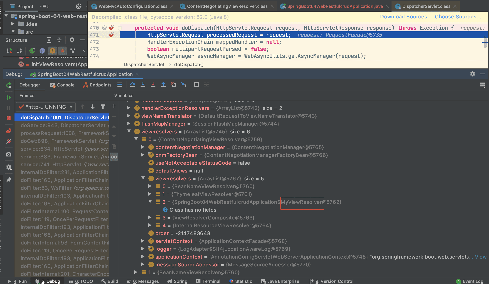

​	

- Support for serving static resources, including support for WebJars (see below).静态资源文件夹路径,webjars

- Static `index.html` support. 静态首页访问

- Custom `Favicon` support (see below).  favicon.ico

- 自动注册了 of `Converter`, `GenericConverter`, `Formatter` beans.

  - `Converter`：转换器；  `public String hello(User user)`：类型转换使用Converter
  - `Formatter`  格式化器；  2017.12.17===Date；

```java
		@Bean
		@ConditionalOnProperty(prefix = "spring.mvc", name = "date-format")//在文件中配置日期格式化的规则
		public Formatter<Date> dateFormatter() {
			return new DateFormatter(this.mvcProperties.getDateFormat());//日期格式化组件
		}
```

​	**自己添加的格式化器转换器，我们只需要放在容器中即可**

- Support for `HttpMessageConverters` (see below).

  - `HttpMessageConverter`：SpringMVC用来转换Http请求和响应的；User---Json；

  - `HttpMessageConverters` 是从容器中确定；获取所有的HttpMessageConverter；

    自己给容器中添加HttpMessageConverter，只需要将自己的组件注册容器中（@Bean,@Component）

    

- Automatic registration of `MessageCodesResolver` (see below).  **定义错误代码生成规则**

- Automatic use of a `ConfigurableWebBindingInitializer` bean (see below).

  我们可以配置一个`ConfigurableWebBindingInitializer`来替换默认的；（添加到容器）

  ```
  初始化WebDataBinder(web书籍绑定器)；
  请求数据=====JavaBean；
  ```


**org.springframework.boot.autoconfigure.web：web的所有自动场景；**

If you want to keep Spring Boot MVC features, and you just want to add additional [MVC configuration](https://docs.spring.io/spring/docs/4.3.14.RELEASE/spring-framework-reference/htmlsingle#mvc) (interceptors, formatters, view controllers etc.) you can add your own `@Configuration` class of type `WebMvcConfigurerAdapter`, but **without** `@EnableWebMvc`. If you wish to provide custom instances of `RequestMappingHandlerMapping`, `RequestMappingHandlerAdapter` or `ExceptionHandlerExceptionResolver` you can declare a `WebMvcRegistrationsAdapter` instance providing such components.

If you want to take complete control of Spring MVC, you can add your own `@Configuration` annotated with `@EnableWebMvc`.

##### 扩展SpringMVC

以前Spring MVC的配置：

```xml
    <mvc:view-controller path="/andyron" view-name="success"/>
    <mvc:interceptors>
        <mvc:interceptor>
            <mvc:mapping path="/andyorn"/>
            <bean></bean>
        </mvc:interceptor>
    </mvc:interceptors>
```

**编写一个配置类（@Configuration），是WebMvcConfigurerAdapter类型；不能标注@EnableWebMvc**;

既保留了所有的自动配置，也能用我们扩展的配置；

```java
@Configuration
public class MyMvcConfig extends WebMvcConfigurerAdapter {

    @Override
    public void addViewControllers(ViewControllerRegistry registry) {
//        super.addViewControllers(registry);
        // 用/andyron 替代了 /success （这个请求已经被替代）
        registry.addViewController("andyron").setViewName("success");
    }

}
```

原理：

​	1）、WebMvcAutoConfiguration是SpringMVC的自动配置类

​	2）、在做其他自动配置时会导入；@Import(**EnableWebMvcConfiguration**.class)

```java
    @Configuration
	public static class EnableWebMvcConfiguration extends DelegatingWebMvcConfiguration {
      private final WebMvcConfigurerComposite configurers = new WebMvcConfigurerComposite();

	 //从容器中获取所有的WebMvcConfigurer
      @Autowired(required = false)
      public void setConfigurers(List<WebMvcConfigurer> configurers) {
          if (!CollectionUtils.isEmpty(configurers)) {
              this.configurers.addWebMvcConfigurers(configurers);
            	
            //一个参考实现；将所有的WebMvcConfigurer相关配置都来一起调用；  
            	@Override
             // public void addViewControllers(ViewControllerRegistry registry) {
              //    for (WebMvcConfigurer delegate : this.delegates) {
               //       delegate.addViewControllers(registry);
               //   }
              }
          }
	}
```

​	3）、容器中所有的WebMvcConfigurer都会一起起作用；

​	4）、我们自定义的配置类也会被调用；

​	效果：SpringMVC的自动配置和我们的扩展配置都会起作用；


##### 4.3 全面接管Spring MVC


**只需要在配置类中添加@EnableWebMvc即可，**就会让SpringMVC的自动配置都失效，如静态资源等。（当然平常开发不推荐）

原理：

为什么@EnableWebMvc会让自动配置就失效了；

1）@EnableWebMvc的核心，引入了DelegatingWebMvcConfiguration

```java
@Import(DelegatingWebMvcConfiguration.class)
public @interface EnableWebMvc {
```

2）、而DelegatingWebMvcConfiguration继承至WebMvcConfigurationSupport

```java
@Configuration
public class DelegatingWebMvcConfiguration extends WebMvcConfigurationSupport {
```

3）、WebMvcConfigurationSupport导入后，自动配置就不能生效

```java
@Configuration
@ConditionalOnWebApplication
@ConditionalOnClass({ Servlet.class, DispatcherServlet.class,
		WebMvcConfigurerAdapter.class })
//容器中没有这个组件的时候，这个自动配置类才生效
@ConditionalOnMissingBean(WebMvcConfigurationSupport.class)
@AutoConfigureOrder(Ordered.HIGHEST_PRECEDENCE + 10)
@AutoConfigureAfter({ DispatcherServletAutoConfiguration.class,
		ValidationAutoConfiguration.class })
public class WebMvcAutoConfiguration {
```


#### 5、如何修改SpringBoot的默认配置

模式：

​	1）、SpringBoot在自动配置很多组件的时候，先看容器中有没有用户自己配置的（@Bean、@Component）如果有就用用户配置的，如果没有，才自动配置；如果有些组件可以有多个（ViewResolver）将用户配置的和自己默认的组合起来；

​	2）、在SpringBoot中会有非常多的**xxxConfigurer**帮助我们进行扩展配置

​	3）、在SpringBoot中会有很多的xxxCustomizer帮助我们进行定制配置


#### 6、RestfulCRUD

##### 默认访问首页


##### 6.2 国际化

**1）、编写国际化配置文件；**

2）、使用ResourceBundleMessageSource管理国际化资源文件

3）、在页面使用fmt:message取出国际化内容


步骤：

1）、编写国际化配置文件，抽取页面需要显示的国际化消息

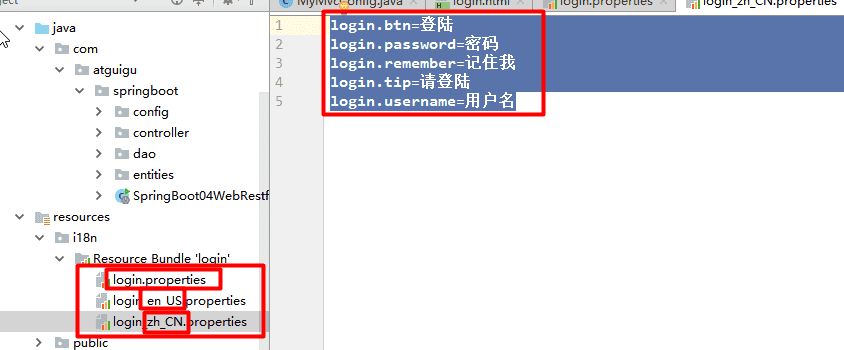


2）、SpringBoot自动配置好了管理国际化资源文件的组件；

```java
@ConfigurationProperties(prefix = "spring.messages")
public class MessageSourceAutoConfiguration {
    
    /**
	 * Comma-separated list of basenames (essentially a fully-qualified classpath
	 * location), each following the ResourceBundle convention with relaxed support for
	 * slash based locations. If it doesn't contain a package qualifier (such as
	 * "org.mypackage"), it will be resolved from the classpath root.
	 */
	private String basename = "messages";  
    //我们的配置文件可以直接放在类路径下叫messages.properties；
    
    @Bean
	public MessageSource messageSource() {
		ResourceBundleMessageSource messageSource = new ResourceBundleMessageSource();
		if (StringUtils.hasText(this.basename)) {
            //设置国际化资源文件的基础名（去掉语言国家代码的）
			messageSource.setBasenames(StringUtils.commaDelimitedListToStringArray(
					StringUtils.trimAllWhitespace(this.basename)));
		}
		if (this.encoding != null) {
			messageSource.setDefaultEncoding(this.encoding.name());
		}
		messageSource.setFallbackToSystemLocale(this.fallbackToSystemLocale);
		messageSource.setCacheSeconds(this.cacheSeconds);
		messageSource.setAlwaysUseMessageFormat(this.alwaysUseMessageFormat);
		return messageSource;
	}
```

3）、在页面中获取国际化的值；

把**File > Other Settings > Default Settings** (最新的版本已经变成**Perference for New Projects**) 编码格式都改成UTF-8。（这边的改动相当于全局改动，而不是单个项目）

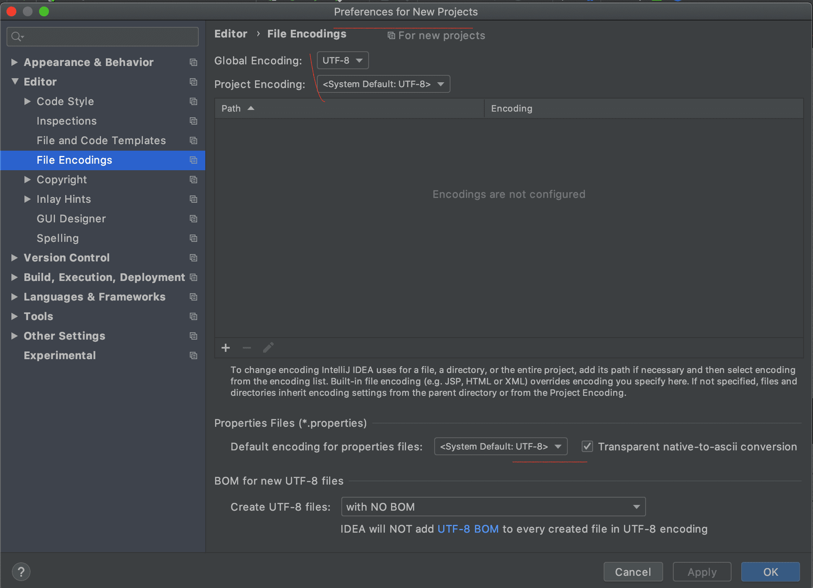

原理：

​	国际化Locale（区域信息对象）；LocaleResolver（获取区域信息对象）；

```java
		@Bean
		@ConditionalOnMissingBean
		@ConditionalOnProperty(prefix = "spring.mvc", name = "locale")
		public LocaleResolver localeResolver() {
			if (this.mvcProperties
					.getLocaleResolver() == WebMvcProperties.LocaleResolver.FIXED) {
				return new FixedLocaleResolver(this.mvcProperties.getLocale());
			}
			AcceptHeaderLocaleResolver localeResolver = new AcceptHeaderLocaleResolver();
			localeResolver.setDefaultLocale(this.mvcProperties.getLocale());
			return localeResolver;
		}
默认的就是根据请求头带来的区域信息获取Locale进行国际化
```

4）、点击链接切换国际化

```java
/**
 * 可以在连接上携带区域信息
 */
public class MyLocaleResolver implements LocaleResolver {
    
    @Override
    public Locale resolveLocale(HttpServletRequest request) {
        String l = request.getParameter("l");
        Locale locale = Locale.getDefault();
        if(!StringUtils.isEmpty(l)){
            String[] split = l.split("_");
            locale = new Locale(split[0],split[1]);
        }
        return locale;
    }

    @Override
    public void setLocale(HttpServletRequest request, HttpServletResponse response, Locale locale) {

    }
}


```

```java
		@Bean
    public LocaleResolver localeResolver(){
        return new MyLocaleResolver();
    }
```


##### 6.3 登录

 

开发期间模板引擎页面修改以后，要实时生效

1）、禁用模板引擎的缓存

```
# 禁用缓存
spring.thymeleaf.cache=false 
```

2）、页面修改完成以后**Command+F9**：重新编译；

登陆错误消息的显示

```html
<p style="color: red" th:text="${msg}" th:if="${not #strings.isEmpty(msg)}"></p>
```


##### 6.4 拦截器进行登陆检查

拦截器：

```java

/**
 * 登陆检查，
 */
public class LoginHandlerInterceptor implements HandlerInterceptor {
    //目标方法执行之前
    @Override
    public boolean preHandle(HttpServletRequest request, HttpServletResponse response, Object handler) throws Exception {
        Object user = request.getSession().getAttribute("loginUser");
        if(user == null){
            //未登陆，返回登陆页面
            request.setAttribute("msg","没有权限请先登陆");
            request.getRequestDispatcher("/index.html").forward(request,response);
            return false;
        }else{
            //已登陆，放行请求
            return true;
        }

    }

    @Override
    public void postHandle(HttpServletRequest request, HttpServletResponse response, Object handler, ModelAndView modelAndView) throws Exception {

    }

    @Override
    public void afterCompletion(HttpServletRequest request, HttpServletResponse response, Object handler, Exception ex) throws Exception {

    }
}
```


注册拦截器：

```java
 //所有的WebMvcConfigurerAdapter组件都会一起起作用
    @Bean //将组件注册在容器
    public WebMvcConfigurerAdapter webMvcConfigurerAdapter(){
        WebMvcConfigurerAdapter adapter = new WebMvcConfigurerAdapter() {
            @Override
            public void addViewControllers(ViewControllerRegistry registry) {
                registry.addViewController("/").setViewName("login");
                registry.addViewController("/index.html").setViewName("login");
                registry.addViewController("/main.html").setViewName("dashboard");
            }

            //注册拦截器
            @Override
            public void addInterceptors(InterceptorRegistry registry) {
                //super.addInterceptors(registry);
                //静态资源；  *.css , *.js
                //SpringBoot已经做好了静态资源映射
                registry.addInterceptor(new LoginHandlerInterceptor()).addPathPatterns("/**")
                        .excludePathPatterns("/index.html","/","/user/login");
            }
        };
        return adapter;
    }
```


##### 6.5 CRUD-员工列表

实验要求：

1）、RestfulCRUD：CRUD满足Rest风格；

URI：  /资源名称/资源标识       HTTP请求方式区分对资源CRUD操作

|      | 普通CRUD（uri来区分操作） | RestfulCRUD       |
| ---- | ------------------------- | ----------------- |
| 查询 | getEmp                    | emp---GET         |
| 添加 | addEmp?xxx                | emp---POST        |
| 修改 | updateEmp?id=xxx&xxx=xx   | emp/{id}---PUT    |
| 删除 | deleteEmp?id=1            | emp/{id}---DELETE |

2）、实验的请求架构;

| 实验功能                             | 请求URI | 请求方式 |
| ------------------------------------ | ------- | -------- |
| 查询所有员工                         | emps    | GET      |
| 查询某个员工(来到修改页面)           | emp/1   | GET      |
| 来到添加页面                         | emp     | GET      |
| 添加员工                             | emp     | POST     |
| 来到修改页面（查出员工进行信息回显） | emp/1   | GET      |
| 修改员工                             | emp     | PUT      |
| 删除员工                             | emp/1   | DELETE   |

3）、员工列表：

把模板中相同部分抽取出来，thymeleaf的文档**Template Layout**

```html
1、抽取公共片段
<div th:fragment="copy">
&copy; 2011 The Good Thymes Virtual Grocery
</div>

2、引入公共片段
<div th:insert="~{footer :: copy}"></div>
~{templatename::selector}：模板名::选择器
~{templatename::fragmentname}:模板名::片段名

3、默认效果：
insert的公共片段在div标签中
如果使用th:insert等属性进行引入，可以不用写~{}：
行内写法可以加上：[[~{}]];[(~{})]；
```


三种引入公共片段的th属性：

**th:insert**：将公共片段整个插入到声明引入的元素中

**th:replace**：将声明引入的元素替换为公共片段

**th:include**：将被引入的片段的内容包含进这个标签中


```html
<footer th:fragment="copy">
&copy; 2011 The Good Thymes Virtual Grocery
</footer>

引入方式
<div th:insert="footer :: copy"></div>
<div th:replace="footer :: copy"></div>
<div th:include="footer :: copy"></div>

效果
<div>
    <footer>
    &copy; 2011 The Good Thymes Virtual Grocery
    </footer>
</div>

<footer>
&copy; 2011 The Good Thymes Virtual Grocery
</footer>

<div>
&copy; 2011 The Good Thymes Virtual Grocery
</div>
```

引入片段的时候传入参数： 

```html
<nav class="col-md-2 d-none d-md-block bg-light sidebar" id="sidebar">
    <div class="sidebar-sticky">
        <ul class="nav flex-column">
            <li class="nav-item">
                <a class="nav-link active"
                   th:class="${activeUri=='main.html'?'nav-link active':'nav-link'}"
                   href="#" th:href="@{/main.html}">
                    <svg xmlns="http://www.w3.org/2000/svg" width="24" height="24" viewBox="0 0 24 24" fill="none" stroke="currentColor" stroke-width="2" stroke-linecap="round" stroke-linejoin="round" class="feather feather-home">
                        <path d="M3 9l9-7 9 7v11a2 2 0 0 1-2 2H5a2 2 0 0 1-2-2z"></path>
                        <polyline points="9 22 9 12 15 12 15 22"></polyline>
                    </svg>
                    Dashboard <span class="sr-only">(current)</span>
                </a>
            </li>

<!--引入侧边栏;传入参数-->
<div th:replace="commons/bar::#sidebar(activeUri='emps')"></div>
```

##### 6.6 CRUD-员工添加

添加页面

```html
<form>
    <div class="form-group">
        <label>LastName</label>
        <input type="text" class="form-control" placeholder="zhangsan">
    </div>
    <div class="form-group">
        <label>Email</label>
        <input type="email" class="form-control" placeholder="zhangsan@atguigu.com">
    </div>
    <div class="form-group">
        <label>Gender</label><br/>
        <div class="form-check form-check-inline">
            <input class="form-check-input" type="radio" name="gender"  value="1">
            <label class="form-check-label">男</label>
        </div>
        <div class="form-check form-check-inline">
            <input class="form-check-input" type="radio" name="gender"  value="0">
            <label class="form-check-label">女</label>
        </div>
    </div>
    <div class="form-group">
        <label>department</label>
        <select class="form-control">
            <option>1</option>
            <option>2</option>
            <option>3</option>
            <option>4</option>
            <option>5</option>
        </select>
    </div>
    <div class="form-group">
        <label>Birth</label>
        <input type="text" class="form-control" placeholder="zhangsan">
    </div>
    <button type="submit" class="btn btn-primary">添加</button>
</form>
```

提交的数据格式不对：生日：日期；

2017-12-12；2017/12/12；2017.12.12；

日期的格式化；SpringMVC将页面提交的值需要转换为指定的类型;

2017-12-12---Date； 类型转换，格式化;

默认日期是按照/的方式；

##### 6.7 CRUD-员工修改

修改添加二合一表单

```html
<!--需要区分是员工修改还是添加；-->
<form th:action="@{/emp}" method="post">
    <!--发送put请求修改员工数据-->
    <!--
1、SpringMVC中配置HiddenHttpMethodFilter;（SpringBoot自动配置好的）
2、页面创建一个post表单
3、创建一个input项，name="_method";值就是我们指定的请求方式
-->
    <input type="hidden" name="_method" value="put" th:if="${emp!=null}"/>
    <input type="hidden" name="id" th:if="${emp!=null}" th:value="${emp.id}">
    <div class="form-group">
        <label>LastName</label>
        <input name="lastName" type="text" class="form-control" placeholder="zhangsan" th:value="${emp!=null}?${emp.lastName}">
    </div>
    <div class="form-group">
        <label>Email</label>
        <input name="email" type="email" class="form-control" placeholder="zhangsan@atguigu.com" th:value="${emp!=null}?${emp.email}">
    </div>
    <div class="form-group">
        <label>Gender</label><br/>
        <div class="form-check form-check-inline">
            <input class="form-check-input" type="radio" name="gender" value="1" th:checked="${emp!=null}?${emp.gender==1}">
            <label class="form-check-label">男</label>
        </div>
        <div class="form-check form-check-inline">
            <input class="form-check-input" type="radio" name="gender" value="0" th:checked="${emp!=null}?${emp.gender==0}">
            <label class="form-check-label">女</label>
        </div>
    </div>
    <div class="form-group">
        <label>department</label>
        <!--提交的是部门的id-->
        <select class="form-control" name="department.id">
            <option th:selected="${emp!=null}?${dept.id == emp.department.id}" th:value="${dept.id}" th:each="dept:${depts}" th:text="${dept.departmentName}">1</option>
        </select>
    </div>
    <div class="form-group">
        <label>Birth</label>
        <input name="birth" type="text" class="form-control" placeholder="zhangsan" th:value="${emp!=null}?${#dates.format(emp.birth, 'yyyy-MM-dd HH:mm')}">
    </div>
    <button type="submit" class="btn btn-primary" th:text="${emp!=null}?'修改':'添加'">添加</button>
</form>
```


##### 6.8 CRUD-员工删除

```html
<tr th:each="emp:${emps}">
    <td th:text="${emp.id}"></td>
    <td>[[${emp.lastName}]]</td>
    <td th:text="${emp.email}"></td>
    <td th:text="${emp.gender}==0?'女':'男'"></td>
    <td th:text="${emp.department.departmentName}"></td>
    <td th:text="${#dates.format(emp.birth, 'yyyy-MM-dd HH:mm')}"></td>
    <td>
        <a class="btn btn-sm btn-primary" th:href="@{/emp/}+${emp.id}">编辑</a>
        <button th:attr="del_uri=@{/emp/}+${emp.id}" class="btn btn-sm btn-danger deleteBtn">删除</button>
    </td>
</tr>


<script>
    $(".deleteBtn").click(function(){
        //删除当前员工的
        $("#deleteEmpForm").attr("action",$(this).attr("del_uri")).submit();
        return false;
    });
</script>
```


#### 7、错误处理机制

